---
## Front matter
lang: ru-RU
title: Упражнение (xcos)
subtitle: Построение фигур Лиссажу
author:
  - Дворкина Е. В.
institute:
  - Российский университет дружбы народов, Москва, Россия
date: 14 февраля 2025

## i18n babel
babel-lang: russian
babel-otherlangs: english

## Formatting pdf
toc: false
toc-title: Содержание
slide_level: 2
aspectratio: 169
section-titles: true
theme: metropolis
header-includes:
 - \metroset{progressbar=frametitle,sectionpage=progressbar,numbering=fraction}
---

## Докладчик

:::::::::::::: {.columns align=center}
::: {.column width="70%"}

  * Дворкина Ева Владимировна
  * студентка
  * группа НФИбд-01-22
  * Российский университет дружбы народов
  * [1132226447@rudn.ru](mailto:1132226447@rudn.ru)
  * <https://github.com/evdvorkina>

:::
::: {.column width="30%"}

:::
::::::::::::::

## Цель работы

Цель данной лабораторной работы - выполнить упражнение по ознакомлению с инструментом *xcos*

## Задание

Постройте с помощью xcos фигуры Лиссажу со следующими параметрами:

1) $A = B = 1, a = 2, b = 2, \, \delta = 0; \, \pi/4; \, \pi/2; \,  3\pi/4;\,  \pi;$

2) $A = B = 1, a = 2, b = 4, \, \delta = 0; \, \pi/4; \, \pi/2; \, 3\pi/4; \, \pi;$

3) $A = B = 1, a = 2, b = 6, \, \delta = 0; \, \pi/4; \, \pi/2; \, 3π/4; \, π;$

4) $A = B = 1, a = 2, b = 3, \, \delta = 0; \, \pi/4; \, \pi/2; \, 3\pi/4; \, \pi.$

## Математическое выражение для кривой Лиссажу

$$
\begin{cases}
  x(t) = A sin(at + \delta),\\
  y(t) = B sin(bt),
\end{cases}
$$

где $A$, $B$ -- амплитуды колебаний, $a$, $b$ -- частоты, $\delta$ -- сдвиг фаз.

## Блоки xcos

- CLOCK_c -- запуск часов модельного времени;
- GENSIN_f -- блок генератора синусоидального сигнала;
- CANIMXY -- анимированное регистрирующее устройство для построения графика типа y = f(x);
- TEXT_f -- задаёт текст примечаний.

## Модель для построения фигур Лиссажу в xcos

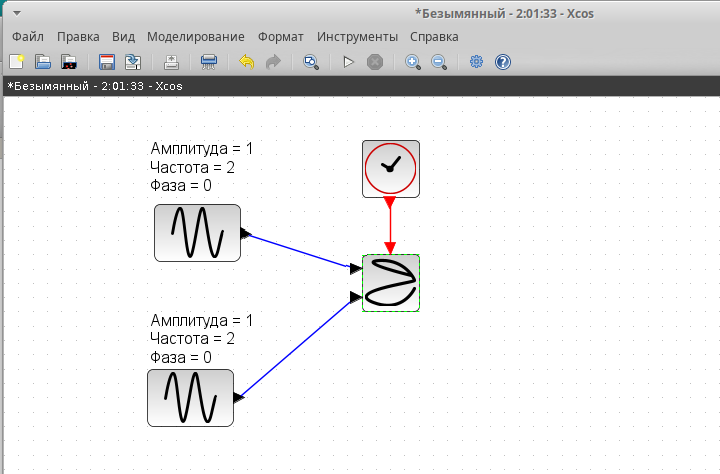{#fig:001 width=70%}

## Настройка параметров генератора синусоидальных колебаний

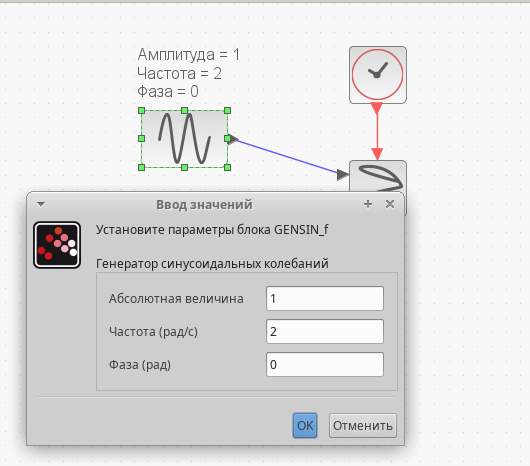{#fig:002 width=70%}

## Настройка параметров генератора синусоидальных колебаний

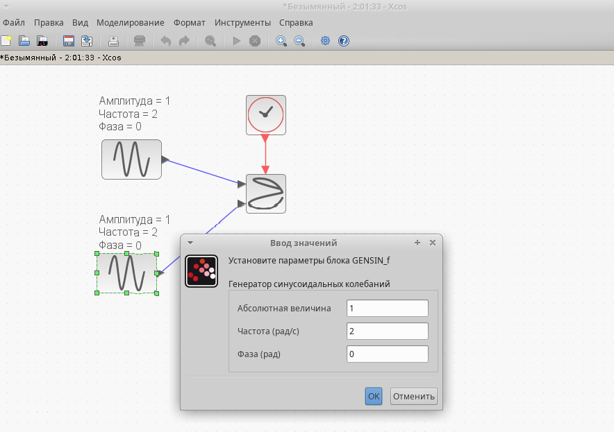{#fig:0021 width=70%}

## Настройка параметров CANIMXY

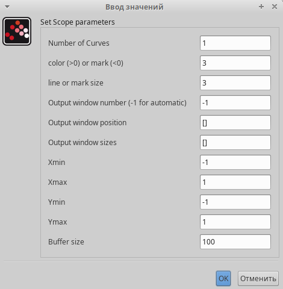{#fig:003 width=70%}

## $A = B = 1, a = 2, b = 2, \delta = 0$

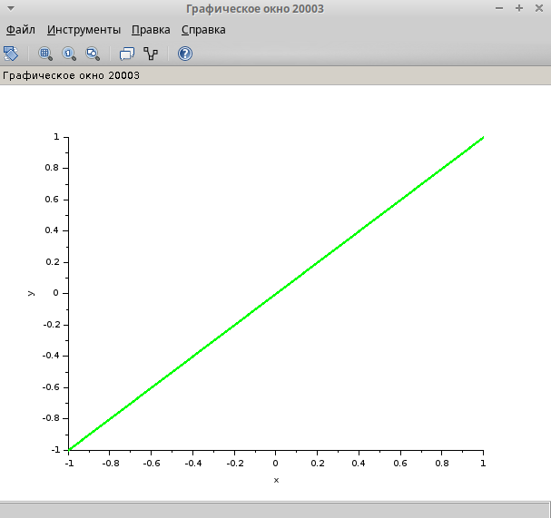{#fig:004 width=70%}

## $A = B = 1, a = 2, b = 2, \delta = \pi/4$

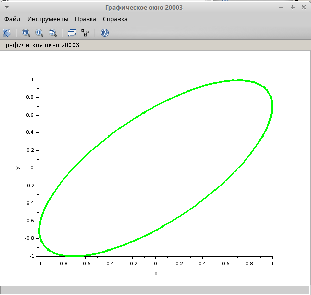{#fig:005 width=70%}

## $A = B = 1, a = 2, b = 2, \delta = \pi/2$

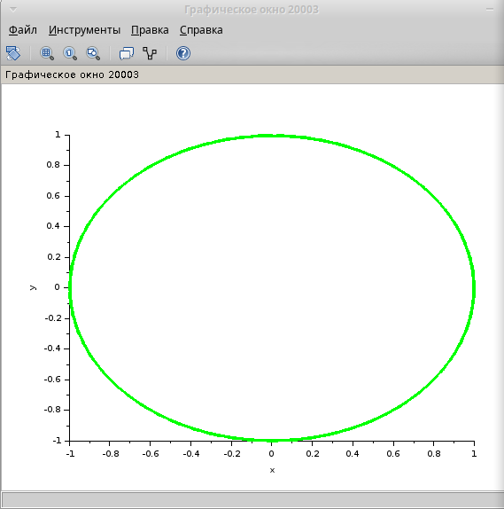{#fig:006 width=70%}

## $A = B = 1, a = 2, b = 2, \delta = 3\pi/4$

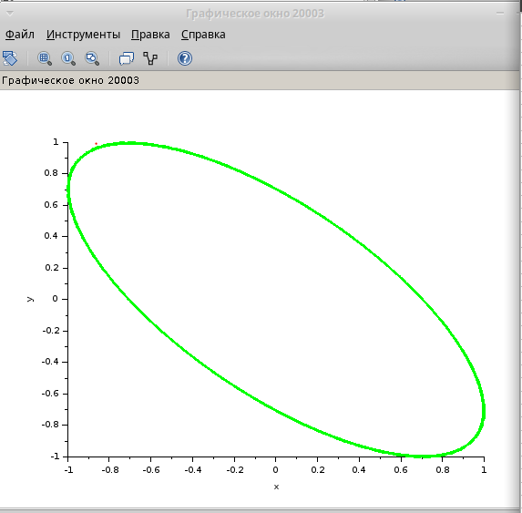{#fig:007 width=70%}

## $A = B = 1, a = 2, b = 2, \delta = \pi$

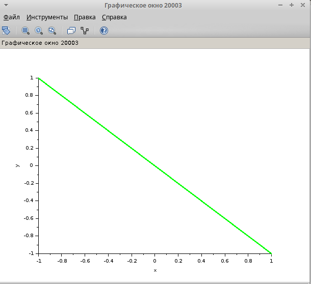{#fig:008 width=70%}

## Изменение параметров на втором генераторе

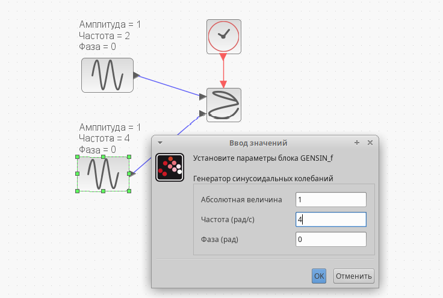{#fig:009 width=70%}

## $A = B = 1, a = 2, b = 4, \delta = 0$

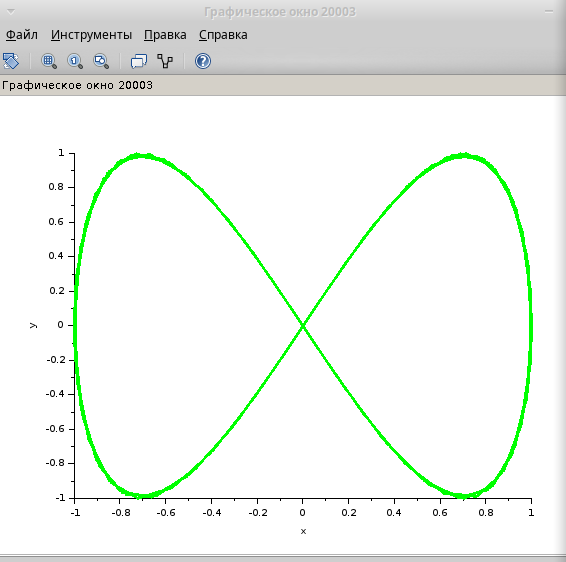{#fig:010 width=70%}

## $A = B = 1, a = 2, b = 4, \delta = \pi/4$

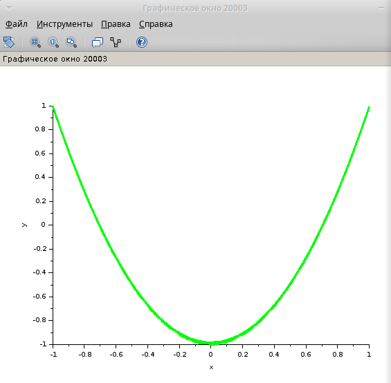{#fig:011 width=70%}

## $A = B = 1, a = 2, b = 4, \delta = \pi/2$

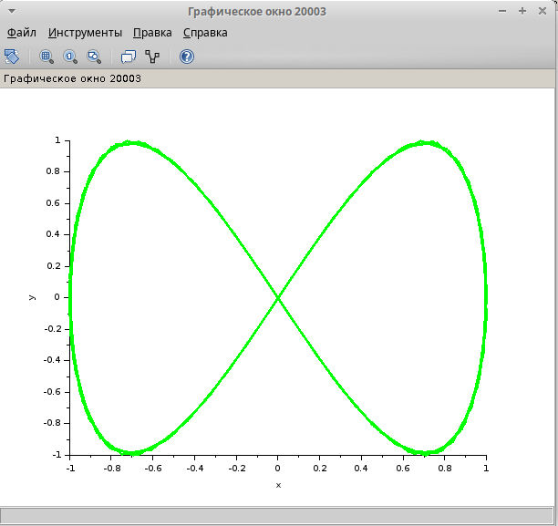{#fig:012 width=70%}

## $A = B = 1, a = 2, b = 4, \delta = 3\pi/4$

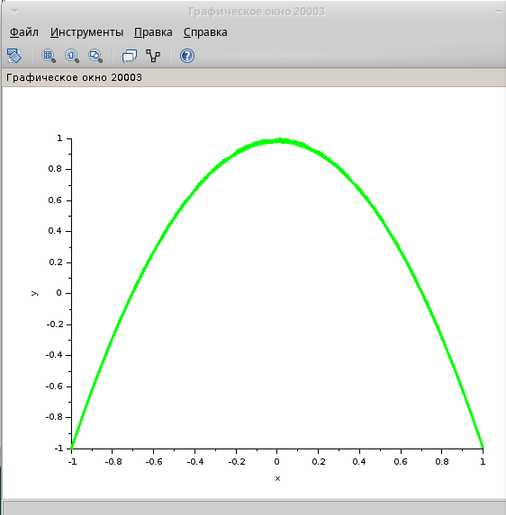{#fig:013 width=70%}

## $A = B = 1, a = 2, b = 4, \delta = \pi$

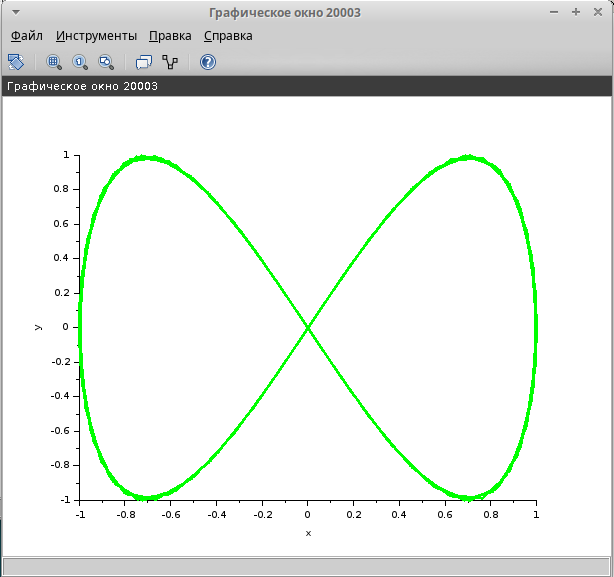{#fig:014 width=70%}

## Изменение параметров на втором генераторе 

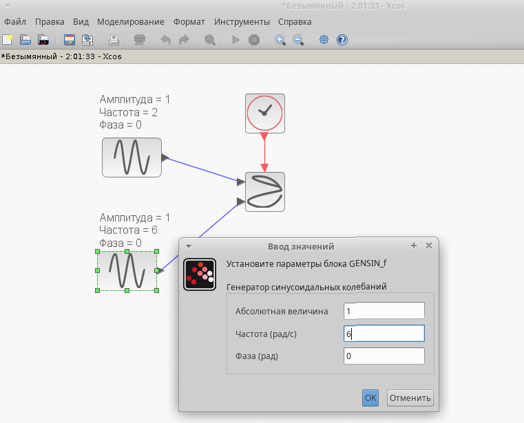{#fig:015 width=70%}

## $A = B = 1, a = 2, b = 6, \delta = 0$

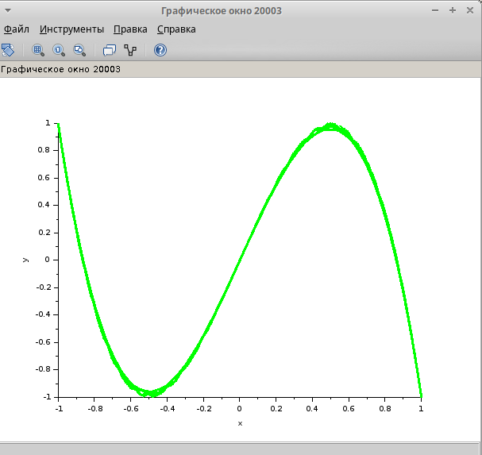{#fig:016 width=70%}

## $A = B = 1, a = 2, b = 6, \delta = \pi/4$

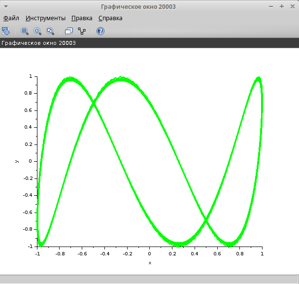{#fig:017 width=70%}

## $A = B = 1, a = 2, b = 6, \delta = \pi/2$

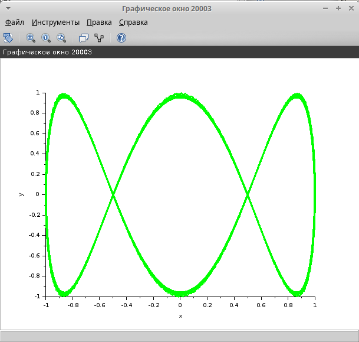{#fig:018 width=70%}

## $A = B = 1, a = 2, b = 6, \delta = 3\pi/4$

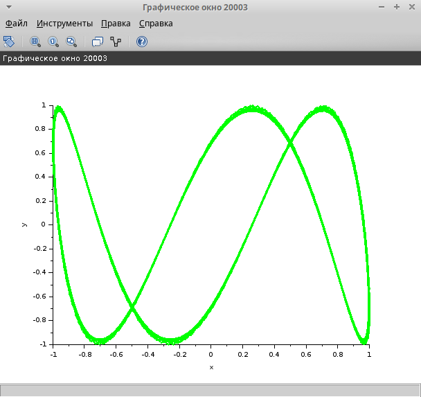{#fig:019 width=70%}

## $A = B = 1, a = 2, b = 6, \delta = \pi$

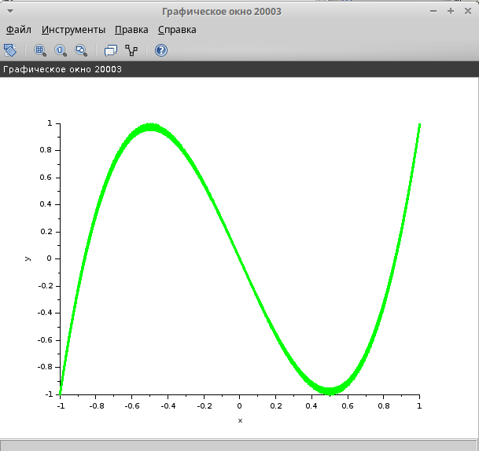{#fig:020 width=70%}

## Изменение параметров на втором генераторе

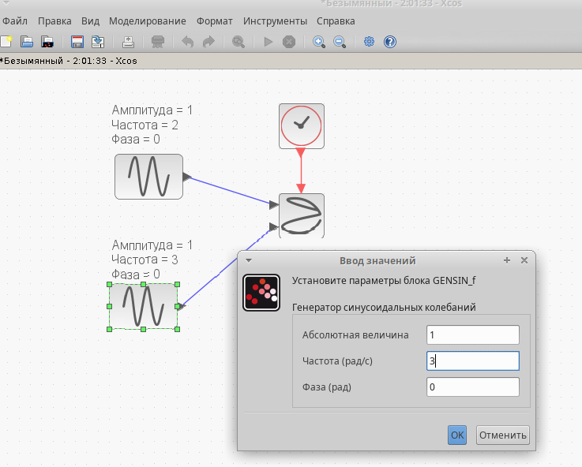{#fig:021 width=70%}

## $A = B = 1, a = 2, b = 3, \delta = 0$

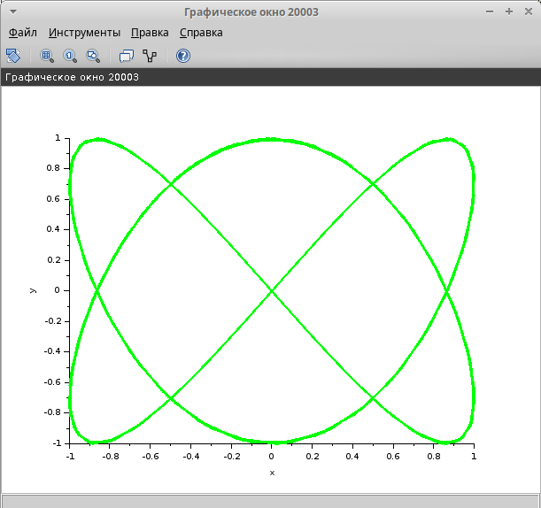{#fig:022 width=70%}

## $A = B = 1, a = 2, b = 3, \delta = \pi/4$

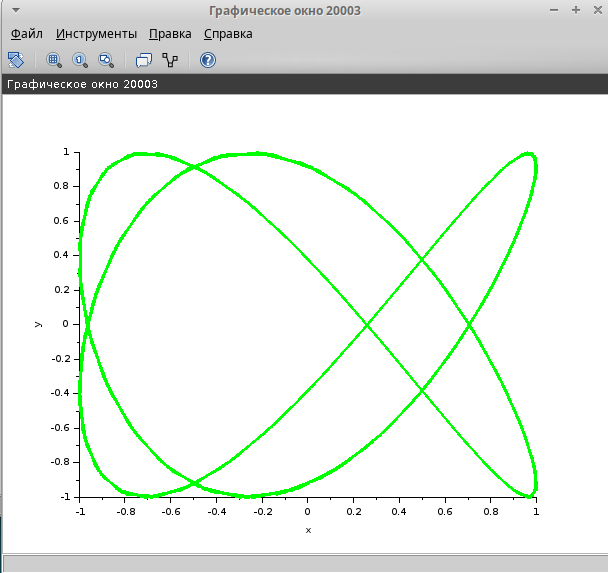{#fig:023 width=70%}

## $A = B = 1, a = 2, b = 3, \delta = \pi/2$

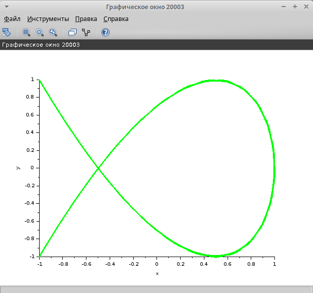{#fig:024 width=70%}

## $A = B = 1, a = 2, b = 3, \delta = 3\pi/4$

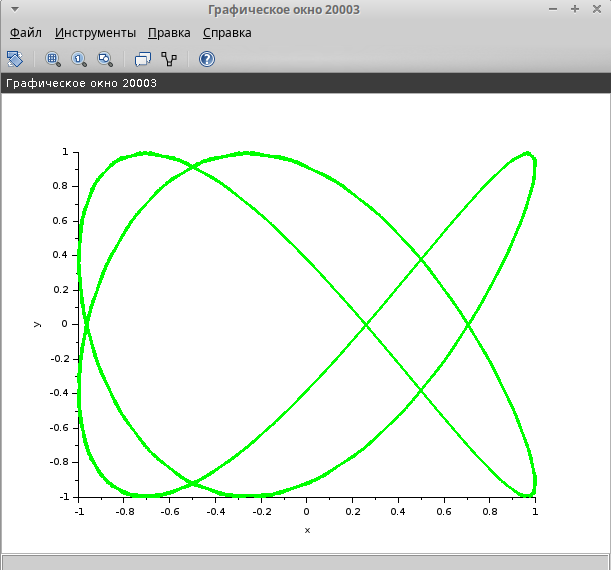{#fig:025 width=70%}

## $A = B = 1, a = 2, b = 3, \delta = \pi$

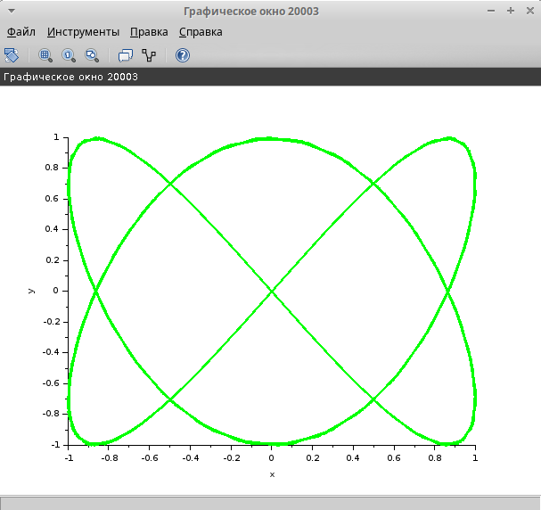{#fig:026 width=70%}

## Выводы

В результате выполнения данной лабораторной работы я выполнила упражнение по ознакомлению с программой *xcos*.

# Спасибо за внимание!
