---
## Front matter
lang: ru-RU
title: Лабораторная работа №1
subtitle: Простые модели компьютерной сети
author:
  - Дворкина Е. В.
institute:
  - Российский университет дружбы народов, Москва, Россия
date: 14 февраля 2025

## i18n babel
babel-lang: russian
babel-otherlangs: english

## Formatting pdf
toc: false
toc-title: Содержание
slide_level: 2
aspectratio: 169
section-titles: true
theme: metropolis
header-includes:
 - \metroset{progressbar=frametitle,sectionpage=progressbar,numbering=fraction}
---

## Докладчик

:::::::::::::: {.columns align=center}
::: {.column width="70%"}

  * Дворкина Ева Владимировна
  * студентка
  * группа НФИбд-01-22
  * Российский университет дружбы народов
  * [1132226447@rudn.ru](mailto:1132226447@rudn.ru)
  * <https://github.com/evdvorkina>

:::
::: {.column width="30%"}

:::
::::::::::::::

## Цель работы

Приобретение навыков моделирования сетей передачи данных с помощью средства имитационного моделирования NS-2, а также анализ полученных результатов
моделирования.

## Задание

1. Создать шаблон сценария для NS-2
2. Выполнить простой пример описания топологии сети, состоящей из двух узлов и одного соединения
3. Выполнить пример с усложненной топологией сети
4. Выполнить пример с кольцевой топологией сети
5. Выполнить упражнение

## Шаблон сценария для NS-2

Создание директории mip/lab-ns и файла `shablon.tcl`.

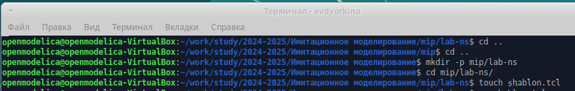

## Шаблон сценария для NS-2

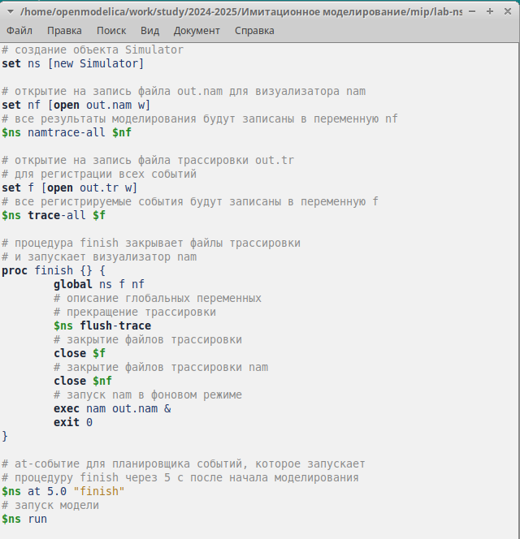

## Шаблон сценария для NS-2

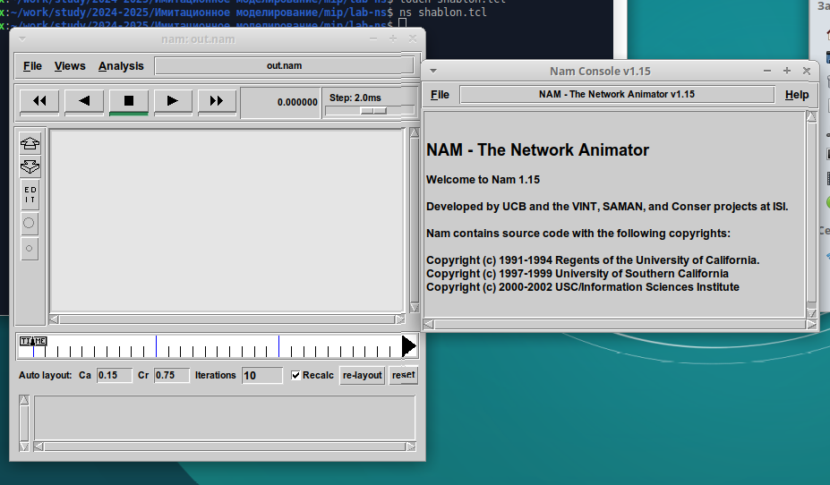

## Простой пример описания топологии сети, состоящей из двух узлов и одного соединения

**Постановка задачи.** Требуется смоделировать сеть передачи данных, состоящую
из двух узлов, соединённых дуплексной линией связи с полосой пропускания 2 Мб/с и задержкой 10 мс, очередью с обслуживанием типа DropTail. От одного узла к другому по протоколу UDP осуществляется передача пакетов, размером 500 байт, с постоянной скоростью 200 пакетов в секунду.

## Простой пример описания топологии сети, состоящей из двух узлов и одного соединения

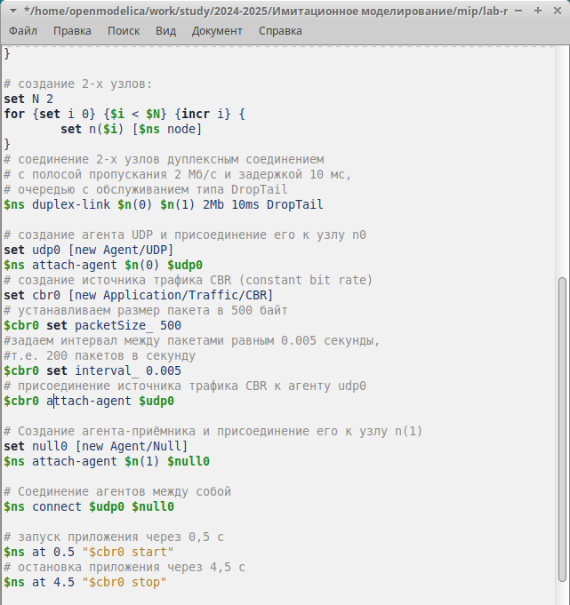

## Простой пример описания топологии сети, состоящей из двух узлов и одного соединения

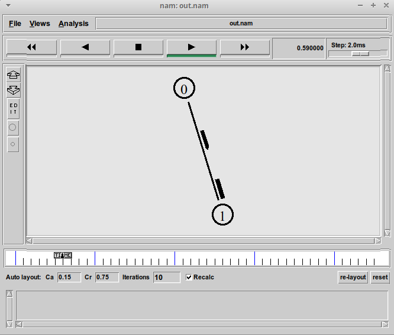

## Пример с усложненной топологией сети

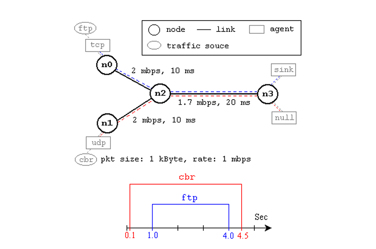

## Пример с усложненной топологией сети

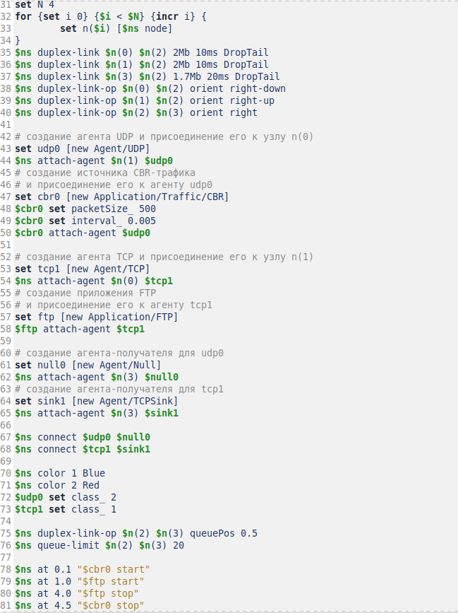

## Пример с усложненной топологией сети

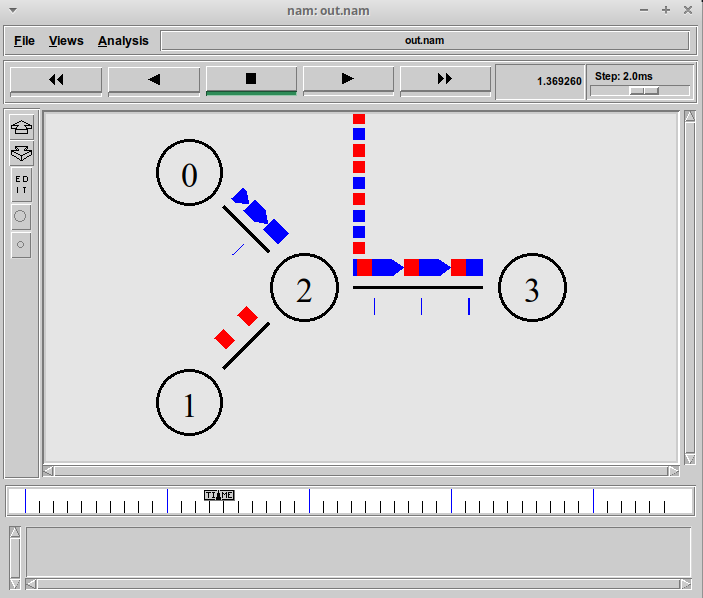

## Пример с кольцевой топологией сети

**Постановка задачи.** 

- сеть состоит из 7 узлов, соединённых в кольцо;
- данные передаются от узла n(0) к узлу n(3) по кратчайшему пути;
- с 1 по 2 секунду модельного времени происходит разрыв соединения между
узлами n(1) и n(2);
- при разрыве соединения маршрут передачи данных должен измениться на резервный

## Пример с кольцевой топологией сети

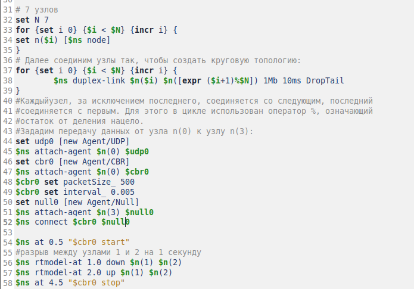

## Пример с кольцевой топологией сети

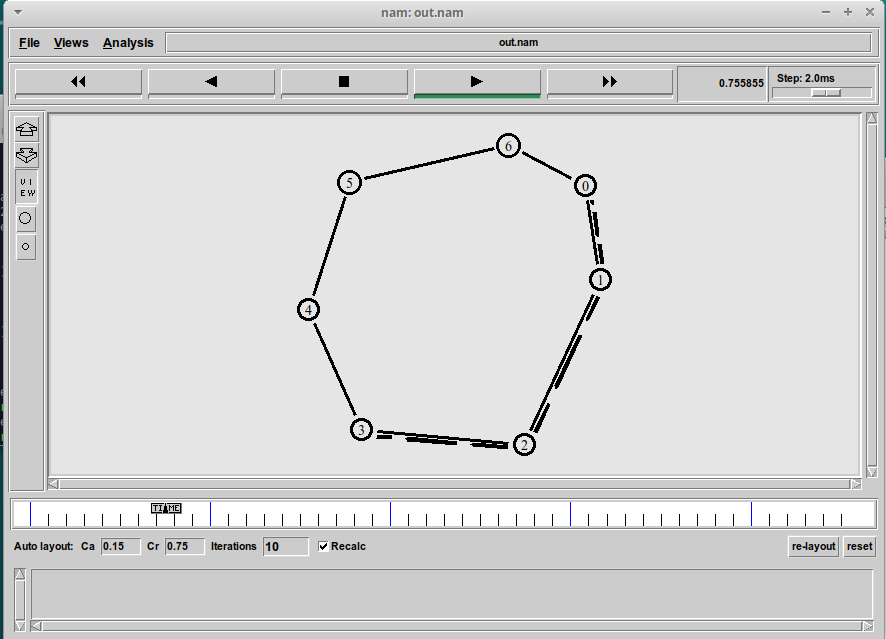

## Пример с кольцевой топологией сети

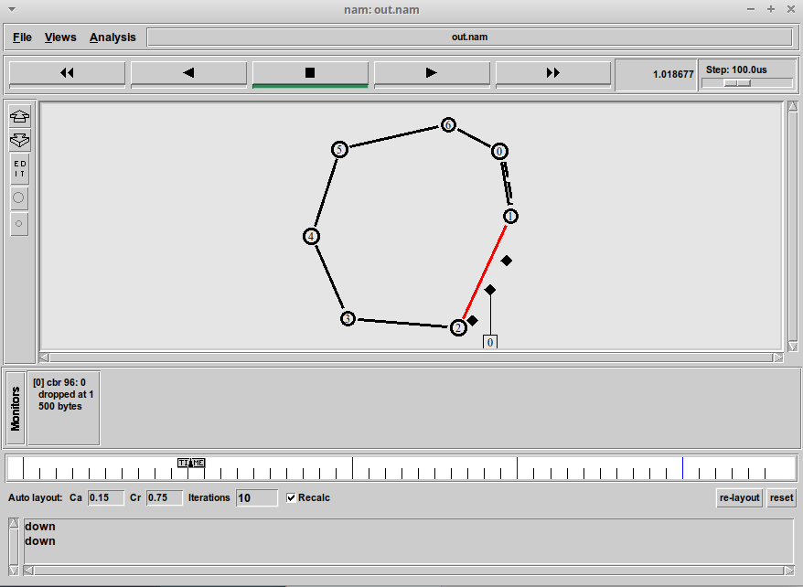

## Пример с кольцевой топологией сети

Добавим в начало скрипта после команды создания объекта Simulator: `$ns rtproto DV`

Сразу после запуска в сети отправляется небольшое количество
маленьких пакетов, используемых для обмена информацией, необходимой для маршрутизации между узлами. Когда соединение будет разорвано, информация о топологии будет обновлена

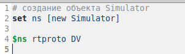

## Пример с кольцевой топологией сети

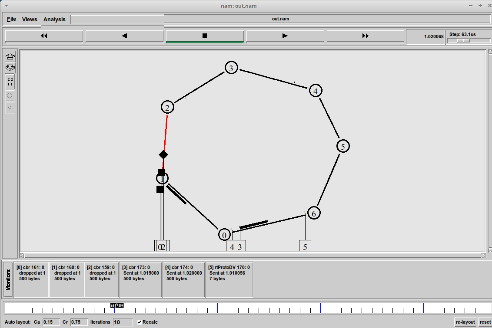

## Упражнение

1. Изменим количество узлов в кольце на 5, узел n5 оподсоединим к узлу n(1)
2. Создадим агента TCP типа Newreno, а на принимающей стороне зададим TCPSink-объект типа DelAck. Поверх TCP работает протокол FTP
3. Протокол FTP работает с 0,5 до 4,5 секунд модельного времени
4. Зададим разрыв соединения между узлами n(0) и n(1) с 1 по 2 секунду модельного времени.

## Упражнение

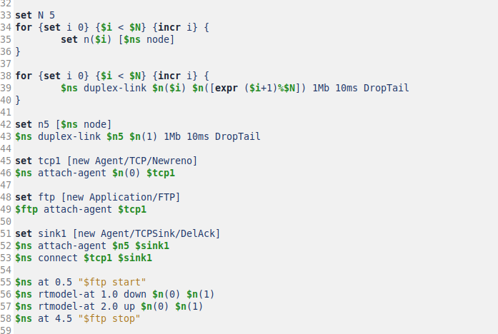

## Упражнение

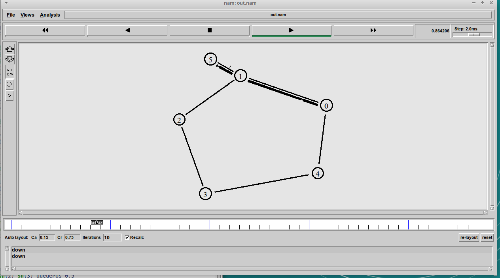

## Упражнение

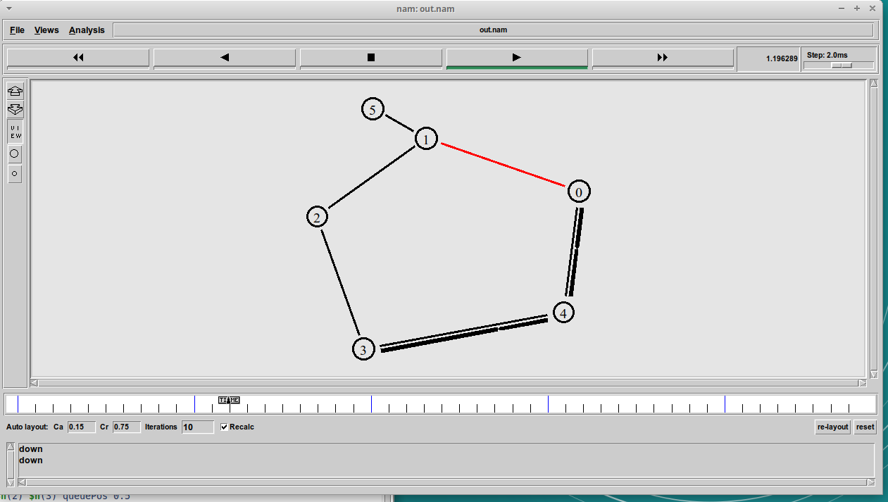

## Выводы

При выполнении данной лабораторной работы я приобрела навыки моделирования сетей передачи данных с помощью средства имитационного моделирования NS-2, а также провела анализ полученных результатов
моделирования.

# Спасибо за внимание!

