---
## Front matter
title: "Лабораторная работа №1"
subtitle: "Простые модели компьютерной сети"
author: "Дворкина Ева Владимировна"

## Generic otions
lang: ru-RU
toc-title: "Содержание"

## Bibliography
bibliography: bib/cite.bib
csl: pandoc/csl/gost-r-7-0-5-2008-numeric.csl

## Pdf output format
toc: true # Table of contents
toc-depth: 2
lof: true # List of figures
lot: false # List of tables
fontsize: 12pt
linestretch: 1.5
papersize: a4
documentclass: scrreprt
## I18n polyglossia
polyglossia-lang:
  name: russian
  options:
	- spelling=modern
	- babelshorthands=true
polyglossia-otherlangs:
  name: english
## I18n babel
babel-lang: russian
babel-otherlangs: english
## Fonts
mainfont: IBM Plex Serif
romanfont: IBM Plex Serif
sansfont: IBM Plex Sans
monofont: IBM Plex Mono
mathfont: STIX Two Math
mainfontoptions: Ligatures=Common,Ligatures=TeX,Scale=0.94
romanfontoptions: Ligatures=Common,Ligatures=TeX,Scale=0.94
sansfontoptions: Ligatures=Common,Ligatures=TeX,Scale=MatchLowercase,Scale=0.94
monofontoptions: Scale=MatchLowercase,Scale=0.94,FakeStretch=0.9
mathfontoptions:
## Biblatex
biblatex: true
biblio-style: "gost-numeric"
biblatexoptions:
  - parentracker=true
  - backend=biber
  - hyperref=auto
  - language=auto
  - autolang=other*
  - citestyle=gost-numeric
## Pandoc-crossref LaTeX customization
figureTitle: "Рис."
tableTitle: "Таблица"
listingTitle: "Листинг"
lofTitle: "Список иллюстраций"
lotTitle: "Список таблиц"
lolTitle: "Листинги"
## Misc options
indent: true
header-includes:
  - \usepackage{indentfirst}
  - \usepackage{float} # keep figures where there are in the text
  - \floatplacement{figure}{H} # keep figures where there are in the text
---

# Цель работы

Цель данной лабораторной работы - приобретение навыков моделирования сетей передачи данных с помощью средства имитационного моделирования NS-2, а также анализ полученных результатов
моделирования.

# Задание

1. Создать шаблон сценария для NS-2
2. Выполнить простой пример описания топологии сети, состоящей из двух узлов и одного соединения
3. Выполнить пример с усложненной топологией сети
4. Выполнить пример с кольцевой топологией сети
5. Выполнить упражнение

# Теоретическое введение

Использованы материалы из источников [@ns; @l].

Network Simulator (NS-2) — один из программных симуляторов моделирования процессов в компьютерных сетях. NS-2 позволяет описать топологию сети, конфигурацию источников и приёмников трафика, параметры соединений (полосу пропускания, задержку, вероятность потерь пакетов и т.д.) и множество других параметров моделируемой системы. Данные о динамике трафика, состоянии со-
единений и объектов сети, а также информация о работе протоколов фиксируются в генерируемом trace-файле.

NS-2 является объектно-ориентированным программным обеспечением. Его ядро реализовано на языке С++. В качестве интерпретатора используется язык скриптов (сценариев) OTcl (Object oriented Tool Command Language). NS-2 полностью поддерживает иерархию классов С++ и подобную иерархию классов интерпретатора OTcl. Обе иерархии обладают идентичной структурой, т.е. существует однозначное соответствие между классом одной иерархии и таким же классом другой. Объединение для совместного функционирования С++ и OTcl производится при помощи TclCl (Classes Tcl). В случае, если необходимо реализовать какую-либо специфическую функцию, не реализованную в NS-2 на уровне ядра, для этого используется код на С++.

Процесс создания модели сети для NS-2 состоит из нескольких этапов:

1. создание нового объекта класса Simulator, в котором содержатся методы, необходимые для дальнейшего описания модели (например, методы `new` и `delete`
используются для создания и уничтожения объектов соответственно);
2. описание топологии моделируемой сети с помощью трёх основных функциональных блоков: узлов (nodes), соединений (links) и агентов (agents);
3. задание различных действий, характеризующих работу сети.
Для создания узла используется метод `node`. При этом каждому узлу автоматически присваивается уникальный адрес. Для построения однонаправленных и двунаправленных линий соединения узлов используют методы `simplex-link`
и `duplex-link` соответственно.

Важным объектом NS-2 являются агенты, которые могут рассматриваться как процессы и/или как транспортные единицы, работающие на узлах моделируемой сети. Агенты могут выступать в качестве источников трафика или приёмников, а также как динамические маршрутизирующие и протокольные модули. Агенты создаются с помощью методов общего класса `Agent` и являются объектами его подкласса, т.е. `Agent/type`, где `type` определяет тип конкретного объекта. Например, TCP-агент может быть создан с помощью команды: 
    `set tcp [ new Agent/TCP ]`

Для закрепления агента за конкретным узлом используется метод `attach-agent`. Каждому агенту присваивается уникальный адрес порта для заданного узла (аналогично портам tcp и udp). Чтобы за конкретным агентом закрепить источник,
используют методы `attach-source` и `attach-traffic`. Например, можно прикрепить ftp или telnet источники к TCP-агенту. Есть агенты, которые генерируют свои собственные данные, например, CBR-агент (Constant Bit-Rate) — источник
трафика с постоянной интенсивностью.

Действия разных агентов могут быть назначены планировщиком событий (Event Scheduler) в определённые моменты времени (также в определённые моменты времени могут быть задействованы или отключены те или иные источники данных, запись статистики, разрыв, либо восстановление соединений, реконфигурация топологии и т.д.). Для этого может использоваться метод `at`. Моделирование начинается при помощи метода `run`.

В качестве дополнения к NS-2 часто используют средство визуализации nam
(network animator) для графического отображения свойств моделируемой системы
и проходящего через неё трафика и пакет Xgraph для графического представления
результатов моделирования.

Запуск сценария NS-2 осуществляется в командной строке с помощью команды:
    `ns [tclscript]`

Здесь `[tclscript]` — имя файла скрипта Tcl, который определяет сценарий моделирования (т.е. топологию и различные события).

Nam можно запустить с помощью команды
    `nam [nam-file]`

Здесь `[nam-file]` — имя nam trace-файла, сгенерированного с помощью ns.

# Выполнение лабораторной работы

## Шаблон сценария для NS-2

В своём рабочем каталоге создала директорию mip, в которой будут выполняться лабораторные работы. Внутри mip создала директорию `lab-ns`, а в ней файл `shablon.tcl`: (рис. [-@fig:001]).

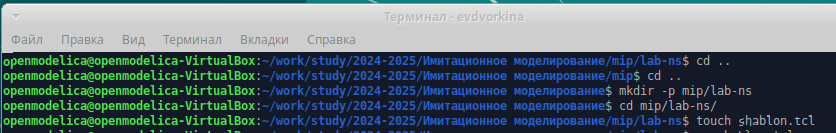{#fig:001 width=70%}

Открыла на редактирование файл `shablon.tcl` в текстовом редакторе mousepad. Сначала создала объект типа `Simulator`, затем создала переменную `nf` и указала, что требуется открыть на запись nam-файл для регистрации выходных результатов моделирования. Строка 
    `$ns namtrace-all $nf` 
дает команду симулятору записывать все данные о динамике модели в файл `out.nam`. Далее создала переменную `f` и открыла на запись файл трассировки для регистрации всех событий модели. После этого добавим процедуру `finish`, которая закрывает файлы трассировки и запускает nam. Наконец, с помощью команды `at` указываем планировщику событий, что процедуру `finish` следует запустить через 5 с после начала моделирования, после чего
запустить симулятор `ns` (рис. [-@fig:002]).

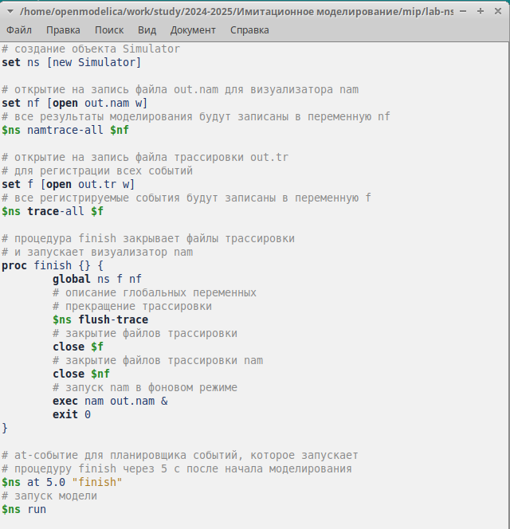{#fig:002 width=70%}

Сохранив изменения в отредактированном файле shablon.tcl и закрыв его,
запустила симулятор командой:
    `ns shablon.tcl`
При этом окно nam будет пустым, поскольку ещё не определены никакие объекты и действия (рис. [-@fig:003]).

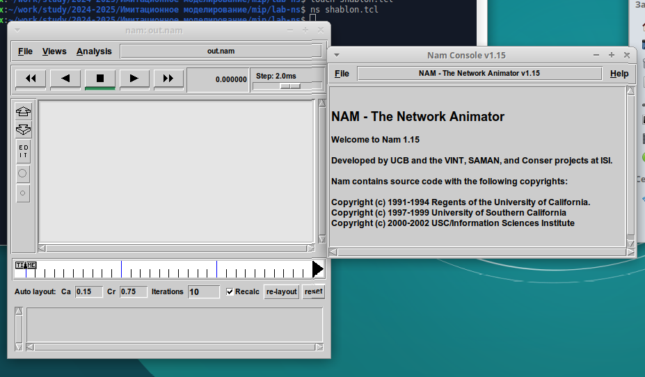{#fig:003 width=70%}

Получившийся шаблон можно использовать в дальнейшем в большинстве разрабатываемых скриптов NS-2, добавляя в него до строки `$ns at 5.0 "finish"` описание объектов и действий моделируемой системы.

## Простой пример описания топологии сети, состоящей из двух узлов и одного соединения

**Постановка задачи.** Требуется смоделировать сеть передачи данных, состоящую
из двух узлов, соединённых дуплексной линией связи с полосой пропускания 2 Мб/с и задержкой 10 мс, очередью с обслуживанием типа DropTail. От одного узла к другому по протоколу UDP осуществляется передача пакетов, размером 500 байт, с постоянной скоростью 200 пакетов в секунду.  

копируем содержимое созданного шаблона в новый файл: (рис. [-@fig:004]).

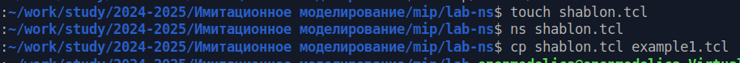{#fig:004 width=70%}

Откроем example1.tcl на редактирование. Добавим в него до строки `$ns at 5.0 "finish"` описание топологии сети (рис. [-@fig:005]).

В нем прописываем создание 2-х узлов, соединение их дуплексным соединением с полосой пропускания 2 Мб/с и задержкой 10 мс, очередью с обслуживанием типа DropTail. Создаем агент для генерации и приема трафика: создаётся агент UDP и присоединяется к узлу n0. В узле агент сам не может генерировать трафик, он лишь реализует протоколы и алгоритмы транспортного уровня. Поэтому к агенту присоединяется приложение. В данном случае — это источник с постоянной скоростью (Constant Bit Rate, CBR), который каждые 5 мс посылает пакет $R = 500$ байт. Таким образом, скорость источника: $R = \dfrac{500\cdot 8}{0,005}$ бит$\backslash$с.

Далее создаем Null-агент, который работает как приёмник трафика, и прикрепим
его к узлу n1. Соединим агент приемник и агент UDP.

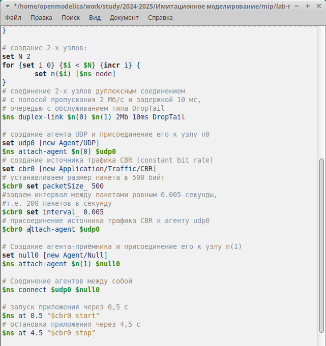{#fig:005 width=70%}

Cохранив изменения в отредактированном файле и запустив симулятор:
    `ns example1.tcl`
получим в качестве результата запуск аниматора nam в фоновом режиме (рис. [-@fig:006]).

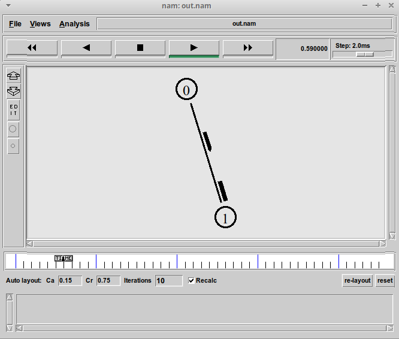{#fig:006 width=70%}

При нажатии на кнопку play в окне nam через 0.5 секунды из узла 0 данные начнут
поступать к узлу 1. Так как мы задали такие at-события в коде. 

## Пример с усложненной топологией сети

**Постановка задачи.** Описание моделируемой сети (рис. [-@fig:007]):

- сеть состоит из 4 узлов (n0, n1, n2, n3);
- между узлами n0 и n2, n1 и n2 установлено дуплексное соединение с пропускной
способностью 2 Мбит/с и задержкой 10 мс;
- между узлами n2 и n3 установлено дуплексное соединение с пропускной способ-
ностью 1,7 Мбит/с и задержкой 20 мс;
- каждый узел использует очередь с дисциплиной DropTail для накопления пакетов,
максимальный размер которой составляет 10;
- TCP-источник на узле n0 подключается к TCP-приёмнику на узле n3
(по-умолчанию, максимальный размер пакета, который TCP-агент может генери-
ровать, равняется 1KByte)
- TCP-приёмник генерирует и отправляет ACK пакеты отправителю и откидывает
полученные пакеты;
- UDP-агент, который подсоединён к узлу n1, подключён к null-агенту на узле n3
(null-агент просто откидывает пакеты);
- генераторы трафика ftp и cbr прикреплены к TCP и UDP агентам соответственно;
- генератор cbr генерирует пакеты размером 1 Кбайт со скоростью 1 Мбит/с;
- работа cbr начинается в 0,1 секунду и прекращается в 4,5 секунды, а ftp начинает
работать в 1,0 секунду и прекращает в 4,0 секунды

{#fig:007 width=70%}

Копируем содержимое созданного шаблона в новый файл:
    `cp shablon.tcl example2.tcl`
и откроем `example2.tcl` на редактирование.

Создадим 4 узла и 3 дуплексных соединения с указанием направления:

```
set N 4
for {set i 0} {$i < $N} {incr i} {
set n($i) [$ns node]
}
$ns duplex-link $n(0) $n(2) 2Mb 10ms DropTail
$ns duplex-link $n(1) $n(2) 2Mb 10ms DropTail
$ns duplex-link $n(3) $n(2) 2Mb 10ms DropTail
$ns duplex-link-op $n(0) $n(2) orient right-down
$ns duplex-link-op $n(1) $n(2) orient right-up
$ns duplex-link-op $n(2) $n(3) orient right
```

Cоздадим агент UDP с прикреплённым к нему источником CBR и агент TCP с прикреплённым к нему приложением FTP:

```
set udp0 [new Agent/UDP]
$ns attach-agent $n(1) $udp0
# создание источника CBR-трафика
# и присоединение его к агенту udp0
set cbr0 [new Application/Traffic/CBR]
$cbr0 set packetSize_ 500
$cbr0 set interval_ 0.005
$cbr0 attach-agent $udp0

set tcp1 [new Agent/TCP]
$ns attach-agent $n(0) $tcp1
# создание приложения FTP
# и присоединение его к агенту tcp1
set ftp [new Application/FTP]
$ftp attach-agent $tcp1
```

Cоздадим агенты-получатели:

```
# создание агента-получателя для udp0
set null0 [new Agent/Null]
$ns attach-agent $n(3) $null0
# создание агента-получателя для tcp1
set sink1 [new Agent/TCPSink]
$ns attach-agent $n(3) $sink1
```

Соединим агенты udp0 и tcp1 и их получателей:

```
$ns connect $udp0 $null0
$ns connect $tcp1 $sink1
```
Зададим описание цвета каждого потока:

```
$ns color 1 Blue
$ns color 2 Red
$udp0 set class_ 2
$tcp1 set class_ 1
```

Добавим отслеживание событий в очереди и наложим ограничения на размер очереди: 

```
$ns duplex-link-op $n(2) $n(3) queuePos 0.5
$ns queue-limit $n(2) $n(3) 20
```

Добавляем at-события:

```
$ns at 0.1 "$cbr0 start"
$ns at 1.0 "$ftp start"
$ns at 4.0 "$ftp stop"
$ns at 4.5 "$cbr0 stop"
```
  
Реализацию модели выполнила в соответствии с описанием и схемой сети, соединив tcp к n0, udp к n1. (рис. [-@fig:008])

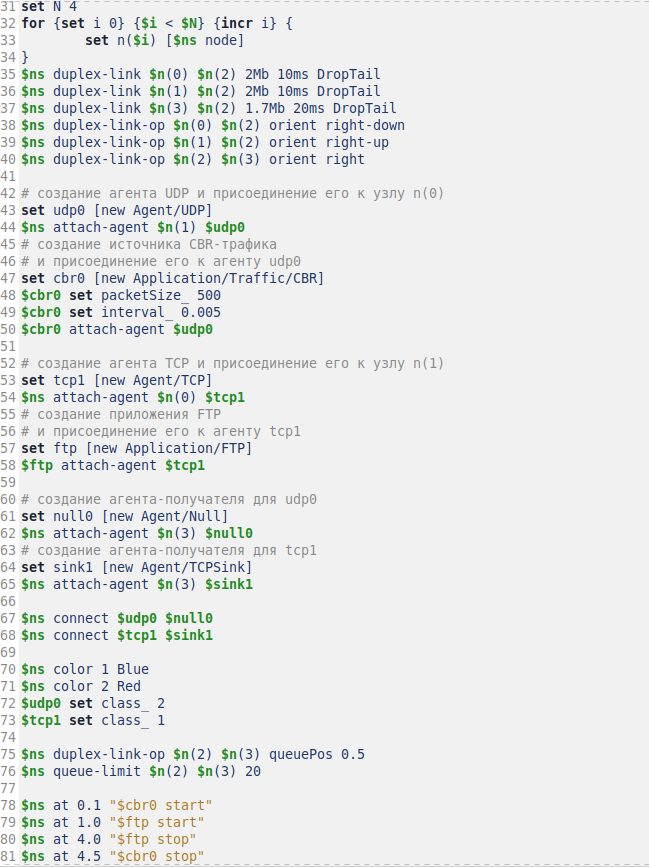{#fig:008 width=70%}

Сохранив изменения в отредактированном файле и запустив симулятор, получим
анимированный результат моделирования (рис. [-@fig:009]).

При запуске скрипта можно заметить, что по соединениям между узлами n(0)–n(2)
и n(1)–n(2) к узлу n(2) передаётся данных больше, чем способно передаваться по
соединению от узла n(2) к узлу n(3).Таким образом, полоса каждого соединения 0,8 Mb, а суммарная
— 1,6 Mb. Но соединение n(2)–n(3) имеет полосу лишь 1 Mb. Следовательно, часть
пакетов должна теряться. В окне аниматора можно видеть пакеты в очереди, а также
те пакеты, которые отбрасываются при переполнении. 

{#fig:009 width=70%}

## Пример с кольцевой топологией сети

**Постановка задачи.** Требуется построить модель передачи данных по сети с кольцевой топологией и динамической маршрутизацией пакетов:

- сеть состоит из 7 узлов, соединённых в кольцо;
- данные передаются от узла n(0) к узлу n(3) по кратчайшему пути;
- с 1 по 2 секунду модельного времени происходит разрыв соединения между
узлами n(1) и n(2);
- при разрыве соединения маршрут передачи данных должен измениться на резерв-
ный

Скопируем содержимое созданного шаблона в новый файл:
    `cp shablon.tcl example3.tcl`
и откроем `example3.tcl` на редактирование.

Опишем топологию моделируемой сети:

```
set N 7
for {set i 0} {$i < $N} {incr i} {
    set n($i) [$ns node]
}
```

Далее соединим узлы так, чтобы создать круговую топологию:

```for {set i 0} {$i < $N} {incr i} {
    $ns duplex-link $n($i) $n([expr ($i+1)%$N]) 1Mb 10ms DropTail
}
```

Каждый узел, за исключением последнего, соединяется со следующим, последний
соединяется с первым. Для этого в цикле использован оператор %, означающий
остаток от деления нацело.
Зададим передачу данных от узла n(0) к узлу n(3):

```
set udp0 [new Agent/UDP]
$ns attach-agent $n(0) $udp0
set cbr0 [new Agent/CBR]
$ns attach-agent $n(0) $cbr0
$cbr0 set packetSize_ 500
$cbr0 set interval_ 0.005
set null0 [new Agent/Null]
$ns attach-agent $n(3) $null0
$ns connect $cbr0 $null0
```

Добавим команду разрыва соединения между узлами n(1) и n(2) на время в одну
секунду, а также время начала и окончания передачи данных:

```
$ns at 0.5 "$cbr0 start"
$ns rtmodel-at 1.0 down $n(1) $n(2)
$ns rtmodel-at 2.0 up $n(1) $n(2)
$ns at 4.5 "$cbr0 stop"
$ns at 5.0 "finish"
```

Изменения в файле представлены на (рис. [-@fig:010])

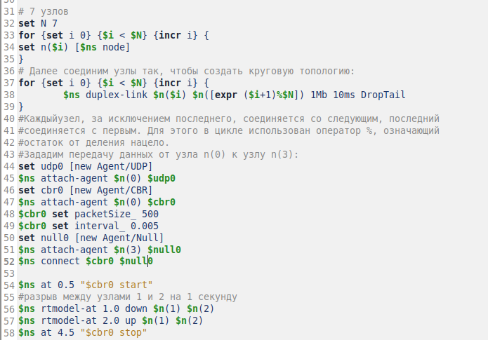{#fig:010 width=70%}

Данные передаются по кратчайшему маршруту от узла n(0) к узлу n(3), через узлы
n(1) и n(2) (рис. [-@fig:011])

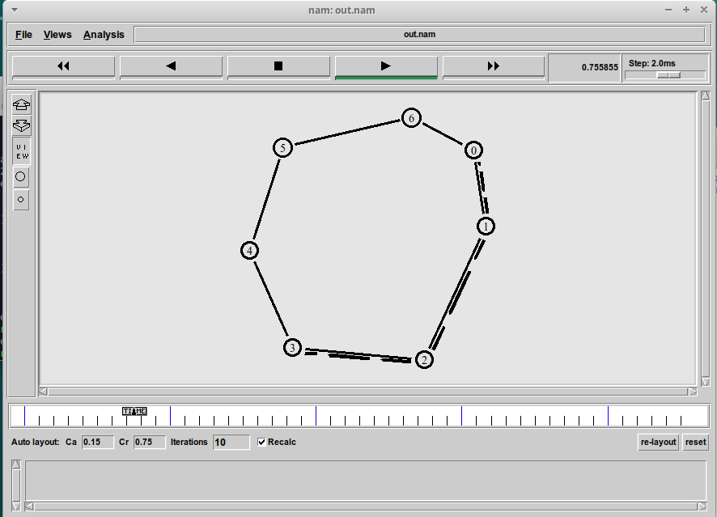{#fig:011 width=70%}

Передача данных при кольцевой топологии сети в случае разрыва соединения
представлена на (рис. [-@fig:012]).

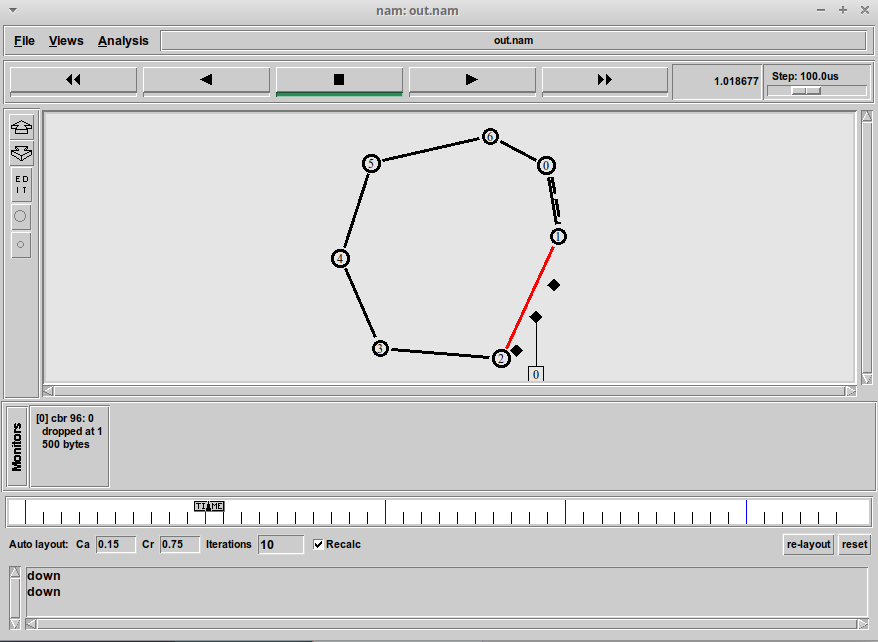{#fig:012 width=70%}

Добавим в начало скрипта после команды создания объекта Simulator: `$ns rtproto DV` (рис. [-@fig:013])

{#fig:013 width=70%}

Увидим, что сразу после запуска в сети отправляется небольшое количество
маленьких пакетов, используемых для обмена информацией, необходимой для маршрутизации между узлами. Когда соединение будет разорвано, информация
о топологии будет обновлена, и пакеты будут отсылаться по новому маршруту через
узлы n(6), n(5) и n(4) (рис. [-@fig:014])

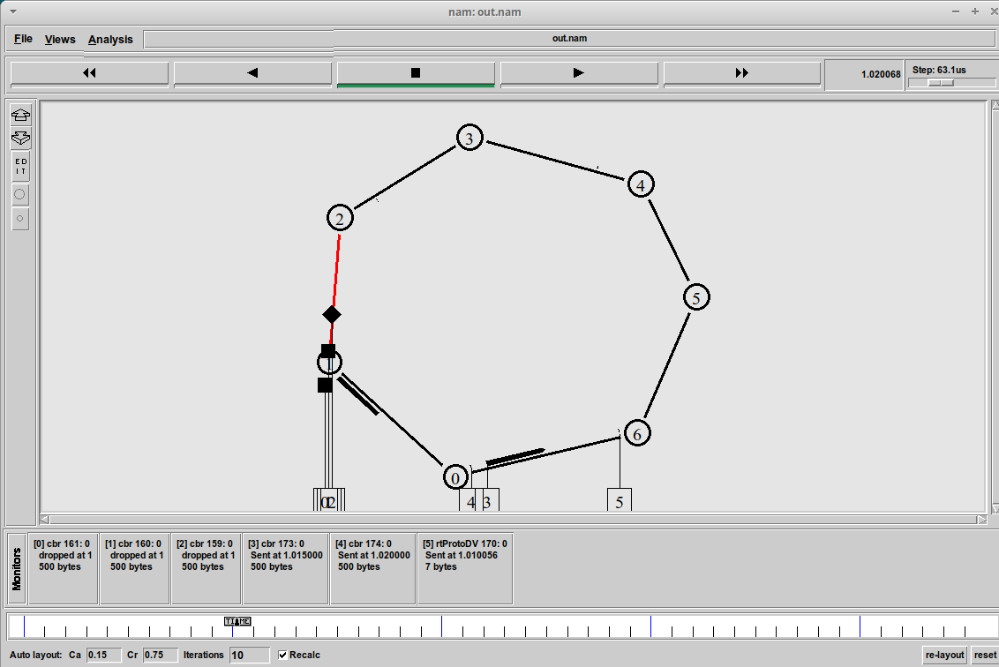{#fig:014 width=70%}

После восстановления соединения информация о топологии снова будет обновлена и пакеты будут отсылаться по кратчайшему маршруту через n(1) и n(2).

## Упражнение

Внесите следующие изменения в реализацию примера с кольцевой
топологией сети:

- Узлы n0, n1, n2, n3, n4 соединены текущий с последующим, а последний с первым. Узел n5 соединен с узло n1.
- передача данных должна осуществляться от узла n(0) до узла n(5) по кратчайшему пути в течение 5 секунд модельного времени;
- передача данных должна идти по протоколу TCP (тип Newreno), на принимающей стороне используется TCPSink-объект типа DelAck; поверх TCP работает
протокол FTP с 0,5 до 4,5 секунд модельного времени;
- с 1 по 2 секунду модельного времени происходит разрыв соединения между
узлами n(0) и n(1);
- при разрыве соединения маршрут передачи данных должен измениться на резервный, после восстановления соединения пакеты снова должны пойти по кратчайшему пути.

Внесем следующие изменения в описание кольцевой топологии сети (рис. [-@fig:015]):

1. Изменим количество узлов в кольце на 5 (нумерация узлов от 0 до 4), а 6-й узел n5 отдельно подсоединим к узлу n(1)
2. Вместо агента UDP создадим агента TCP типа Newreno, а на принимающей стороне вместо агента Null зададим TCPSink-объект типа DelAck. Поверх TCP работает протокол FTP (прикрепляем FTP к TCP), соединяю протокол TCP и приемник TCPSInk. 
3. Протокол FTP работает с 0,5 до 4,5 секунд модельного времени
4. Зададим разрыв соединения между узлами n(0) и n(1) так же длительностью в одну секунду с 1 по 2 секунду модельного времени.

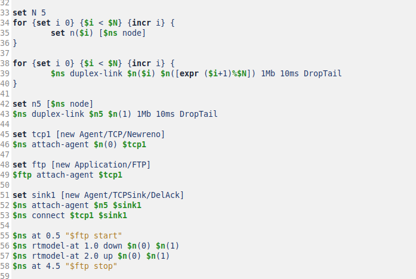{#fig:015 width=70%}

Передача данных до разрыва соединения передача данных от узла n(0) до узла n5 осуществляется по кратчайшему соединению (рис. [-@fig:016])

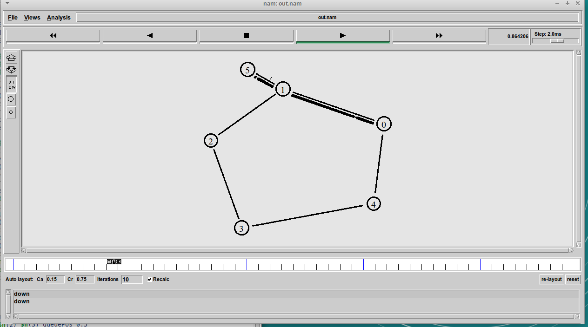{#fig:016 width=70%}

После разрыва соединения между узлами n(0) и n(1) часть пакетов, которые передавались по этому соединению в момент разрыва теряется, а данные продолжат передавать по единственному оставшемуся маршруту n(0), n(4), n(3), n(2), n(1), n5  так как у нас выполняется обмен информации, необходимой для маршрутизации между узлами и информация о топологии изменяется (рис. [-@fig:017]).

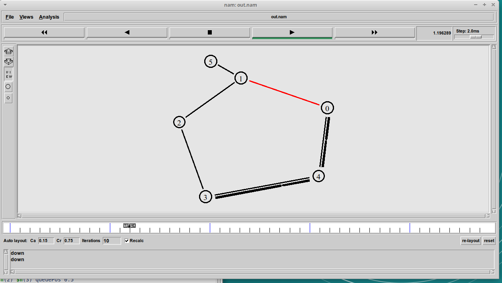{#fig:017 width=70%}

После восстановления соединения информация о топологии снова будет обновлена и пакеты будут отсылаться по кратчайшему маршруту через n(0) и n(1).

# Выводы

При выполнении данной лабораторной работы я приобрела навыки моделирования сетей передачи данных с помощью средства имитационного моделирования NS-2, а также провела анализ полученных результатов
моделирования.

# Список литературы{.unnumbered}

::: {#refs}
:::
