---
## Front matter
lang: ru-RU
title: Лабораторная работа №2
subtitle: Исследование TCP протокола и алгоритма управления очередью RED
author:
  - Дворкина Е. В.
institute:
  - Российский университет дружбы народов, Москва, Россия
date: 21 февраля 2025

## i18n babel
babel-lang: russian
babel-otherlangs: english

## Formatting pdf
toc: false
toc-title: Содержание
slide_level: 2
aspectratio: 169
section-titles: true
theme: metropolis
header-includes:
 - \metroset{progressbar=frametitle,sectionpage=progressbar,numbering=fraction}
---

## Докладчик

:## Докладчик

:::::::::::::: {.columns align=center}
::: {.column width="70%"}

  * Дворкина Ева Владимировна
  * студентка
  * группа НФИбд-01-22
  * Российский университет дружбы народов
  * [1132226447@rudn.ru](mailto:1132226447@rudn.ru)
  * <https://github.com/evdvorkina>

:::
::: {.column width="30%"}

:::
::::::::::::::

## Цель работы

Исследовать протокол TCP и алгоритм управления очередью RED.

## Задание

1. Выполнить пример с дисциплиной RED

2. Изменить в модели на узле s1 тип протокола TCP Reno на NewReno, затем на Vegas. Сравните и поясните результаты.

3. Внести изменения при отображении окон с графиками (измените цвет фона, цвет траекторий, подписи к осям, подпись траектории в легенде).

## Алгоритм управления очередью RED
Функция сброса алгоритма RED управления очередью 

$$
p^{RED}(\hat{q}) =
  \begin{cases}
    0       & \quad 0 < \hat{q} \leq q_{min}\\
    \frac{\hat{q}-q_{min}}{q_{max}-q_{min}} p_{max}  & \quad q_{min} < \hat{q} \leq q_{max}\\
    1         & \quad \hat{q} > q_{max}
  \end{cases}
$$

Где $q_{min}$, $q_{max}$ - пороговые значения очереди; $p_{max}$ - параметр максимального сброса.

## Пример с дисциплиной RED

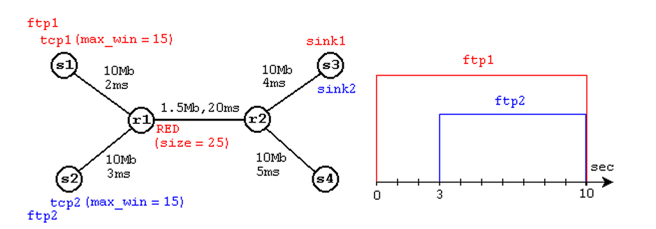

## Динамика длины очереди (Reno)

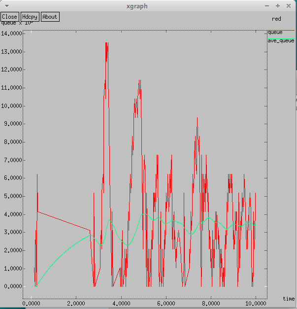

## Динамика окна TCP (Reno)

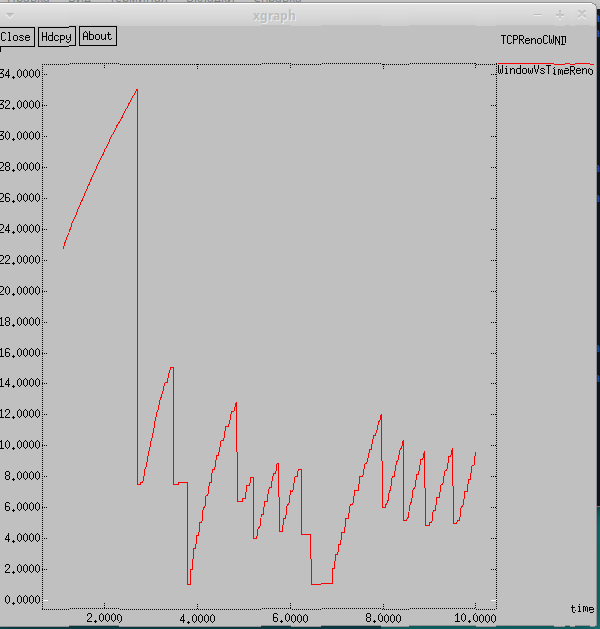

## Изменение модели

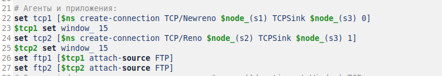

## Динами длины очереди (NewReno)

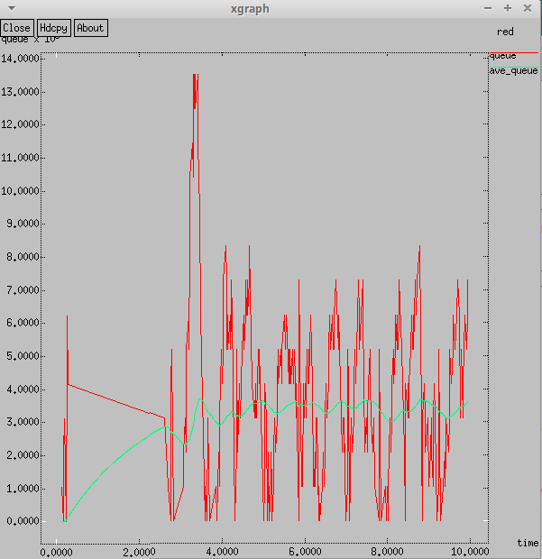

## Динамика окна TCP (NewReno)

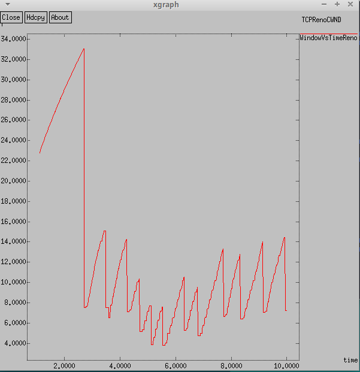

## Изменение модели

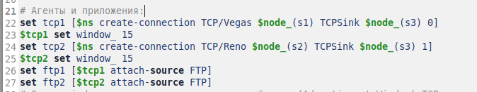

## Динамика длины очереди (Vegas)

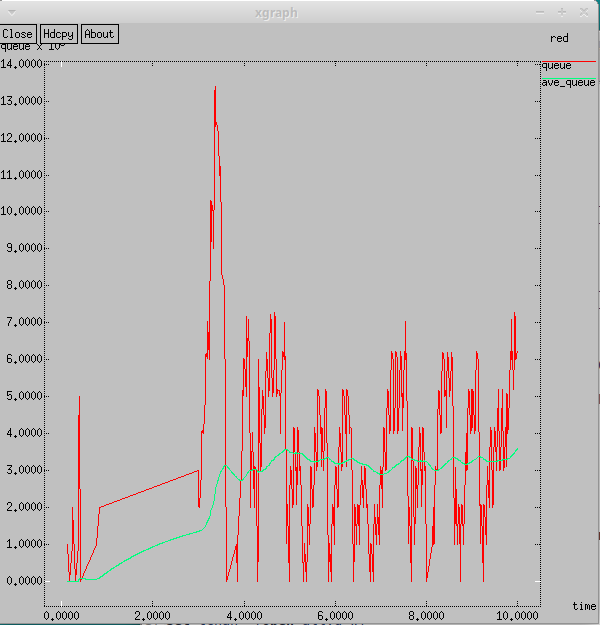

## Динамика окна TCP (Vegas)

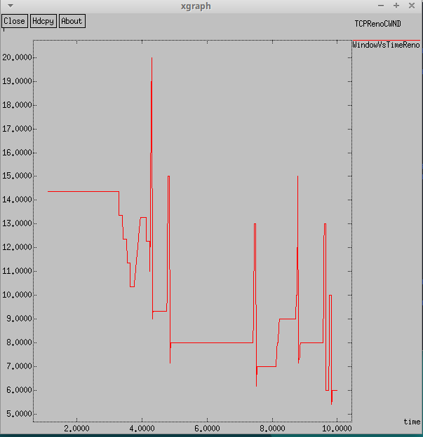

## Внесение изменения при отображении окон с графиками

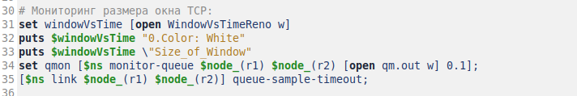

## Внесение изменения при отображении окон с графиками

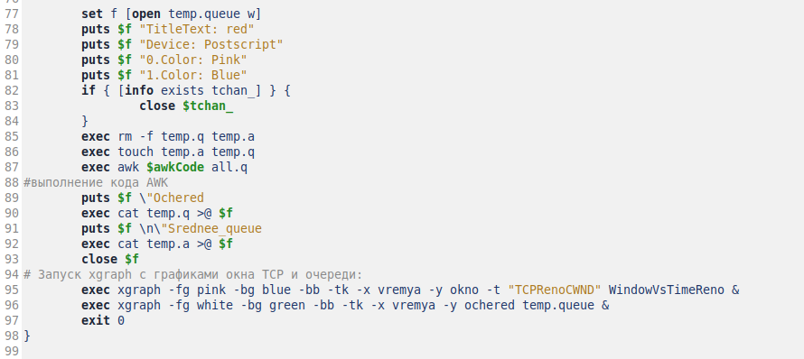

## Динамика длины очереди

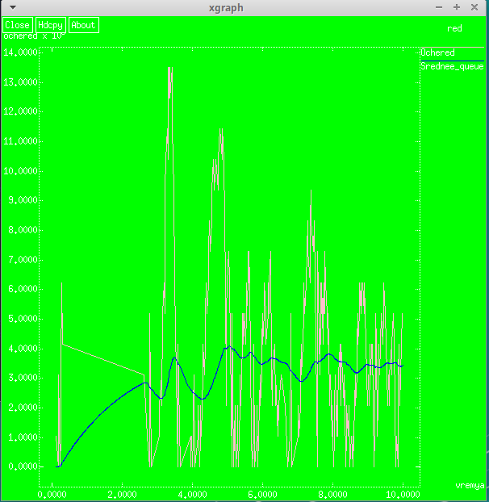

## Динамика окна TCP 

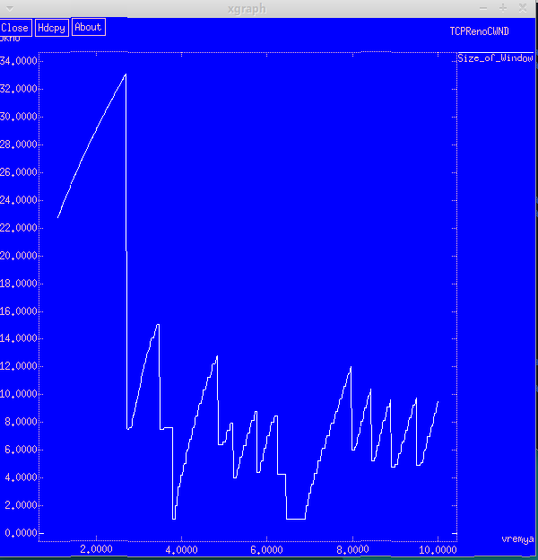

## Выводы

При выполнении данной лабораторной работы я исследовала протокол TCP и алгоритм управления очередью RED.

# Спасибо за внимание!
