---
## Front matter
title: "Лабораторная работа №2"
subtitle: "Исследование TCP протокола и алгоритма управления очередью RED"
author: "Дворкина Ева Владимировна"

## Generic otions
lang: ru-RU
toc-title: "Содержание"

## Bibliography
bibliography: bib/cite.bib
csl: pandoc/csl/gost-r-7-0-5-2008-numeric.csl

## Pdf output format
toc: true # Table of contents
toc-depth: 2
lof: true # List of figures
lot: false # List of tables
fontsize: 12pt
linestretch: 1.5
papersize: a4
documentclass: scrreprt
## I18n polyglossia
polyglossia-lang:
  name: russian
  options:
	- spelling=modern
	- babelshorthands=true
polyglossia-otherlangs:
  name: english
## I18n babel
babel-lang: russian
babel-otherlangs: english
## Fonts
mainfont: IBM Plex Serif
romanfont: IBM Plex Serif
sansfont: IBM Plex Sans
monofont: IBM Plex Mono
mathfont: STIX Two Math
mainfontoptions: Ligatures=Common,Ligatures=TeX,Scale=0.94
romanfontoptions: Ligatures=Common,Ligatures=TeX,Scale=0.94
sansfontoptions: Ligatures=Common,Ligatures=TeX,Scale=MatchLowercase,Scale=0.94
monofontoptions: Scale=MatchLowercase,Scale=0.94,FakeStretch=0.9
mathfontoptions:
## Biblatex
biblatex: true
biblio-style: "gost-numeric"
biblatexoptions:
  - parentracker=true
  - backend=biber
  - hyperref=auto
  - language=auto
  - autolang=other*
  - citestyle=gost-numeric
## Pandoc-crossref LaTeX customization
figureTitle: "Рис."
tableTitle: "Таблица"
listingTitle: "Листинг"
lofTitle: "Список иллюстраций"
lotTitle: "Список таблиц"
lolTitle: "Листинги"
## Misc options
indent: true
header-includes:
  - \usepackage{indentfirst}
  - \usepackage{float} # keep figures where there are in the text
  - \floatplacement{figure}{H} # keep figures where there are in the text
---

# Цель работы

Цель данной лабораторной работы - исследовать протокол TCP и алгоритм управления очередью RED.

# Задание

1. Выполнить пример с дисциплиной RED

2. Изменить в модели на узле s1 тип протокола TCP Reno на NewReno, затем на Vegas. Сравните и поясните результаты.

3. Внести изменения при отображении окон с графиками (измените цвет фона, цвет траекторий, подписи к осям, подпись траектории в легенде).


# Теоретическое введение

## Протокол TCP

Протокол управления передачей (Transmission Control Protocol, TCP) имеет средства управления потоком и коррекции ошибок, ориентирован на установление соединения.

Управление потоком в протоколе TCP осуществляется при помощи скользящего
окна переменного размера:

- поле Размер окна (Window) (длина 16 бит) содержит количество байт, которое
может быть послано после байта, получение которого уже подтверждено;

- если значение этого поля равно нулю, это означает, что все байты, вплоть до байта
с номером Номер подтверждения - 1, получены, но получатель отказывается
принимать дальнейшие данные;

- разрешение на дальнейшую передачу может быть выдано отправкой сегмента
с таким же значением поля Номер подтверждения и ненулевым значением поля
Размер окна.

Регулирование трафика в TCP:

- контроль доставки — отслеживает заполнение входного буфера получателя
с помощью параметра Размер окна (Window);

- контроль перегрузки — регистрирует перегрузку канала и связанные с этим
потери, а также понижает интенсивность трафика с помощью Окна перегрузки
(Congestion Window, CWnd) и Порога медленного старта (Slow Start Threshold,
SSThreth)

В ns-2 поддерживает следующие TCP-агенты односторонней передачи:

- Agent/TCP
- Agent/TCP/Reno
- Agent/TCP/Newreno
- Agent/TCP/Sack1 — TCP с выборочным повтором (RFC2018)
- Agent/TCP/Vegas
- Agent/TCP/Fack — Reno TCP с «последующим подтверждением»
- Agent/TCP/Linux — TCP-передатчик с поддержкой SACK, который использует
TCP с перезагрузкой контрольных модулей из ядра Linux

Односторонние агенты приёма:
- Agent/TCPSink
- Agent/TCPSink/DelAck
- Agent/TCPSink/Sack1
- Agent/TCPSink/Sack1/DelAck
Двунаправленный агент:
- Agent/TCP/FullTcp

**TCP Reno**:

- медленный старт (Slow-Start);
- контроль перегрузки (Congestion Avoidance);
- быстрый повтор передачи (Fast Retransmit);
- процедура быстрого восстановления (Fast Recovery);
- метод оценки длительности цикла передачи (Round Trip Time, RTT), используемой для установки таймера повторной передачи (Retransmission TimeOut, RTO).

**Схема работы TCP Reno**:

- размер окна увеличивается до тех пор, пока не произойдёт потеря сегмента (аналогично TCP Tahoe):
- фаза медленного старта;
- фаза избежания перегрузки;
- алгоритм не требует освобождения канала и его медленного (slow-start) заполнения после потери одного пакета;
- отправитель переходит в режим быстрого восстановления, после получения
некоторого предельного числа дублирующих подтверждений — отправитель
повторяет передачу одного пакета и уменьшает окно перегрузки (cwnd) в два
раза и устанавливает ssthresh_ в соответствии с этим значением

**TCP NewReno**:
- медленный старт (Slow-Start): 
  Размер окна увеличивается экспоненциально, удваиваясь после каждого успешного цикла передачи (RTT), пока не достигнет порогового значения (`ssthresh`) или не произойдет потеря пакета.
  
- контроль перегрузки (Congestion Avoidance): 
  После достижения `ssthresh` размер окна увеличивается линейно, добавляя 1 сегмент на каждый полученный ACK.

- быстрый повтор передачи (Fast Retransmit): 
  При получении трех дублицирующих ACK (подтверждений для одного и того же сегмента), отправитель считает, что произошла потеря пакета, и немедленно переходит к повторной передаче потерянного сегмента.

- процедура быстрого восстановления (Fast Recovery): 
  В отличие от TCP Reno, TCP NewReno поддерживает восстановление нескольких потерянных сегментов в одном окне. Если после повторной передачи приходят новые ACK, алгоритм продолжает восстанавливать оставшиеся потерянные пакеты, используя информацию из этих ACK. Это позволяет более эффективно восстанавливать потери без полного сброса окна.

**Схема работы TCP NewReno**:

- Работает аналогично TCP Reno до момента обнаружения потерь.
- В режиме быстрого восстановления TCP NewReno может обрабатывать несколько потерянных пакетов внутри одного окна передачи, тогда как TCP Reno предполагает сброс окна после каждой потери.
- При получении новых ACK, содержащих информацию о дополнительных потерях, TCP NewReno корректирует состояние окна и продолжает восстановление, не переходя обратно в фазу медленного старта.
- Таким образом, TCP NewReno более эффективен в сетях с высокими потерями и обеспечивает лучшую производительность по сравнению с TCP Reno.

**TCP Vegas**:

- медленный старт (Slow-Start): 
  Размер окна увеличивается экспоненциально, как и в других реализациях TCP, но TCP Vegas также начинает мониторинг задержки (delay-based approach) уже на этой фазе.

- контроль перегрузки (Congestion Avoidance): 
  TCP Vegas использует задержку передачи (RTT) для определения наличия перегрузки в сети. Если среднее значение RTT растет, это сигнализирует о начале перегрузки, и размер окна (`cwnd`) уменьшается. Если RTT остается стабильным, TCP Vegas продолжает увеличивать окно линейно.

- быстрый повтор передачи (Fast Retransmit): 
  Поддерживается, как и в других версиях TCP, но TCP Vegas стремится избежать потерь за счет управления задержкой, поэтому частота использования Fast Retransmit ниже.

- процедура быстрого восстановления (Fast Recovery): 
  TCP Vegas работает преимущественно на основе прогнозирования загрузки сети, поэтому процедура быстрого восстановления используется реже. Однако если происходит потеря пакета, алгоритм действует аналогично TCP Reno.

- метод оценки длительности цикла передачи (Round Trip Time, RTT): 
  TCP Vegas активно мониторит RTT для выявления перегрузки. Он использует три ключевых параметра:
  - `BaseRTT`: Минимальное измеренное значение RTT.
  - `Expected Throughput`: Ожидаемая пропускная способность на основе текущего `cwnd` и `BaseRTT`.
  - `Actual Throughput`: Реальная пропускная способность, рассчитанная на основе полученных ACK.

**Схема работы TCP Vegas**:

- TCP Vegas избегает потерь пакетов за счет контроля задержки передачи (RTT). Алгоритм постоянно сравнивает `Expected Throughput` с `Actual Throughput`:
  - Если `Actual Throughput` меньше `Expected Throughput`, это указывает на возможную перегрузку, и размер окна (`cwnd`) уменьшается.
  - Если `Actual Throughput` близко к `Expected Throughput`, TCP Vegas увеличивает окно.
- В отличие от традиционных реализаций TCP, таких как Reno или NewReno, TCP Vegas старается минимизировать потери пакетов, адаптируясь к изменяющейся загрузке сети через управление задержкой.
- TCP Vegas лучше работает в сетях с низкой потерей пакетов, но может быть менее эффективен в условиях

## Мониторинг очередей

Объект мониторинга очереди оповещает диспетчера очереди о поступлении пакета.
Диспетчер очереди осуществляет мониторинг очереди. 

Функция сброса алгоритма RED управления очередью ([-@eq:eq:red])

$$
p^{RED}(\hat{q}) =
  \begin{cases}
    0       & \quad 0 < \hat{q} \leq q_{min}\\
    \frac{\hat{q}-q_{min}}{q_{max}-q_{min}} p_{max}  & \quad q_{min} < \hat{q} \leq q_{max}\\
    1         & \quad \hat{q} > q_{max}
  \end{cases}
$$ {#eq:eq:red}

Где $q_{min}$, $q_{max}$ - пороговые значения очереди; $p_{max}$ - параметр максимального сброса.

Материалы взяты из [@l].

# Выполнение лабораторной работы

## Пример с дисциплиной RED

Постановка задачи Описание моделируемой сети:
- сеть состоит из 6 узлов;
- между всеми узлами установлено дуплексное соединение с различными пропускной способностью и задержкой 10 мс (рис. [-@fig:001]);
- узел r1 использует очередь с дисциплиной RED для накопления пакетов, максимальный размер которой составляет 25;
- TCP-источники на узлах s1 и s2 подключаются к TCP-приёмнику на узле s3;
- генераторы трафика FTP прикреплены к TCP-агентам.

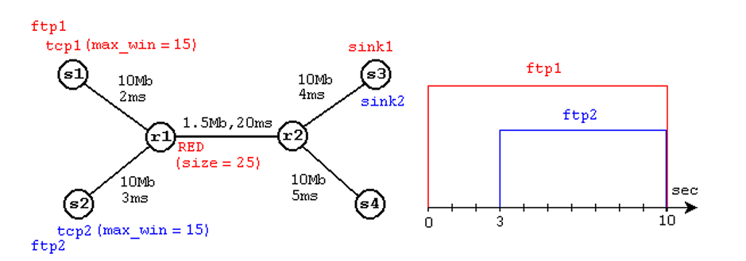{#fig:001 width=70%}

Реализуем модель в соответствии со схемой.

```
# создание объекта Simulator
set ns [new Simulator]

 # Узлы сети:
set N 5
for {set i 1} {$i < $N} {incr i} {
	set node_(s$i) [$ns node]
}
set node_(r1) [$ns node]
set node_(r2) [$ns node]
# Соединения:
$ns duplex-link $node_(s1) $node_(r1) 10Mb 2ms DropTail
$ns duplex-link $node_(s2) $node_(r1) 10Mb 3ms DropTail
$ns duplex-link $node_(r1) $node_(r2) 1.5Mb 20ms RED
$ns queue-limit $node_(r1) $node_(r2) 25
$ns queue-limit $node_(r2) $node_(r1) 25
$ns duplex-link $node_(s3) $node_(r2) 10Mb 4ms DropTail
$ns duplex-link $node_(s4) $node_(r2) 10Mb 5ms DropTail
# Агенты и приложения:
set tcp1 [$ns create-connection TCP/Reno $node_(s1) TCPSink $node_(s3) 0]
$tcp1 set window_ 15
set tcp2 [$ns create-connection TCP/Reno $node_(s2) TCPSink $node_(s3) 1]
$tcp2 set window_ 15
set ftp1 [$tcp1 attach-source FTP]
set ftp2 [$tcp2 attach-source FTP]
# Здесь window_ — верхняя граница окна приёмника (Advertisment Window) TCPсоединения.

# Мониторинг размера окна TCP:
set windowVsTime [open WindowVsTimeReno w]
set qmon [$ns monitor-queue $node_(r1) $node_(r2) [open qm.out w] 0.1];
[$ns link $node_(r1) $node_(r2)] queue-sample-timeout;

# Мониторинг очереди:
set redq [[$ns link $node_(r1) $node_(r2)] queue]
set tchan_ [open all.q w]
$redq trace curq_
$redq trace ave_
$redq attach $tchan_
#Здесь curq_ — текущий размер очереди, ave_ — средний размер очереди.

# Добавление at-событий:
$ns at 0.0 "$ftp1 start"
$ns at 1.1 "plotWindow $tcp1 $windowVsTime"
$ns at 3.0 "$ftp2 start"
$ns at 10 "finish"

# Формирование файла с данными о размере окна TCP:
proc plotWindow {tcpSource file} {
	global ns
	set time 0.01
	set now [$ns now]
	set cwnd [$tcpSource set cwnd_]
	puts $file "$now $cwnd"
	$ns at [expr $now+$time] "plotWindow $tcpSource $file"
}
#Здесь cwnd_ — текущее значение окна перегрузки.

# Процедура finish:
proc finish {} {
	global tchan_
# подключение кода AWK:
	set awkCode {
		{
			if ($1 == "Q" && NF>2) {
				print $2, $3 >> "temp.q";
				set end $2
			}
			else if ($1 == "a" && NF>2)
			print $2, $3 >> "temp.a";
		}
	}
	set f [open temp.queue w]
	puts $f "TitleText: red"
	puts $f "Device: Postscript"
	if { [info exists tchan_] } {
		close $tchan_
	}
	exec rm -f temp.q temp.a
	exec touch temp.a temp.q
# выполнение кода AWK
	exec awk $awkCode all.q
	puts $f \"queue
	exec cat temp.q >@ $f
	puts $f \n\"ave_queue
	exec cat temp.a >@ $f
	close $f
# Запуск xgraph с графиками окна TCP и очереди:
	exec xgraph -bb -tk -x time -t "TCPRenoCWND" WindowVsTimeReno &
	exec xgraph -bb -tk -x time -y queue temp.queue &
	exit 0
}

# запуск модели
$ns run
```

Запустим файл с приведенным кодом программы и получим график изменения очереди (рис. [-@fig:002]) и график изменения окна TCP (рис. [-@fig:003]).

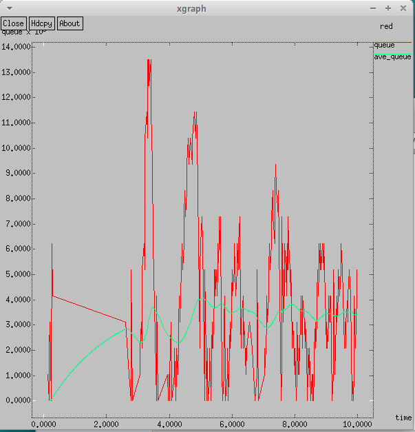{#fig:002 width=70%}

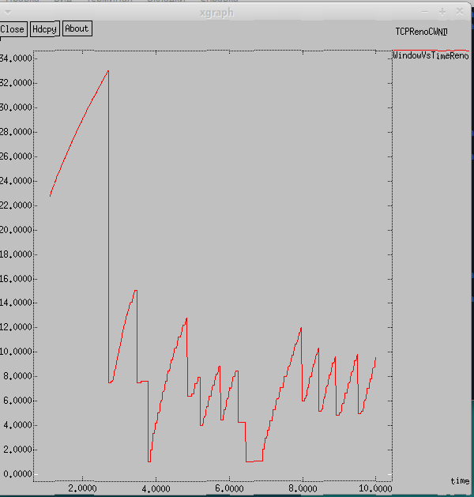{#fig:003 width=70%}


## Изменить в модели на узле s1 тип протокола TCP Reno на NewReno, затем на Vegas. 

Поменяем в модели на узле s1 тип протокола TCP Reno на Newreno (рис. [-@fig:004])

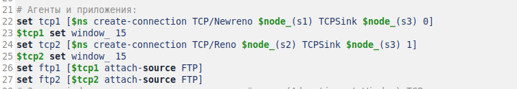{#fig:004 width=70%}

После запуска обновленной программы снова получим график изменения очереди (рис. [-@fig:005]) и график изменения окна TCP (рис. [-@fig:006]).

Различий между предыдущими графиками и полученными графиками для Newreno достаточно мало, так как основные принципы работы Newreno и Reno совпадают, Newreno - это улучшенная версия Reno. При получении информации о дополнительных потерях, TCP NewReno корректирует состояние окна и продолжает восстановление, не переходя обратно в фазу медленного старта. Так, рост окна TCP Newreno по графику происходит быстрее, а разброс размера очереди после ее пикового значения меньше чем при TCP Reno, однако первое пиковое значение очереди 14 на обоих графиках динамики очереди совпадает. На обоих графиках максимальный размер окна TCP 34.

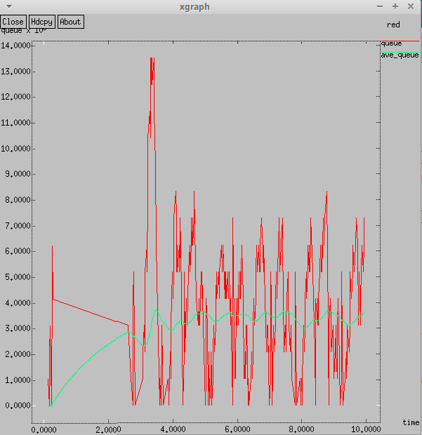{#fig:005 width=70%}

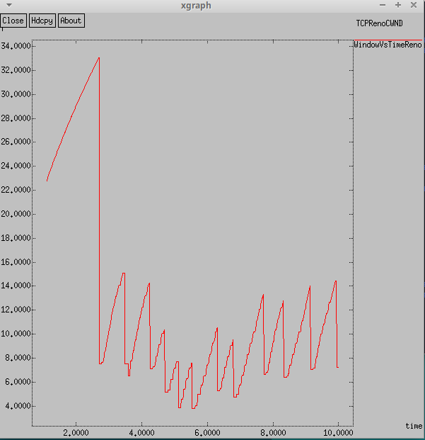{#fig:006 width=70%}

Поменяем в модели на узле s1 тип протокола TCP Newreno на Vegas (рис. [-@fig:007])

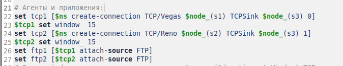{#fig:007 width=70%}

После запуска обновленной программы снова получим график изменения очереди (рис. [-@fig:008]) и график изменения окна TCP (рис. [-@fig:009]).

На полученных графиках видны существенные отличия от предыдущих примеров. TCP Vegas работает преимущественно на основе прогнозирования загрузки сети, поэтому процедура быстрого восстановления используется реже. Однако если происходит потеря пакета, алгоритм действует аналогично TCP Reno. TCP Vegas пытается предугадать возможную перегрузку сети, и размер окна для предотвращения перегрузки сети уменьшается. Максимальное значение очереди так же 14, а максимальный размер окна меньше чем на предыдущих графиках - 20. 

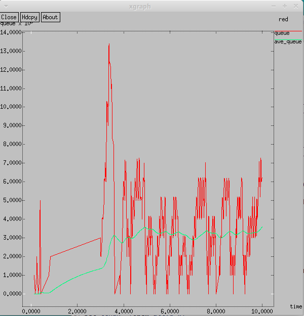{#fig:008 width=70%}

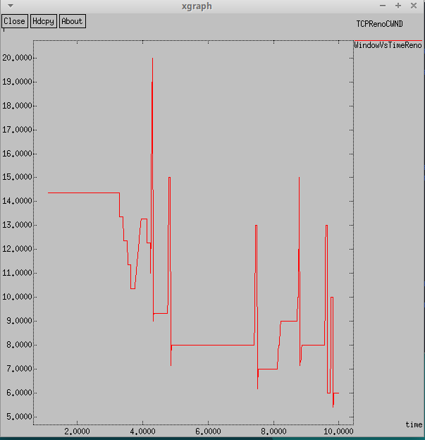{#fig:009 width=70%}

## Внесение изменения при отображении окон с графиками

Далее поменяем цвет фона, цвет траектории, подписи к осями и подпись траектории в легенде графиков (рис. [-@fig:009] и [-@fig:009]). Для внесения изменений использованы материалы из [@ns]. 

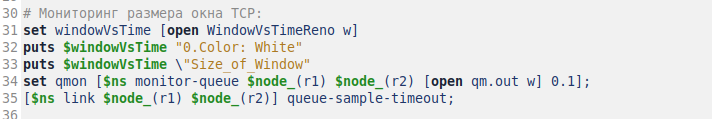{#fig:010 width=70%}

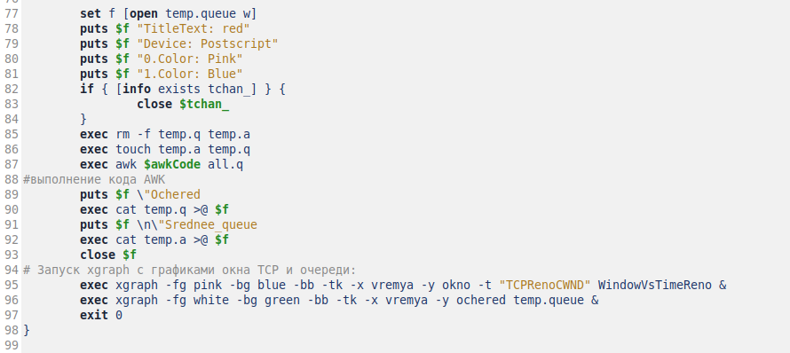{#fig:011 width=70%}

Запустив измененную программу получим два графика с новыми цветами осей и фона, с новыми подписями к осям и изменениями в легенде.

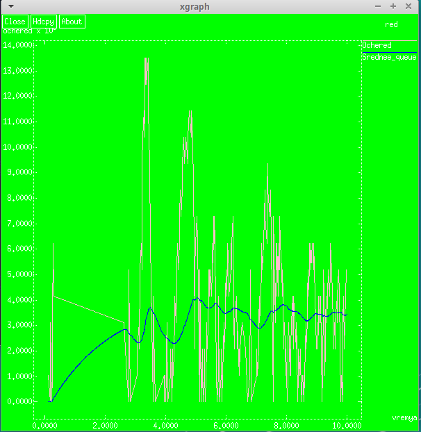{#fig:012 width=70%}

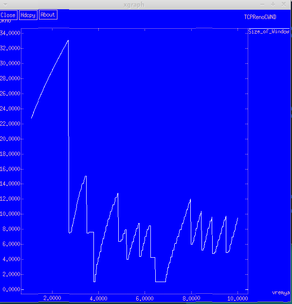{#fig:013 width=70%}


# Выводы

При выполнении данной лабораторной работы я исследовала протокол TCP и алгоритм управления очередью RED.

# Список литературы{.unnumbered}

::: {#refs}
:::
