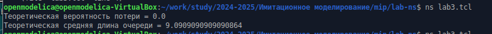
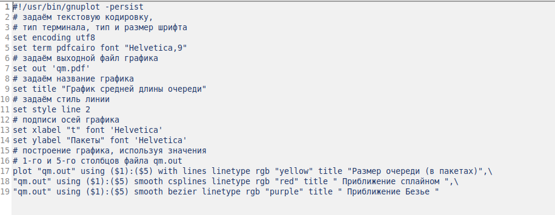
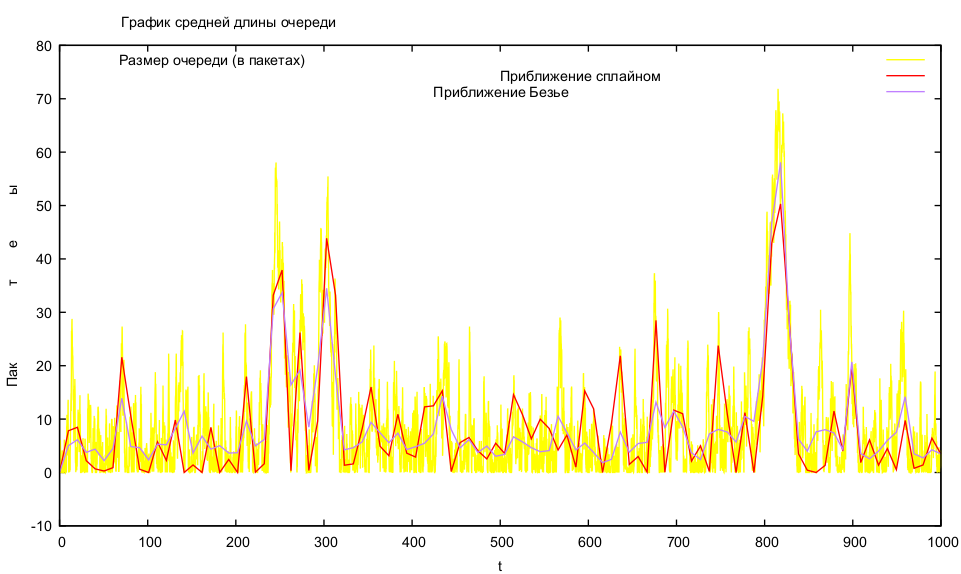

---
## Front matter
lang: ru-RU
title: Лабораторная работа №3
subtitle: Моделирование стохастических процессов
author:
  - Дворкина Е. В.
institute:
  - Российский университет дружбы народов, Москва, Россия
date: 21 февраля 2025

## i18n babel
babel-lang: russian
babel-otherlangs: english

## Formatting pdf
toc: false
toc-title: Содержание
slide_level: 2
aspectratio: 169
section-titles: true
theme: metropolis
header-includes:
 - \metroset{progressbar=frametitle,sectionpage=progressbar,numbering=fraction}
---

## Докладчик

:::::::::::::: {.columns align=center}
::: {.column width="70%"}

  * Дворкина Ева Владимировна
  * студентка
  * группа НФИбд-01-22
  * Российский университет дружбы народов
  * [1132226447@rudn.ru](mailto:1132226447@rudn.ru)
  * <https://github.com/evdvorkina>

:::
::: {.column width="30%"}


:::
::::::::::::::

## Цель работы

Цель данной лабораторной работы - провести моделирование системы массового обслуживания (СМО).

## Задание

1. Реализовать модель $M|M|1$
2. Посчитать нагрузку системы и вероятность потери пакетов
3. Построить график изменения размера очереди в GNUplot


## Реализация модели $M|M|1$ (1)

```
set ns [new Simulator]
set tf [open out.tr w]
$ns trace-all $tf

set lambda 30.0
set mu 33.0
set qsize 100000
# устанавливаем длительность эксперимента
set duration 1000.0

set n1 [$ns node]
set n2 [$ns node]
set link [$ns simplex-link $n1 $n2 100kb 0ms DropTail]
```

## Реализация модели $M|M|1$ (2)

```
# наложение ограничения на размер очереди:
$ns queue-limit $n1 $n2 $qsize
# задаём распределения интервалов времени
# поступления пакетов и размера пакетов
set InterArrivalTime [new RandomVariable/Exponential]
$InterArrivalTime set avg_ [expr 1/$lambda]
set pktSize [new RandomVariable/Exponential]
$pktSize set avg_ [expr 100000.0/(8*$mu)]
```

## Реализация модели $M|M|1$ (3)

```
# задаём агент UDP и присоединяем его к источнику,
# задаём размер пакета
set src [new Agent/UDP]
$src set packetSize_ 100000
$ns attach-agent $n1 $src
# задаём агент-приёмник и присоединяем его
set sink [new Agent/Null]
$ns attach-agent $n2 $sink
$ns connect $src $sink
```

## Реализация модели $M|M|1$ (4)

```
# мониторинг очереди
set qmon [$ns monitor-queue $n1 $n2 [open qm.out w] 0.1]
$link queue-sample-timeout
# процедура finish закрывает файлы трассировки
proc finish {} {
	global ns tf
	$ns flush-trace
	close $tf
	exit 0
}
```

## Реализация модели $M|M|1$ (5)

```
# процедура случайного генерирования пакетов
proc sendpacket {} {
	global ns src InterArrivalTime pktSize
	set time [$ns now]
	$ns at [expr $time +[$InterArrivalTime value]] "sendpacket"
	set bytes [expr round ([$pktSize value])]
	$src send $bytes
}
# планировщик событий
$ns at 0.0001 "sendpacket"
$ns at $duration "finish"
```

## Реализация модели $M|M|1$ (6)

```
# расчет загрузки системы и вероятности потери пакетов
set rho [expr $lambda/$mu]
set ploss [expr (1-$rho)*pow($rho,$qsize)/(1-pow($rho,($qsize+1)))]
puts "Теоретическая вероятность потери = $ploss"
set aveq [expr $rho*$rho/(1-$rho)]
puts "Теоретическая средняя длина очереди = $aveq"
# запуск модели
$ns run
```

## Подсчет нагрузки системы и вероятности потери пакетов



## Построение графика изменения размера очереди в GNUplot



## Исполнение файла

```
chmod +x graph_plot

./graph_plot
```

## График поведения длины очереди

{#fig:003 width=70%}

## Выводы

При выполнении лабораторной работы я провела моделирование системы массового обслуживания (СМО).

# Спасибо за внимание
