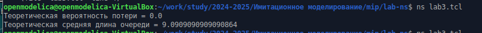
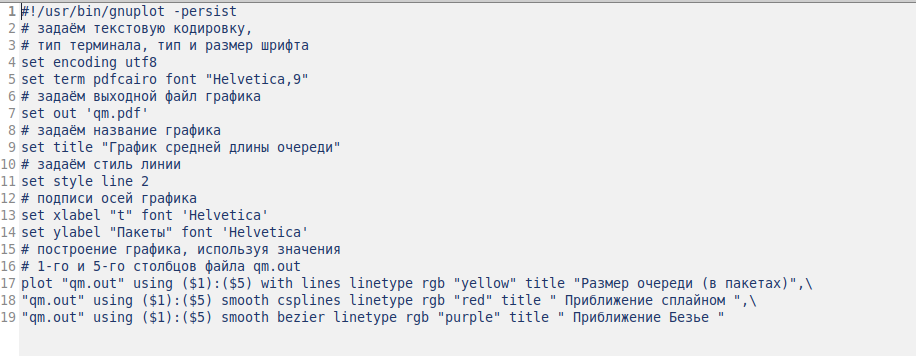
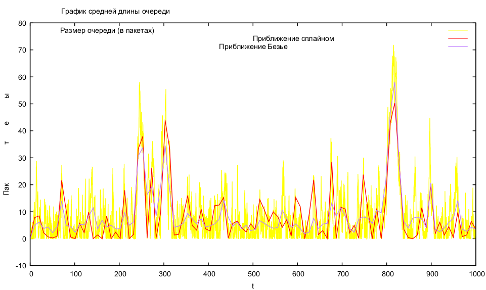

---
## Front matter
title: "Лабораторная работа №3"
subtitle: "Моделирование стохастических процессов"
author: "Дворкина Ева Владимировна"

## Generic otions
lang: ru-RU
toc-title: "Содержание"

## Bibliography
bibliography: bib/cite.bib
csl: pandoc/csl/gost-r-7-0-5-2008-numeric.csl

## Pdf output format
toc: true # Table of contents
toc-depth: 2
lof: true # List of figures
lot: false # List of tables
fontsize: 12pt
linestretch: 1.5
papersize: a4
documentclass: scrreprt
## I18n polyglossia
polyglossia-lang:
  name: russian
  options:
	- spelling=modern
	- babelshorthands=true
polyglossia-otherlangs:
  name: english
## I18n babel
babel-lang: russian
babel-otherlangs: english
## Fonts
mainfont: IBM Plex Serif
romanfont: IBM Plex Serif
sansfont: IBM Plex Sans
monofont: IBM Plex Mono
mathfont: STIX Two Math
mainfontoptions: Ligatures=Common,Ligatures=TeX,Scale=0.94
romanfontoptions: Ligatures=Common,Ligatures=TeX,Scale=0.94
sansfontoptions: Ligatures=Common,Ligatures=TeX,Scale=MatchLowercase,Scale=0.94
monofontoptions: Scale=MatchLowercase,Scale=0.94,FakeStretch=0.9
mathfontoptions:
## Biblatex
biblatex: true
biblio-style: "gost-numeric"
biblatexoptions:
  - parentracker=true
  - backend=biber
  - hyperref=auto
  - language=auto
  - autolang=other*
  - citestyle=gost-numeric
## Pandoc-crossref LaTeX customization
figureTitle: "Рис."
tableTitle: "Таблица"
listingTitle: "Листинг"
lofTitle: "Список иллюстраций"
lotTitle: "Список таблиц"
lolTitle: "Листинги"
## Misc options
indent: true
header-includes:
  - \usepackage{indentfirst}
  - \usepackage{float} # keep figures where there are in the text
  - \floatplacement{figure}{H} # keep figures where there are in the text
---

# Цель работы

Цель данной лабораторной работы - провести моделирование системы массового обслуживания (СМО).

# Задание

1. Реализовать модель $M|M|1$
2. Посчитать нагрузку системы и вероятность потери пакетов
3. Построить график изменения размера очереди в GNUplot

# Теоретическое введение

$M|M|1$ — однолинейная СМО с накопителем бесконечной ёмкости. Поступаю-
щий поток заявок — пуассоновский с интенсивностью $\lambda$. Времена обслуживания
заявок — независимые в совокупности случайные величины, распределённые по
экспоненциальному закону с параметром $\mu$.

Система дифференциальных уравнений Колмогорова ([-@eq:eq:syst]):

$$
  \begin{cases}
    p'_0(t) = -\lambda p_0(t) + \mu p_1(t)\\
    p'_i(t) = -(\lambda + \mu)p_i(t)+\lambda p_{i-1}(t) + \mu p_{i+1}(t) & \quad i \geq 1
  \end{cases}
$$ {#eq:eq:syst}

$p_i(t)=P\{ \nu (t) = i \}$ - вероятность того, что в момент времени $t$ в системе находится $i$ заявок.

$\rho = \frac{\lambda}{\mu}$ - загрузка системы

Стационарное среднее число заявок в очереди ([-@eq:eq:qq]):

$$
Q = \frac{\rho^2}{1-\rho}
$$ {#eq:eq:qq}

Более подробно в [@l; @ns].

# Выполнение лабораторной работы

## Реализация модели $M|M|1$

В новом файле выполним реализацию модели системы массового обслуживания

```
# созданиеобъекта Simulator
set ns [new Simulator]
# открытиеназаписьфайлаout.trдлярегистрациисобытий
set tf [open out.tr w]
$ns trace-all $tf
# задаёмзначенияпараметровсистемы
set lambda 30.0
set mu 33.0
# размерочередидляM|M|1(дляM|M|1|R:setqsizeR)
set qsize 100000
# устанавливаемдлительностьэксперимента
set duration 1000.0
# задаёмузлыисоединяемихсимплекснымсоединением
# сполосойпропускания100Кб/сизадержкой0мс,
# очередьюс обслуживаниемтипа DropTail
set n1 [$ns node]
set n2 [$ns node]
set link [$ns simplex-link $n1 $n2 100kb 0ms DropTail]
# наложение ограничения на размер очереди:
$ns queue-limit $n1 $n2 $qsize
# задаём распределения интервалов времени
# поступления пакетов и размера пакетов
set InterArrivalTime [new RandomVariable/Exponential]
$InterArrivalTime set avg_ [expr 1/$lambda]
set pktSize [new RandomVariable/Exponential]
$pktSize set avg_ [expr 100000.0/(8*$mu)]
# задаём агент UDP и присоединяем его к источнику,
# задаём размер пакета
set src [new Agent/UDP]
$src set packetSize_ 100000
$ns attach-agent $n1 $src
# задаём агент-приёмник и присоединяем его
set sink [new Agent/Null]
$ns attach-agent $n2 $sink
$ns connect $src $sink
# мониторинг очереди
set qmon [$ns monitor-queue $n1 $n2 [open qm.out w] 0.1]
$link queue-sample-timeout
# процедура finish закрывает файлы трассировки
proc finish {} {
	global ns tf
	$ns flush-trace
	close $tf
	exit 0
}
# процедура случайного генерирования пакетов
proc sendpacket {} {
	global ns src InterArrivalTime pktSize
	set time [$ns now]
	$ns at [expr $time +[$InterArrivalTime value]] "sendpacket"
	set bytes [expr round ([$pktSize value])]
	$src send $bytes
}
# планировщик событий
$ns at 0.0001 "sendpacket"
$ns at $duration "finish"
# расчет загрузки системы и вероятности потери пакетов
set rho [expr $lambda/$mu]
set ploss [expr (1-$rho)*pow($rho,$qsize)/(1-pow($rho,($qsize+1)))]
puts "Теоретическая вероятность потери = $ploss"
set aveq [expr $rho*$rho/(1-$rho)]
puts "Теоретическая средняя длина очереди = $aveq"
# запуск модели
$ns run
```

## Подсчет нагрузки системы и вероятности потери пакетов

Запустив программу, получим результаты, сообщающие о теоретической вероятности потери пакета и о теоретической средней длине очереди. Вероятность потери у нас равна 0, потому что реализована модель СМО с накопителем бесконечной емкости (для этого предел длины очередь в программе задали не бесконечным, а очень большим) (рис. [-@fig:001]).

{#fig:001 width=70%}

## Построение графика изменения размера очереди в GNUplot

В программе, написанной в файле `graph_plot`, для построения графика GNUplot я изначально внесла изменения в цвет графиков (рис. [-@fig:002]).

{#fig:002 width=70%}

После закрытия файла необходимо добавить ему права на исполнения (сделать исполняемым), а следующей командой запустить файл: 

```
chmod +x graph_plot

./graph_plot
```

Согласно реализации построения графика, он сохраняется в файле pdf, на нем мы видим изменение длины очереди от времени, а также приближение сплайном и безье для замены функции сложных колебаний длины очереди функцией, которая приближенно и обобщенно их описывает (рис. [-@fig:003]).

{#fig:003 width=70%}


# Выводы

При выполнении лабораторной работы я провела моделирование системы массового обслуживания (СМО).

# Список литературы{.unnumbered}

::: {#refs}
:::
