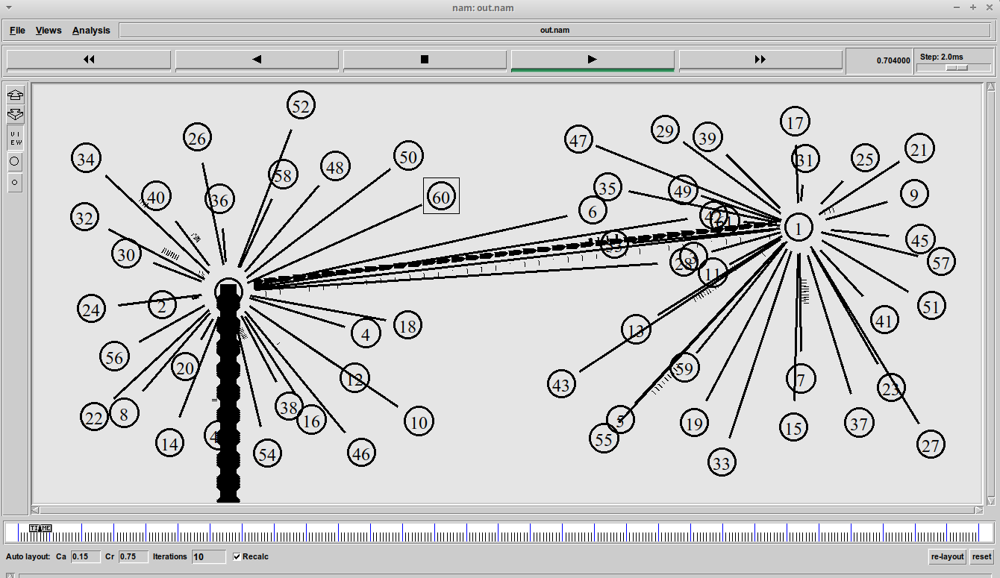
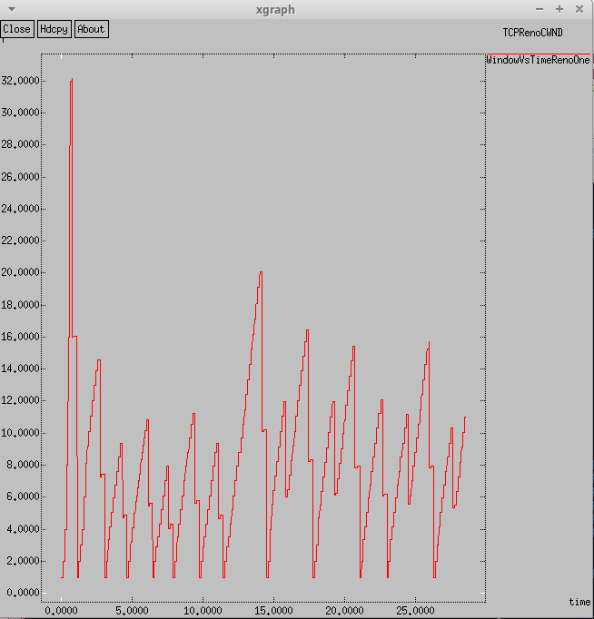
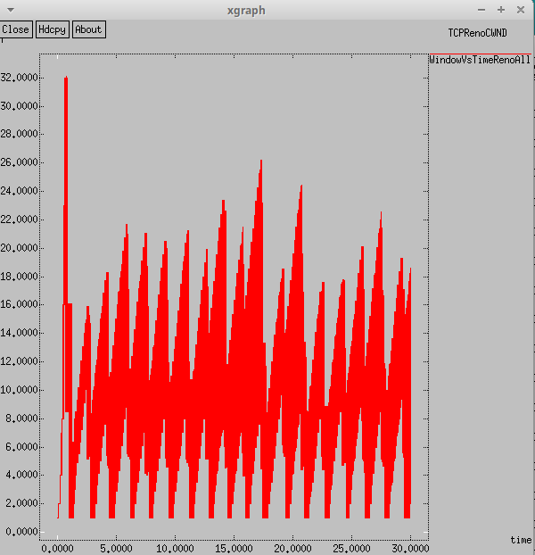
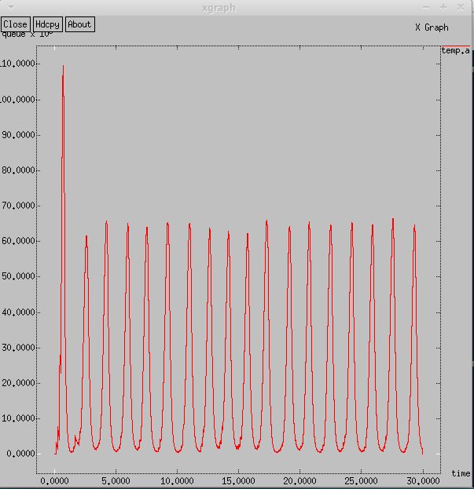
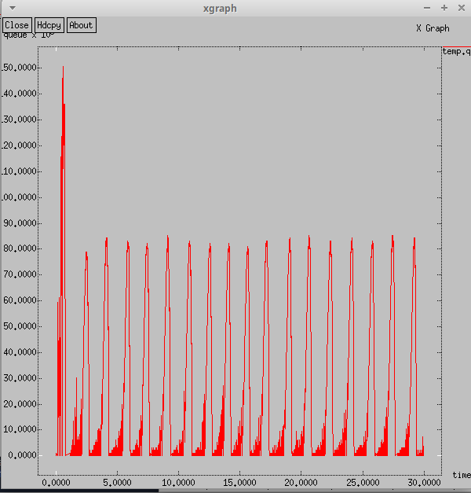
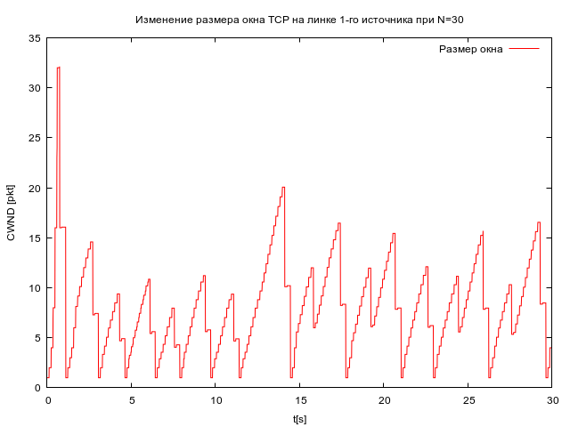
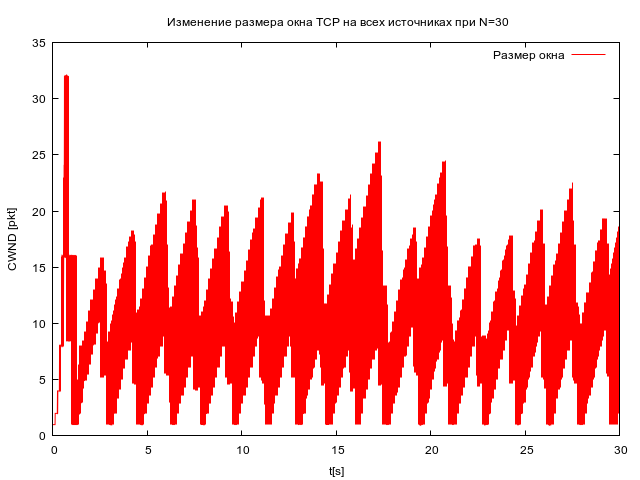
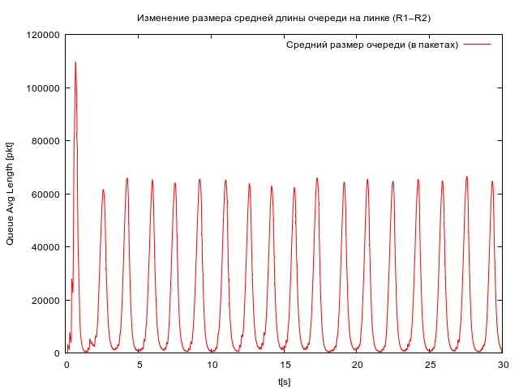
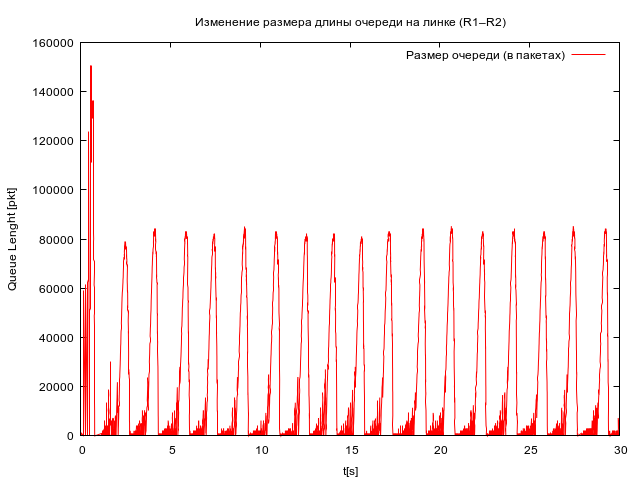

---
## Front matter
lang: ru-RU
title: Лабораторная работа №4
subtitle: Задание для самостоятельного выполнения
author:
  - Дворкина Е. В.
institute:
  - Российский университет дружбы народов, Москва, Россия
date: 25 февраля 2025

## i18n babel
babel-lang: russian
babel-otherlangs: english

## Formatting pdf
toc: false
toc-title: Содержание
slide_level: 2
aspectratio: 169
section-titles: true
theme: metropolis
header-includes:
 - \metroset{progressbar=frametitle,sectionpage=progressbar,numbering=fraction}
---

## Докладчик

:::::::::::::: {.columns align=center}
::: {.column width="70%"}

  * Дворкина Ева Владимировна
  * студентка
  * группа НФИбд-01-22
  * Российский университет дружбы народов
  * [1132226447@rudn.ru](mailto:1132226447@rudn.ru)
  * <https://github.com/evdvorkina>

:::
::: {.column width="30%"}


:::
::::::::::::::


## Цель работы

Цель данной лабораторной работы - выполнить задание для самостоятельного выполнения.

## Задание

1. Для приведённой схемы разработать имитационную модель в пакете NS-2.
2. Построить график изменения размера окна TCP (в Xgraph и в GNUPlot).
3. Построить график изменения длины очереди и средней длины очереди на первом маршрутизаторе.
4. Оформить отчёт о выполненной работе.


# Выполнение лабораторной работы

## Описание моделируемой сети:
- сеть состоит из N TCP-источников, N TCP-приёмников, двух маршрутизаторов R1 и R2 между источниками и приёмниками (N — не менее 20);
- между TCP-источниками и первым маршрутизатором установлены дуплексные соединения с пропускной способностью 100 Мбит/с и задержкой 20 мс очередью типа DropTail;
- между TCP-приёмниками и вторым маршрутизатором установлены дуплексные соединения с пропускной способностью 100 Мбит/с и задержкой 20 мс очередью типа DropTail;

## Описание моделируемой сети:

- между маршрутизаторами установлено симплексное соединение (R1–R2) с пропускной способностью 20 Мбит/с и задержкой 15 мс очередью типа RED, размером буфера 300 пакетов; в обратную сторону — симплексное соединение (R2–R1) с пропускной способностью 15 Мбит/с и задержкой 20 мс очередью типа DropTail;
- данные передаются по протоколу FTP поверх TCPReno;
- параметры алгоритма RED: qmin = 75, qmax = 150, qw = 0, 002, pmax = 0.1;
- максимальный размер TCP-окна 32; размер передаваемого пакета 500 байт; время моделирования — не менее 20 единиц модельного времени.

## Программа NS-2

```
# создание объекта Simulator
set ns [new Simulator]
# открытие на запись файла out.nam для визуализатора nam
set nf [open out.nam w]
$ns namtrace-all $nf
# открытие на запись файла трассировки out.tr
set f [open out.tr w]
# все регистрируемые события будут записаны в переменную f
$ns trace-all $f
```

## Программа NS-2

```
Agent/TCP set window_ 32
Agent/TCP set pktSize_ 500
```

## Программа NS-2

```
# Формирование файла с данными о размере окна TCP:
proc plotWindow {tcpSource file} {
	global ns
	set time 0.01
	set now [$ns now]
	set cwnd [$tcpSource set cwnd_]
	puts $file "$now $cwnd"
	$ns at [expr $now+$time] "plotWindow $tcpSource $file"
}
#Здесь cwnd_ — текущее значение окна перегрузки.
```

## Программа NS-2. Процедура finish

```
proc finish {} {
	# описание глобальных переменных
	global ns f nf tchan_
	set awkCode {
		{
			if ($1 == "Q" && NF>2) {
				print $2, $3 >> "temp.q";
				set end $2
			}
			else if ($1 == "a" && NF>2)
			print $2, $3 >> "temp.a";
		}
	}
```

## Программа NS-2. Процедура finish

```
	exec rm -f temp.q temp.a
	exec touch temp.a temp.q
# выполнение кода AWK
	exec awk $awkCode all.q
	# прекращение трассировки
	$ns flush-trace
# закрытие файлов трассировки
# закрытие файлов трассировки nam
	close $f
	close $nf
```

## Программа NS-2. Процедура finish

```
# запуск nam в фоновом режиме
# Запуск xgraph с графиками окна TCP и очереди:
	exec xgraph -bb -tk -x time -t "TCPRenoCWND" WindowVsTimeRenoOne &
	exec xgraph -bb -tk -x time -t "TCPRenoCWND" WindowVsTimeRenoAll &
	exec xgraph -bb -tk -x time -y queue temp.q &
	exec xgraph -bb -tk -x time -y queue temp.a &
	exec nam out.nam &
	exit 0
}
```

## Программа NS-2

```
set node_(r1) [$ns node]
set node_(r2) [$ns node]
# Соединения:
$ns simplex-link $node_(r1) $node_(r2) 20Mb 15ms RED
$ns simplex-link $node_(r2) $node_(r1) 15Mb 20ms DropTail
$ns queue-limit $node_(r1) $node_(r2) 300
```

## Программа NS-2

```
set N 30
for {set i 0} {$i < $N} {incr i} {
	set node_(s$i) [$ns node]
	set node_(f$i) [$ns node]
	$ns duplex-link $node_(s$i) $node_(r1) 100Mb 20ms DropTail
	$ns duplex-link $node_(f$i) $node_(r2) 100Mb 20ms DropTail
	set tcp($i) [$ns create-connection TCP/Reno $node_(s$i) TCPSink $node_(f$i) $i]
	set ftp($i) [$tcp($i) attach-source FTP]
}
```

## Программа NS-2. Мониторинг размера окна TCP

```
# Мониторинг размера окна TCP:
set windowVsTimeOne [open WindowVsTimeRenoOne w]
set windowVsTimeAll [open WindowVsTimeRenoAll w]

set qmon [$ns monitor-queue $node_(r1) $node_(r2) [open qm.out w] 0.1];
[$ns link $node_(r1) $node_(r2)] queue-sample-timeout;

```

## Программа NS-2. Мониторинг очереди

```
set redq [[$ns link $node_(r1) $node_(r2)] queue]
$redq set thresh_ 75
$redq set maxthresh_ 150
$redq set q_weight_ 0.002
$redq set linterm_ 10

set tchan_ [open all.q w]
$redq trace curq_
$redq trace ave_
$redq attach $tchan_
#Здесь curq_ — текущий размер очереди, ave_ — средний размер очереди.
```

## Программа NS-2. at-события

```
for {set i 0} {$i < $N} {incr i} {
	$ns at 0.0 "$ftp($i) start"
	$ns at 0.0 "plotWindow $tcp($i) $windowVsTimeAll"
}
$ns at 0.0 "plotWindow $tcp(0) $windowVsTimeOne"
$ns at 30.0 "finish"
# запуск модели
$ns run
```

## Результат в визуализаторе nam

{#fig:001 width=70%}

## График XGraph. Изменение размера окна TCP на линке 1-го источника 

{#fig:002 width=70%}

## График XGraph. Изменение размера окна TCP на всех источниках

{#fig:003 width=70%}

## График XGraph. Изменение размера средней длины очереди

{#fig:004 width=70%}

## График XGraph. Изменение размера длины очереди

{#fig:005 width=70%}

## Программа GNUPlot

```
#!/usr/bin/gnuplot -persist
# задаём текстовую кодировку,
# тип терминала, тип и размер шрифта
set encoding utf8
set term pngcairo font "Helvetica,9"
```

## Программа GNUPlot

```
# задаём выходной файл графика
set out 'windowOne.png'
set title "Изменение размера окна TCP на линке 1-го источника при N=30"
set xlabel "t[s]" font 'Helvetica'
set ylabel "CWND [pkt]" font 'Helvetica'
plot "WindowVsTimeRenoOne" using ($1):($2) with lines linetype rgb "red" title "Размер окна"
```

## Программа GNUPlot

```
set out 'windowAll.png'
set title " Изменение размера окна TCP на всех источниках при N=30"
set xlabel "t[s]" font 'Helvetica'
set ylabel "CWND [pkt]" font 'Helvetica'
plot "WindowVsTimeRenoAll" using ($1):($2) with lines linetype rgb "red" title "Размер окна"
```

## Программа GNUPlot

```
set out 'queue.png'
set title "Изменение размера длины очереди на линке (R1–R2)"
set xlabel "t[s]" font 'Helvetica'
set ylabel "Queue Lenght [pkt]" font 'Helvetica'
plot "temp.q" using ($1):($2) with lines linetype rgb "red" title "Размер очереди (в пакетах)"
```

## Программа GNUPlot

```
set out 'average_queue.png'
set title "Изменение размера средней длины очереди на линке (R1–R2)"
set xlabel "t[s]" font 'Helvetica'
set ylabel "Queue Avg Length [pkt]" font 'Helvetica'
plot "temp.a" using ($1):($2) with lines linetype rgb "red" title "Средний размер очереди (в пакетах)"
```

## График GNUPlot. Изменение размера окна TCP на линке 1-го источника 

{#fig:006 width=70%}

## График GNUPlot. Изменение размера окна TCP на всех источниках

{#fig:007 width=70%}

## График GNUPlot. Изменение размера средней длины очереди

{#fig:008 width=70%}

## График GNUPlot. Изменение размера длины очереди

{#fig:009 width=70%}

## Выводы

При выполнении данной лабораторной работы я выполнила задание для индивидуального выполнения.

# Спасибо за внимание
