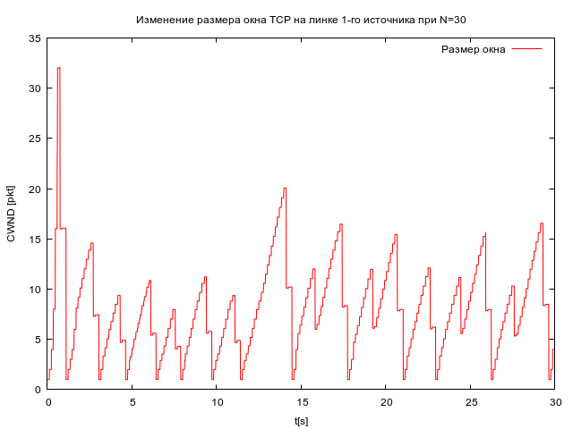
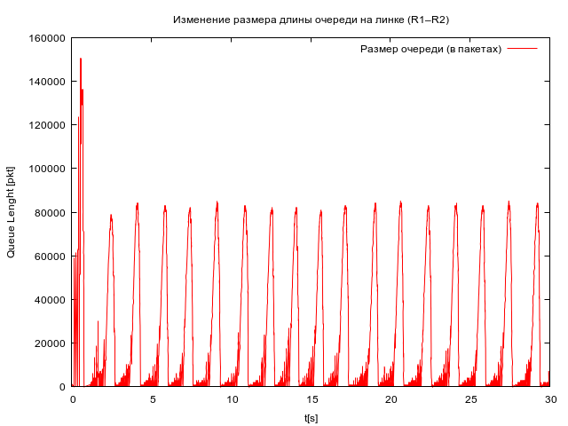

---
## Front matter
title: "Лабораторная работа №4"
subtitle: "Задание для самостоятельного выполнения"
author: "Дворкина Ева Владимировна"

## Generic otions
lang: ru-RU
toc-title: "Содержание"

## Bibliography
bibliography: bib/cite.bib
csl: pandoc/csl/gost-r-7-0-5-2008-numeric.csl

## Pdf output format
toc: true # Table of contents
toc-depth: 2
lof: true # List of figures
lot: false # List of tables
fontsize: 12pt
linestretch: 1.5
papersize: a4
documentclass: scrreprt
## I18n polyglossia
polyglossia-lang:
  name: russian
  options:
	- spelling=modern
	- babelshorthands=true
polyglossia-otherlangs:
  name: english
## I18n babel
babel-lang: russian
babel-otherlangs: english
## Fonts
mainfont: IBM Plex Serif
romanfont: IBM Plex Serif
sansfont: IBM Plex Sans
monofont: IBM Plex Mono
mathfont: STIX Two Math
mainfontoptions: Ligatures=Common,Ligatures=TeX,Scale=0.94
romanfontoptions: Ligatures=Common,Ligatures=TeX,Scale=0.94
sansfontoptions: Ligatures=Common,Ligatures=TeX,Scale=MatchLowercase,Scale=0.94
monofontoptions: Scale=MatchLowercase,Scale=0.94,FakeStretch=0.9
mathfontoptions:
## Biblatex
biblatex: true
biblio-style: "gost-numeric"
biblatexoptions:
  - parentracker=true
  - backend=biber
  - hyperref=auto
  - language=auto
  - autolang=other*
  - citestyle=gost-numeric
## Pandoc-crossref LaTeX customization
figureTitle: "Рис."
tableTitle: "Таблица"
listingTitle: "Листинг"
lofTitle: "Список иллюстраций"
lotTitle: "Список таблиц"
lolTitle: "Листинги"
## Misc options
indent: true
header-includes:
  - \usepackage{indentfirst}
  - \usepackage{float} # keep figures where there are in the text
  - \floatplacement{figure}{H} # keep figures where there are in the text
---

# Цель работы

Цель данной лабораторной работы - выполнить задание для самостоятельного выполнения.

# Задание

1. Для приведённой схемы разработать имитационную модель в пакете NS-2.
2. Построить график изменения размера окна TCP (в Xgraph и в GNUPlot).
3. Построить график изменения длины очереди и средней длины очереди на первом маршрутизаторе.
4. Оформить отчёт о выполненной работе.

# Теоретическое введение

Процесс создания модели сети для NS-2 состоит из нескольких этапов [@ns] :

1. создание нового объекта класса Simulator, в котором содержатся методы, необходимые для дальнейшего описания модели (например, методы new и delete используются для создания и уничтожения объектов соответственно);

2. описание топологии моделируемой сети с помощью трёх основных функциональных блоков: узлов (nodes), соединений (links) и агентов (agents);

3. задание различных действий, характеризующих работу сети.


# Выполнение лабораторной работы

**Описание моделируемой сети:** [@l]
- сеть состоит из N TCP-источников, N TCP-приёмников, двух маршрутизаторов R1 и R2 между источниками и приёмниками (N — не менее 20);
- между TCP-источниками и первым маршрутизатором установлены дуплексные соединения с пропускной способностью 100 Мбит/с и задержкой 20 мс очередью типа DropTail;
- между TCP-приёмниками и вторым маршрутизатором установлены дуплексные соединения с пропускной способностью 100 Мбит/с и задержкой 20 мс очередью типа DropTail;
- между маршрутизаторами установлено симплексное соединение (R1–R2) с пропускной способностью 20 Мбит/с и задержкой 15 мс очередью типа RED, размером буфера 300 пакетов; в обратную сторону — симплексное соединение (R2–R1) с пропускной способностью 15 Мбит/с и задержкой 20 мс очередью типа DropTail;
- данные передаются по протоколу FTP поверх TCPReno;
- параметры алгоритма RED: qmin = 75, qmax = 150, qw = 0, 002, pmax = 0.1;
- максимальный размер TCP-окна 32; размер передаваемого пакета 500 байт; время моделирования — не менее 20 единиц модельного времени.

Создала файл `lab4.tcl`, написала в нем программу для реализации приведенной моделируемой сети при N=30 и временем моделирования 30 единиц. Так же в программе реализовано построение графиков через Xgraph. 

```
# создание объекта Simulator
set ns [new Simulator]

# открытие на запись файла out.nam для визуализатора nam
set nf [open out.nam w]
# все результаты моделирования будут записаны в переменную nf
$ns namtrace-all $nf

# открытие на запись файла трассировки out.tr
# для регистрации всех событий
set f [open out.tr w]
# все регистрируемые события будут записаны в переменную f
$ns trace-all $f

Agent/TCP set window_ 32
Agent/TCP set pktSize_ 500

# Формирование файла с данными о размере окна TCP:
proc plotWindow {tcpSource file} {
	global ns
	set time 0.01
	set now [$ns now]
	set cwnd [$tcpSource set cwnd_]
	puts $file "$now $cwnd"
	$ns at [expr $now+$time] "plotWindow $tcpSource $file"
}
#Здесь cwnd_ — текущее значение окна перегрузки.

# процедура finish закрывает файлы трассировки
# и запускает визуализатор nam
proc finish {} {
	# описание глобальных переменных
	global ns f nf tchan_
	set awkCode {
		{
			if ($1 == "Q" && NF>2) {
				print $2, $3 >> "temp.q";
				set end $2
			}
			else if ($1 == "a" && NF>2)
			print $2, $3 >> "temp.a";
		}
	}
	exec rm -f temp.q temp.a
	exec touch temp.a temp.q
# выполнение кода AWK
	exec awk $awkCode all.q
	# прекращение трассировки
	$ns flush-trace
# закрытие файлов трассировки
# закрытие файлов трассировки nam
	close $f
	close $nf
# запуск nam в фоновом режиме
# Запуск xgraph с графиками окна TCP и очереди:
	exec xgraph -bb -tk -x time -t "TCPRenoCWND" WindowVsTimeRenoOne &
	exec xgraph -bb -tk -x time -t "TCPRenoCWND" WindowVsTimeRenoAll &
	exec xgraph -bb -tk -x time -y queue temp.q &
	exec xgraph -bb -tk -x time -y queue temp.a &
	exec nam out.nam &
	exit 0
}

set node_(r1) [$ns node]
set node_(r2) [$ns node]
# Соединения:
$ns simplex-link $node_(r1) $node_(r2) 20Mb 15ms RED
$ns simplex-link $node_(r2) $node_(r1) 15Mb 20ms DropTail
$ns queue-limit $node_(r1) $node_(r2) 300

set N 30
for {set i 0} {$i < $N} {incr i} {
	set node_(s$i) [$ns node]
	set node_(f$i) [$ns node]
	$ns duplex-link $node_(s$i) $node_(r1) 100Mb 20ms DropTail
	$ns duplex-link $node_(f$i) $node_(r2) 100Mb 20ms DropTail
	set tcp($i) [$ns create-connection TCP/Reno $node_(s$i) TCPSink $node_(f$i) $i]
	set ftp($i) [$tcp($i) attach-source FTP]
}

# Мониторинг размера окна TCP:
set windowVsTimeOne [open WindowVsTimeRenoOne w]
set windowVsTimeAll [open WindowVsTimeRenoAll w]

set qmon [$ns monitor-queue $node_(r1) $node_(r2) [open qm.out w] 0.1];
[$ns link $node_(r1) $node_(r2)] queue-sample-timeout;

# Мониторинг очереди:
set redq [[$ns link $node_(r1) $node_(r2)] queue]
$redq set thresh_ 75
$redq set maxthresh_ 150
$redq set q_weight_ 0.002
$redq set linterm_ 10

set tchan_ [open all.q w]
$redq trace curq_
$redq trace ave_
$redq attach $tchan_
#Здесь curq_ — текущий размер очереди, ave_ — средний размер очереди.

for {set i 0} {$i < $N} {incr i} {
	$ns at 0.0 "$ftp($i) start"
	$ns at 0.0 "plotWindow $tcp($i) $windowVsTimeAll"
}
# at-событие для планировщика событий, которое запускает
# процедуру finish через 30 с после начала моделирования
$ns at 0.0 "plotWindow $tcp(0) $windowVsTimeOne"
$ns at 30.0 "finish"
# запуск модели
$ns run
```

После запуска программы получаю схему модели в визуализаторе `nam`. При запуске модели можно увидеть передачу пакетов, передачу сообщений о получении пакетов, а так же сброс пакетов по алгоритму RED на маршрутизаторе R1 (рис. [-@fig:001]).


{#fig:001 width=70%}

На полученном графике окна TCP в Xgraph видим периодическое уменьшение и увеличение окна TCP на первом источнике, похожий график был получен в прошлой лабораторной работе при использовании TCP/Reno (как и в этой лабораторной работе) (рис. [-@fig:002]).

{#fig:002 width=70%}

Далее получим график, на котором отображено изменение окон TCP на всех источниках (рис. [-@fig:003]).

{#fig:003 width=70%}

Получили график изменения средней длины очереди, видим, что после достижения максмального значения 110000 средняя длина очереди будет колебаться с практически одинаковой частотой, достигая значений не выше 70000(рис. [-@fig:004]).

{#fig:004 width=70%}

Похожий характер у графика изменения длины очереди, но без усреднения мы видим, что максимальное значение очереди на нем 150000, а далее значения не превышают 90000, так же видим, как колеблется очередь в значениях до 30000 до достижения пиков около 90000 (значит срабатывает по алгоритму RED сброс пакетов с определенной вероятностью) (рис. [-@fig:005]).

{#fig:005 width=70%}

Напишем программу для построения этих же графиков в GNUPlot. Зададим им красный цвет, сохранять будем в формате png.

```
#!/usr/bin/gnuplot -persist
# задаём текстовую кодировку,
# тип терминала, тип и размер шрифта
set encoding utf8
set term pngcairo font "Helvetica,9"

# задаём выходной файл графика
set out 'windowOne.png'
set title "Изменение размера окна TCP на линке 1-го источника при N=30"
set xlabel "t[s]" font 'Helvetica'
set ylabel "CWND [pkt]" font 'Helvetica'
plot "WindowVsTimeRenoOne" using ($1):($2) with lines linetype rgb "red" title "Размер окна"

set out 'windowAll.png'
set title " Изменение размера окна TCP на всех источниках при N=30"
set xlabel "t[s]" font 'Helvetica'
set ylabel "CWND [pkt]" font 'Helvetica'
plot "WindowVsTimeRenoAll" using ($1):($2) with lines linetype rgb "red" title "Размер окна"

set out 'queue.png'
set title "Изменение размера длины очереди на линке (R1–R2)"
set xlabel "t[s]" font 'Helvetica'
set ylabel "Queue Lenght [pkt]" font 'Helvetica'
plot "temp.q" using ($1):($2) with lines linetype rgb "red" title "Размер очереди (в пакетах)"

set out 'average_queue.png'
set title "Изменение размера средней длины очереди на линке (R1–R2)"
set xlabel "t[s]" font 'Helvetica'
set ylabel "Queue Avg Length [pkt]" font 'Helvetica'
plot "temp.a" using ($1):($2) with lines linetype rgb "red" title "Средний размер очереди (в пакетах)"
```

После запуска программы получим аналогичные ранее представленным графики (рис. [-@fig:006], [-@fig:007], [-@fig:008], [-@fig:009]).

{#fig:006 width=70%}

{#fig:007 width=70%}

{#fig:008 width=70%}

{#fig:009 width=70%}

# Выводы

При выполнении данной лабораторной работы я выполнила задание для индивидуального выполнения.

# Список литературы{.unnumbered}

::: {#refs}
:::
