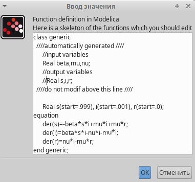

---
## Front matter
lang: ru-RU
title: Лабораторная работа №5
subtitle: Модель эпидемии (SIR)
author:
  - Дворкина Е. В.
institute:
  - Российский университет дружбы народов, Москва, Россия
date: 8 марта 2025

## i18n babel
babel-lang: russian
babel-otherlangs: english

## Formatting pdf
toc: false
toc-title: Содержание
slide_level: 2
aspectratio: 169
section-titles: true
theme: metropolis
header-includes:
 - \metroset{progressbar=frametitle,sectionpage=progressbar,numbering=fraction}
---

## Докладчик

:::::::::::::: {.columns align=center}
::: {.column width="70%"}

  * Дворкина Ева Владимировна
  * студентка
  * группа НФИбд-01-22
  * Российский университет дружбы народов
  * [1132226447@rudn.ru](mailto:1132226447@rudn.ru)
  * <https://github.com/evdvorkina>

:::
::: {.column width="30%"}

:::
::::::::::::::

## Цель работы

Исследование модели эпидемии (SIR) с помощью xcos и OpenModelica.

## Задание

- Реализовать классическую модель SIR с помощью xcos(в том числе с помощью блока Modelica) и OpenModelica.
- Реализовать модель SIR с учетом демографических признаков с помощью xcos(в том числе с помощью блока Modelica) и OpenModelica.
- Исследовать модель SIR с учетом демографических признаков, изменяя параметры.

## Теоретическое введение

$$
\begin{cases}
	\frac{dS}{dt} = - \frac{\beta I S}{N}, \\
	\frac{dI}{dt} = \frac{\beta I S}{N} - \nu I, \\
	\frac{dR}{dt} = \nu I,
\end{cases}
$$

# Выполнение лабораторной работы

## Задать контекст в xcos

{#fig:001 width=70%}

## Реализация модели в xcos

{#fig:004 width=70%}

## Начальные значения интегрирования

{#fig:005 width=70%}

## Время моделирования

{#fig:007 width=70%}

## Параметры регистрирующего устрйоства

{#fig:008 width=70%}

## Решение модели

{#fig:009 width=70%}

## Реализация модели с помощью блока Modelica (настройка блока)

{#fig:010 width=70%}

## Реализация модели с помощью блока Modelica (настройка блока)

{#fig:011 width=70%}

## Реализация модели с помощью блока Modelica в xcos

{#fig:012 width=70%}

## Решение модели

{#fig:013 width=70%}

## Реализация модели в OpenModelica

{#fig:014 width=70%}

## Решение модели

{#fig:015 width=70%}

# Задание для самостоятельного выполнения

## Модель SIR с учетом демографии

$$
\begin{cases}
\frac{dS}{dt} = - \beta I S + \mu (N - S), \\
\frac{dI}{dt} = \beta I S - \nu I - \mu I, \\
\frac{dR}{dt} = \nu I - \mu R,
\end{cases}
$$

## Задать переменные окружения

{#fig:016 width=70%}

## Реализация модели в xcos

{#fig:017 width=70%}

## Решение модели с параметрами $\beta = 1$, $\nu = 0.3$, $\mu = 0.1$

{#fig:018 width=70%}

## Реализация модели с помощью блока Modelica в xcos (настройка блока)

{#fig:019 width=70%}

## Реализация модели с помощью блока Modelica в xcos (настройка блока)

{#fig:020 width=70%}

## Реализация модели с помощью блока Modelica в xcos

{#fig:021 width=70%}

## Решение модели с параметрами $\beta = 1$, $\nu = 0.3$, $\mu = 0.1$

{#fig:022 width=70%}

## Реализация модели в OpenModelica

{#fig:023 width=70%}

## Задать параметры моделирования

{#fig:024 width=70%}

## Решение модели с параметрами $\beta = 1$, $\nu = 0.3$, $\mu = 0.1$

{#fig:025 width=70%}

# Анализ графиков при разных параметрах модели

## Решение модели с параметрами $\beta = 1$, $\nu = 0.3$, $\mu = 0.3$

{#fig:026 width=70%}

## Решение модели с параметрами $\beta = 1$, $\nu = 0.3$, $\mu = 0.5$

{#fig:027 width=70%}

## Решение модели с параметрами $\beta = 1$, $\nu = 0.3$, $\mu = 0.05$

{#fig:028 width=70%}

## Решение модели с параметрами $\beta = 1.5$, $\nu = 0.2$, $\mu = 0.2$
{#fig:029 width=70%}

## Решение модели с параметрами $\beta = 1$, $\nu = 0.5$, $\mu = 0.2$

{#fig:030 width=70%}

## Выводы

В результате выполнения работы была исследована модель SIR при помощи xcos и OpenModelica.

