---
## Front matter
title: "Лабораторная работа № 5"
subtitle: "Модель эпидемии (SIR)"
author: "Дворкина Ева Владимировна"

## Generic otions
lang: ru-RU
toc-title: "Содержание"

## Bibliography
bibliography: bib/cite.bib
csl: pandoc/csl/gost-r-7-0-5-2008-numeric.csl

## Pdf output format
toc: true # Table of contents
toc-depth: 2
lof: true # List of figures
lot: false # List of tables
fontsize: 12pt
linestretch: 1.5
papersize: a4
documentclass: scrreprt
## I18n polyglossia
polyglossia-lang:
  name: russian
  options:
	- spelling=modern
	- babelshorthands=true
polyglossia-otherlangs:
  name: english
## I18n babel
babel-lang: russian
babel-otherlangs: english
## Fonts
mainfont: IBM Plex Serif
romanfont: IBM Plex Serif
sansfont: IBM Plex Sans
monofont: IBM Plex Mono
mathfont: STIX Two Math
mainfontoptions: Ligatures=Common,Ligatures=TeX,Scale=0.94
romanfontoptions: Ligatures=Common,Ligatures=TeX,Scale=0.94
sansfontoptions: Ligatures=Common,Ligatures=TeX,Scale=MatchLowercase,Scale=0.94
monofontoptions: Scale=MatchLowercase,Scale=0.94,FakeStretch=0.9
mathfontoptions:
## Biblatex
biblatex: true
biblio-style: "gost-numeric"
biblatexoptions:
  - parentracker=true
  - backend=biber
  - hyperref=auto
  - language=auto
  - autolang=other*
  - citestyle=gost-numeric
## Pandoc-crossref LaTeX customization
figureTitle: "Рис."
tableTitle: "Таблица"
listingTitle: "Листинг"
lofTitle: "Список иллюстраций"
lotTitle: "Список таблиц"
lolTitle: "Листинги"
## Misc options
indent: true
header-includes:
  - \usepackage{indentfirst}
  - \usepackage{float} # keep figures where there are in the text
  - \floatplacement{figure}{H} # keep figures where there are in the text
---

# Цель работы

Исследование модели эпидемии (SIR) с помощью xcos и OpenModelica.

# Задание

- Реализовать классическую модель SIR с помощью xcos(в том числе с помощью блока Modelica) и OpenModelica.
- Реализовать модель SIR с учетом демографических признаков с помощью xcos(в том числе с помощью блока Modelica) и OpenModelica.
- Исследовать модель SIR с учетом демографических признаков, изменяя параметры.

# Теоретическое введение

Модель SIR предложена в 1927 г. (W. O. Kermack, A. G. McKendrick). 

$$
\begin{cases}
	\frac{dS}{dt} = - \beta I S, \\
	\frac{dI}{dt} = \beta I S - \nu I, \\
	\frac{dR}{dt} = \nu I,
\end{cases}
$$

где $S$ -- численность восприимчивой популяции, $I$ -- численность инфицированных, $R$ -- численность удаленной популяции (в результате смерти или выздоровления), и $N$ -- это сумма этих трёх, а $\beta$ и $\nu$ - это коэффициенты заболеваемости и выздоровления соответственно [@l].

# Выполнение лабораторной работы

## Реализация модели в xcos

Зафиксируем начальные параметры в меню `Моделирование`, `Задать переменные окружения`, а затем построим модель при помощи блоков моделирования (рис. [-@fig:001]).

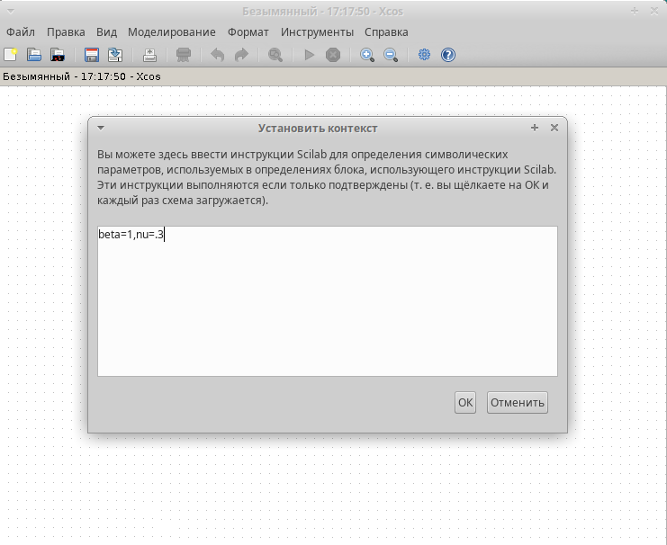{#fig:001 width=70%}

Для реализации модели потребовались следующие блоки xcos [@xcos] :

- CLOCK_c -- запуск часов модельного времени;

- CSCOPE -- регистрирующее устройство для построения графика;

- TEXT_f -- задаёт текст примечаний;

- MUX -- мультиплексер, позволяющий в данном случае вывести на графике сразу несколько кривых;

- INTEGRAL_m -- блок интегрирования;

- GAINBLK_f -- в данном случае позволяет задать значения коэффициентов $\beta$ и $\nu$;

- SUMMATION -- блок суммирования;

- PROD_f -- поэлементное произведение двух векторов на входе блока.

Настраиваю количество входов в блок мультиплексер (рис. [-@fig:002]).

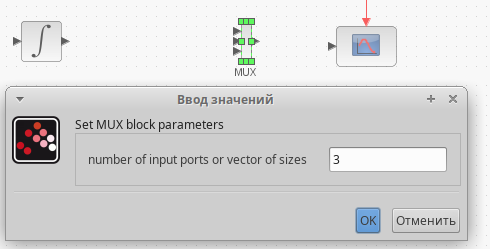{#fig:002 width=70%}

Настраиваю параметры блока суммирования, чтобы оба слагаемых в сумме на входе в интегратор были со знаком минус (рис. [-@fig:003]).

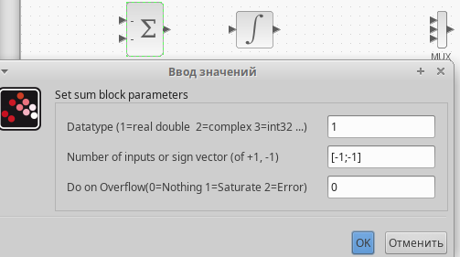{#fig:003 width=70%}

Первое уравнение модели задано верхним блоком интегрирования, блоком произведения и блоком задания коэффициента $\beta$. Блок произведения соединен с выходами верхнего и среднего блоков интегрирования и блоком коэффициента $\beta$, что реализует математическую конструкцию $\beta s(t)i(t)$. Третье уравнение модели задано нижним блоком интегрирования и блоком задания коэффициента $\nu$. Для реализации математической конструкции $\nu i(t)$ соединяем выход среднего блока интегрирования и вход блока задания коэффициента $\nu$, а результат передаём на вход нижнего блока интегрирования.

Средний блок интегрирования и блок суммирования определяют второе уравнение модели, которое по сути является суммой правых частей первого и третьего уравнений. Для реализации соединяем входы верхнего и нижнего блоков интегрирования с входами блока суммирования, меняя при этом в его параметрах оба знака на минус. Выход блока суммирования соединяем с входом среднего блока интегрирования (рис. [-@fig:004]).

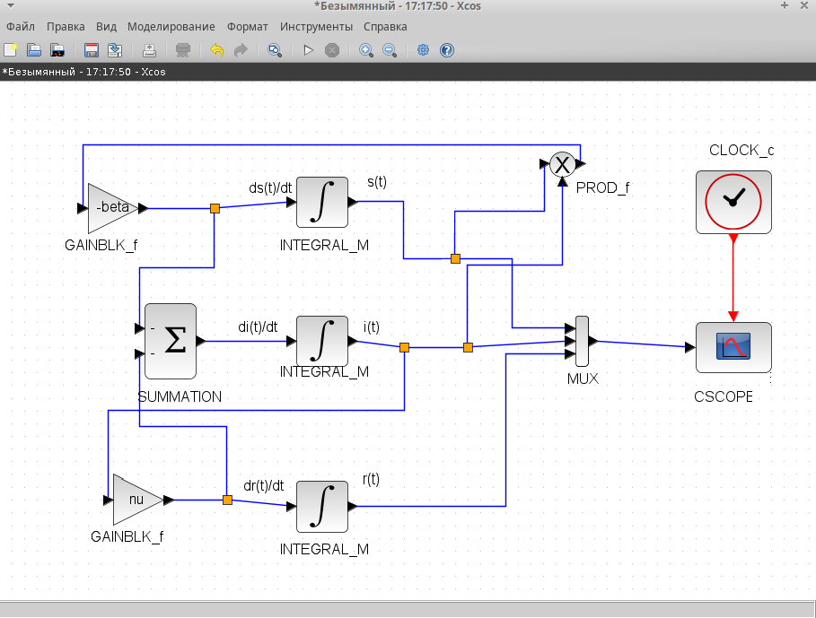{#fig:004 width=70%}

Зафиксируем начальные значения в блоках интегрирования (рис. [-@fig:005], [-@fig:006]).

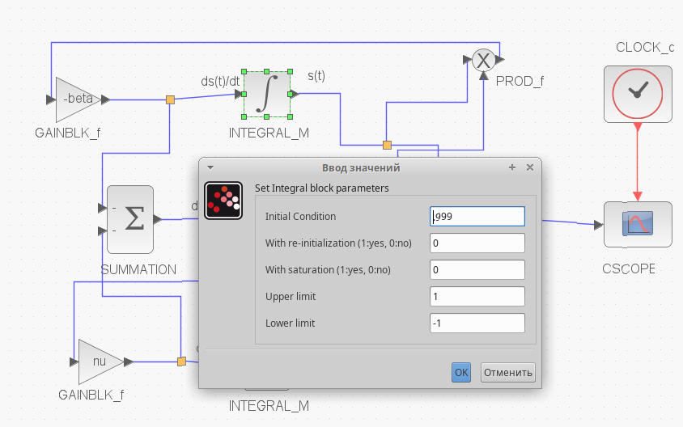{#fig:005 width=70%}

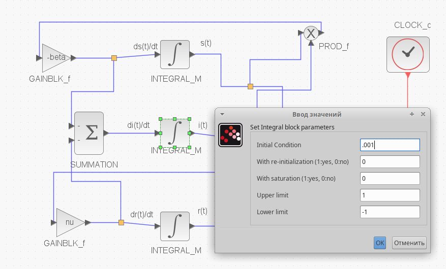{#fig:006 width=70%}

Также зададим время интегрирования равное 30 единиц модельного времени (рис. [-@fig:007]).

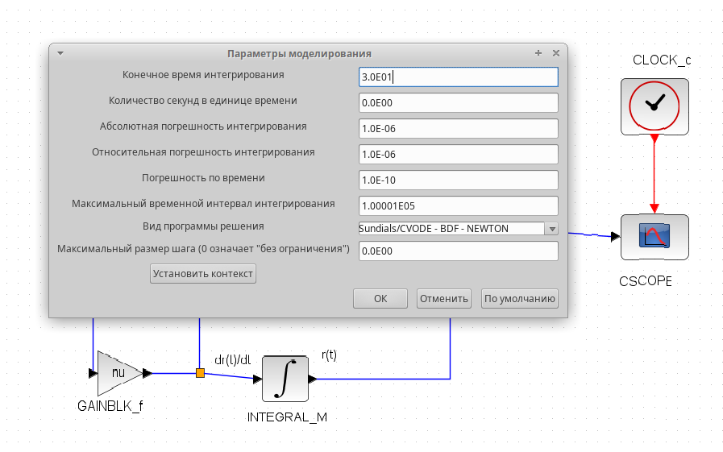{#fig:007 width=70%}

Настроим параметры регистрирующего устройства для отображения графика (рис. [-@fig:008]).

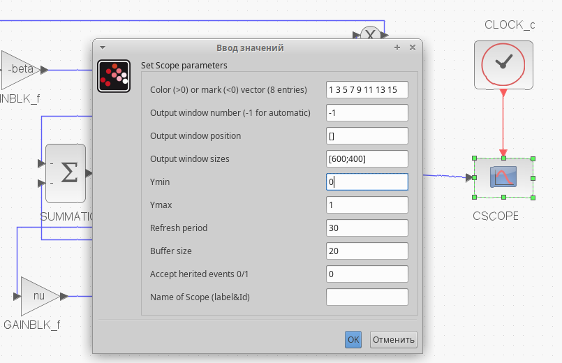{#fig:008 width=70%}

Решение модели SIR выглядит следующим образом (рис. [-@fig:009]).

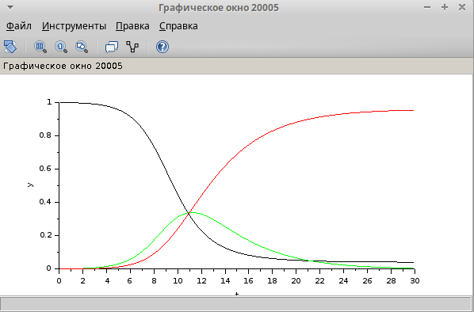{#fig:009 width=70%}

Видим, что точка пересечения всех функций - порог эпидемии, после которого количество заболевших уменьшается. Также на конец моделирование у нас остается некоторое количество уязвимых, которые не успели переболеть и больше не смогут заразиться, а все заболевшие выздоровели.

## Реализация модели с помощью блока Modelica в xcos

Для реализации модели с помощью языка Modelica помимо блоков CLOCK_c, CSCOPE, TEXT_f и MUX требуются блоки [@xcos] :

- CONST_m -- задаёт константу; 

- MBLOCK(Modelica generic) -- блок реализации кода на языке Modelica.

Задаём значения переменных $\beta$ и $\nu$. Параметры блока Modelica: переменные на входе (“beta”, “nu”) и выходе (“s”, “i”, “r”) блока заданы как внешние (“E”).Затем прописываем дифференциальное уравнение(рис. [-@fig:010], [-@fig:011]).

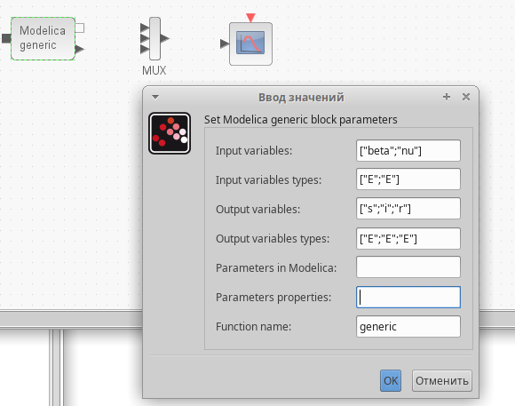{#fig:010 width=70%}

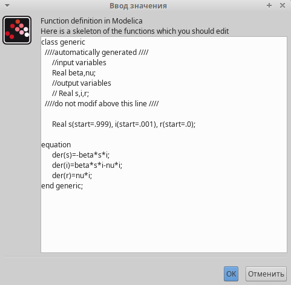{#fig:011 width=70%}

Соединив блоки, получим следующую модель (рис. [-@fig:012]).

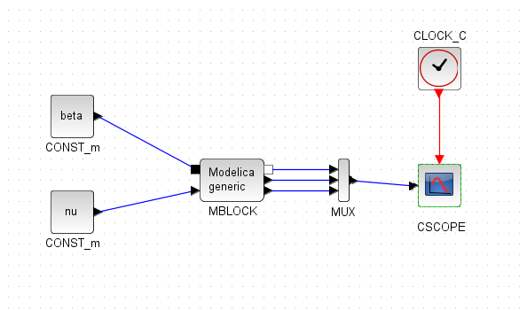{#fig:012 width=70%}

В результате получим аналогичное предыдущему решение (рис. [-@fig:013]).

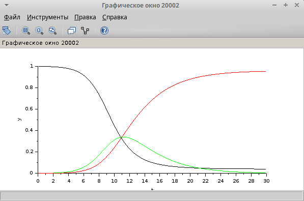{#fig:013 width=70%}

## Реализация модели в OpenModelica

Реализуем модель в OpenModelica. Для этого создадим файл модели, пропишем там параметры и начальные условие, а также дифференциальное уравнение (рис. [-@fig:014]).

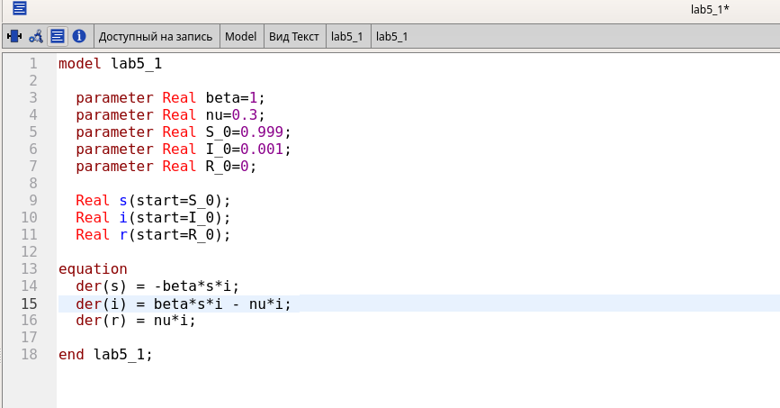{#fig:014 width=70%}

Затем укажем параметры моделирования, время так же поставим равным 30 единиц модельного времени 

В результате получим график аналогичный графикам в xcos (рис. [-@fig:015]).

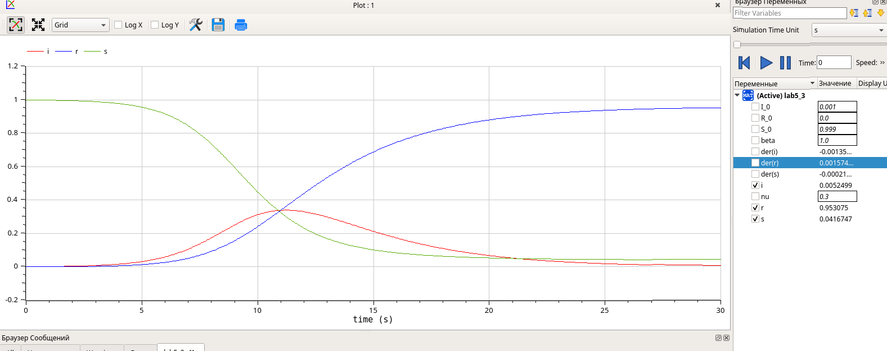{#fig:015 width=70%}

# Задание для самостоятельного выполнения

## Модель SIR с учетом демографии

В дополнение к предположениям, которые были сделаны для модели SIR, предположим, что учитываются демографические процессы, в частности, что смертность в популяции полностью уравновешивает рождаемость, а все рожденные индивидуумы появляются на свет абсолютно здоровыми. Тогда получим следующую систему уравнений:

$$
\begin{cases}
\frac{dS}{dt} = - \beta I S + \mu (N - S), \\
\frac{dI}{dt} = \beta I S - \nu I - \mu I, \\
\frac{dR}{dt} = \nu I - \mu R,
\end{cases}
$$

где $\mu$ -- константа, которая равна коэффициенту смертности и рождаемости [@l].

Требуется:

- реализовать модель SIR с учётом процесса рождения гибели особей в xcos (в том числе и с использованием блока Modelica), а также в OpenModelica;
- построить графики эпидемического порога при различных значениях параметров модели (в частности изменяя параметр $\mu$);
- сделать анализ полученных графиков в зависимости от выбранных значений параметров модели

## Реализация модели в xcos

Для реализации этой модели добавим в переменные окружения mu  (рис. [-@fig:016]).

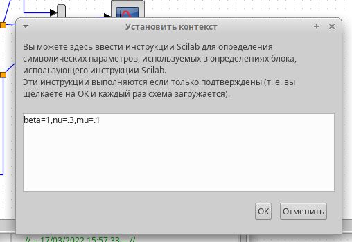{#fig:016 width=70%}

Необходимые блоки такие же (рис. [-@fig:017]).

Первое уравнение модели задано верхним блоком интегрирования, блоком произведения, блоком задания коэффициента $- \beta$ и сумматором. Блок произведения соединён с выходами верхнего и среднего блоков интегрирования и блоком коэффициента $- \beta$, что реализует математическую конструкцию $- \beta s(t)i(t)$, которая передается в блок суммирования. Ниже заданы математические конструкции $\mu i$ и $\mu r$, которые со знаком плюс передаются в сумматор перед первым блоком интегрирования. 

Третье уравнение модели задано нижним блоком интегрирования и блоком задания коэффициента $\nu$. Для реализации математической конструкции $\nu i(t)$ соединяем выход среднего блока интегрирования и вход блока задания коэффициента $\nu$. Перед блоком интегрирования размешаем сумматор, в которой передаем математические конструкции $\mu r$ со знаком минус и $\nu i(t)$. Результат суммирования передаём на вход нижнего блока интегрирования.

Средний блок интегрирования и блок суммирования определяют второе уравнение модели, которое по сути является суммой правых частей первого и третьего уравнений со знаком минус. Для реализации соединяем входы верхнего и нижнего блоков интегрирования с входами блока суммирования, меняя при этом в его параметрах оба знака на минус. Выход блока суммирования соединяем с входом среднего блока интегрирования

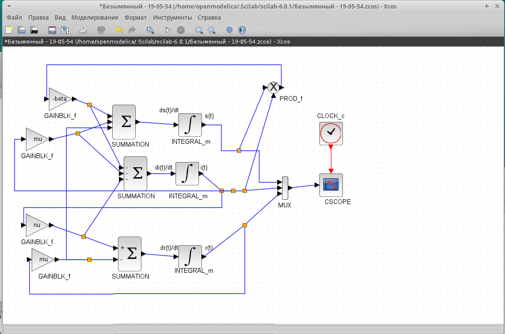{#fig:017 width=70%}

В результате получим график решения (рис. [-@fig:018]).

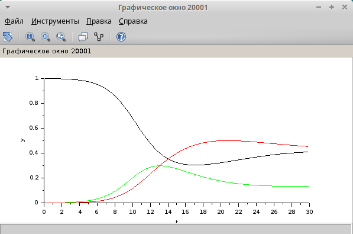{#fig:018 width=70%}

Здесь так же происходит стабилизация всех функций после прохождения порога эпидемии, но, в отличие от предыдущего решения, количество заболевших стабилизируется не на уровне 0, а на уровне определенного значения, то есть из-за постоянного появления новых особей, появляются новые уязвимые, которые могут заболеть и заболевают.

## Реализация модели с помощью блока Modelica в xcos

Для реализации с помощью блока Modelica добавим блок параметра $\mu$.

Также изменим данные блока Modelica, добавив информацию о третьем параметре и изменив дифференциальное уравнение (рис. [-@fig:019], [-@fig:020]).

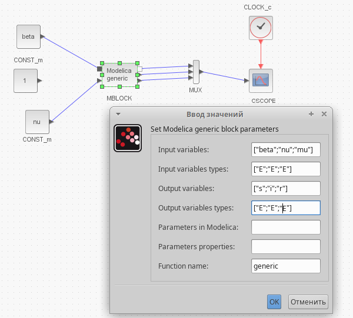{#fig:019 width=70%}

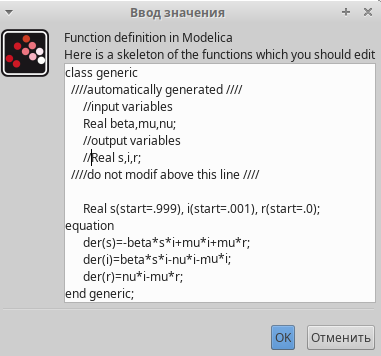{#fig:020 width=70%}

Соединим блоки и получим следующую модель (рис. [-@fig:021]).

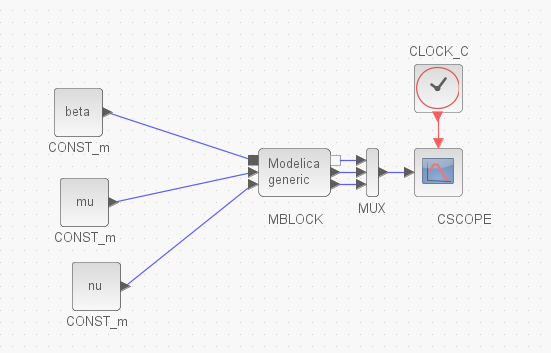{#fig:021 width=70%}

В результате получим график решения(рис. [-@fig:022]).

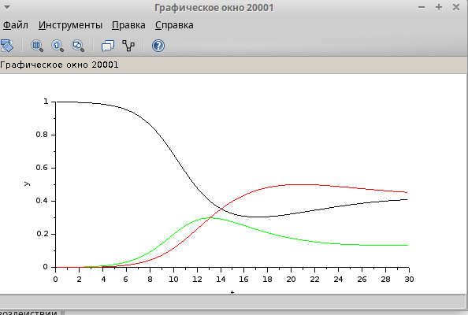{#fig:022 width=70%}

## Реализация модели в OpenModelica

Изменим данные программы в OpenModelica, добавив информацию о третьем параметре и изменив дифференциальное уравнение (рис. [-@fig:023]).

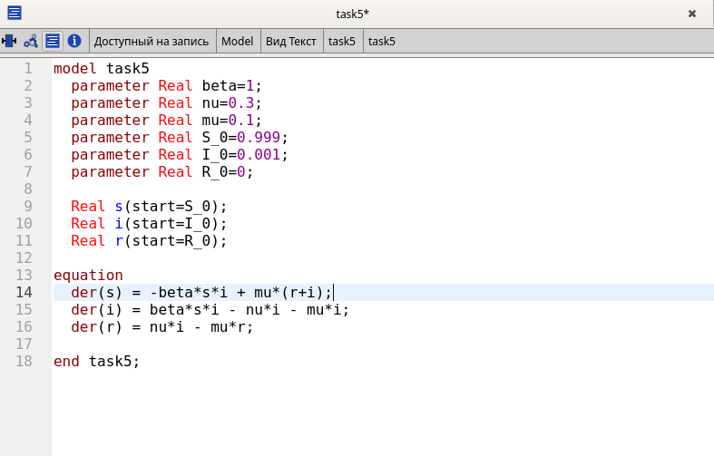{#fig:023 width=70%}

Затем укажем параметры моделирования, время так же поставим равным 30 единиц модельного времени (рис. [-@fig:024]).

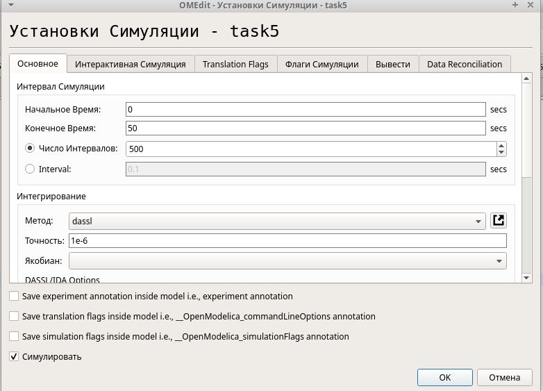{#fig:024 width=70%}

В результате получим график аналогичный графикам в xcos (рис. [-@fig:025]).

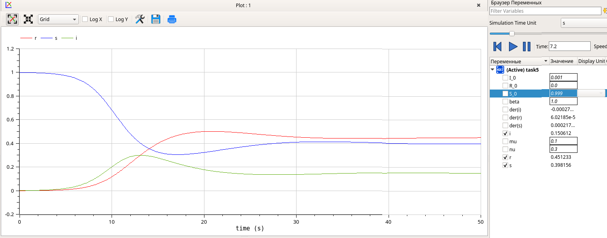{#fig:025 width=70%}

## Анализ графиков при разных параметрах модели

Можно увидеть, что чем больше значение любого параметра, тем быстрее система приходит в стационарное состояние(рис. [-@fig:026] - [-@fig:030]). 

Когда параметр $\mu$ достигает значения 0.5 (рис. [-@fig:027]) на графике очень слабо меняются траектории переменных. Это можно объяснить тем, что рождается и умирает почти столько же здоровых, сколько заражается. Можно сделать вывод, что чем выше показать $\mu$, тем слабее эпидемия влияет на популяцию (тем слабее меняются траектории графиков)

Если $\mu$=$\nu$  (рис. [-@fig:026]), то графики изменения выздоровевших/умерших и заболевших после стабилизации системы совпадут, значит рождается и заболевает столько же, сколько выздоравливает и умирает.

Чем меньше $\mu$, тем меньше этот параметр влияет на систему и ее решение все больше походит на систему, где этот параметр не учитывается (рис. [-@fig:028]).

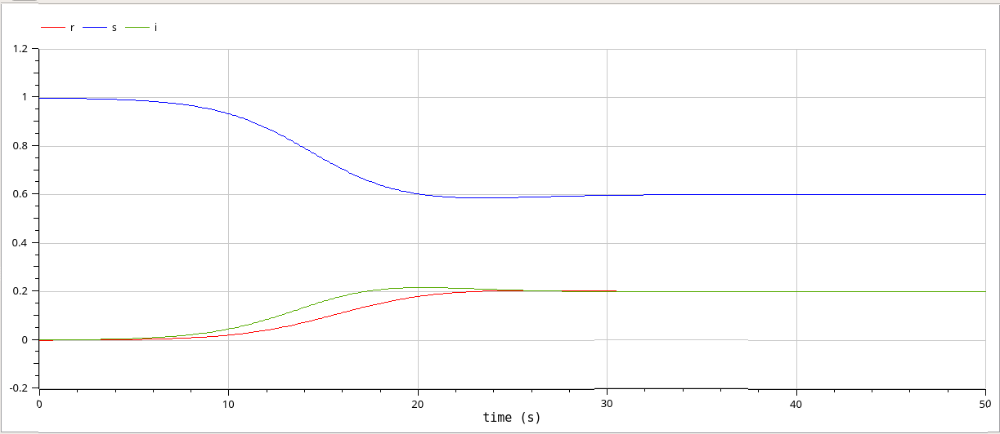{#fig:026 width=70%}

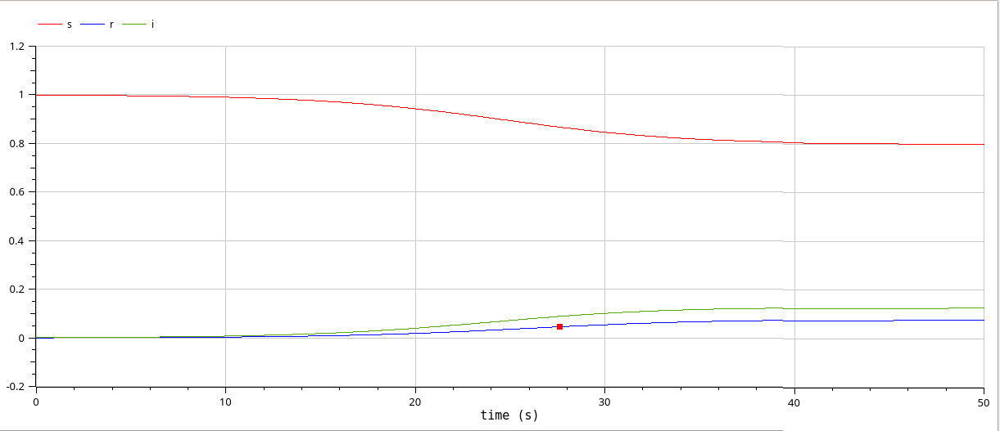{#fig:027 width=70%}

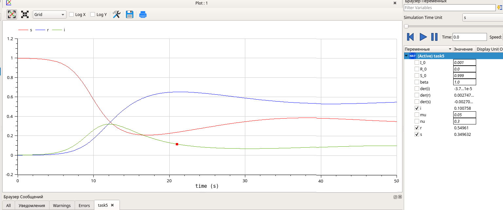{#fig:028 width=70%}

При увеличении параметра $\beta$ на графике заметим, что количество уязвимых людей снижается до минимума быстрее, ведь мы увеличили скорость заражения (рис. [-@fig:029]).

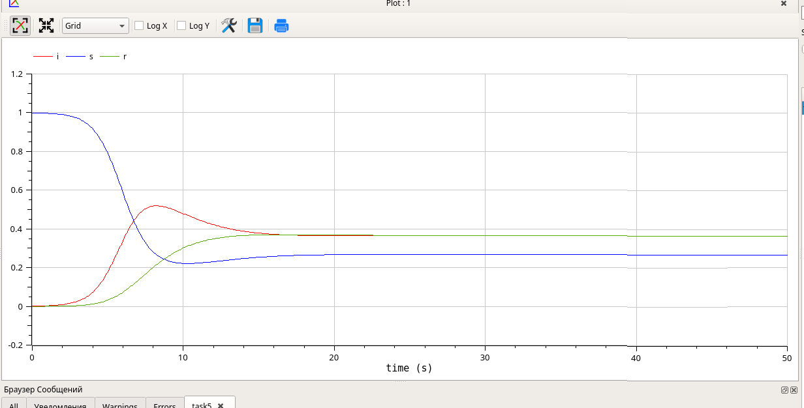{#fig:029 width=70%}

При увеличении параметра $\nu$, график тех, кто приобрел иммунитет находится выше графика заболевших, и быстрее возрастает, ведь мы увеличили скорость выздоровления (рис. [-@fig:030]).

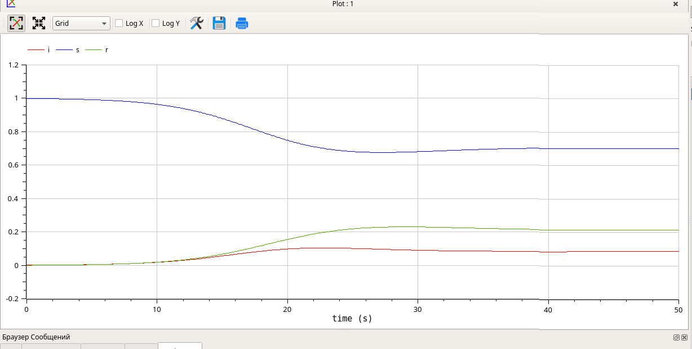{#fig:030 width=70%}

# Выводы

В результате выполнения работы была исследована модель SIR при помощи xcos и OpenModelica.

# Список литературы{.unnumbered}

::: {#refs}
:::
