---
## Front matter
lang: ru-RU
title: Лабораторная работа №1
subtitle: Простые модели компьютерной сети
author:
  - Дворкина Е. В.
institute:
  - Российский университет дружбы народов, Москва, Россия
date: 14 февраля 2025

## i18n babel
babel-lang: russian
babel-otherlangs: english

## Formatting pdf
toc: false
toc-title: Содержание
slide_level: 2
aspectratio: 169
section-titles: true
theme: metropolis
header-includes:
 - \metroset{progressbar=frametitle,sectionpage=progressbar,numbering=fraction}
---

## Докладчик

:::::::::::::: {.columns align=center}
::: {.column width="70%"}

  * Дворкина Ева Владимировна
  * студентка
  * группа НФИбд-01-22
  * Российский университет дружбы народов
  * [1132226447@rudn.ru](mailto:1132226447@rudn.ru)
  * <https://github.com/evdvorkina>

:::
::: {.column width="30%"}

:::
::::::::::::::

## Цель работы

Исследование модели хищник–жертва с помощью xcos и OpenModelica.

## Задание

Реализовать классическую систему хищник–жертва 
  - в xcos
  - в xcos с помощью блока Modelica
  - в OpenModelica

## Математическая модель

$$\begin{cases}
  &\dfrac{dx}{dt} = ax(t)-bx(t)y(t)\\
  &\dfrac{dy}{dt} = -cy(t)+dx(t)y(t)
\end{cases}$$

$x$ – число жертв, $y$ - число хищников. 

$a$ - скорость естественного прироста числа жертв в отсутствие хищников.

$c$ - естественное вымирание хищников, лишенных пищи в виде жертв. 

# Выполнение лабораторной работы

## Реализация модели в xcos (Переменные окружения)

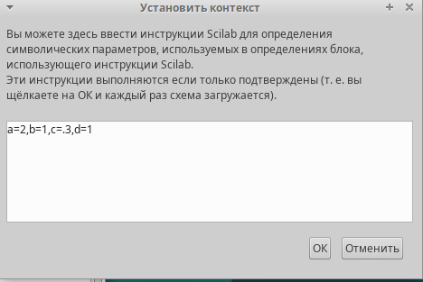{#fig:001 width=50%}

## Реализация модели в xcos (Модель)

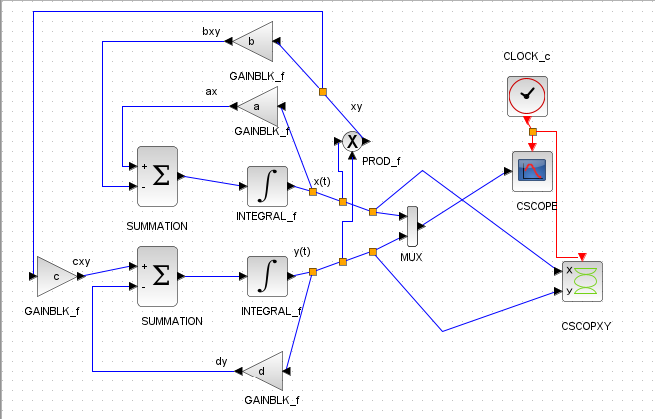{#fig:002 width=70%}

## Реализация модели в xcos (Начальные значения)

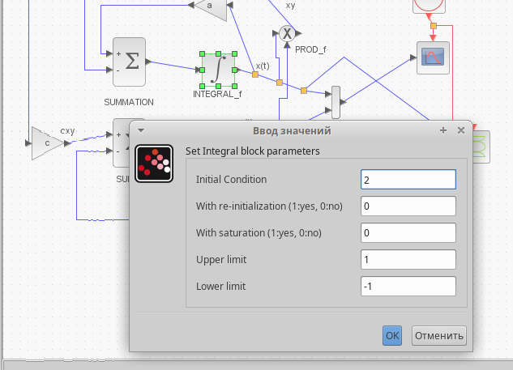{#fig:003 width=70%}

## Реализация модели в xcos (Начальные значения)

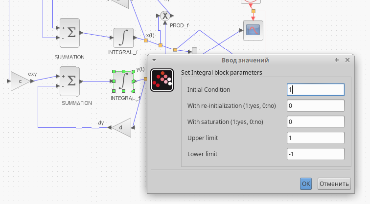{#fig:004 width=70%}

## Реализация модели в xcos (Регистрирующее устройство CSCOPE)

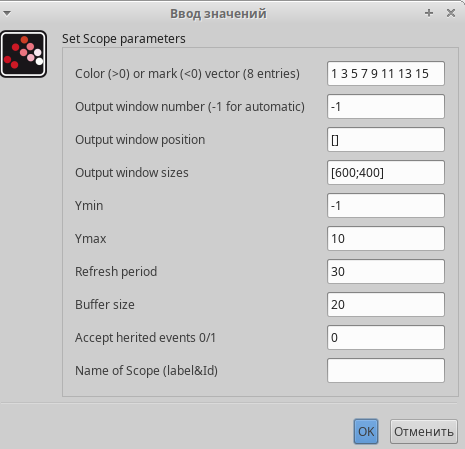{#fig:005 width=70%}

## Реализация модели в xcos (Регистрирующее устройство CSCOPXY)

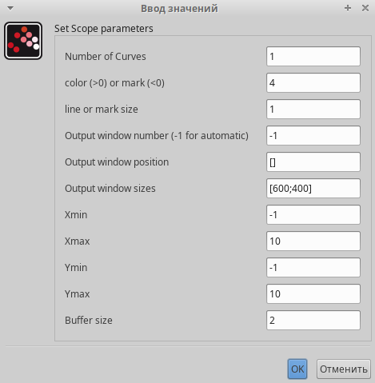{#fig:006 width=70%}

## Реализация модели в xcos (Параметры интегрирования)

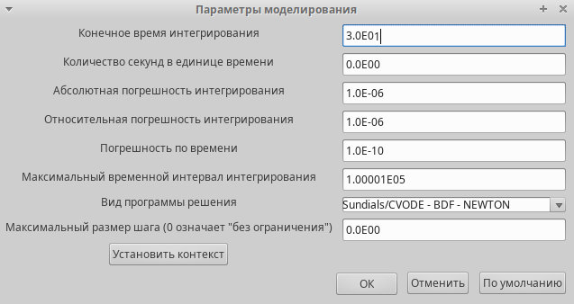{#fig:009 width=70%}

## Реализация модели в xcos (Решение модели)

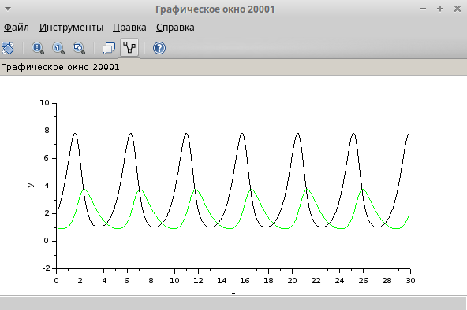{#fig:007 width=70%}

## Реализация модели в xcos (Фазовый портрет модели)

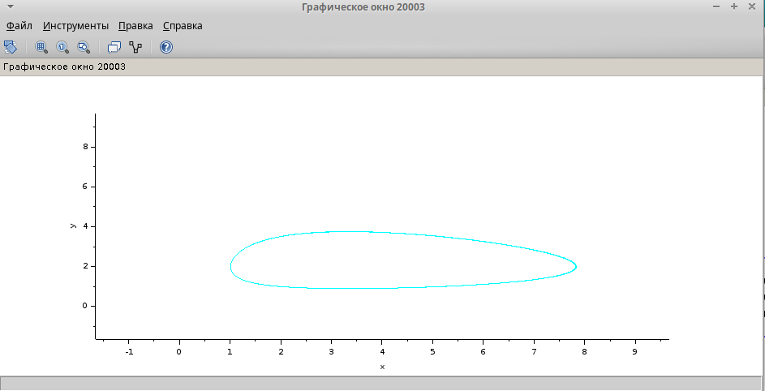{#fig:008 width=70%}

## Реализация модели с помощью блока Modelica в xcos (Модель)

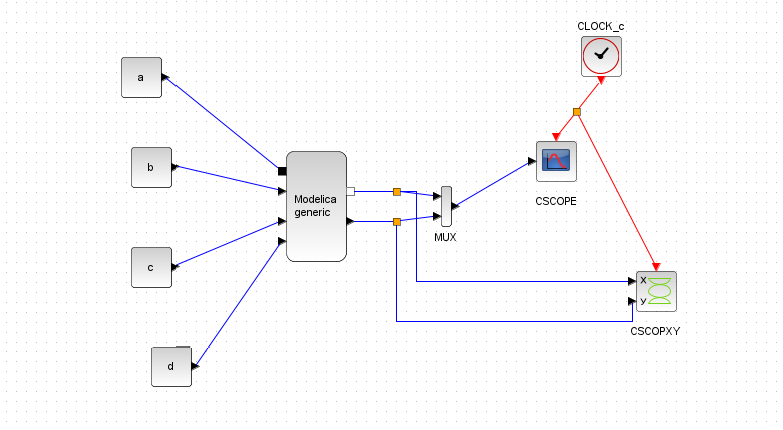{#fig:012 width=70%}

## Реализация модели с помощью блока Modelica в xcos (блок Modelica)

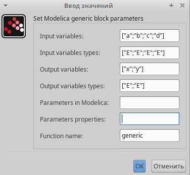{#fig:010 width=70%}

## Реализация модели с помощью блока Modelica в xcos (блок Modelica)

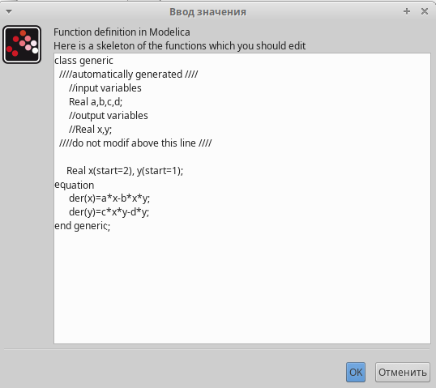{#fig:011 width=70%}

## Реализация модели с помощью блока Modelica в xcos (Решение модели)

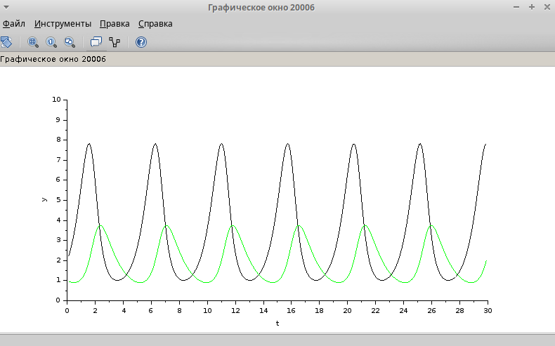{#fig:013 width=70%}

## Реализация модели с помощью блока Modelica в xcos (Фазовый портрет модели)

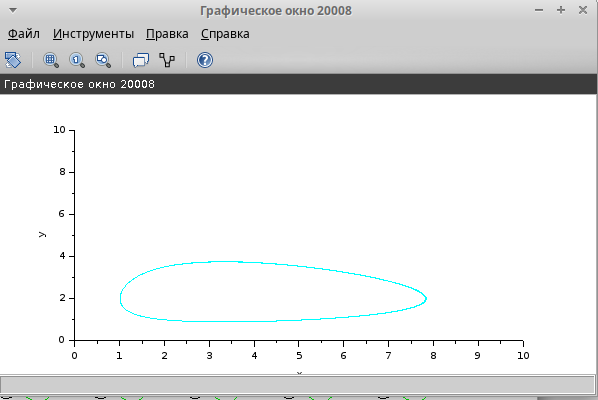{#fig:014 width=70%}

## Реализация модели в OpenModelica (Модель)

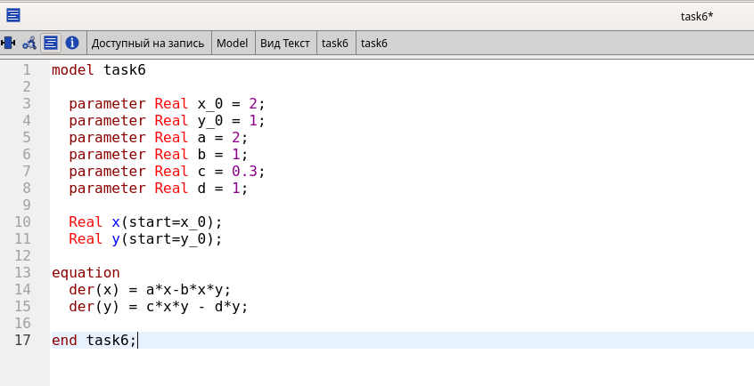{#fig:015 width=70%}

## Реализация модели в OpenModelica (Параметры моделирования)

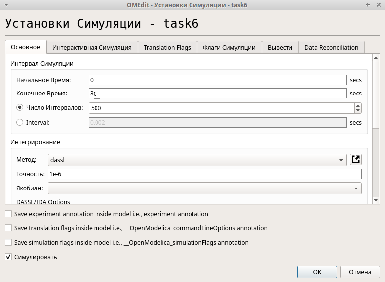{#fig:016 width=65%}

## Реализация модели в OpenModelica (Решение модели)

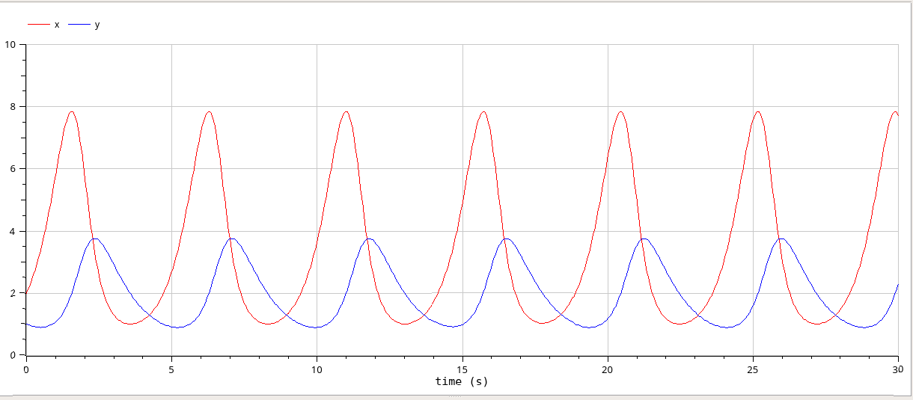{#fig:017 width=70%}

## Реализация модели в OpenModelica (Фазовый портрет модели)

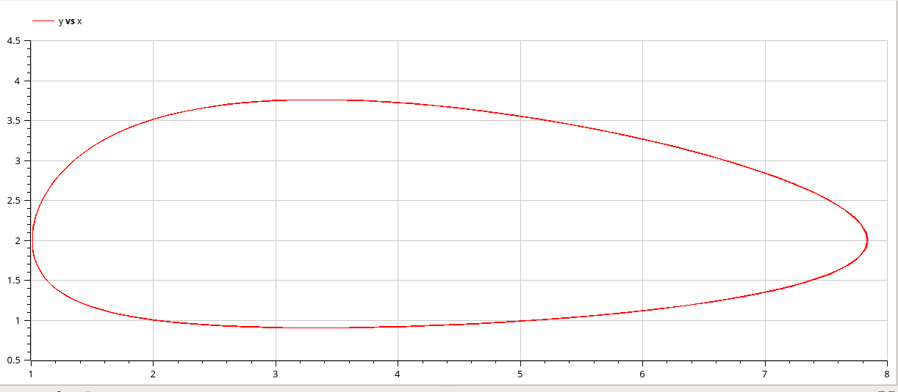{#fig:018 width=70%}

## Выводы

Исследовала модель хищник–жертва с помощью xcos и OpenModelica.
