---
## Front matter
title: "Лабораторная работа № 6"
subtitle: "Модель хищник–жертва"
author: "Дворкина Ева Владимировна"

## Generic otions
lang: ru-RU
toc-title: "Содержание"

## Bibliography
bibliography: bib/cite.bib
csl: pandoc/csl/gost-r-7-0-5-2008-numeric.csl

## Pdf output format
toc: true # Table of contents
toc-depth: 2
lof: true # List of figures
lot: false # List of tables
fontsize: 12pt
linestretch: 1.5
papersize: a4
documentclass: scrreprt
## I18n polyglossia
polyglossia-lang:
  name: russian
  options:
	- spelling=modern
	- babelshorthands=true
polyglossia-otherlangs:
  name: english
## I18n babel
babel-lang: russian
babel-otherlangs: english
## Fonts
mainfont: IBM Plex Serif
romanfont: IBM Plex Serif
sansfont: IBM Plex Sans
monofont: IBM Plex Mono
mathfont: STIX Two Math
mainfontoptions: Ligatures=Common,Ligatures=TeX,Scale=0.94
romanfontoptions: Ligatures=Common,Ligatures=TeX,Scale=0.94
sansfontoptions: Ligatures=Common,Ligatures=TeX,Scale=MatchLowercase,Scale=0.94
monofontoptions: Scale=MatchLowercase,Scale=0.94,FakeStretch=0.9
mathfontoptions:
## Biblatex
biblatex: true
biblio-style: "gost-numeric"
biblatexoptions:
  - parentracker=true
  - backend=biber
  - hyperref=auto
  - language=auto
  - autolang=other*
  - citestyle=gost-numeric
## Pandoc-crossref LaTeX customization
figureTitle: "Рис."
tableTitle: "Таблица"
listingTitle: "Листинг"
lofTitle: "Список иллюстраций"
lotTitle: "Список таблиц"
lolTitle: "Листинги"
## Misc options
indent: true
header-includes:
  - \usepackage{indentfirst}
  - \usepackage{float} # keep figures where there are in the text
  - \floatplacement{figure}{H} # keep figures where there are in the text
---

# Цель работы

Цель данной лабораторной работы - исследование модели хищник–жертва с помощью xcos и OpenModelica.

# Задание

Реализовать классическую систему хищник–жертва 
  - в xcos
  - в xcos с помощью блока Modelica
  - в OpenModelica

# Теоретическое введение

## Математическая модель

$$\begin{cases}
  &\dfrac{dx}{dt} = ax(t)-bx(t)y(t)\\
  &\dfrac{dy}{dt} = -cy(t)+dx(t)y(t)
\end{cases}$$

В этой модели $x$ – число жертв, $y$ - число хищников. 

Коэффициент $a$ описывает скорость естественного прироста числа жертв в отсутствие хищников, $c$ - естественное вымирание хищников, лишенных пищи в виде жертв. 

Вероятность взаимодействия жертвы и хищника считается пропорциональной как количеству жертв, так и числу самих хищников. Каждый акт взаимодействия уменьшает популяцию жертв, но способствует увеличению популяции хищников (члены $-bxy$ и $dxy$ в правой части уравнения) [@l:bash].

# Выполнение лабораторной работы

## Реализация модели в xcos

Для работы в xcos будем использовать дополнительные материалы [@xcos:bash].

Зафиксируем начальные параметры в меню *Моделирование, Задать переменные окружения* (рис. [-@fig:001]).

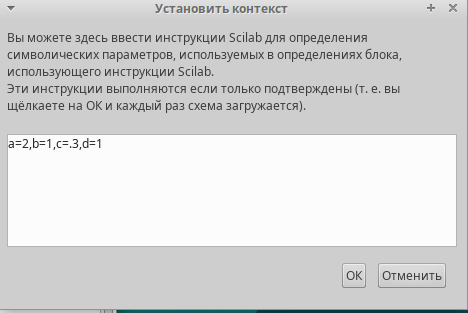{#fig:001 width=50%}

Затем построим модель при помощи блоков моделирования  (рис. [-@fig:002]).

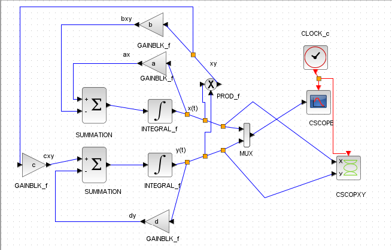{#fig:002 width=70%}

Для реализации модели (6.1) в дополнение к блокам CLOCK_c, CSCOPE, TEXT_f, MUX, INTEGRAL_m, GAINBLK_f, SUMMATION, PROD_f потребуется блок CSCOPXY — регистрирующее устройство для построения фазового портрета.

Первое уравнение модели задано верхним блоком интегрирования, блоком произведения и блоками задания коэффициентов a и b. 

Второе уравнение модели задано нижним блоком интегрирования и блоками задания коэффициентов c и d. 

Для суммирования слагаемых правых частей уравнений используем блоки суммирования с соответствующими знаками перед коэффициентами. Выходы блоков суммирования соединяем с входами блоков интегрирования. Выходы блоков интегрирования соединяем с мультиплексором, который в свою очередь позволяет вывести на один график сразу обе кривые: динамику численности жертв и динамику численности хищников.

Зафиксируем начальные значения интеграторов (рис. [-@fig:003], [-@fig:004]).

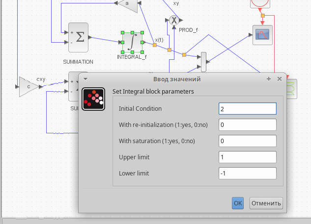{#fig:003 width=70%}

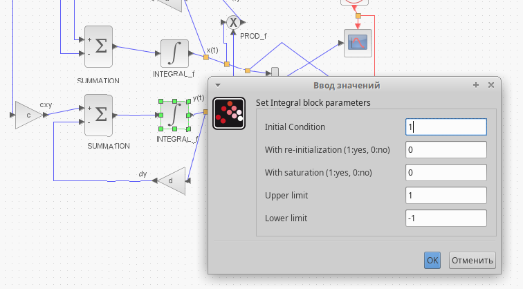{#fig:004 width=70%}

Зададим параметры в блоках регистрирующих устройств (рис. [-@fig:005], [-@fig:006]).

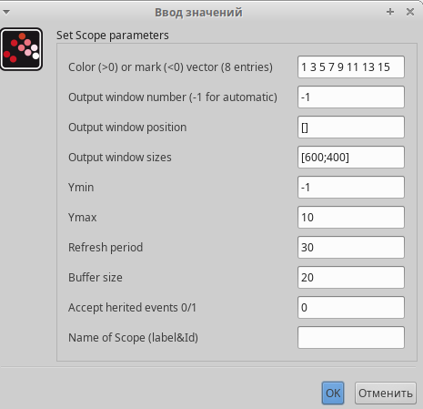{#fig:005 width=70%}

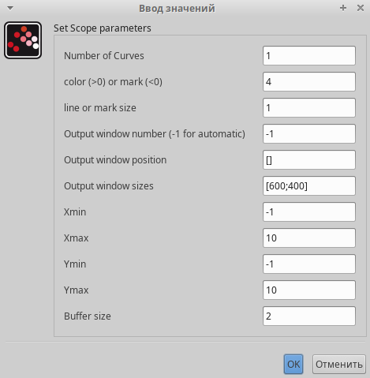{#fig:006 width=70%}

Также зададим время интегрирования равное 30 единиц модельного времени (рис. [-@fig:009]).

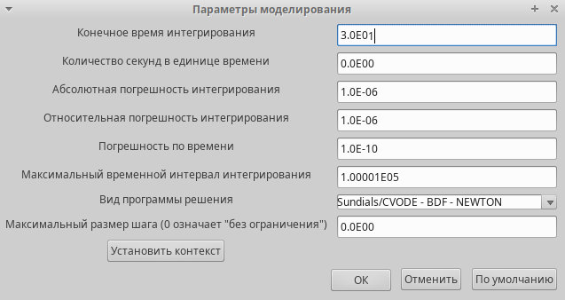{#fig:009 width=70%}

В результате получим решение системы хищник-жертва и фазовый портрет (рис. [-@fig:007], [-@fig:008]).

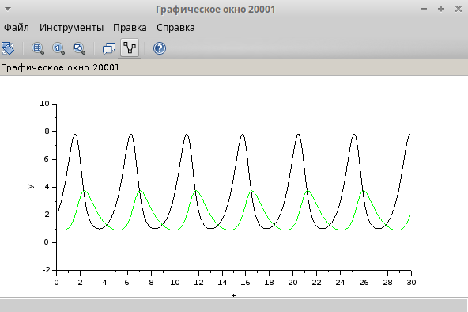{#fig:007 width=70%}

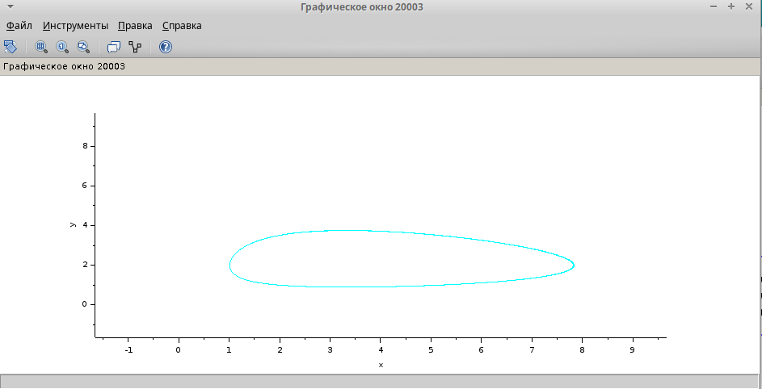{#fig:008 width=70%}

## Реализация модели с помощью блока Modelica в xcos

Для реализации модели с помощью языка Modelica помимо блоков CLOCK_c, CSCOPE, TEXT_f, MUX и CSCOPXY требуются блоки CONST_m -- задаёт константу; MBLOCK(Modelica generic) -- блок реализации кода на языке Modelica (рис. [-@fig:012]).

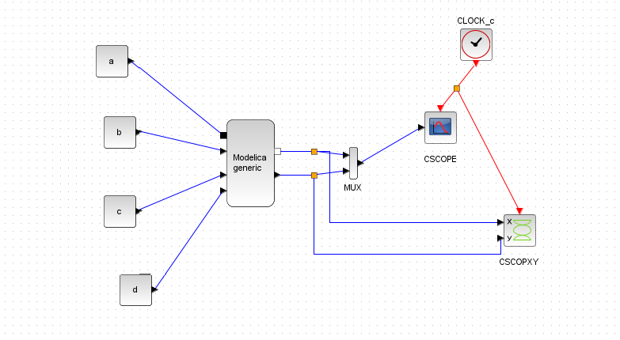{#fig:012 width=70%}

Задаём значения переменных $a, b, c, d$ в параметры блока Modelica как переменные на входе, а на выходе (“X”, "Y"). Все переменные блока заданы как внешние (“E”). Затем прописываем дифференциальное уравнение в следующем окне (рис. [-@fig:010], [-@fig:011]).

{#fig:010 width=70%}

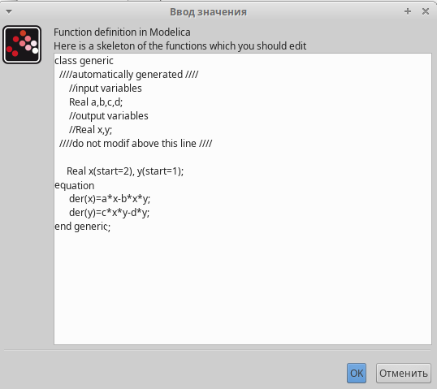{#fig:011 width=70%}

В результате получим решение системы хищник-жертва и фазовый портрет такие же, как при моделировании без блока Modelica (рис. [-@fig:013], [-@fig:014]).

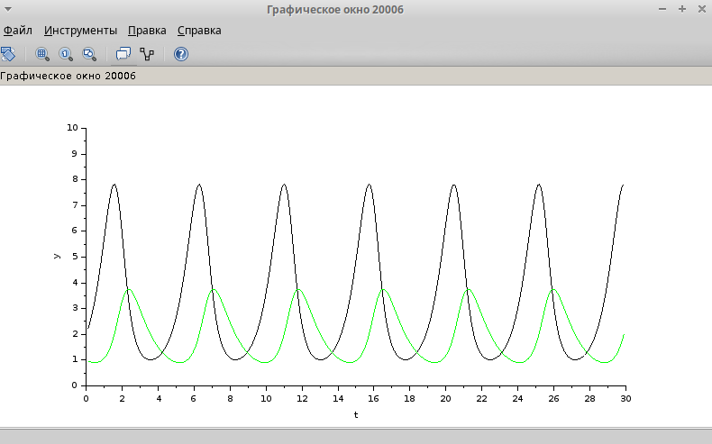{#fig:013 width=70%}

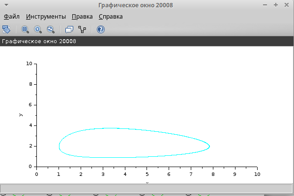{#fig:014 width=70%}

## Реализация модели в OpenModelica

Реализуем модель в OpenModelica. Для этого создадим файл модели, пропишем там параметры и начальные условия, а также систему дифференциальных уравнений (рис. [-@fig:015]).

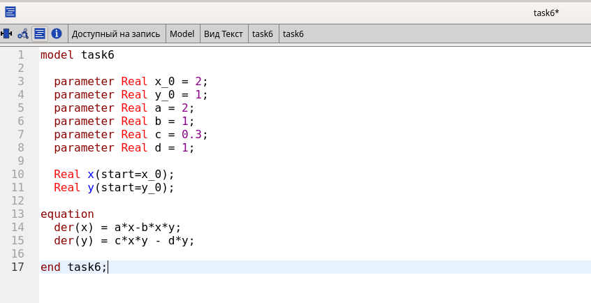{#fig:015 width=70%}

Затем укажем параметры моделированиф, время так же как и при моделировании в `xcos` поставим равным 30 единиц модельного времени (рис. [-@fig:016]).

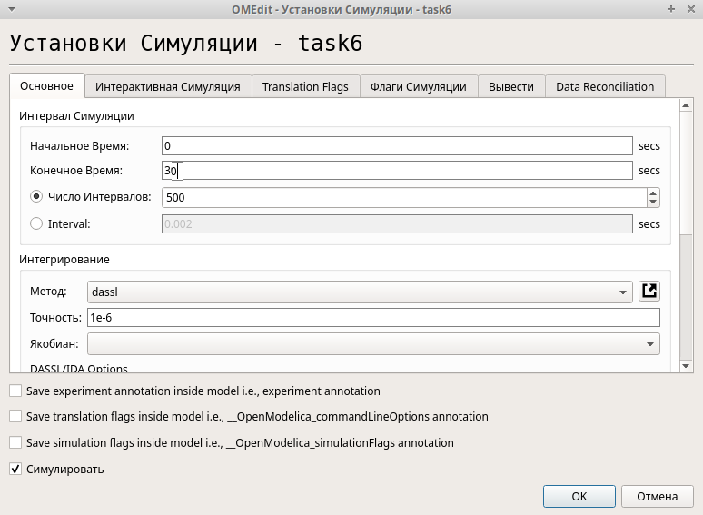{#fig:016 width=65%}

В результате получим график, аналогичный графикам в xcos (рис. [-@fig:017], [~@fig:018]).

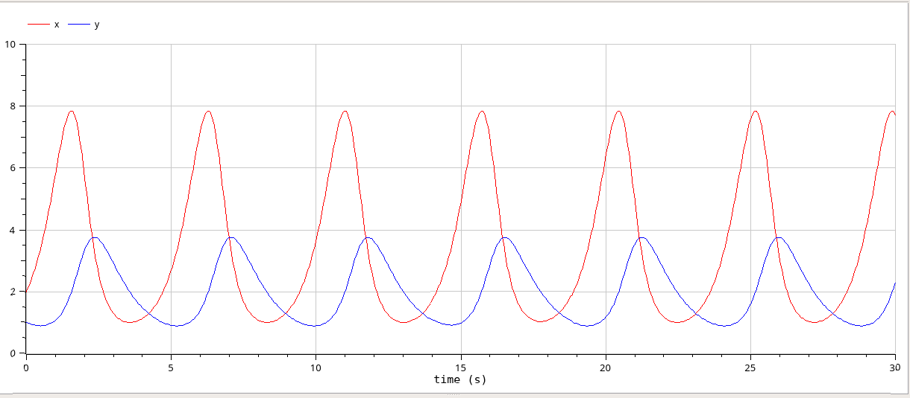{#fig:017 width=70%}

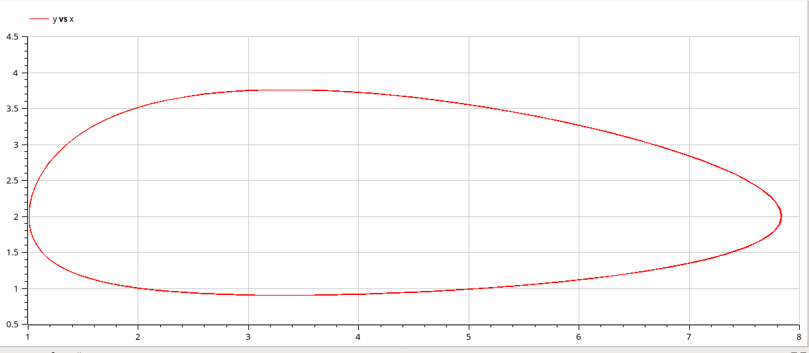{#fig:018 width=70%}

# Выводы

При выполнении данной лабораторной работы я исследовала модель хищник–жертва с помощью xcos и OpenModelica.

# Список литературы{.unnumbered}

::: {#refs}
:::
