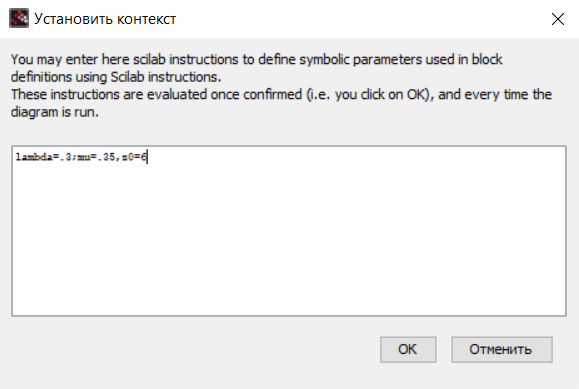
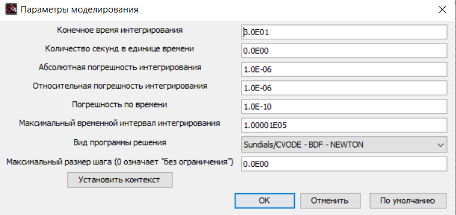
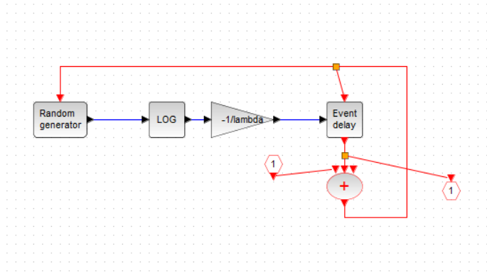
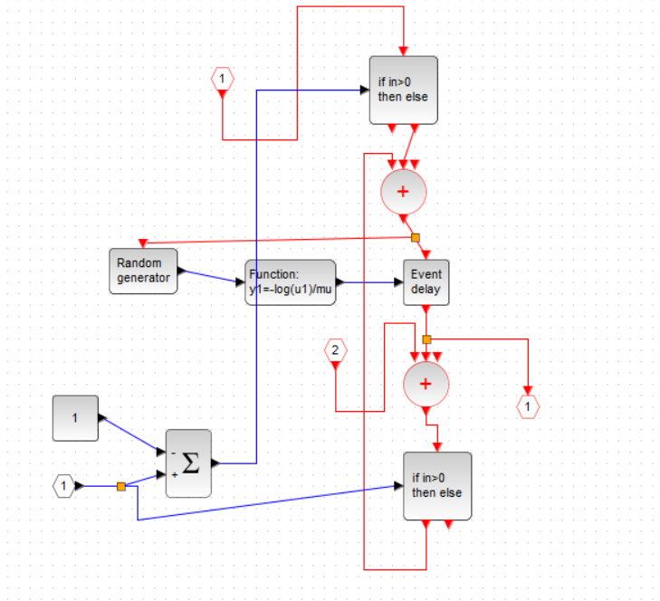
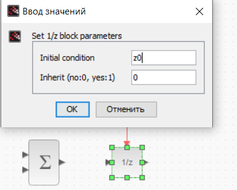
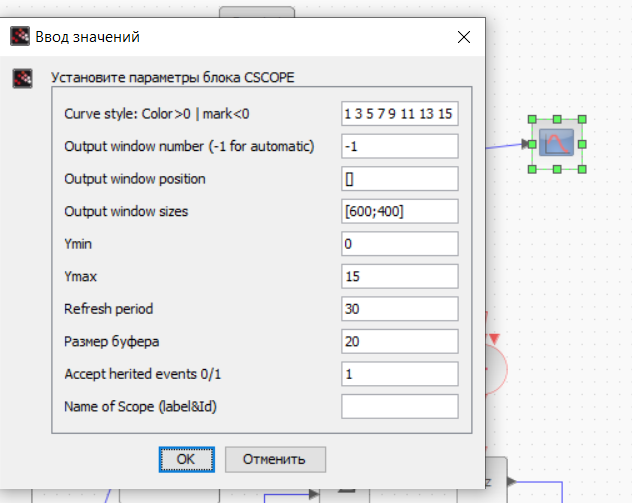
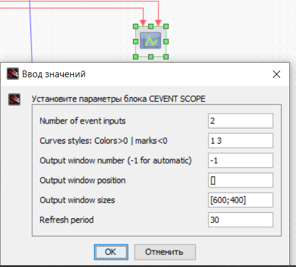
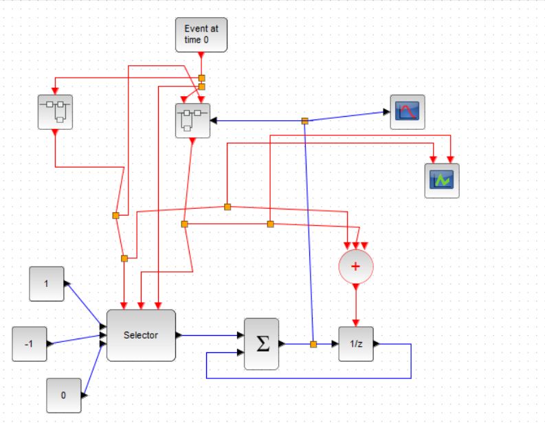
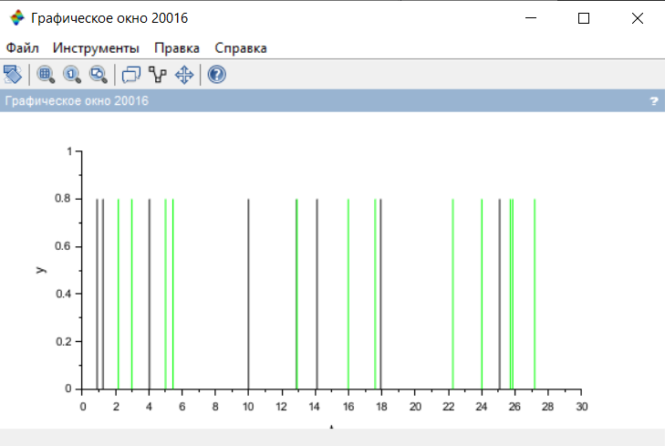
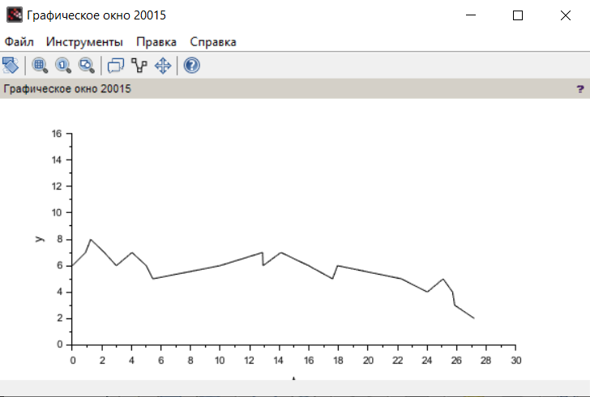

---
## Front matter
lang: ru-RU
title: Лабораторная работа № 7
subtitle: Модель СМО
author:
  - Дворкина Е. В.
institute:
  - Российский университет дружбы народов, Москва, Россия
date: 11 марта 2025

## i18n babel
babel-lang: russian
babel-otherlangs: english

## Formatting pdf
toc: false
toc-title: Содержание
slide_level: 2
aspectratio: 169
section-titles: true
theme: metropolis
header-includes:
 - \metroset{progressbar=frametitle,sectionpage=progressbar,numbering=fraction}
---

## Докладчик

:::::::::::::: {.columns align=center}
::: {.column width="70%"}

  * Дворкина Ева Владимировна
  * студентка
  * группа НФИбд-01-22
  * Российский университет дружбы народов
  * [1132226447@rudn.ru](mailto:1132226447@rudn.ru)
  * <https://github.com/evdvorkina>

:::
::: {.column width="30%"}

:::
::::::::::::::

## Цель работы

Реализовать модель $M|M|1|\infty$ с помощью xcos.

## Задание

- Реализовать в xcos модель системы массового обслуживания типа $M|M|1|\infty$.
- Построить график, описывающий динамику размера очереди 
- Построить график, описывающий поступление и обработку заявок.

# Выполнение лабораторной работы

## Переменные окружения

{#fig:001 width=70%}

## Параметры моделирования

{#fig:002 width=70%}

## Моделирование поступления заявки в суперблоке

{#fig:003 width=70%}

## Моделирование обработки заявки в суперблоке

{#fig:005 width=70%}

## Установка начального значения длины очереди

{#fig:006 width=70%}

## Параметры CSCOPE

{#fig:007 width=70%}

## Параметры CEVENTCOPE

{#fig:011 width=70%}

## Реализация модели в xcos

{#fig:008 width=70%}

## График поступления и обработки заявок

{#fig:009 width=70%}

## График динамики длины очереди

{#fig:010 width=70%}

## Выводы

При выполнении данной лабораторной работы я реализовала модель $M|M|1|\infty$ с помощью xcos.
