---
## Front matter
title: "Лабораторная работа № 7"
subtitle: "Модель СМО"
author: "Дворкина Ева Владимировна"

## Generic otions
lang: ru-RU
toc-title: "Содержание"

## Bibliography
bibliography: bib/cite.bib
csl: pandoc/csl/gost-r-7-0-5-2008-numeric.csl

## Pdf output format
toc: true # Table of contents
toc-depth: 2
lof: true # List of figures
lot: false # List of tables
fontsize: 12pt
linestretch: 1.5
papersize: a4
documentclass: scrreprt
## I18n polyglossia
polyglossia-lang:
  name: russian
  options:
	- spelling=modern
	- babelshorthands=true
polyglossia-otherlangs:
  name: english
## I18n babel
babel-lang: russian
babel-otherlangs: english
## Fonts
mainfont: IBM Plex Serif
romanfont: IBM Plex Serif
sansfont: IBM Plex Sans
monofont: IBM Plex Mono
mathfont: STIX Two Math
mainfontoptions: Ligatures=Common,Ligatures=TeX,Scale=0.94
romanfontoptions: Ligatures=Common,Ligatures=TeX,Scale=0.94
sansfontoptions: Ligatures=Common,Ligatures=TeX,Scale=MatchLowercase,Scale=0.94
monofontoptions: Scale=MatchLowercase,Scale=0.94,FakeStretch=0.9
mathfontoptions:
## Biblatex
biblatex: true
biblio-style: "gost-numeric"
biblatexoptions:
  - parentracker=true
  - backend=biber
  - hyperref=auto
  - language=auto
  - autolang=other*
  - citestyle=gost-numeric
## Pandoc-crossref LaTeX customization
figureTitle: "Рис."
tableTitle: "Таблица"
listingTitle: "Листинг"
lofTitle: "Список иллюстраций"
lotTitle: "Список таблиц"
lolTitle: "Листинги"
## Misc options
indent: true
header-includes:
  - \usepackage{indentfirst}
  - \usepackage{float} # keep figures where there are in the text
  - \floatplacement{figure}{H} # keep figures where there are in the text
---

# Цель работы

Цель данной лабораторной работы - реализовать модель $M|M|1|\infty$ с помощью xcos.

# Задание

- Реализовать в xcos модель системы массового обслуживания типа $M|M|1|\infty$.
- Построить график, описывающий динамику размера очереди 
- Построить график, описывающий поступление и обработку заявок.

# Теоретическое введение

$M|M|1$ — однолинейная СМО с накопителем бесконечной ёмкости. Поступаю-
щий поток заявок — пуассоновский с интенсивностью $\lambda$. Времена обслуживания
заявок — независимые в совокупности случайные величины, распределённые по
экспоненциальному закону с параметром $\mu$.

Система дифференциальных уравнений Колмогорова ([-@eq:eq:syst]):

$$
  \begin{cases}
    p'_0(t) = -\lambda p_0(t) + \mu p_1(t)\\
    p'_i(t) = -(\lambda + \mu)p_i(t)+\lambda p_{i-1}(t) + \mu p_{i+1}(t) & \quad i \geq 1
  \end{cases}
$$ {#eq:eq:syst}

$p_i(t)=P\{ \nu (t) = i \}$ - вероятность того, что в момент времени $t$ в системе находится $i$ заявок.

$\rho = \frac{\lambda}{\mu}$ - загрузка системы

Стационарное среднее число заявок в очереди ([-@eq:eq:qq]):

$$
Q = \frac{\rho^2}{1-\rho}
$$ {#eq:eq:qq}

Более подробно в [@l:bash; @l3:bash].

# Выполнение лабораторной работы

## Реализация модели в xcos

Для работы в xcos будем использовать дополнительные материалы [@xcos:bash].

В нашей модели одна очереди, поступление заявок описывается пуассоновским процессом.

Зададим переменные окружения (рис. [-@fig:001]).

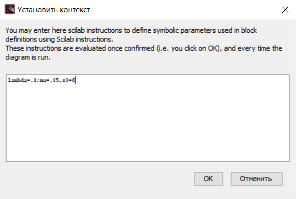{#fig:001 width=70%}

Установим время моделирования системы на 30 единиц модельного времени (рис. [-@fig:002]).

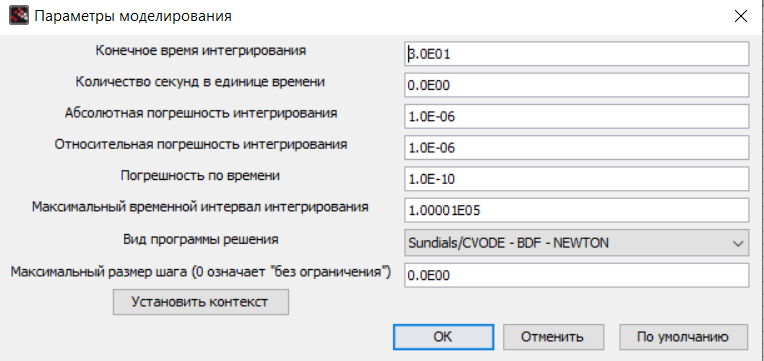{#fig:002 width=70%}

Модель будет состоять из суперблоков.

В нашей модели есть суперблок для описания поступления заявок (рис. [-@fig:003]):

В нем используются следующие блоки:

- RAND_M -- генератор случайных чисел по равномерному распределению.

- LOGBLCK_f -- взятие логарифма от потока выхода случайных чисел, чтобы получить Пуассоновское распределение.

- GAINBLCK_f -- умножает сгенерированный поток по Пуассоновскому распределению на $- \dfrac{1}{\lambda}$

- EVTGEN_f -- обработчик событий, так как для моделирования заявок будут использованы события.

- CLKSOMV_f -- синхронизация выходных и входных сигналов.

- CLKINV_f -- порт входа в суперблок.

- CLKOUTV_f -- порт выхода из суперблок.

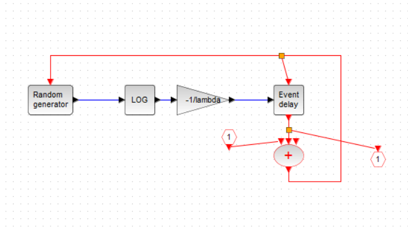{#fig:003 width=70%}

Второй необходимый нам суперблок - суперблок для моделирования обработки заявки, где время обработки распределено по экспоненциальному закону.

Используемые блоки:

- RAND_M -- генератор случайных чисел по равномерному распределению.
sci_funk_m_block -- задает математическое выражение $y1=-log(u1)/mu$, которое ранее мы задавали блоками.

- EVTGEN_f -- обработчик событий, так как для моделирования заявок будут использованы события.

- CLKSOMV_f -- синхронизация выходных и входных сигналов. В этом суперблоке их два. 

- IFHEL_f -- два блока для определения длины очереди, если значение больше нуля, то сигнал подается.

- CLKINV_f -- входы для запуска и для сообщения о том, что сообщение пришло в очередь, чтобы по разному обрабатывать пустую и не пустую очередь.

- IN_f, CONST_M -- проверка на длину очереди

Сначала опишем выражение в блоке Function, которое будет преобразовывать поступающие сигналы, распределенные по равномерному закону, в сигналы, распределенные экспоненциально (рис. [-@fig:004]).

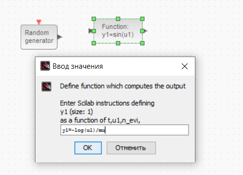{#fig:004 width=70%}

Соединив все блоки, получим суперблок, моделирующий обработку заявок (рис. [-@fig:005]).

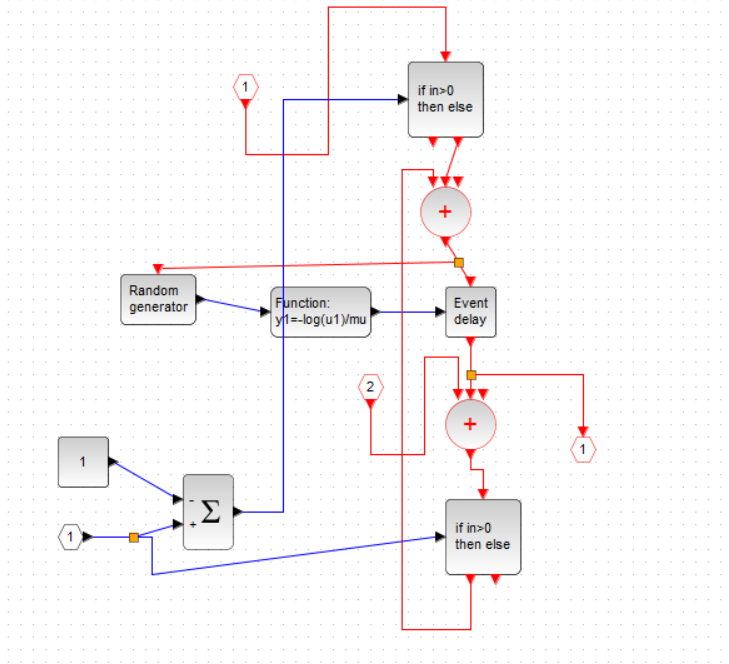{#fig:005 width=70%}

Перейдем к составлению общей системы.

В ней используются:

- SELECTOR_M -- берёт входные сигналы и с помощью управляющих сигналов будет добавлять вход к очереди, либо считывать. У него три входа -- для поступления заявок, обработки заявок и начальной синхронизации.

- CONST_M -- поступление заявки выражается 1, обслуживание заявки -- -1, первоначальная синхронизация -- 0.

- EVTGEN_f -- запуск первоначального события в нулевой момент времени.

- DOLLAR_f -- блок для иммитации очереди, на него приходит управление, которое синхронизируется с источника и с обработчика.

- CSCOPE -- для отрисовки длины очереди.

- CEVEBTSCOPE -- обработка событий.

Укажем в блоке DOLLAR_f (блок для иммитации очереди) начальное значение очереди, оно у нас равно $z_0=6$ (рис. [-@fig:006]).

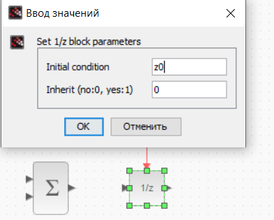{#fig:006 width=70%}

Также определим параметры регистрирующих устройств в системе. В CSCOPE будет отображаться график изменения очереди в системе (рис. [-@fig:007]).

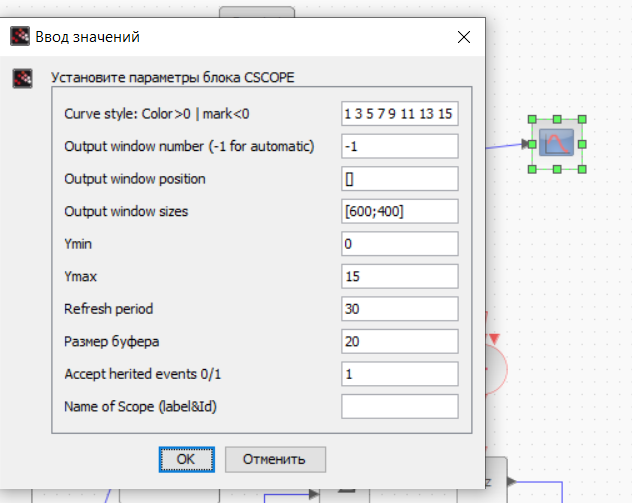{#fig:007 width=70%}

Далее установим параметры блока CEVENTSCOPE, в нем будут отображаться события обработки и поступления заявки в систему ([-@fig:011]).

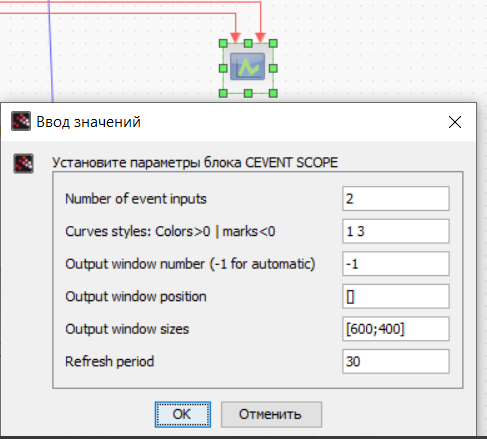{#fig:011 width=70%}

Вся модель выглядит следующим образом (рис. [-@fig:008]):

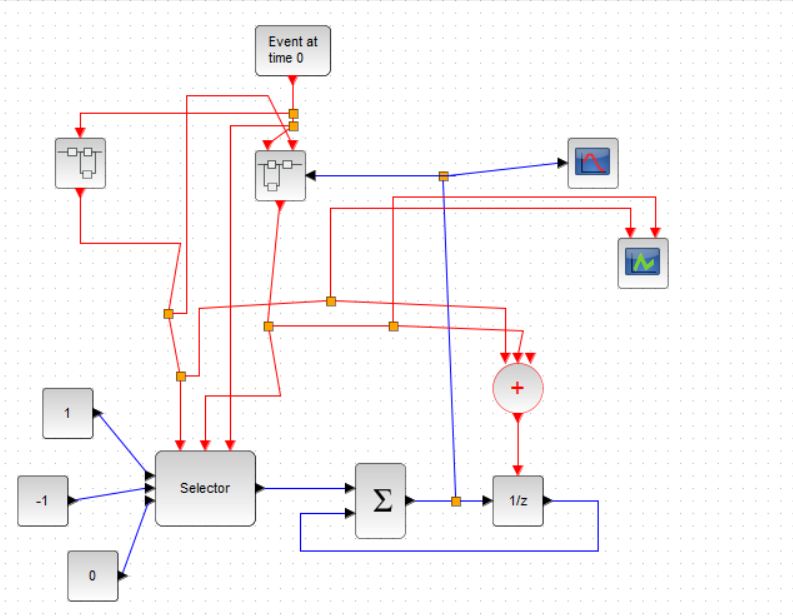{#fig:008 width=70%}

В результате получим два графика: один показывает поступление и обработку заявок, а второй изменение длины очереди (рис. [-@fig:009], [-@fig:010]).

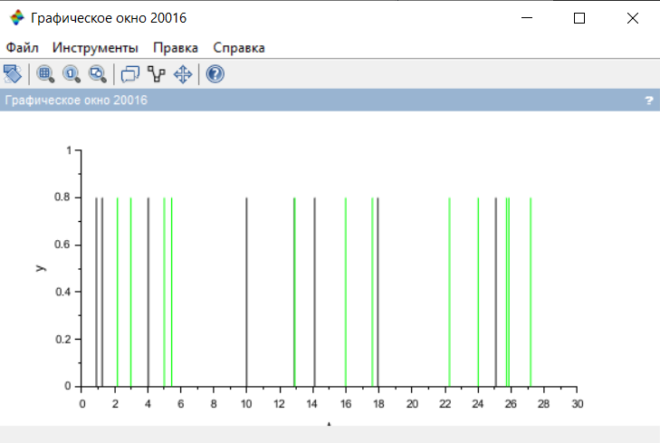{#fig:009 width=70%}

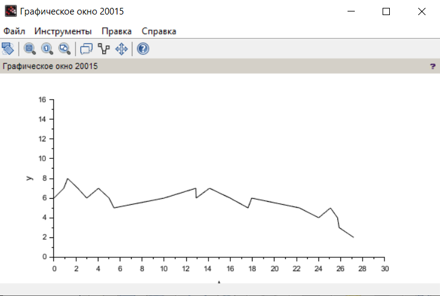{#fig:010 width=70%}

Размер очереди начинается со значения 6, потому что таким мы задали значение очереди на начальный момент времени. Так же видим рост очереди на графике динамики размера очереди, что подтверждается в том числе графиком обработки и поступления заявок, где первые события - поступления, то есть, наша очередь за первые два события увеличивается.

Далее на графике поступления и обработки заявок можно заметить больше событий обработки, чем поступления, что связано с тем, что изначально у нас уже есть заявки в очереди, которые тоже надо обработать.

# Выводы

При выполнении данной лабораторной работы я реализовала модель $M|M|1|\infty$ с помощью xcos.

# Список литературы{.unnumbered}

::: {#refs}
:::
