---
## Front matter
lang: ru-RU
title: Лабораторная работа №8
subtitle: Модель TCP/AQM
author:
  - Дворкина Е. В.
institute:
  - Российский университет дружбы народов, Москва, Россия
date: 11 марта 2025

## i18n babel
babel-lang: russian
babel-otherlangs: english

## Formatting pdf
toc: false
toc-title: Содержание
slide_level: 2
aspectratio: 169
section-titles: true
theme: metropolis
header-includes:
 - \metroset{progressbar=frametitle,sectionpage=progressbar,numbering=fraction}
---

## Докладчик

:::::::::::::: {.columns align=center}
::: {.column width="70%"}

  * Дворкина Ева Владимировна
  * студентка
  * группа НФИбд-01-22
  * Российский университет дружбы народов
  * [1132226447@rudn.ru](mailto:1132226447@rudn.ru)
  * <https://github.com/evdvorkina>

:::
::: {.column width="30%"}

:::
::::::::::::::

## Цель работы

Цель данной лабораторной работы -- реализовать модель TCP/AQM с помощью xcos и OpenModelica.

## Задание

- Реализовать в xcos и OpenModelica модель TCP/AQM.
- Построить график, описывающий динамику размера очереди и TCP окна
- Построить фазовый портрет, описывающий зависимость размера очереди от TCP окна

## Теоретическое введение

Рассмотрим упрощённую модель поведения TCP-подобного трафика с регулируемой
некоторым AQM алгоритмом динамической интенсивностью потока 

$$
\dot{W}(t) = \frac{1}{R} - \frac{W(t)W(t-R)}{2R} K Q(t-R)
$$

$$
\dot{Q}(t) = 
\begin{cases} 
    \frac{NW(t)}{R} - C, & Q(t) > 0, \\
    \max \left( \frac{NW(t)}{R} - C, 0 \right), & Q(t) = 0.
\end{cases}
$$

# Выполнение лабораторной работы

## Реализация в xcos (Переменные окружения)

Начальные значения параметров $N = 1, R = 1, K = 5.3, C = 1, W(0) = 0.1, Q(0) = 1$.

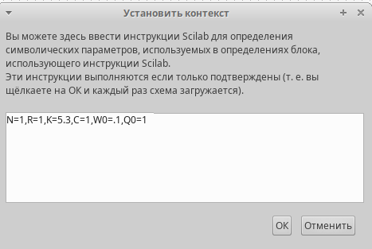{#fig:001 width=50%}

## Реализация в xcos (Параметры моделирования)

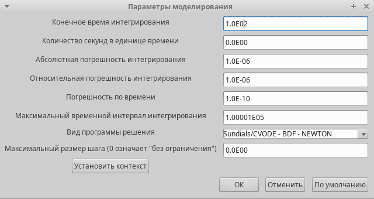{#fig:002 width=70%}

## Реализация в xcos (Установка начального значения)

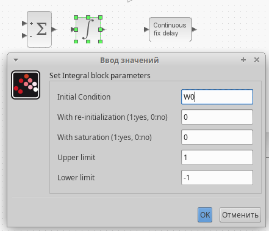{#fig:003 width=50%}

## Реализация в xcos (Установка начального значения)

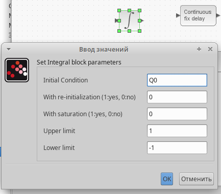{#fig:004 width=50%}

## Реализация в xcos (Установка значения задержки)

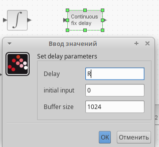{#fig:005 width=50%}

## Реализация в xcos (Задать выражение в блоке)

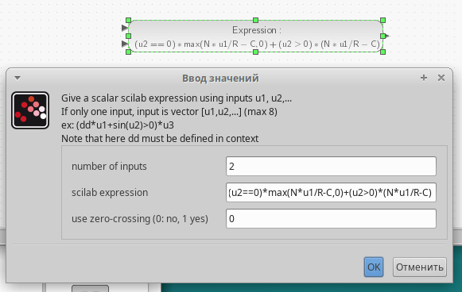{#fig:006 width=70%}

## Реализация в xcos (Полученная модель)

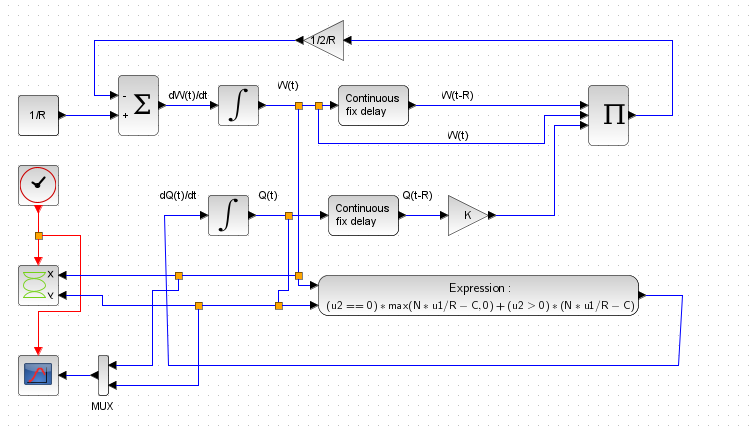{#fig:009 width=70%}

## Реализация в xcos (График изменения размера окна TCP и очереди)

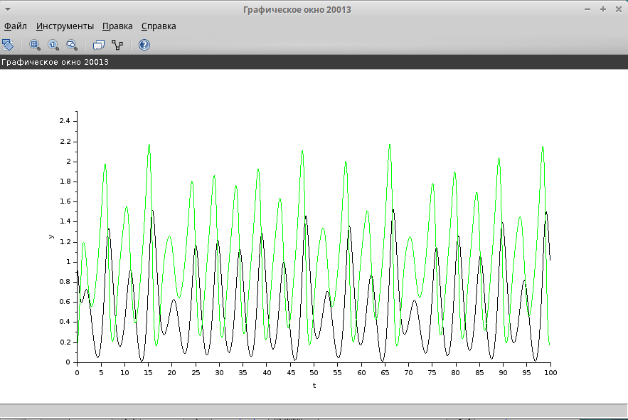{#fig:010 width=50%}

## Реализация в xcos (Фазовый портрет)

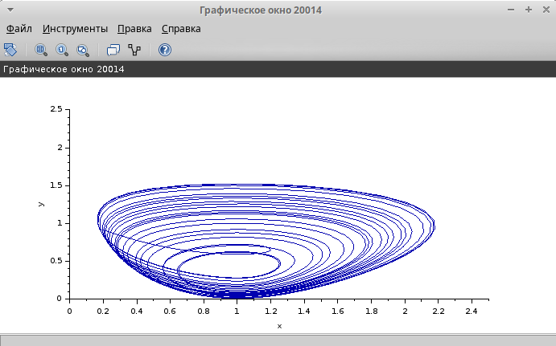{#fig:011 width=70%}

## Реализация в xcos (Изменение переменных окружения)

Уменьшим скорость обработки пакетов C до $0.9$

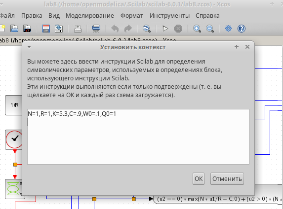{#fig:012 width=50%}

## Реализация в xcos (График изменения размера окна TCP и очереди)

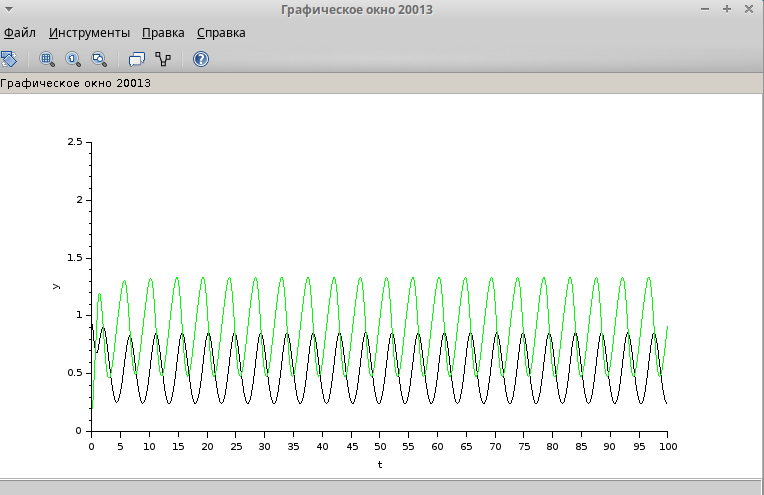{#fig:013 width=70%}

## Реализация в xcos (Фазовый портрет)

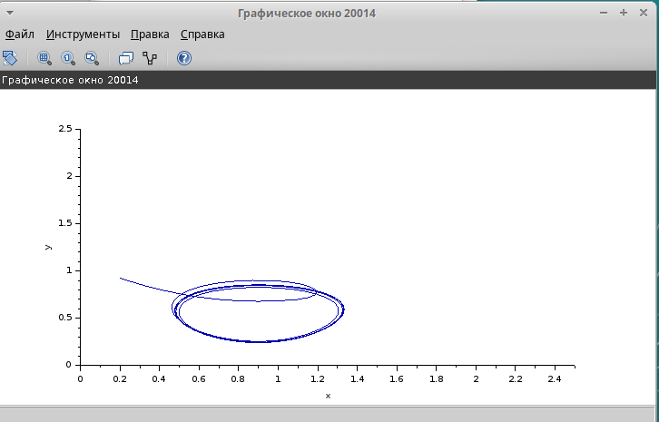{#fig:014 width=70%}

## Реализация в OpenModelica (Полученная модель)

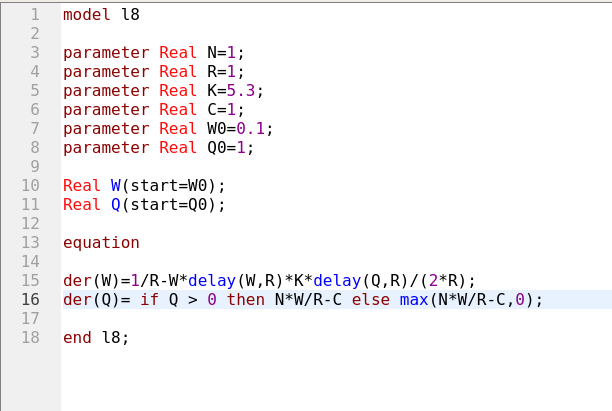{#fig:015 width=70%}

## Реализация в OpenModelica (Установка симуляции)

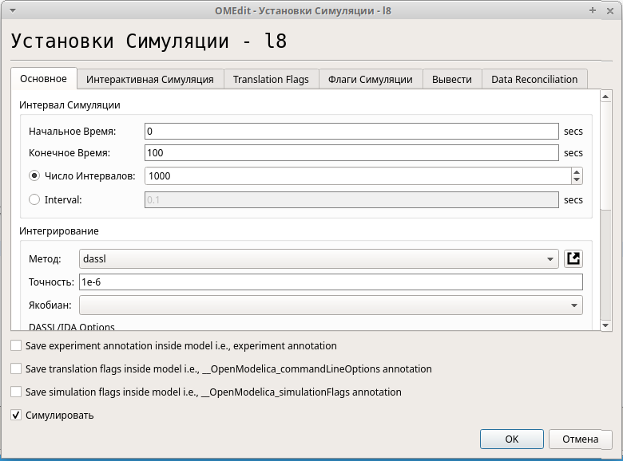{#fig:016 width=60%}

## Реализация в OpenModelica (График изменения размера окна TCP и очереди)

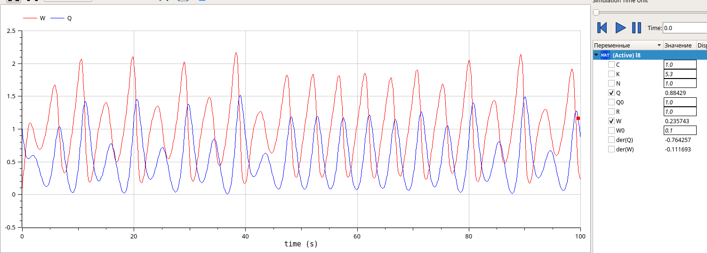{#fig:017 width=75%}

## Реализация в OpenModelica (Фазовый портрет)

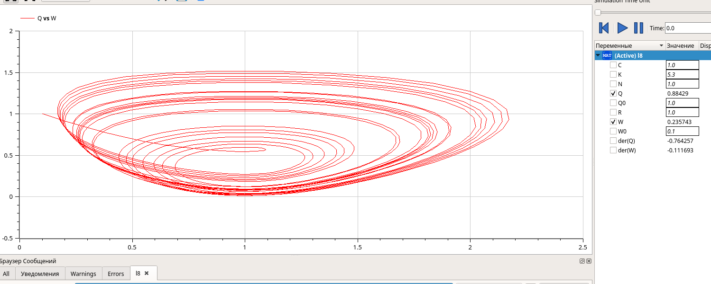{#fig:018 width=70%}

## Реализация в OpenModelica (Изменение переменных)

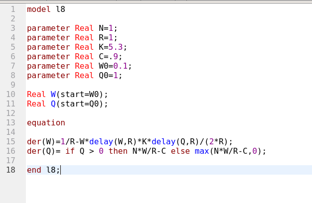{#fig:019 width=70%}

## Реализация в OpenModelica (График изменения размера окна TCP и очереди)

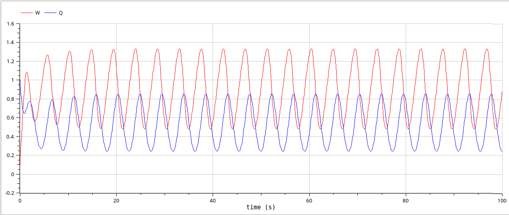{#fig:020 width=70%}

## Реализация в OpenModelica (Фазовый портрет)

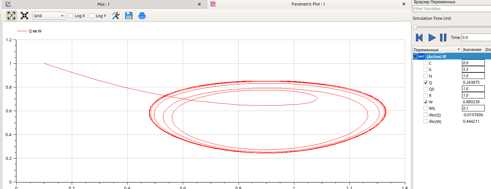{#fig:021 width=70%}

## Выводы

При выполнении данной лабораторной работы я реализовала модель TCP/AQM с помощью xcos и OpenModelica.
