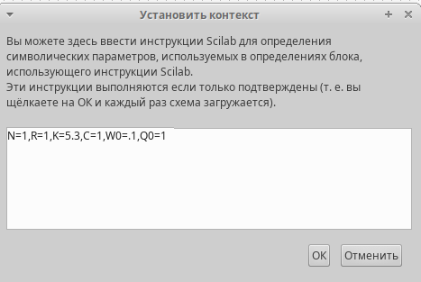
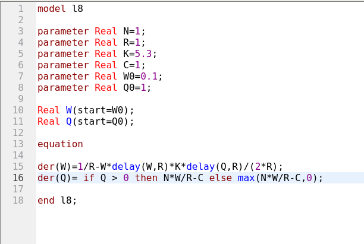

---
## Front matter
title: "Лабораторная работа № 8"
subtitle: "Модель TCP/AQM"
author: "Дворкина Ева Владимировна"

## Generic otions
lang: ru-RU
toc-title: "Содержание"

## Bibliography
bibliography: bib/cite.bib
csl: pandoc/csl/gost-r-7-0-5-2008-numeric.csl

## Pdf output format
toc: true # Table of contents
toc-depth: 2
lof: true # List of figures
lot: false # List of tables
fontsize: 12pt
linestretch: 1.5
papersize: a4
documentclass: scrreprt
## I18n polyglossia
polyglossia-lang:
  name: russian
  options:
	- spelling=modern
	- babelshorthands=true
polyglossia-otherlangs:
  name: english
## I18n babel
babel-lang: russian
babel-otherlangs: english
## Fonts
mainfont: IBM Plex Serif
romanfont: IBM Plex Serif
sansfont: IBM Plex Sans
monofont: IBM Plex Mono
mathfont: STIX Two Math
mainfontoptions: Ligatures=Common,Ligatures=TeX,Scale=0.94
romanfontoptions: Ligatures=Common,Ligatures=TeX,Scale=0.94
sansfontoptions: Ligatures=Common,Ligatures=TeX,Scale=MatchLowercase,Scale=0.94
monofontoptions: Scale=MatchLowercase,Scale=0.94,FakeStretch=0.9
mathfontoptions:
## Biblatex
biblatex: true
biblio-style: "gost-numeric"
biblatexoptions:
  - parentracker=true
  - backend=biber
  - hyperref=auto
  - language=auto
  - autolang=other*
  - citestyle=gost-numeric
## Pandoc-crossref LaTeX customization
figureTitle: "Рис."
tableTitle: "Таблица"
listingTitle: "Листинг"
lofTitle: "Список иллюстраций"
lotTitle: "Список таблиц"
lolTitle: "Листинги"
## Misc options
indent: true
header-includes:
  - \usepackage{indentfirst}
  - \usepackage{float} # keep figures where there are in the text
  - \floatplacement{figure}{H} # keep figures where there are in the text
---

# Цель работы

Цель данной лабораторной работы -- реализовать модель TCP/AQM с помощью xcos и OpenModelica.

# Задание

- Реализовать в xcos и OpenModelica модель TCP/AQM.
- Построить график, описывающий динамику размера очереди и TCP окна
- Построить фазовый портрет, описывающий зависимость размера очереди от TCP окна

# Теоретическое введение

Рассмотрим упрощённую модель поведения TCP-подобного трафика с регулируемой
некоторым AQM алгоритмом динамической интенсивностью потока [@l:bash]. 

$W(t)$ -- средний размер TCP-окна (в пакетах, функция положительна),

$Q(t)$ -- средний размер очереди (в пакетах, функция положительна),

$R(t)$ -- время двойного оборота (Round Trip Time, сек.)

$C$ -- скорость обработки пакетов в очереди (пакетов в секунду)

$N(t)$ -- число TCP-сессий

$p(t-R(t))$ -- вероятностная функция сброса (отметки на сброс) пакета, значения которой лежат на интервале $[0,1]$.

Примем $N(t) \equiv N$, $R(t) \equiv R$, т. е. указанные величины положим постоянными, не изменяющимися во времени. Также положим $p(t-R(t))=KQ(t)$, т.е. функция сброса пакетов пропорциональна длине очереди $Q(t)$. 

Тогда получим систему ([-eq:eq:W], [-eq:eq:Q])

$$
\dot{W}(t) = \frac{1}{R} - \frac{W(t)W(t-R)}{2R} K Q(t-R)
$${#eq:eq:W}

$$
\dot{Q}(t) = 
\begin{cases} 
    \frac{NW(t)}{R} - C, & Q(t) > 0, \\
    \max \left( \frac{NW(t)}{R} - C, 0 \right), & Q(t) = 0.
\end{cases}
$${#eq:eq:Q}

# Выполнение лабораторной работы

## Реализация в xcos

Построим схему xcos [@xcos:bash], моделирующую нашу систему, с начальными значениями параметров $N = 1, R = 1, K = 5.3, C = 1, W(0) = 0.1, Q(0) = 1$.

Для этого сначала зададим переменные окружения (рис. [-@fig:001]).

{#fig:001 width=70%}

Так же зададим время моделирования как 100 единиц модельного времени (рис. [-@fig:002]).

{#fig:002 width=70%}

Установим начальные значения в блоках интегрирования (рис. [-@fig:003], [-@fig:004]).

{#fig:003 width=70%}

{#fig:004 width=70%}

Установка параметра задержки (рис. [-@fig:005]).

{#fig:005 width=70%}

Запись выражения, определяющего $\dot{Q}(t)$ в блок Expression (рис. [-@fig:006]).

{#fig:006 width=70%}

Установим параметры регистрирующих устройств для оптимального отображения графиков, также можем настроить цвета. Так же у блока CSCOPE ставим параметр `refresh period`=100, чтобы на графики отобразились результаты моделирования в течение 100 секунд модельного времени (рис. [-@fig:007], [-@fig:008]).

{#fig:007 width=70%}

{#fig:008 width=70%}

Затем реализуем модель TCP/AQM и разместим регистрирующие устройства CSCOPE для графиков изменения окна TCP и изменения очереди, и CSCOPXY для фазового портрета (рис. [-@fig:009]).

{#fig:009 width=70%}

Получим динамику изменения размера TCP окна $W(t)$ (зеленая линия) и размера очереди $Q(t)$ (черная линия), а также фазовый портрет, который показывает наличие автоколебаний параметров системы — фазовая траектория осциллирует вокруг своей стационарной точки (рис. [-@fig:010], [-@fig:011]):

{#fig:010 width=70%}

{#fig:011 width=70%}

Уменьшив скорость обработки пакетов C до $0.9$ (рис. [-@fig:012]) увидим, что автоколебания стали более выраженными (рис. [-@fig:013], [-@fig:014]).

{#fig:012 width=70%}

{#fig:013 width=70%}

{#fig:014 width=70%}

## Реализация модели в OpenModelica

Перейдем к реализации модели в OpenModelica. Зададим параметры, начальные значения и систему дифференциальных уравнений (рис. [-@fig:015]).

{#fig:015 width=70%}

Затем установим параметры симуляции - 100 единиц модельного времени (рис. [-@fig:016]).

{#fig:016 width=70%}

Получим динамику изменения размера TCP окна $W(t)$ (красная линия) и размера очереди $Q(t)$ (синяя линия), а также фазовый портрет, который показывает наличие автоколебаний параметров системы — фазовая траектория осциллирует вокруг своей стационарной точки (рис. [-@fig:017], [-@fig:010]):

{#fig:017 width=70%}

{#fig:018 width=70%}

Изменим в OpenModelica скорость обработки пакетов C до 0.9 (рис. [-@fig:019]).

{#fig:019 width=70%}

Точно так же увидим, что автоколебания стали более выраженными (рис. [-@fig:020], [-@fig:021]).

{#fig:020 width=70%}

{#fig:021 width=70%}

# Выводы

При выполнении данной лабораторной работы я реализовала модель TCP/AQM с помощью xcos и OpenModelica.

# Список литературы{.unnumbered}

::: {#refs}
:::
