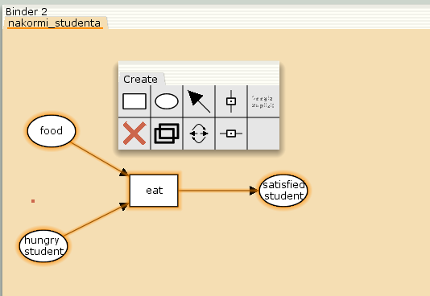
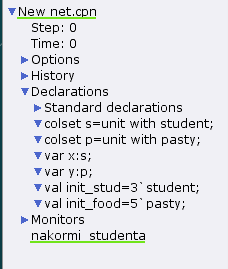
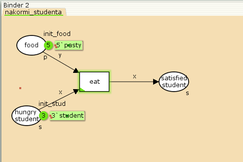
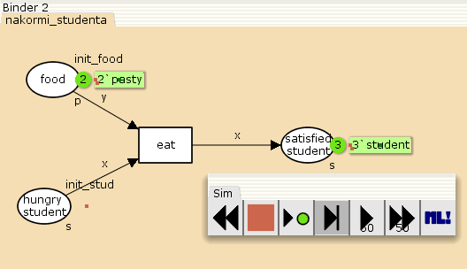
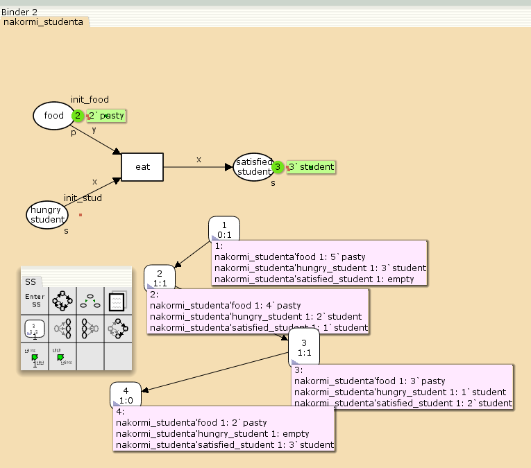

---
## Front matter
lang: ru-RU
title: Лабораторная работа №9
subtitle: Модель «Накорми студентов»
author:
  - Дворкина Е. В.
institute:
  - Российский университет дружбы народов, Москва, Россия
date: 11 марта 2025

## i18n babel
babel-lang: russian
babel-otherlangs: english

## Formatting pdf
toc: false
toc-title: Содержание
slide_level: 2
aspectratio: 169
section-titles: true
theme: metropolis
header-includes:
 - \metroset{progressbar=frametitle,sectionpage=progressbar,numbering=fraction}
---

## Докладчик

:::::::::::::: {.columns align=center}
::: {.column width="70%"}

  * Дворкина Ева Владимировна
  * студентка
  * группа НФИбд-01-22
  * Российский университет дружбы народов
  * [1132226447@rudn.ru](mailto:1132226447@rudn.ru)
  * <https://github.com/evdvorkina>

:::
::: {.column width="30%"}


:::
::::::::::::::

# Введение

## Цели и задачи

**Цель работы**

Цель данной лабораторной работы - реализовать в CPN Tools модель "Накорми студентов".

**Задание**

- Реализовать в CPN Tools модель "Накорми студентов".

- Вычислить пространство состояний, сформировать отчет о нем и построить граф.

## Теоретическое введение

Основные функции CPN Tools:

- создание (редактирование) моделей;

- анализ поведения моделей с помощью имитации динамики сети Петри;

- построение и анализ пространства состояний модели.

# Выполнение лабораторной работы

## Граф модели "Накорми студентов"

{#fig:001 width=70%}


## Декларации модели "Накорми студентов"

:::

{#fig:002 width=35%}

:::

## Реализация в CPN Tools модели "Накорми студентов"

{#fig:003 width=70%}

## Запуск модели

{#fig:005 width=70%}

# Упражнение

## Построение графа состояний

{#fig:008 width=55%}

## Анализ пространства состояний

```
CPN Tools state space report for:
<unsaved net>
Report generated: Sun Mar  2 19:52:49 2025
```

## Анализ пространства состояний

```
 Statistics
------------------------------------------------------------------------

  State Space
     Nodes:  4
     Arcs:   3
     Secs:   0
     Status: Full

  Scc Graph
     Nodes:  4
     Arcs:   3
     Secs:   0
```

## Анализ пространства состояний

```
 Boundedness Properties
------------------------------------------------------------------------

  Best Integer Bounds
                             Upper      Lower
     nakormi_studenta'food 1 5          2
     nakormi_studenta'hungry_student 1
                             3          0
     nakormi_studenta'satisfied_student 1
                             3          0
```

## Анализ пространства состояний

```
  Best Upper Multi-set Bounds
     nakormi_studenta'food 1
                         5`pasty
     nakormi_studenta'hungry_student 1
                         3`student
     nakormi_studenta'satisfied_student 1
                         3`student

  Best Lower Multi-set Bounds
     nakormi_studenta'food 1
                         2`pasty
     nakormi_studenta'hungry_student 1
                         empty
     nakormi_studenta'satisfied_student 1
                         empty
```

## Анализ пространства состояний

```
 Home Properties
------------------------------------------------------------------------
  Home Markings
     [4]
```

## Анализ пространства состояний

```
 Liveness Properties
------------------------------------------------------------------------
  Dead Markings
     [4]
     
  Dead Transition Instances
     None

  Live Transition Instances
     None
```

## Анализ пространства состояний

```
 Fairness Properties
------------------------------------------------------------------------
     No infinite occurrence sequences.
```

## Выводы

 При выполнении данной лабораторной работы я реализовала в CPN Tools модель "Накорми студентов".
