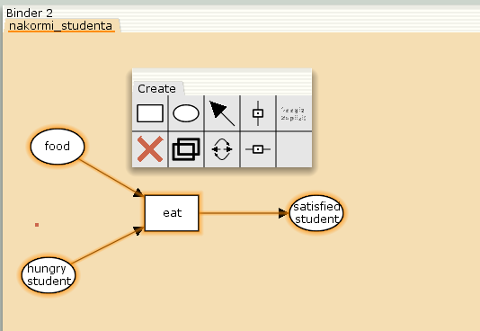
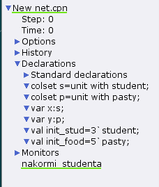
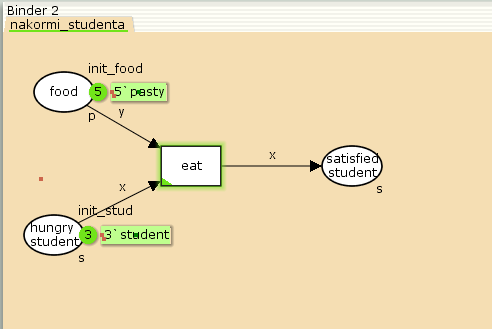
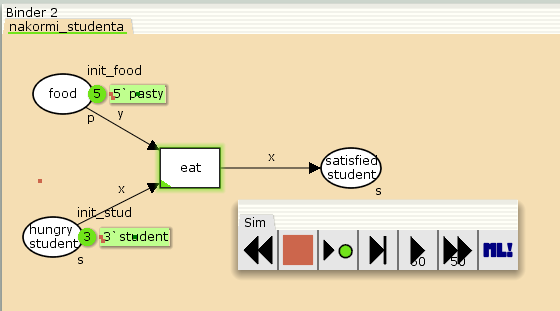
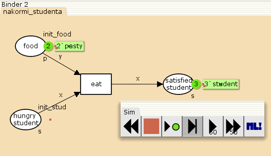
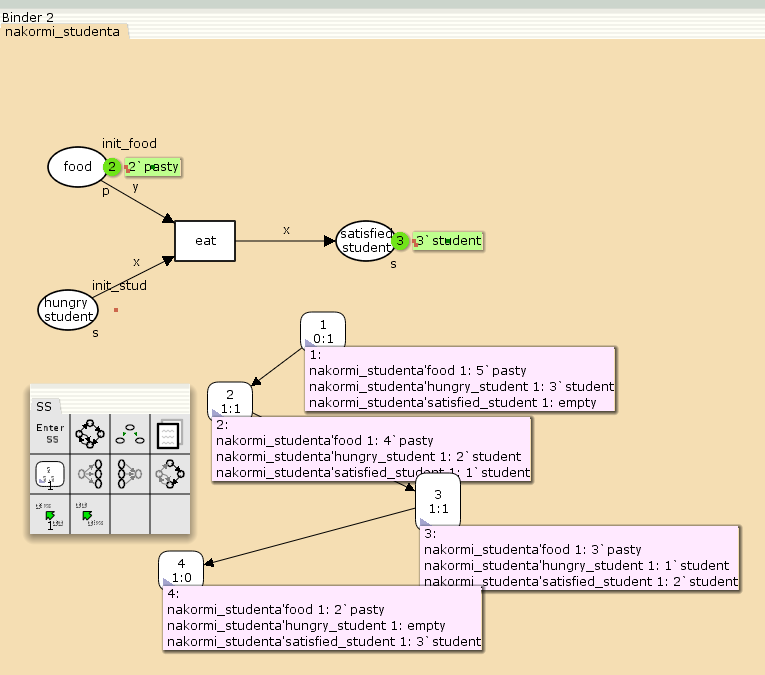

---
## Front matter
title: "Лабораторная работа № 9"
subtitle: "Модель «Накорми студентов»"
author: "Дворкина Ева Владимировна"

## Generic otions
lang: ru-RU
toc-title: "Содержание"

## Bibliography
bibliography: bib/cite.bib
csl: pandoc/csl/gost-r-7-0-5-2008-numeric.csl

## Pdf output format
toc: true # Table of contents
toc-depth: 2
lof: true # List of figures
lot: false # List of tables
fontsize: 12pt
linestretch: 1.5
papersize: a4
documentclass: scrreprt
## I18n polyglossia
polyglossia-lang:
  name: russian
  options:
	- spelling=modern
	- babelshorthands=true
polyglossia-otherlangs:
  name: english
## I18n babel
babel-lang: russian
babel-otherlangs: english
## Fonts
mainfont: IBM Plex Serif
romanfont: IBM Plex Serif
sansfont: IBM Plex Sans
monofont: IBM Plex Mono
mathfont: STIX Two Math
mainfontoptions: Ligatures=Common,Ligatures=TeX,Scale=0.94
romanfontoptions: Ligatures=Common,Ligatures=TeX,Scale=0.94
sansfontoptions: Ligatures=Common,Ligatures=TeX,Scale=MatchLowercase,Scale=0.94
monofontoptions: Scale=MatchLowercase,Scale=0.94,FakeStretch=0.9
mathfontoptions:
## Biblatex
biblatex: true
biblio-style: "gost-numeric"
biblatexoptions:
  - parentracker=true
  - backend=biber
  - hyperref=auto
  - language=auto
  - autolang=other*
  - citestyle=gost-numeric
## Pandoc-crossref LaTeX customization
figureTitle: "Рис."
tableTitle: "Таблица"
listingTitle: "Листинг"
lofTitle: "Список иллюстраций"
lotTitle: "Список таблиц"
lolTitle: "Листинги"
## Misc options
indent: true
header-includes:
  - \usepackage{indentfirst}
  - \usepackage{float} # keep figures where there are in the text
  - \floatplacement{figure}{H} # keep figures where there are in the text
---

# Введение

## Цели и задачи

**Цель работы**

Цель данной лабораторной работы - реализовать в CPN Tools модель "Накорми студентов".

**Задание**

- Реализовать в CPN Tools модель "Накорми студентов".

- Вычислить пространство состояний, сформировать отчет о нем и построить граф.

# Теоретическое введение

CPN Tools — специальное программное средство, предназначенное для моделирования иерархических временных раскрашенных сетей Петри. Такие сети 
эквивалентны машине Тьюринга и составляют универсальную алгоритмическую
систему, позволяющую описать произвольный объект [@cpn:bash].

CPN Tools позволяет визуализировать модель с помощью графа сети Петри и при-
менить язык программирования CPN ML (Colored Petri Net Markup Language) для
формализованного описания модели.

Назначение CPN Tools:

- разработка сложных объектов и моделирование процессов в различных прикладных областях, в том числе:

- моделирование производственных и бизнес-процессов;

- моделирование систем управления производственными системами и роботами;

- спецификация и верификация протоколов, оценка пропускной способности сетей
и качества обслуживания, проектирование телекоммуникационных устройств
и сетей.

Основные функции CPN Tools:

- создание (редактирование) моделей;

- анализ поведения моделей с помощью имитации динамики сети Петри;

- построение и анализ пространства состояний модели.

# Выполнение лабораторной работы

## Реализация в CPN Tools модели "Накорми студентов"

Рассмотрим пример студентов, обедающих пирогами. Голодный студент становится сытым после того, как съедает пирог [@l:bash].

Таким образом, имеем:

- два типа фишек: «пироги» и «студенты»;

- три позиции: «голодный студент», «пирожки», «сытый студент»;

- один переход: «съесть пирожок».

Сначала нарисуем граф сети. Для этого с помощью контекстного меню создаём новую
сеть, добавляем позиции, переход и дуги (рис. [-@fig:001]).

{#fig:001 width=70%}

В меню задаём новые декларации модели: типы фишек, начальные значения
позиций, выражения для дуг. Для этого наведя мышку на меню Standart declarations,
правой кнопкой вызываем контекстное меню и выбираем New Decl (рис. [-@fig:002]).

{#fig:002 width=70%}

После этого задаем тип s фишкам, относящимся к студентам, тип p — фишкам,
относящимся к пирогам, задаём значения переменных x и y для дуг и начальные
значения мультимножеств `init_stud` и `init_food`. В результате получаем работающую модель (рис. [-@fig:003]).

{#fig:003 width=70%}

Для запуска будем использовать блок инструментов simulation (рис. [-@fig:004]).

{#fig:004 width=70%}

После запуска фишки типа «пирожки» из позиции «еда» и фишки типа «студенты» из позиции «голодный студент», пройдя через переход «кушать», попадают
в позицию «сытый студент» и преобразуются в тип «студенты» (рис. [-@fig:005]).

{#fig:005 width=70%}

## Упражнение

Для построения графа состояний этого войдем в пространство состояний, посчитаем его с помощью `Calculate State Space` и рассчитаем граф состояний с помощью `Calculate State Space Graph`. Далее построим граф, а нажав на розовые "кармашки" у вершин графа (состояний сети), получим пояснение о состоянии сети (рис. [-@fig:005]).

{#fig:008 width=70%}

Вычислим пространство состояний. Прежде, чем пространство состояний может быть вычислено и проанализировано, необходимо сформировать код пространства состояний. Этот код создается, когда используется инструмент Войти в пространство состояний. Вход в пространство состояний занимает некоторое время. Затем, если ожидается, что пространство состояний будет небольшим, можно просто применить инструмент Вычислить пространство состояний к листу, содержащему страницу сети. Сформируем отчёт о пространстве состояний и проанализируем его.  Чтобы сохранить отчет, необходимо применить инструмент Сохранить отчет о пространстве состояний к листу, содержащему страницу сети и ввести имя файла отчета.

Из полученного отчета можно узнать:

- В графе есть 4 узла и 3 дуги (4 состояния и 3 перехода).

- Указаны границы значений для каждого элемента: голодные студенты (максимум - 3, минимум - 0), сытые студенты (максимум - 3, минимум - 0), еда (максимум - 5, минимум - 2, минимальное значение 2, так как в конце симуляции остаются пирожки).

- Также указаны границы мультимножеств.

- Маркировка home равная 4, так как только в эту позицию мы можем попасть из любой другой маркировки.

- Маркировка dead равная 4, так как из неё переходов быть не может.

- В конце указано, что нет бесконечных последовательностей вхождений.


```
CPN Tools state space report for:
<unsaved net>
Report generated: Sun Mar  2 19:52:49 2025


 Statistics
------------------------------------------------------------------------

  State Space
     Nodes:  4
     Arcs:   3
     Secs:   0
     Status: Full

  Scc Graph
     Nodes:  4
     Arcs:   3
     Secs:   0


 Boundedness Properties
------------------------------------------------------------------------

  Best Integer Bounds
                             Upper      Lower
     nakormi_studenta'food 1 5          2
     nakormi_studenta'hungry_student 1
                             3          0
     nakormi_studenta'satisfied_student 1
                             3          0

  Best Upper Multi-set Bounds
     nakormi_studenta'food 1
                         5`pasty
     nakormi_studenta'hungry_student 1
                         3`student
     nakormi_studenta'satisfied_student 1
                         3`student

  Best Lower Multi-set Bounds
     nakormi_studenta'food 1
                         2`pasty
     nakormi_studenta'hungry_student 1
                         empty
     nakormi_studenta'satisfied_student 1
                         empty


 Home Properties
------------------------------------------------------------------------

  Home Markings
     [4]


 Liveness Properties
------------------------------------------------------------------------

  Dead Markings
     [4]

  Dead Transition Instances
     None

  Live Transition Instances
     None


 Fairness Properties
------------------------------------------------------------------------
     No infinite occurrence sequences.
```

# Выводы

 При выполнении данной лабораторной работы я реализовала в CPN Tools модель "Накорми студентов".

# Список литературы{.unnumbered}

::: {#refs}
:::
