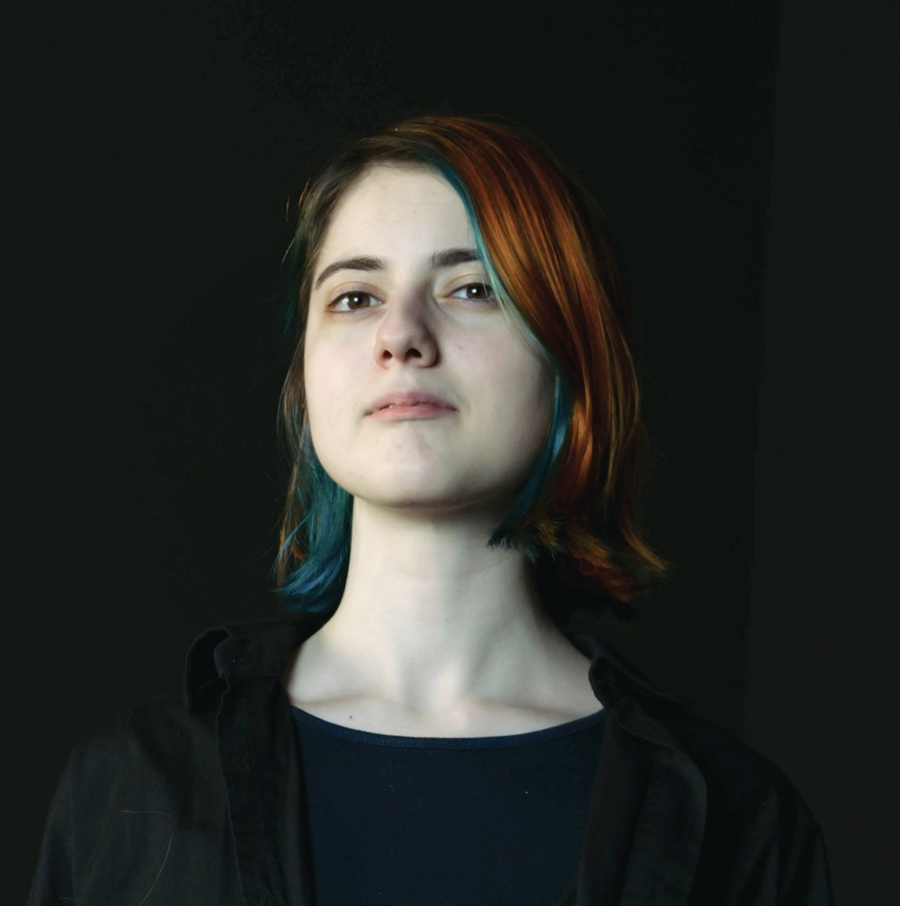
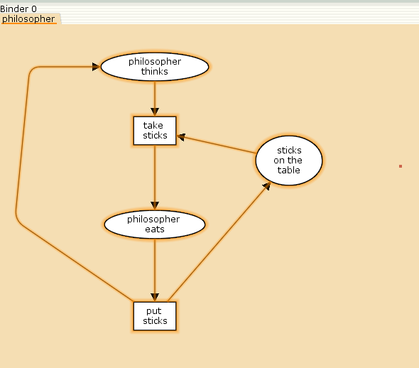
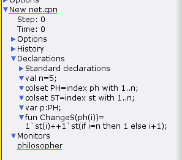
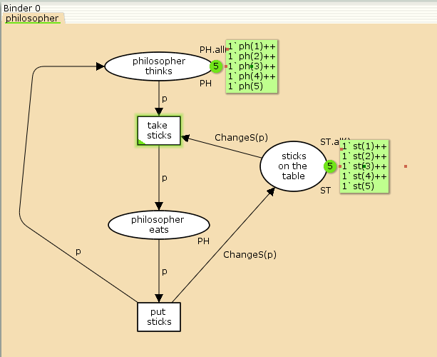
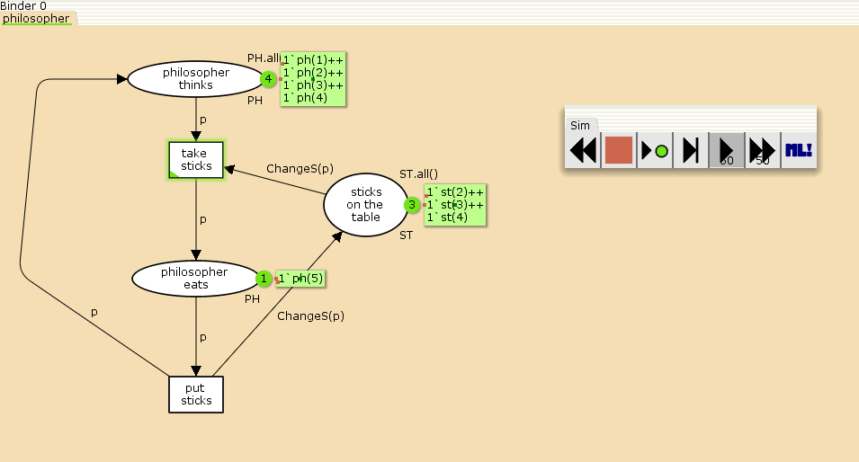
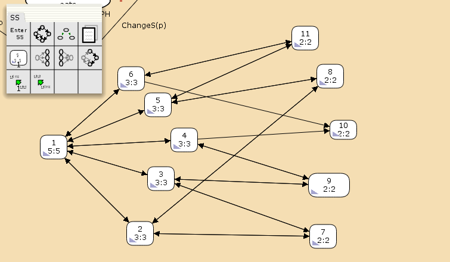

---
## Front matter
lang: ru-RU
title: Лабораторная работа №10
subtitle: Задача об обедающих мудрецах
author:
  - Дворкина Е. В.
institute:
  - Российский университет дружбы народов, Москва, Россия
date: 11 марта 2025

## i18n babel
babel-lang: russian
babel-otherlangs: english

## Formatting pdf
toc: false
toc-title: Содержание
slide_level: 2
aspectratio: 169
section-titles: true
theme: metropolis
header-includes:
 - \metroset{progressbar=frametitle,sectionpage=progressbar,numbering=fraction}
---

## Докладчик

:::::::::::::: {.columns align=center}
::: {.column width="70%"}

  * Дворкина Ева Владимировна
  * студентка
  * группа НФИбд-01-22
  * Российский университет дружбы народов
  * [1132226447@rudn.ru](mailto:1132226447@rudn.ru)
  * <https://github.com/evdvorkina>

:::
::: {.column width="30%"}



:::
::::::::::::::

## Цель работы

Цель данной лабораторной работы реализовать модель задачи об обедающих мудрецах в CPN Tools.

## Задание

- Реализовать модель задачи об обедающих мудрецах  в CPN Tools;
- Вычислить пространство состояний, сформировать отчет о нем и построить граф.

# Выполнение лабораторной работы

## Задача об обедающих мудрецах

Пять мудрецов сидят за круглым столом и могут пребывать в двух состояниях --
думать и есть. Между соседями лежит одна палочка для еды. Для приёма пищи
необходимы две палочки. Необходимо синхронизировать процесс еды так, чтобы мудрецы не умерли с голода.

## Граф сети

{#fig:001 width=55%}

## Декларации модели

{#fig:002 width=40%}

## Готовая модели

{#fig:003 width=55%}

## Работающая модель

{#fig:004 width=70%}

# Упражнение

## Граф пространства состояний

{#fig:005 width=70%}

## Анализ отчета

```
 Statistics
------------------------------------------------------------------------
  State Space
     Nodes:  11
     Arcs:   30
     Secs:   0
     Status: Full

  Scc Graph
     Nodes:  1
     Arcs:   0
     Secs:   0
```

## Анализ отчета

```
 Boundedness Properties
------------------------------------------------------------------------

  Best Integer Bounds
                             Upper      Lower
     philosopher'philosopher_eats 1
                             2          0
     philosopher'philosopher_thinks 1
                             5          3
     philosopher'sticks_on_the_table 1
                             5          1
```
## Анализ отчета

```
  Best Upper Multi-set Bounds
     philosopher'philosopher_eats 1
                         1`ph(1)++
1`ph(2)++
1`ph(3)++
1`ph(4)++
1`ph(5)
```

## Анализ отчета

```
     philosopher'philosopher_thinks 1
                         1`ph(1)++
1`ph(2)++
1`ph(3)++
1`ph(4)++
1`ph(5)
```

## Анализ отчета

```
     philosopher'sticks_on_the_table 1
                         1`st(1)++
1`st(2)++
1`st(3)++
1`st(4)++
1`st(5)
```

## Анализ отчета

```
  Best Lower Multi-set Bounds
     philosopher'philosopher_eats 1
                         empty
     philosopher'philosopher_thinks 1
                         empty
     philosopher'sticks_on_the_table 1
                         empty
```

## Анализ отчета

```
 Home Properties
------------------------------------------------------------------------
  Home Markings
     All
```

## Анализ отчета

```
 Liveness Properties
------------------------------------------------------------------------
  Dead Markings
     None

  Dead Transition Instances
     None

  Live Transition Instances
     All
```

## Анализ отчета

```
 Fairness Properties
------------------------------------------------------------------------
       philosopher'put_sticks 1
                         Impartial
       philosopher'take_stiicks 1
                         Impartial
```

# Выводы

При выполнении данной лабораторной работы я реализовла модель задачи об обедающих мудрецах в CPN Tools.


