---
## Front matter
lang: ru-RU
title: Лабораторная работа №11
subtitle: Модель системы массового обслуживания M|M|1
author:
  - Дворкина Е. В.
institute:
  - Российский университет дружбы народов, Москва, Россия
date: 19 апреля 2025

## i18n babel
babel-lang: russian
babel-otherlangs: english

## Formatting pdf
toc: false
toc-title: Содержание
slide_level: 2
aspectratio: 169
section-titles: true
theme: metropolis
header-includes:
 - \metroset{progressbar=frametitle,sectionpage=progressbar,numbering=fraction}
---

## Докладчик

:::::::::::::: {.columns align=center}
::: {.column width="70%"}

  * Дворкина Ева Владимировна
  * студентка
  * группа НФИбд-01-22
  * Российский университет дружбы народов
  * [1132226447@rudn.ru](mailto:1132226447@rudn.ru)
  * <https://github.com/evdvorkina>

:::
::: {.column width="30%"}


:::
::::::::::::::

# Введение

## Цели и задачи

**Цель работы**

Реализовать в CPN Tools модель системы массового обслуживания M|M|1.

**Задание**

- Реализовать в CPN Tools модель системы массового обслуживания M|M|1.
- Настроить мониторинг параметров моделируемой системы и нарисовать графики очереди.

# Выполнение лабораторной работы

## Постановка задачи

В систему поступает поток заявок двух типов, распределённый по пуассоновскому закону. Заявки поступают в очередь сервера на обработку. Дисциплина очереди FIFO. Если сервер находится в режиме ожидания (нет заявок на сервере), то заявка поступает на обработку сервером

## Граф сети системы обработки заявок в очередь

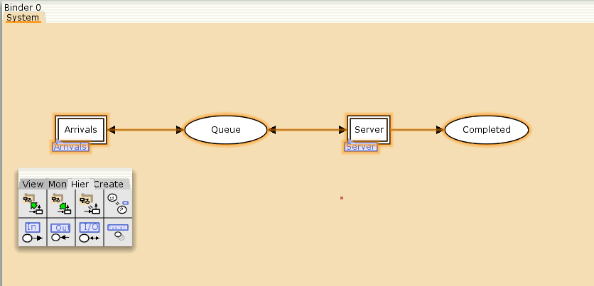{#fig:001 width=70%}

## Граф генератора заявок системы

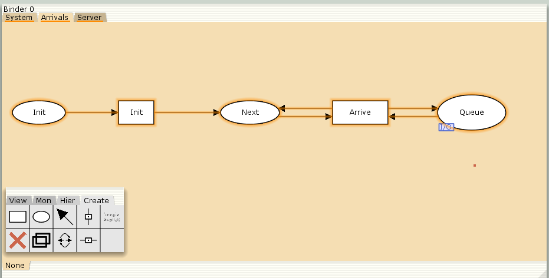{#fig:002 width=70%}

## Граф процесса обработки заявок на сервере системы

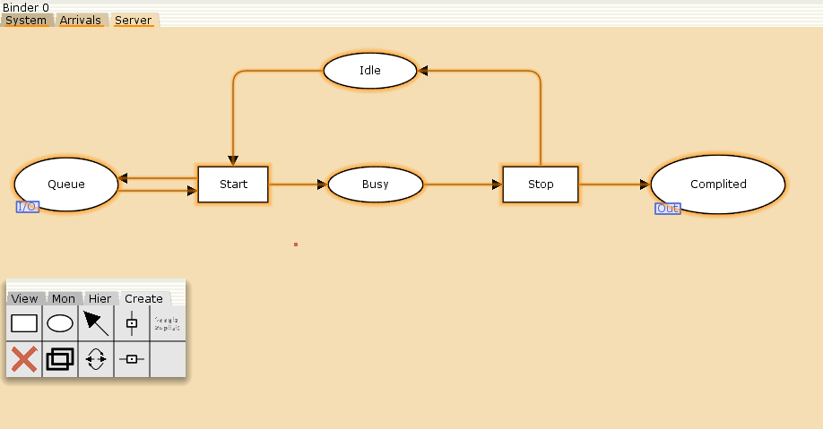{#fig:003 width=70%}

## Количество цветов фишек

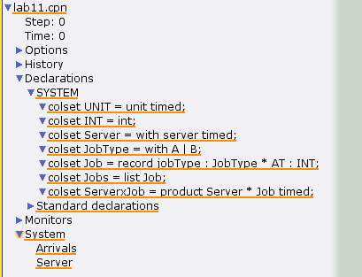{#fig:004 width=50%}

## Переменные модели

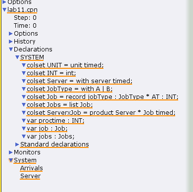{#fig:005 width=45%}

## Функции системы

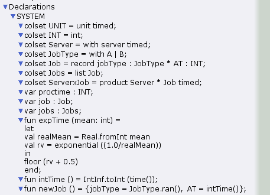{#fig:006 width=50%}

## Параметры модели основного графа

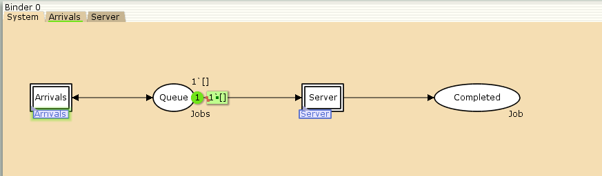{#fig:007 width=70%}

## Параметры модели графа генератора заявок

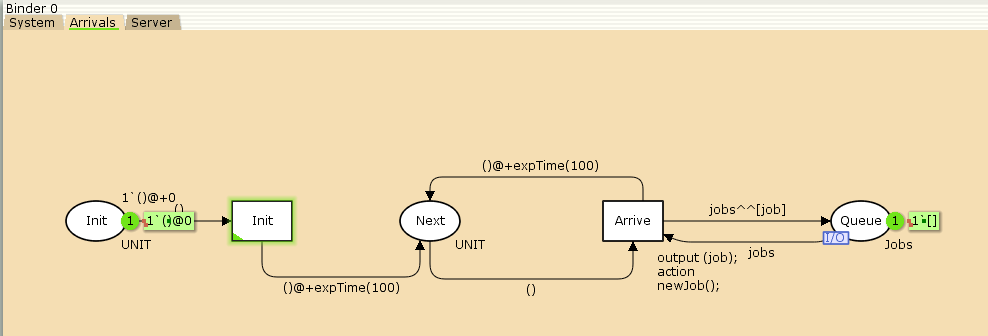{#fig:008 width=70%}

## Параметры модели графа обработчика заявок системы

{#fig:009 width=70%}

## Запуск системы

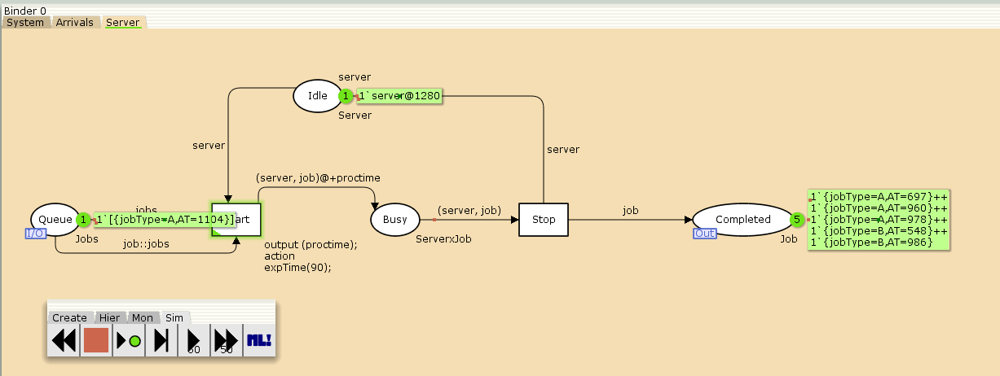{#fig:010 width=70%}

## Мониторинг параметров моделируемой системы (Ostanovka) 

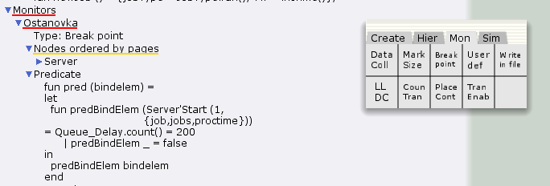{#fig:011 width=70%}

## Мониторинг параметров моделируемой системы (Queue Delay) 

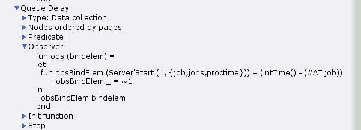{#fig:012 width=70%}

## Мониторинг параметров моделируемой системы (Queue Delay Real) 

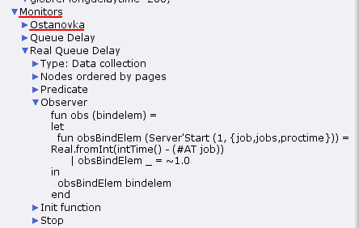{#fig:013 width=70%}

## Мониторинг параметров моделируемой системы (Long Delay Time) 

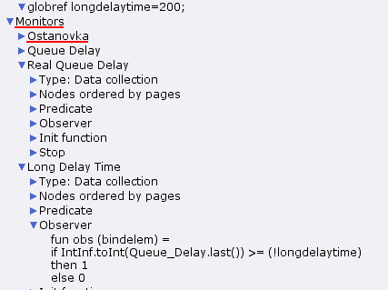{#fig:014 width=50%}

## График в gnuplot

```
#!/usr/bin/gnuplot -persist
# задаём текстовую кодировку,
# тип терминала, тип и размер шрифта
set encoding utf8
set term pdfcairo font "Arial,9"
# задаём выходной файл графика
set out 'qm.pdf'
# задаём стиль линии
set style line 2
plot "Queue_Delay.log" using ($4):($1) with lines
```

## График изменения задержки в очереди

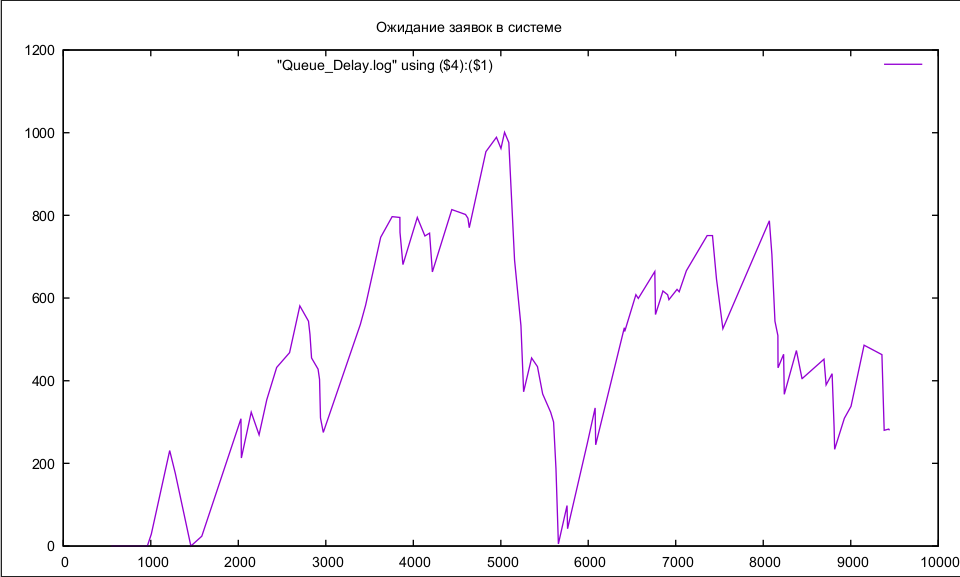{#fig:015 width=70%}

## График в gnuplot

```
#!/usr/bin/gnuplot -persist
# задаём текстовую кодировку,
# тип терминала, тип и размер шрифта
set encoding utf8
set term pdfcairo font "Arial,9"
# задаём выходной файл графика
set out 'qm.pdf'
# задаём стиль линии
set style line 2
plot [0:] [0:1.2] "Long_Delay_Time.log" using ($4):($1) with lines
```
## Периоды времени, когда значения задержки в очереди превышали заданное значение

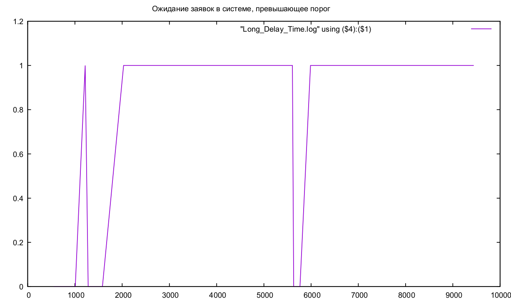{#fig:016 width=70%}

## Выводы

В результате выполнения работы была реализована в CPN Tools модель системы массового обслуживания M|M|1.

