---
## Front matter
title: "Лабораторная работа № 11"
subtitle: "Модель системы массового обслуживания M|M|1"
author: "Дворкина Ева Владимировна"

## Generic otions
lang: ru-RU
toc-title: "Содержание"

## Bibliography
bibliography: bib/cite.bib
csl: pandoc/csl/gost-r-7-0-5-2008-numeric.csl

## Pdf output format
toc: true # Table of contents
toc-depth: 2
lof: true # List of figures
lot: false # List of tables
fontsize: 12pt
linestretch: 1.5
papersize: a4
documentclass: scrreprt
## I18n polyglossia
polyglossia-lang:
  name: russian
  options:
	- spelling=modern
	- babelshorthands=true
polyglossia-otherlangs:
  name: english
## I18n babel
babel-lang: russian
babel-otherlangs: english
## Fonts
mainfont: IBM Plex Serif
romanfont: IBM Plex Serif
sansfont: IBM Plex Sans
monofont: IBM Plex Mono
mathfont: STIX Two Math
mainfontoptions: Ligatures=Common,Ligatures=TeX,Scale=0.94
romanfontoptions: Ligatures=Common,Ligatures=TeX,Scale=0.94
sansfontoptions: Ligatures=Common,Ligatures=TeX,Scale=MatchLowercase,Scale=0.94
monofontoptions: Scale=MatchLowercase,Scale=0.94,FakeStretch=0.9
mathfontoptions:
## Biblatex
biblatex: true
biblio-style: "gost-numeric"
biblatexoptions:
  - parentracker=true
  - backend=biber
  - hyperref=auto
  - language=auto
  - autolang=other*
  - citestyle=gost-numeric
## Pandoc-crossref LaTeX customization
figureTitle: "Рис."
tableTitle: "Таблица"
listingTitle: "Листинг"
lofTitle: "Список иллюстраций"
lotTitle: "Список таблиц"
lolTitle: "Листинги"
## Misc options
indent: true
header-includes:
  - \usepackage{indentfirst}
  - \usepackage{float} # keep figures where there are in the text
  - \floatplacement{figure}{H} # keep figures where there are in the text
---

# Введение

## Цели и задачи

**Цель работы**

Реализовать в CPN Tools модель системы массового обслуживания M|M|1.

**Задание**

- Реализовать в CPN Tools модель системы массового обслуживания M|M|1.
- Настроить мониторинг параметров моделируемой системы и нарисовать графики очереди.

# Теоретическое введение

CPN Tools — специальное программное средство, предназначенное для моделирования иерархических временных раскрашенных сетей Петри. Такие сети 
эквивалентны машине Тьюринга и составляют универсальную алгоритмическую
систему, позволяющую описать произвольный объект [@cpn:bash].

CPN Tools позволяет визуализировать модель с помощью графа сети Петри и при-
менить язык программирования CPN ML (Colored Petri Net Markup Language) для
формализованного описания модели.

Назначение CPN Tools:

- разработка сложных объектов и моделирование процессов в различных прикладных областях, в том числе:

- моделирование производственных и бизнес-процессов;

- моделирование систем управления производственными системами и роботами;

- спецификация и верификация протоколов, оценка пропускной способности сетей
и качества обслуживания, проектирование телекоммуникационных устройств
и сетей.


# Выполнение лабораторной работы

## Постановка задачи

В систему поступает поток заявок двух типов, распределённый по пуассоновскому закону. Заявки поступают в очередь сервера на обработку. Дисциплина очереди FIFO. Если сервер находится в режиме ожидания (нет заявок на сервере), то заявка поступает на обработку сервером [@l:bash]. 

## Реализация модели системы массового обслуживания M|M|1 в CPN Tools

Модель состоит из трех отдельных листов: на первом листе опишем граф системы (рис. [-@fig:001]):, на втором — генератор заявок (рис. [-@fig:002]):, на третьем — сервер обработки заявок (рис. [-@fig:003]).

Сеть имеет 2 позиции (очередь — Queue, обслуженные заявки — Complited) и два перехода (генерировать заявку — Arrivals, передать заявку на обработку серверу -- Server). Переходы имеют сложную иерархическую структуру, задаваемую на отдельных листах модели (с помощью соответствующего инструмента меню -- Hierarchy).

Между переходом Arrivals и позицией Queue, а также между позицией Queue и переходом Server установлена дуплексная связь. Между переходом Server и позицией Complited — односторонняя связь. 

Граф генератора заявок имеет 3 позиции (текущая заявка — Init, следующая заявка — Next, очередь — Queue из листа System) и 2 перехода (Init — определяет распределение поступления заявок по экспоненциальному закону с интенсивностью 100 заявок в единицу времени, Arrive — определяет поступление заявок в очередь).

Граф процесса обработки заявок на сервере имеет 4 позиции (Busy — сервер занят, Idle — сервер в режиме ожидания, Queue и Complited из листа System) и 2 перехода (Start — начать обработку заявки, Stop — закончить обработку заявки).

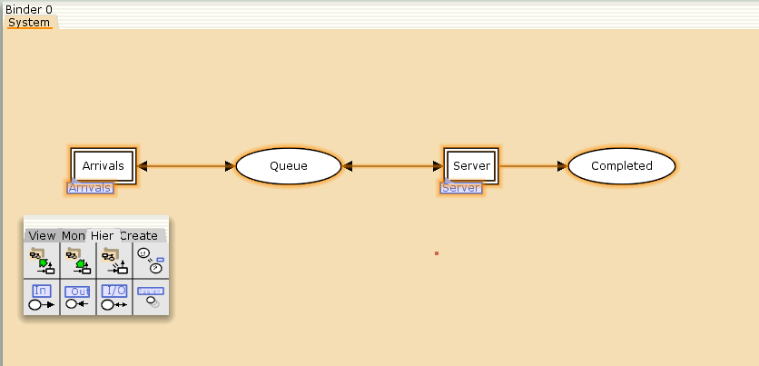{#fig:001 width=70%}

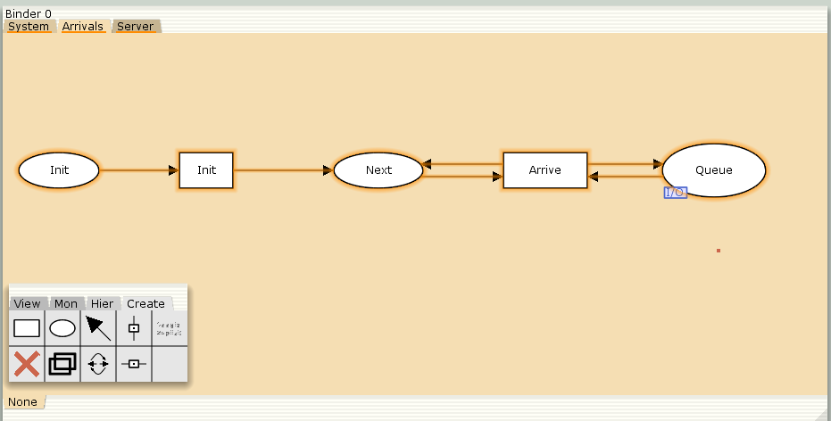{#fig:002 width=70%}

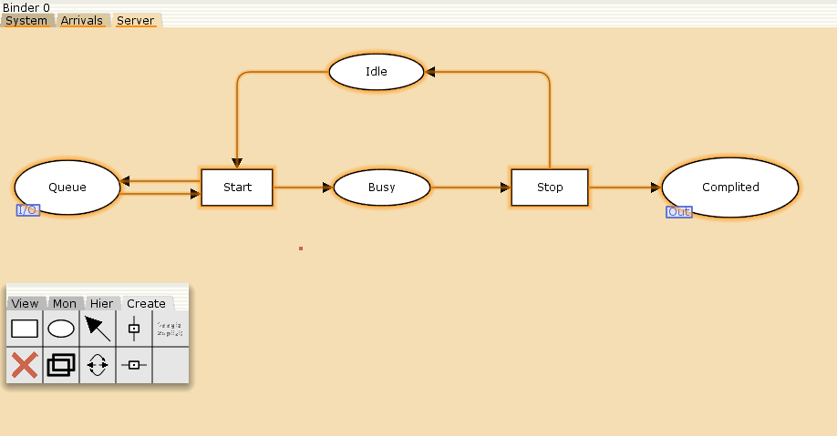{#fig:003 width=70%}

Зададим декларации системы (рис. [-@fig:004]-[-@fig:006]).

Определим множества цветов системы (colorset):
- фишки типа UNIT определяют моменты времени;
- фишки типа INT определяют моменты поступления заявок в систему.
- фишки типа JobType определяют 2 типа заявок — A и B;
- кортеж Job имеет 2 поля: jobType определяет тип работы, соответственно имеет тип JobType, поле AT имеет тип INT и используется для хранения времени нахождения заявки в системе;
- фишки Jobs — список заявок;
- фишки типа ServerxJob — определяют состояние сервера, занятого обработкой заявок.

Переменные модели:
- proctime — определяет время обработки заявки;
- job — определяет тип заявки;
- jobs — определяет поступление заявок в очередь

Функции модели:
- функция expTime описывает генерацию целочисленных значений через интервалы времени, распределённые по экспоненциальному закону;
- функция intTime преобразует текущее модельное время в целое число;
- функция newJob возвращает значение из набора Job — случайный выбор типа заявки (A или B)


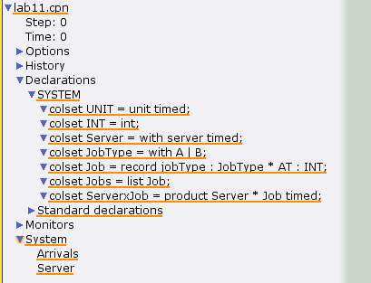{#fig:004 width=70%}

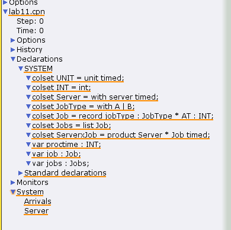{#fig:005 width=70%}

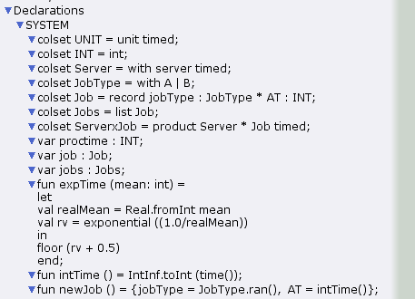{#fig:006 width=70%}

Зададим параметры модели на графах сети.

На листе System (рис. [-@fig:007]):
- у позиции Queue множество цветов фишек — Jobs; начальная маркировка 1`[] определяет, что изначально очередь пуста.
- у позиции Completed множество цветов фишек — Job.

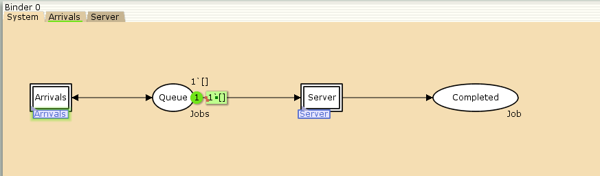{#fig:007 width=70%}

На листе Arrivals (рис. [-@fig:008]):
- у позиции Init: множество цветов фишек — UNIT; начальная маркировка 1`()@0 определяет, что поступление заявок в систему начинается с нулевого момента времени;
- у позиции Next: множество цветов фишек — UNIT;
- на дуге от позиции Init к переходу Init выражение () задаёт генерацию заявок;
- на дуге от переходов Init и Arrive к позиции Next выражение ()@+expTime(100) задаёт экспоненциальное распределение времени между поступлениями заявок;
- на дуге от позиции Next к переходу Arrive выражение () задаёт перемещение фишки;
- на дуге от перехода Arrive к позиции Queue выражение jobs^^[job] задает поступление заявки в очередь;
- на дуге от позиции Queue к переходу Arrive выражение jobs задаёт обратную связь.

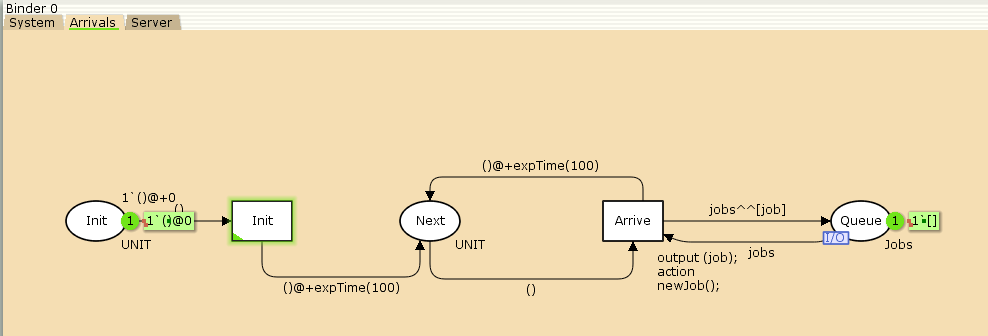{#fig:008 width=70%}

На листе Server (рис. [-@fig:009]):
- у позиции Busy: множество цветов фишек — Server, начальное значение маркировки — 1`server@0 определяет, что изначально на сервере нет заявок наобслуживание;
- у позиции Idle: множество цветов фишек — ServerxJob;
- переход Start имеет сегмент кода output (proctime); action expTime(90); определяющий, что время обслуживания заявки распределено по экспоненциальному закону со средним временем обработки в 90 единиц времени;
- на дуге от позиции Queue к переходу Start выражение job::jobs определяет, что сервер может начать обработку заявки, если в очереди есть хотя бы одна заявка;
- на дуге от перехода Start к позиции Busy выражение (server,job)@+proctime запускает функцию расчёта времени обработки заявки на сервере;
- на дуге от позиции Busy к переходу Stop выражение (server,job) говорит о завершении обработки заявки на сервере;
- на дуге от перехода Stop к позиции Completed выражение job показывает, что заявка считается обслуженной;
- выражение server на дугах от и к позиции Idle определяет изменение состояние сервера (обрабатывает заявки или ожидает);
- на дуге от перехода Start к позиции Queue выражение jobs задаёт обратную связь.

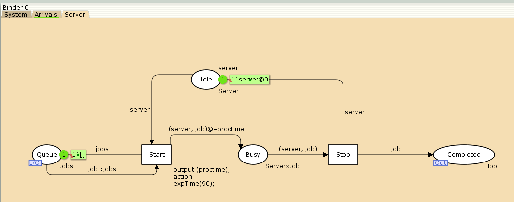{#fig:009 width=70%}

После добавления всех параметров система начинает работать (рис. [-@fig:010])

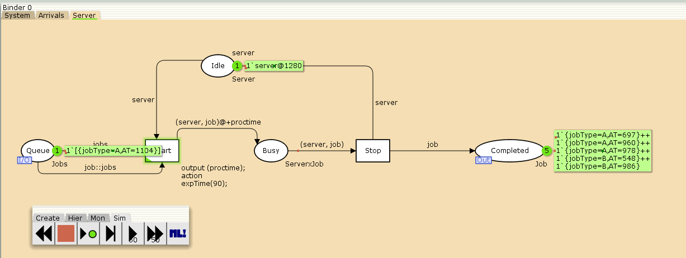{#fig:010 width=70%}

## Мониторинг параметров моделируемой системы

Потребуется палитра Monitoring. Выбираем Break Point (точка останова) и устанавливаем её на переход Start. После этого в разделе меню Monitor появится новый подраздел, который назовём Ostanovka. В этом подразделе необходимо внести изменения в функцию Predicate, которая будет выполняться при запуске монитора. Зададим число шагов, через которое будем останавливать мониторинг. Для этого true заменим на Queue_Delay.count()=200 (рис. [-@fig:011]). 

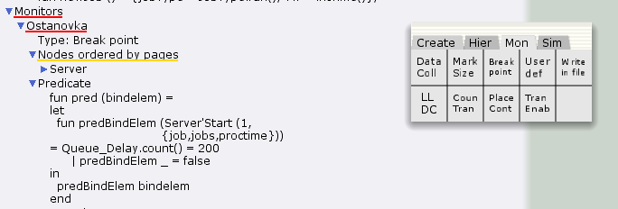{#fig:011 width=70%}

Необходимо определить конструкцию Queue_Delay.count() . С помощью палитры Monitoring выбираем Data Call и устанавливаем на переходе Start. Появившийся в меню монитор называем Queue Delay (без подчеркивания). Функция Observer выполняется тогда, когда функция предикатора выдаёт значение true. По умолчанию функция выдаёт 0 или унарный минус (~1), подчёркивание обозначает произвольный аргумент. Изменим её так, чтобы получить значение задержки в очереди. Для этого необходимо из текущего времени intTime() вычесть временную метку AT , означающую приход заявки в очередь (рис. [-@fig:012])..

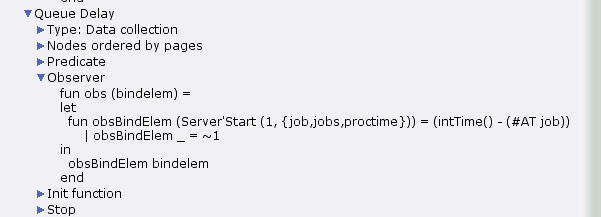{#fig:012 width=70%}

Посчитаем задержку в действительных значениях. С помощью палитры Monitoring
выбираем Data Call и устанавливаем на переходе Start. Появившийся в меню
монитор называем Queue Delay Real. Функцию Observer изменим следующим образом (рис. [-@fig:013]):

По сравнению с предыдущим описанием функции добавлено преобразование значения функции из целого в действительное, при этом obsBindElem _ принимает значение ~1.0. После запуска программы на выполнение в каталоге с кодом программы появится файл Queue_Delay_Real.log с содержимым, аналогичным содержимому файла Queue_Delay.log, но значения задержки имеют действительный тип.

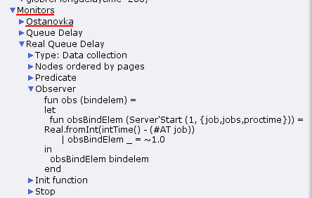{#fig:013 width=70%}

Посчитаем, сколько раз задержка превысила заданное значение. С помощью палитры Monitoring выбираем Data Call и устанавливаем на переходе Start. Монитор называем Long Delay Time.
Функцию Observer изменим следующим образом(рис. [-@fig:014]):

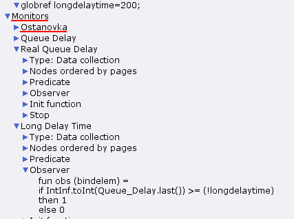{#fig:014 width=70%}

После запуска программы на выполнение в каталоге с кодом программы появится файл Queue_Delay.log, содержащий в первой колонке — значение задержки очереди, во второй — счётчик, в третьей — шаг, в четвёртой — время. С помощью gnuplot можно построить график значений задержки в очереди (рис. [-@fig:015]), выбрав по оси x время, а по оси y — значения задержки:

```
#!/usr/bin/gnuplot -persist
# задаём текстовую кодировку,
# тип терминала, тип и размер шрифта
set encoding utf8
set term pdfcairo font "Arial,9"
# задаём выходной файл графика
set out 'qm.pdf'
# задаём стиль линии
set style line 2
plot "Queue_Delay.log" using ($4):($1) with lines
```

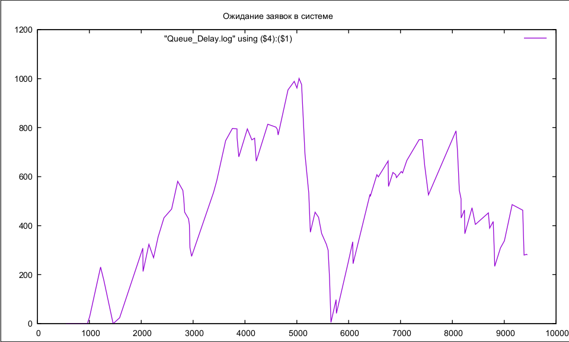{#fig:015 width=70%}

С помощью gnuplot можно построить график (рис. [-@fig:016]), демонстрирующий, в какие периоды времени значения задержки в очереди превышали заданное значение 200.

```
#!/usr/bin/gnuplot -persist
# задаём текстовую кодировку,
# тип терминала, тип и размер шрифта
set encoding utf8
set term pdfcairo font "Arial,9"
# задаём выходной файл графика
set out 'qm.pdf'
# задаём стиль линии
set style line 2
plot [0:] [0:1.2] "Long_Delay_Time.log" using ($4):($1) with lines
```

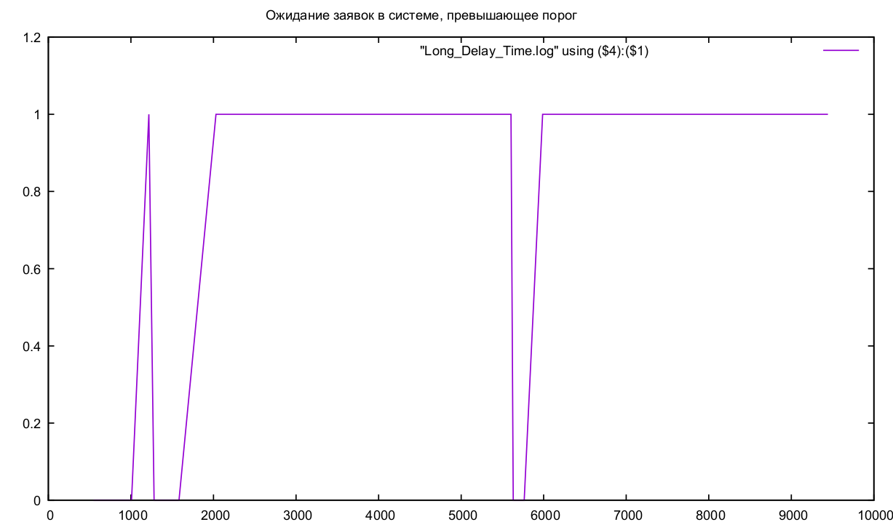{#fig:016 width=70%}

# Выводы

В результате выполнения работы была реализована в CPN Tools модель системы массового обслуживания M|M|1.

# Список литературы{.unnumbered}

::: {#refs}
:::
