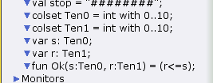
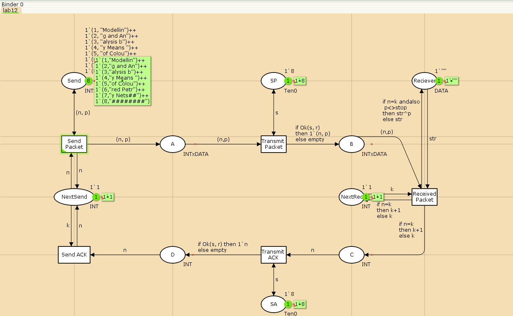
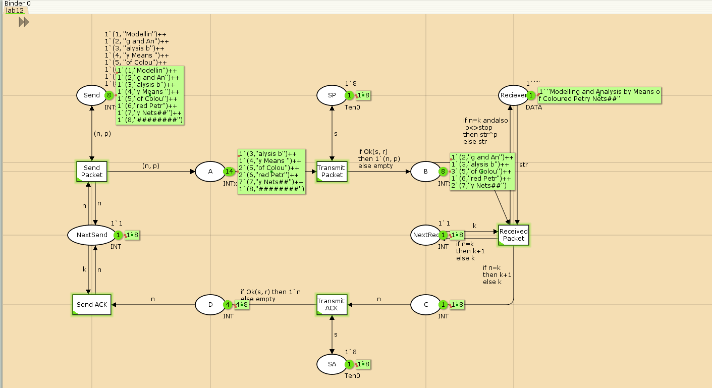
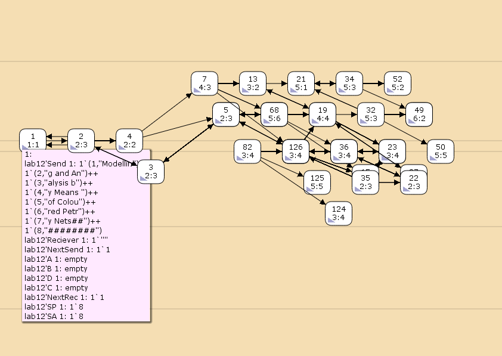

---
## Front matter
lang: ru-RU
title: Лабораторная работа №12
subtitle: Пример моделирования простого протокола передачи данных
author:
  - Дворкина Е. В.
institute:
  - Российский университет дружбы народов, Москва, Россия
date: 26 апреля 2025

## i18n babel
babel-lang: russian
babel-otherlangs: english

## Formatting pdf
toc: false
toc-title: Содержание
slide_level: 2
aspectratio: 169
section-titles: true
theme: metropolis
header-includes:
 - \metroset{progressbar=frametitle,sectionpage=progressbar,numbering=fraction}
---

## Докладчик

:::::::::::::: {.columns align=center}
::: {.column width="70%"}

  * Дворкина Ева Владимировна
  * студентка
  * группа НФИбд-01-22
  * Российский университет дружбы народов
  * [1132226447@rudn.ru](mailto:1132226447@rudn.ru)
  * <https://github.com/evdvorkina>

:::
::: {.column width="30%"}


:::
::::::::::::::

## Цели и задачи

**Цель работы**

Реализовать простой протокол передачи данных в CPN Tools.

**Задание**

- Реализовать простой протокол передачи данных в CPN Tools.

- Вычислить пространство состояний, сформировать отчет о нем и построить граф.

## Декларации модели

{#fig:001 width=70%}

## Декларации модели

{#fig:002 width=70%}

## Граф и параметры модели

{#fig:003 width=70%}

## Запуск модели

{#fig:004 width=70%}

## Упражнение. Отчет по пространству состояний

```
  State Space
     Nodes:  20711
     Arcs:   333468
     Secs:   300
     Status: Partial

  Scc Graph
     Nodes:  10841
     Arcs:   278229
     Secs:   13
```

## Отчет по пространству состояний 

```
  Best Integer Bounds
                             Upper      Lower
     lab12'A 1               22         0
     lab12'B 1               10         0
     lab12'C 1               7          0
     lab12'D 1               5          0
     lab12'NextRec 1         1          1
     lab12'NextSend 1        1          1
     lab12'Reciever 1        1          1
     lab12'SA 1              1          1
     lab12'SP 1              1          1
     lab12'Send 1            8          8
```

## Отчет по пространству состояний

```
  Best Upper Multi-set Bounds
     lab12'A 1           22`(1,"Modellin")++
16`(2,"g and An")++
11`(3,"alysis b")++
6`(4,"y Means ")++
1`(5,"of Colou")
     lab12'B 1           10`(1,"Modellin")++
8`(2,"g and An")++
5`(3,"alysis b")++
3`(4,"y Means ")

```

## Отчет по пространству состояний

```
  Best Lower Multi-set Bounds
     lab12'A 1           empty
     lab12'B 1           empty
     lab12'C 1           empty
     lab12'D 1           empty
     lab12'NextRec 1     empty
     lab12'NextSend 1    empty
     lab12'Reciever 1    empty
     lab12'SA 1          1`8
     lab12'SP 1          1`8
     lab12'Send 1        1`(1,"Modellin")++1`(2,"g and An")++1`(3,"alysis b")++1`(4,"y Means ")++1`(5,"of Colou")++1`(6,"red Petr")++1`(7,"y Nets##")++1`(8,"########")

```

## Отчет по пространству состояний

```
  Home Markings
     None

  Dead Markings
     7264 [20711,20710,20709,20708,20707,...]

  Dead Transition Instances
     None

  Live Transition Instances
     None
```

## Отчет по пространству состояний

```

 Fairness Properties
       lab12'Received_Packet 1    No Fairness
       lab12'Send_ACK 1       No Fairness
       lab12'Send_Packet 1    Impartial
       lab12'Transmit_ACK 1   No Fairness
       lab12'Transmit_Packet 1       Impartial
```

## Упражнение. Начало графа пространства состояний

{#fig:005 width=70%}


## Выводы

В результате выполнения работы был реализован в CPN Tools простой протокол передачи данных и проведен анализ его пространства состояний.


