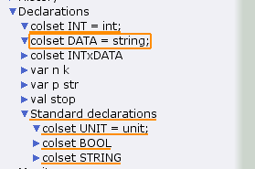
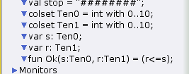
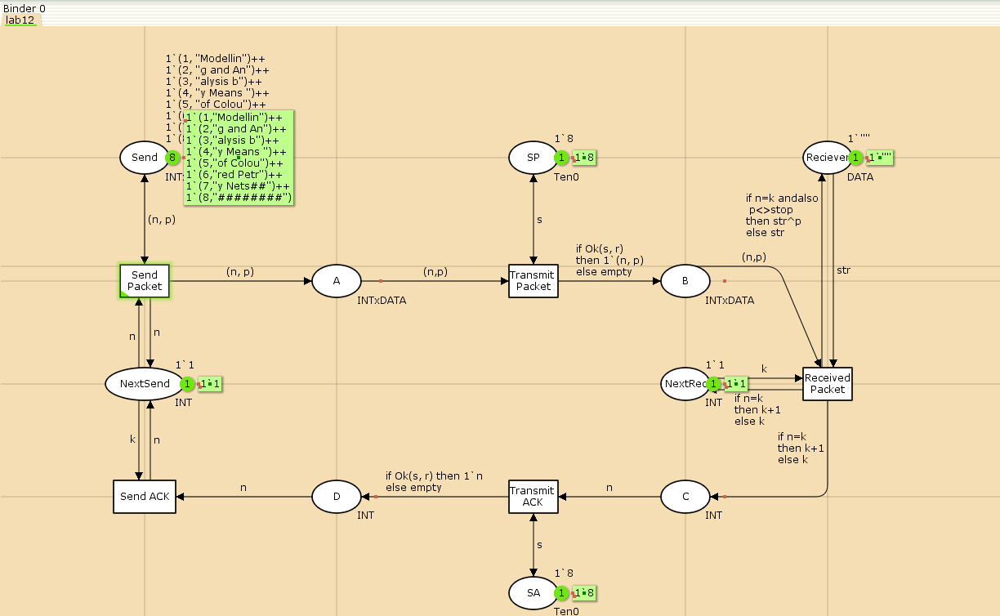
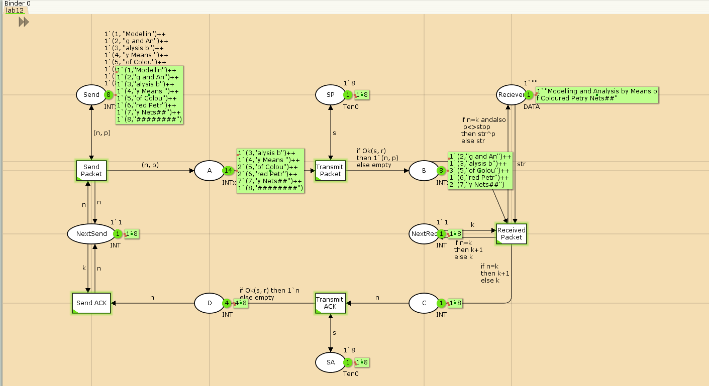
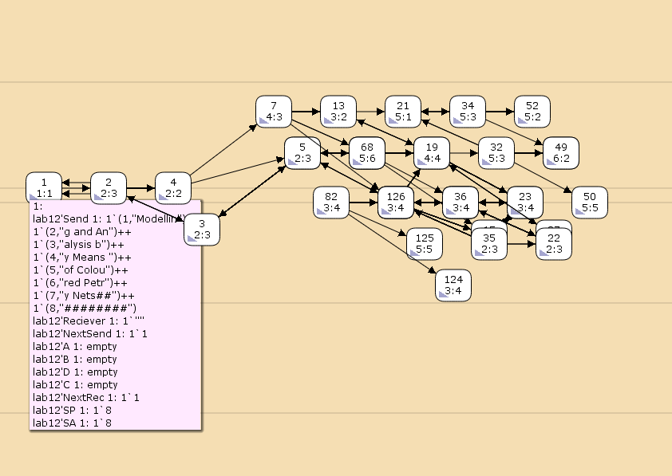

---
## Front matter
title: "Лабораторная работа №12"
subtitle: "Пример моделирования простого протокола передачи данных"
author: "Дворкина Ева Владимировна"

## Generic otions
lang: ru-RU
toc-title: "Содержание"

## Bibliography
bibliography: bib/cite.bib
csl: pandoc/csl/gost-r-7-0-5-2008-numeric.csl

## Pdf output format
toc: true # Table of contents
toc-depth: 2
lof: true # List of figures
lot: false # List of tables
fontsize: 12pt
linestretch: 1.5
papersize: a4
documentclass: scrreprt
## I18n polyglossia
polyglossia-lang:
  name: russian
  options:
	- spelling=modern
	- babelshorthands=true
polyglossia-otherlangs:
  name: english
## I18n babel
babel-lang: russian
babel-otherlangs: english
## Fonts
mainfont: IBM Plex Serif
romanfont: IBM Plex Serif
sansfont: IBM Plex Sans
monofont: IBM Plex Mono
mathfont: STIX Two Math
mainfontoptions: Ligatures=Common,Ligatures=TeX,Scale=0.94
romanfontoptions: Ligatures=Common,Ligatures=TeX,Scale=0.94
sansfontoptions: Ligatures=Common,Ligatures=TeX,Scale=MatchLowercase,Scale=0.94
monofontoptions: Scale=MatchLowercase,Scale=0.94,FakeStretch=0.9
mathfontoptions:
## Biblatex
biblatex: true
biblio-style: "gost-numeric"
biblatexoptions:
  - parentracker=true
  - backend=biber
  - hyperref=auto
  - language=auto
  - autolang=other*
  - citestyle=gost-numeric
## Pandoc-crossref LaTeX customization
figureTitle: "Рис."
tableTitle: "Таблица"
listingTitle: "Листинг"
lofTitle: "Список иллюстраций"
lotTitle: "Список таблиц"
lolTitle: "Листинги"
## Misc options
indent: true
header-includes:
  - \usepackage{indentfirst}
  - \usepackage{float} # keep figures where there are in the text
  - \floatplacement{figure}{H} # keep figures where there are in the text
---

# Введение

## Цели и задачи

**Цель работы**

Реализовать простой протокол передачи данных в CPN Tools.

**Задание**

- Реализовать простой протокол передачи данных в CPN Tools.

- Вычислить пространство состояний, сформировать отчет о нем и построить граф.

# Теоретическое введение

CPN Tools — специальное программное средство, предназначенное для моделирования иерархических временных раскрашенных сетей Петри. Такие сети эквивалентны машине Тьюринга и составляют универсальную алгоритмическую систему, позволяющую описать произвольный объект [@cpn:bash].

CPN Tools позволяет визуализировать модель с помощью графа сети Петри и применить язык программирования CPN ML (Colored Petri Net Markup Language) для формализованного описания модели.

Назначение CPN Tools:

- разработка сложных объектов и моделирование процессов в различных прикладных областях, в том числе:

- моделирование производственных и бизнес-процессов;

- моделирование систем управления производственными системами и роботами;

- спецификация и верификация протоколов, оценка пропускной способности сетей и качества обслуживания, проектирование телекоммуникационных устройств и сетей.

# Выполнение лабораторной работы

Основные состояния: источник (Send), получатель (Receiver) [@l:bash].

Действия (переходы): отправить пакет (Send Packet), отправить подтверждение (Send ACK).

Промежуточное состояние: следующий посылаемый пакет (NextSend).

Зададим декларации модели (рис. [-@fig:001], [-@fig:002]).

Определим множества фишек:

- DATA - передаваемые строки
- INTxDATA - неименованный кортеж с номеров передаваемого пакета и самой строкой

Определим переменные:

- n, k типа int, обозначающие номера передаваемого и следующего пакета
- p типа str - передаваемая строка
- stop типа DATA - стоп-символ из 8 решеток.

Чтобы сделать передачу данных ненадежной, добавим вероятность потери пакетов. 

В декларациях добавим фишки: Ten0, Ten1 с перечисляемым типом, которые принимают значение от 0 до 10.

Переменные s, v типов Ten0, Ten1 соответствено, функция Ok которая будет определять, сработал ли сброс пакета или нет (если вернула False, то r>s и пакет теряется).

{#fig:001 width=70%}

{#fig:002 width=70%}

Состояние Send имеет тип INTxDATA и начальную маркировку в соответствии с передаваемой фразой.

Стоповый байт ("########") определяет, что сообщение закончилось. Состояние Receiver имеет тип DATA и начальное значение 1'"" (т.е. пустая строка, поскольку состояние собирает данные и номер пакета его не интересует). Состояние NextSend имеет тип INT и начальное значение 1'1. Поскольку пакеты представляют собой кортеж, состоящий из номера пакета и строки, то выражение у двусторонней дуги будет иметь значение (n,p). Кроме того, необходимо взаимодействовать с состоянием, которое будет сообщать номер следующего посылаемого пакета данных. Поэтому переход Send Packet соединяем с состоянием NextSend двумя дугами с выражениями n. Также необходимо получать информацию с подтверждениями о получении данных. От перехода Send Packet к состоянию NextSend дуга с выражением n, обратно -- k.

Зададим промежуточные состояния (A, B с типом INTxDATA, C, D с типом INTxDATA) для переходов (рис. 12.2): передать пакет Transmit Packet (передаём (n,p)), передать подтверждение Transmit ACK (передаём целое число k). Добавляем переход получения пакета (Receive Packet). От состояния Receiver идёт дуга к переходу Receive Packet со значением той строки (str), которая находится в состоянии Receiver. Обратно: проверяем, что номер пакета новый и строка не равна стоп-биту. Если это так, то строку добавляем к полученным данным. Кроме того, необходимо знать, каким будет номер следующего пакета. Для этого добавляем состояние NextRec с типом INT и начальным значением 1'1 (один пакет), связываем его дугами с переходом Receive Packet. Причём к переходу идёт дуга с выражением k, от перехода — if n=k then k+1 else k. Связываем состояния B и C с переходом Receive Packet. От состояния B к переходу Receive Packet — выражение (n,p), от перехода Receive Packet к состоянию C — выражение if n=k then k+1 else k. От перехода Receive Packet к состоянию Receiver: if n=k andalso p<>stop then str^p else str. (если n=k и мы не получили стоп-байт, то направляем в состояние строку и к ней прикрепляем p, в противном случае посылаем только строку).  На переходах Transmit Packet и Transmit ACK зададим потерю пакетов. Для этого на интервале от 0 до 10 зададим пороговое значение и, если передаваемое значение превысит этот порог, то считаем, что произошла потеря пакета, если нет, то передаём пакет дальше. Для этого задаём вспомогательные состояния SP и SA с типом Ten0 и начальным значением 1`8, соединяем с соответствующими переходами (рис. [-@fig:003]):

{#fig:003 width=70%}

Таким образом, получим модель простого протокола передачи данных (рис. [-@fig:004]).
Пакет последовательно проходит: состояние Send, переход Send Packet, состояние A, с некоторой вероятностью переход Transmit Packet, состояние B, попадает
на переход Receive Packet, где проверяется номер пакета и если нет совпадения,
то пакет направляется в состояние Received, а номер пакета передаётся последовательно в состояние C, с некоторой вероятностью в переход Transmit ACK,
далее в состояние D, переход Receive ACK, состояние NextSend (увеличивая на 1
номер следующего пакета), переход Send Packet. Так продолжается до тех пор,
пока не будут переданы все части сообщения. Последней будет передана стоп-последовательность.

{#fig:004 width=70%}

## Упражнение

Вычислим пространство состояний. Прежде, чем пространство состояний может быть вычислено и проанализировано, необходимо сформировать код пространства состояний. Этот код создается, когда используется инструмент Войти в пространство состояний. Вход в пространство состояний занимает некоторое время. Затем, если ожидается, что пространство состояний будет небольшим, можно просто применить инструмент Вычислить пространство состояний к листу, содержащему страницу сети. Сформируем отчёт о пространстве состояний и проанализируем его.  Чтобы сохранить отчет, необходимо применить инструмент Сохранить отчет о пространстве состояний к листу, содержащему страницу сети и ввести имя файла отчета.

Из него можно увидеть:

- 20711 состояний и 333468 переходов между ними.

- Указаны границы значений для каждого элемента: промежуточные состояния A, B, C (наибольшая верхняя граница у A, так как после него пакеты отбрасываются. У следующего состояния B верхняя граница - 10, вспомогательные состояния SP, SA, NextRec, NextSend, Receiver (в них может находиться только один пакет) и состояние Send(в нем хранится только 8 элементов, так как мы задали их в начале и с ними никаких изменений не происходит).

- Указаны границы в виде мультимножеств.

- Маркировка home ни для какого состояния, так как из-за вероятности потери пакетов нет таких состояний, в которые можно попасть из любого.

- Маркировка dead равная 7264 [20711,20710,20709,20708,20707,...] -- это состояния, в которых нет включенных переходов. 

- В конце указано, что бесконечно часто могут происходит(Impartial Transition Instances) события Send_Packet и Transmit_Packet (они позволяют сети всегда передавать данные). Также указаны Transition Instances with No Fairness: Send_ACK, Transmit_ACK, Received_Packet. В них возможны бесконечные последовательности, но они не срабатывают из-за условий перехода.

```
CPN Tools state space report for:

/home/openmodelica/Desktop/lab12.cpn

Report generated: Mon Apr 21 04:32:04 2025

 Statistics

------------------------------------------------------------------------


  State Space

     Nodes:  20711

     Arcs:   333468

     Secs:   300

     Status: Partial


  Scc Graph

     Nodes:  10841

     Arcs:   278229

     Secs:   13


 Boundedness Properties

------------------------------------------------------------------------


  Best Integer Bounds

                             Upper      Lower

     lab12'A 1               22         0

     lab12'B 1               10         0

     lab12'C 1               7          0

     lab12'D 1               5          0

     lab12'NextRec 1         1          1

     lab12'NextSend 1        1          1

     lab12'Reciever 1        1          1

     lab12'SA 1              1          1

     lab12'SP 1              1          1

     lab12'Send 1            8          8


  Best Upper Multi-set Bounds

     lab12'A 1           22`(1,"Modellin")++

16`(2,"g and An")++

11`(3,"alysis b")++

6`(4,"y Means ")++

1`(5,"of Colou")

     lab12'B 1           10`(1,"Modellin")++

8`(2,"g and An")++

5`(3,"alysis b")++

3`(4,"y Means ")

     lab12'C 1           7`2++

5`3++

3`4++

2`5

     lab12'D 1           5`2++

4`3++

2`4++

1`5

     lab12'NextRec 1     1`1++

1`2++

1`3++

1`4++

1`5

     lab12'NextSend 1    1`1++

1`2++

1`3++

1`4++

1`5

     lab12'Reciever 1    1`""++

1`"Modellin"++

1`"Modelling and An"++

1`"Modelling and Analysis b"++

1`"Modelling and Analysis by Means "

     lab12'SA 1          1`8

     lab12'SP 1          1`8

     lab12'Send 1        1`(1,"Modellin")++

1`(2,"g and An")++

1`(3,"alysis b")++

1`(4,"y Means ")++

1`(5,"of Colou")++

1`(6,"red Petr")++

1`(7,"y Nets##")++

1`(8,"########")


  Best Lower Multi-set Bounds

     lab12'A 1           empty

     lab12'B 1           empty

     lab12'C 1           empty

     lab12'D 1           empty

     lab12'NextRec 1     empty

     lab12'NextSend 1    empty

     lab12'Reciever 1    empty

     lab12'SA 1          1`8

     lab12'SP 1          1`8

     lab12'Send 1        1`(1,"Modellin")++

1`(2,"g and An")++

1`(3,"alysis b")++

1`(4,"y Means ")++

1`(5,"of Colou")++

1`(6,"red Petr")++

1`(7,"y Nets##")++

1`(8,"########")


 Home Properties

------------------------------------------------------------------------

  Home Markings

     None


 Liveness Properties

------------------------------------------------------------------------

  Dead Markings

     7264 [20711,20710,20709,20708,20707,...]


  Dead Transition Instances

     None


  Live Transition Instances

     None


 Fairness Properties

------------------------------------------------------------------------

       lab12'Received_Packet 1

                         No Fairness

       lab12'Send_ACK 1       No Fairness

       lab12'Send_Packet 1    Impartial

       lab12'Transmit_ACK 1   No Fairness

       lab12'Transmit_Packet 1

                         Impartial


```

Сформируем начало графа пространства состояний, так как их много(рис. [-@fig:005]):

{#fig:005 width=70%}


# Выводы

В результате выполнения работы был реализован в CPN Tools простой протокол передачи данных и проведен анализ его пространства состояний.

# Список литературы{.unnumbered}

::: {#refs}
:::
