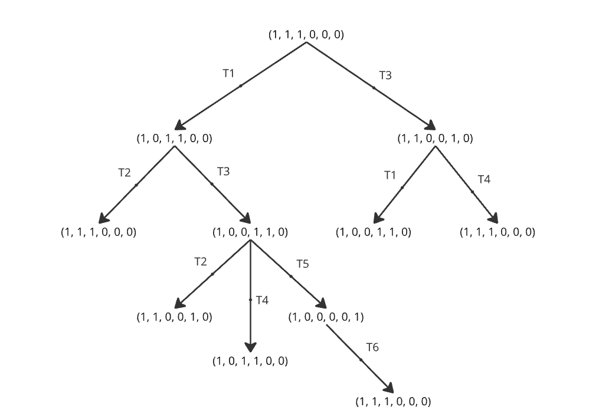
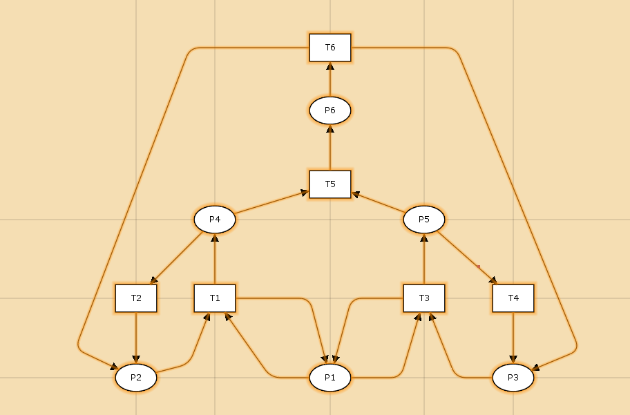
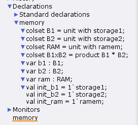
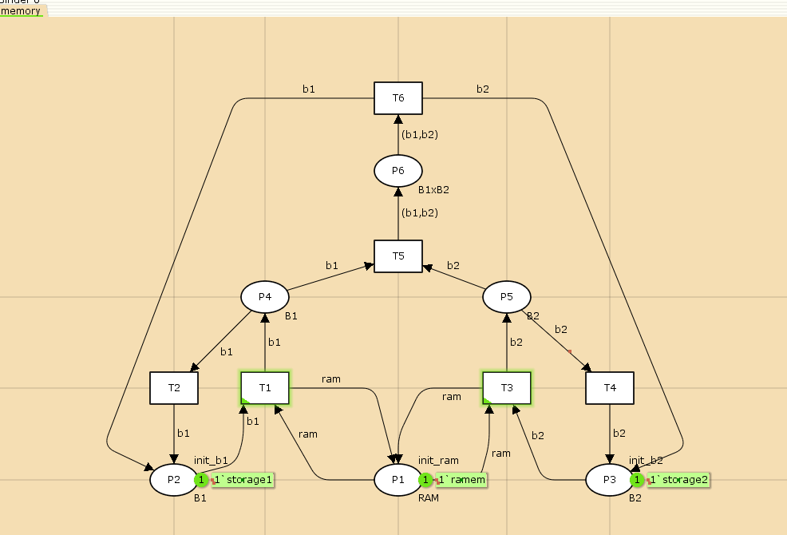
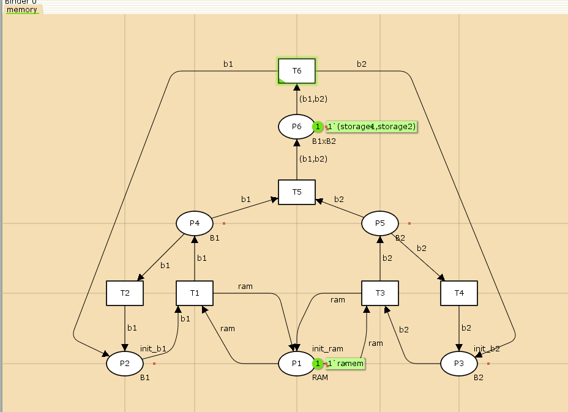
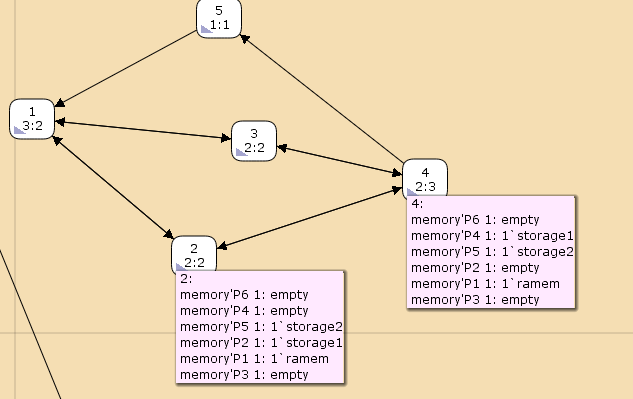

---
## Front matter
lang: ru-RU
title: Лабораторная работа №13
subtitle: Задание для самостоятельного выполнения
author:
  - Дворкина Е. В.
institute:
  - Российский университет дружбы народов, Москва, Россия
date: 3 мая 2025

## i18n babel
babel-lang: russian
babel-otherlangs: english

## Formatting pdf
toc: false
toc-title: Содержание
slide_level: 2
aspectratio: 169
section-titles: true
theme: metropolis
header-includes:
 - \metroset{progressbar=frametitle,sectionpage=progressbar,numbering=fraction}
---

## Докладчик

:::::::::::::: {.columns align=center}
::: {.column width="70%"}

  * Дворкина Ева Владимировна
  * студентка
  * группа НФИбд-01-22
  * Российский университет дружбы народов
  * [1132226447@rudn.ru](mailto:1132226447@rudn.ru)
  * <https://github.com/evdvorkina>

:::
::: {.column width="30%"}


:::
::::::::::::::

## Цели и задачи

1. Провести анализ сети. Определить, является ли сеть безопасной, ограниченной, сохраняющей, имеются ли
тупики 
2. Промоделировать сеть Петри с помощью CPNTools.
3. Вычислить пространство состояний. Сформировать отчёт о пространстве состояний и проанализировать его.Построить граф пространства состояний.

## Схема модели

Заявка gоступает в ОП, передается на прибор пространстве состоянийдля обработки. После этого заявка может равновероятно обратиться к оперативной памяти или к одному из двух внешних запоминающих устройств (B1 и B2). Прежде чем записать информацию на
внешний накопитель, необходимо вторично обратиться к центральному процессору, определяющему состояние накопителя и выдающему необходимую управляющую информацию. Накопители (B1 и B2) могут работать в 3-х режимах:

1) B1 — занят, B2 — свободен;
2) B2 — свободен, B1 — занят;
3) B1 — занят, B2 — занят.

## Описание модели

P1 — состояние оперативной памяти (свободна / занята);

P2 — состояние внешнего запоминающего устройства B1 (свободно / занято);

P3 — состояние внешнего запоминающего устройства B2 (свободно / занято);

P4 — работа на ОП и B1 закончена;

P5 — работа на ОП и B2 закончена;

P6 — работа на ОП, B1 и B2 закончена;

## Описание модели

T1 — CPU работает только с RAM и B1;

T2 — обрабатываются данные из RAM и с B1 переходят на устройство вывода;

T3 — CPU работает только с RAM и B2;

T4 — обрабатываются данные из RAM и с B2 переходят на устройство вывода;

T5 — CPU работает только с RAM и с B1, B2;

T6 — обрабатываются данные из RAM, B1, B2 и переходят на устройство вывода.

## Анализ сети Петри

{#fig:001 width=70%}

## Анализ сети Петри

- безопасна

- ограничена

- не имеет тупиков

- не является сохраняюще

## Реализация модели в CPN Tools (схема)

{#fig:002 width=70%}

## Реализация модели в CPN Tools (декларации)

{#fig:003 width=50%}

## Реализация модели в CPN Tools (модель)

{#fig:004 width=70%}

## Реализация модели в CPN Tools (запуск)

{#fig:005 width=50%}

## Граф пространства состояний

{#fig:006 width=70%}

## Отчет о пространстве состояний

```
  State Space
     Nodes:  5
     Arcs:   10
     Secs:   0
     Status: Full
```

## Отчет о пространстве состояний
 
```
  Best Integer Bounds
                             Upper      Lower
     memory'P1 1             1          1
     memory'P2 1             1          0
     memory'P3 1             1          0
     memory'P4 1             1          0
     memory'P5 1             1          0
     memory'P6 1             1          0
```

## Отчет о пространстве состояний

```
  Best Upper Multi-set Bounds
     memory'P1 1         1`ramem
     memory'P2 1         1`storage1
     memory'P3 1         1`storage2
     memory'P4 1         1`storage1
     memory'P5 1         1`storage2
     memory'P6 1         1`(storage1,storage2)
```

## Отчет о пространстве состояний

```
  Best Lower Multi-set Bounds
     memory'P1 1         1`ramem
     memory'P2 1         empty
     memory'P3 1         empty
     memory'P4 1         empty
     memory'P5 1         empty
     memory'P6 1         empty
```

## Отчет о пространстве состояний

```
 Home Properties
------------------------------------------------------------------------

  Home Markings
     All


 Liveness Properties
------------------------------------------------------------------------

  Dead Markings
     None

  Dead Transition Instances
     None

  Live Transition Instances
     All
```

## Отчет о пространстве состояний

```

 Fairness Properties
------------------------------------------------------------------------
       memory'T1 1            No Fairness
       memory'T2 1            No Fairness
       memory'T3 1            No Fairness
       memory'T4 1            No Fairness
       memory'T5 1            Just
       memory'T6 1            Fair
```

## Выводы

В результате выполнения данной лабораторной работы я выполнила задание для самостоятельного выполнения, а именно провела анализ сети Петри, построила сеть в CPN Tools, построила граф состояний и провела его анализ.

