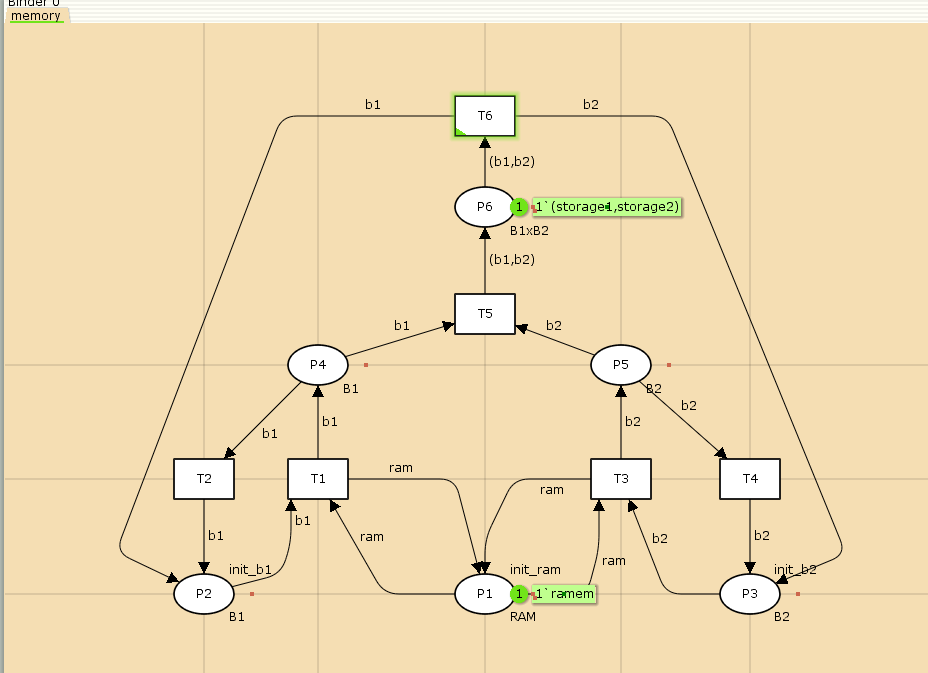
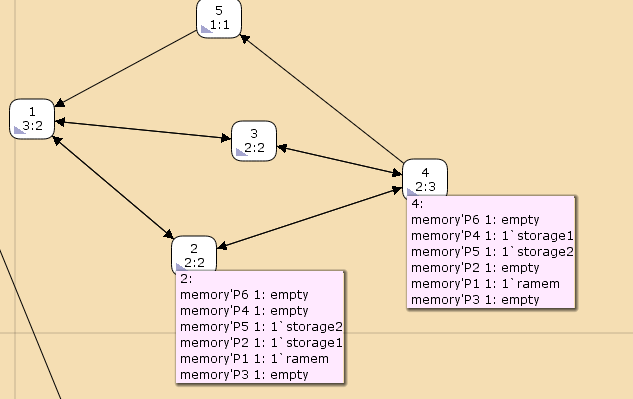

---
## Front matter
title: "Лабораторная работа №13"
subtitle: "Задание для самостоятельного выполнения"
author: "Дворкина Ева Владимировна"

## Generic otions
lang: ru-RU
toc-title: "Содержание"

## Bibliography
bibliography: bib/cite.bib
csl: pandoc/csl/gost-r-7-0-5-2008-numeric.csl

## Pdf output format
toc: true # Table of contents
toc-depth: 2
lof: true # List of figures
lot: false # List of tables
fontsize: 12pt
linestretch: 1.5
papersize: a4
documentclass: scrreprt
## I18n polyglossia
polyglossia-lang:
  name: russian
  options:
	- spelling=modern
	- babelshorthands=true
polyglossia-otherlangs:
  name: english
## I18n babel
babel-lang: russian
babel-otherlangs: english
## Fonts
mainfont: IBM Plex Serif
romanfont: IBM Plex Serif
sansfont: IBM Plex Sans
monofont: IBM Plex Mono
mathfont: STIX Two Math
mainfontoptions: Ligatures=Common,Ligatures=TeX,Scale=0.94
romanfontoptions: Ligatures=Common,Ligatures=TeX,Scale=0.94
sansfontoptions: Ligatures=Common,Ligatures=TeX,Scale=MatchLowercase,Scale=0.94
monofontoptions: Scale=MatchLowercase,Scale=0.94,FakeStretch=0.9
mathfontoptions:
## Biblatex
biblatex: true
biblio-style: "gost-numeric"
biblatexoptions:
  - parentracker=true
  - backend=biber
  - hyperref=auto
  - language=auto
  - autolang=other*
  - citestyle=gost-numeric
## Pandoc-crossref LaTeX customization
figureTitle: "Рис."
tableTitle: "Таблица"
listingTitle: "Листинг"
lofTitle: "Список иллюстраций"
lotTitle: "Список таблиц"
lolTitle: "Листинги"
## Misc options
indent: true
header-includes:
  - \usepackage{indentfirst}
  - \usepackage{float} # keep figures where there are in the text
  - \floatplacement{figure}{H} # keep figures where there are in the text
---

# Цель работы

Цель данной лабораторной работы - выполнить задание для самостоятельного выполнения с помощью CPNTools

# Задание

1. Используя теоретические методы анализа сетей Петри, провести анализ сети (с помощью построения дерева достижимости). Определить, является ли сеть безопасной, ограниченной, сохраняющей, имеются ли
тупики [@l:bash].
2. Промоделировать сеть Петри с помощью CPNTools.
3. Вычислить пространство состояний. Сформировать отчёт о пространстве состояний и проанализировать его.Построить граф пространства состояний.

# Теоретическое введение

CPN Tools — специальное программное средство, предназначенное для моделирования иерархических временных раскрашенных сетей Петри. Такие сети эквивалентны машине Тьюринга и составляют универсальную алгоритмическую систему, позволяющую описать произвольный объект [@cpn:bash].

CPN Tools позволяет визуализировать модель с помощью графа сети Петри и применить язык программирования CPN ML (Colored Petri Net Markup Language) для формализованного описания модели.

Назначение CPN Tools:

- разработка сложных объектов и моделирование процессов в различных прикладных областях, в том числе:

- моделирование производственных и бизнес-процессов;

- моделирование систем управления производственными системами и роботами;

- спецификация и верификация протоколов, оценка пропускной способности сетей и качества обслуживания, проектирование телекоммуникационных устройств и сетей.

# Выполнение лабораторной работы

## Схема модели

Заявка (команды программы, операнды) поступает в оперативную память (ОП), затем передается на прибор (центральный процессор, ЦП) для обработки. После этого заявка может равновероятно обратиться к оперативной памяти или к одному из двух внешних запоминающих устройств (B1 и B2). Прежде чем записать информацию на
внешний накопитель, необходимо вторично обратиться к центральному процессору, определяющему состояние накопителя и выдающему необходимую управляющую информацию. Накопители (B1 и B2) могут работать в 3-х режимах:

1) B1 — занят, B2 — свободен;
2) B2 — свободен, B1 — занят;
3) B1 — занят, B2 — занят.

## Описание модели

Множество позиций:

P1 — состояние оперативной памяти (свободна / занята);

P2 — состояние внешнего запоминающего устройства B1 (свободно / занято);

P3 — состояние внешнего запоминающего устройства B2 (свободно / занято);

P4 — работа на ОП и B1 закончена;

P5 — работа на ОП и B2 закончена;

P6 — работа на ОП, B1 и B2 закончена;

Множество переходов:

T1 — CPU работает только с RAM и B1;

T2 — обрабатываются данные из RAM и с B1 переходят на устройство вывода;

T3 — CPU работает только с RAM и B2;

T4 — обрабатываются данные из RAM и с B2 переходят на устройство вывода;

T5 — CPU работает только с RAM и с B1, B2;

T6 — обрабатываются данные из RAM, B1, B2 и переходят на устройство вывода.

Функционирование сети Петри можно расматривать как срабатывание переходов, в ходе которого происходит перемещение маркеров по позициям:

- работа CPU с RAM и B1 отображается запуском перехода T1 (удаление маркеров из P1, P2 и появление в P1, P4), что влечет за собой срабатывание перехода T2, т.е. передачу данных с RAM и B1 на устройство вывода;

- работа CPU с RAM и B2 отображается запуском перехода T3 (удаление маркеров из P1 и P3 и появление в P1 и P5), что влечет за собой срабатывание перехода T4, т.е. передачу данных с RAM и B2 на устройство вывода;

- работа CPU с RAM, B1 и B2 отображается запуском перехода T5 (удаление маркеров из P4 и P5 и появление в P6), далее срабатывание перехода T6, и данные из RAM, B1 и B2 передаются на устройство вывода;

- состояние устройств восстанавливается при срабатывании: RAM — переходов T1 или T2; B1 — переходов T2 или T6; B2 — переходов T4 или T6.

## Анализ сети Петри

Построим дерево достижимости (рис. [-@fig:001]).

{#fig:001 width=70%}

Можем увидеть, что представленная сеть:

- безопасна, поскольку в каждой позиции количество фишек не превышает 1;

- ограничена, так как существует такое целое k, что число фишек в каждой позиции не может превысить k (в данном случае k=1);

- сеть не имеет тупиков;

- сеть не является сохраняющей, так как при переходах t5 и t6 количество фишек меняется.

## Реализация модели в CPN Tools

Реализуем описанную ранее модель в CPN Tools. С помощью контекстного меню создаем новую сеть, далее нам понадобятся 6 позиций и 6 блоков переходов, затем их нужно соединить,(рис. [-@fig:002]).

{#fig:002 width=70%}

Также зададим нужные декларации (рис. [-@fig:003]).

{#fig:003 width=70%}

Зададим параметры и начальные значения. Получаем готовую модель (рис. [-@fig:004]).

{#fig:004 width=70%}

Запустив модель, можно посмотреть, как она работает (рис. [-@fig:005]).

{#fig:005 width=70%}

## Пространство состояний

Изучим пространство состояний. Сформируем граф пространства состояний, их всего 5 ([-@fig:006]).

{#fig:006 width=70%}

Вычислим пространство состояний. Прежде, чем пространство состояний может быть вычислено и проанализировано, необходимо сформировать код пространства состояний. Этот код создается, когда используется инструмент Войти в пространство состояний. Вход в пространство состояний занимает некоторое время. Затем, если ожидается, что пространство состояний будет небольшим, можно просто применить инструмент Вычислить пространство состояний к листу, содержащему страницу сети. Сформируем отчёт о пространстве состояний и проанализируем его.  Чтобы сохранить отчет, необходимо применить инструмент Сохранить отчет о пространстве состояний к листу, содержащему страницу сети и ввести имя файла отчета.

Из отчета можно увидеть:

- есть 5 состояний и 10 переходов между ними, strongly connected components (SCC) graph содержит 1 вершину и 0 переходов.

- Затем указаны границы значений для каждого элемента: состояние P1 всегда заполнено 1 элементом, а остальные содержат максимум 1 элемент, минимум -- 0.

- Также указаны границы в виде мультимножеств.

- Маркировка home для всех состояний, так как в любую позицию мы можем попасть из любой другой маркировки.

- Маркировка dead равная None, так как нет состояний, из которых переходов быть не может.

- В конце указано, что бесконечно часто могут происходить переходы T1, T2, T3, T4, но не обязательно, также состояние T5 необходимо для того, чтобы система не попадала в тупик, а состояние T6 происходит всегда, если доступно.

```
CPN Tools state space report for:
<unsaved net>
Report generated: Fri May  2 18:35:42 2025


 Statistics
------------------------------------------------------------------------

  State Space
     Nodes:  5
     Arcs:   10
     Secs:   0
     Status: Full

  Scc Graph
     Nodes:  1
     Arcs:   0
     Secs:   0


 Boundedness Properties
------------------------------------------------------------------------

  Best Integer Bounds
                             Upper      Lower
     memory'P1 1             1          1
     memory'P2 1             1          0
     memory'P3 1             1          0
     memory'P4 1             1          0
     memory'P5 1             1          0
     memory'P6 1             1          0

  Best Upper Multi-set Bounds
     memory'P1 1         1`ramem
     memory'P2 1         1`storage1
     memory'P3 1         1`storage2
     memory'P4 1         1`storage1
     memory'P5 1         1`storage2
     memory'P6 1         1`(storage1,storage2)

  Best Lower Multi-set Bounds
     memory'P1 1         1`ramem
     memory'P2 1         empty
     memory'P3 1         empty
     memory'P4 1         empty
     memory'P5 1         empty
     memory'P6 1         empty


 Home Properties
------------------------------------------------------------------------

  Home Markings
     All


 Liveness Properties
------------------------------------------------------------------------

  Dead Markings
     None

  Dead Transition Instances
     None

  Live Transition Instances
     All


 Fairness Properties
------------------------------------------------------------------------
       memory'T1 1            No Fairness
       memory'T2 1            No Fairness
       memory'T3 1            No Fairness
       memory'T4 1            No Fairness
       memory'T5 1            Just
       memory'T6 1            Fair

```

# Выводы

В результате выполнения данной лабораторной работы я выполнила задание для самостоятельного выполнения, а именно провела анализ сети Петри, построила сеть в CPN Tools, построила граф состояний и провела его анализ.

# Список литературы{.unnumbered}

::: {#refs}
:::
