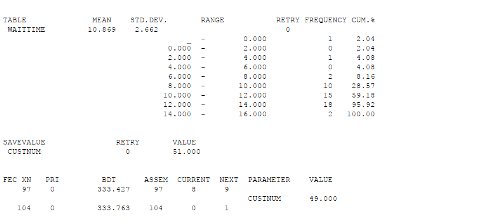
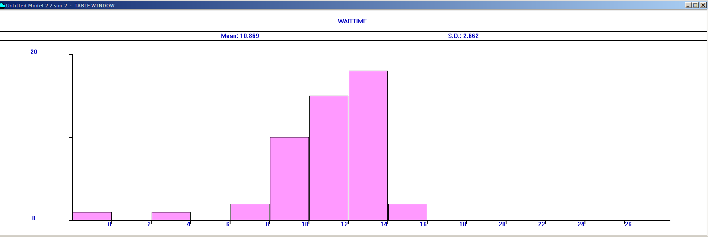
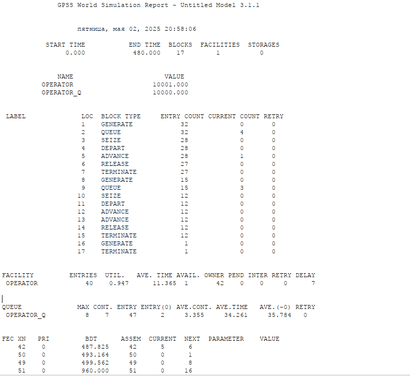

---
## Front matter
lang: ru-RU
title: Лабораторная работа №14
subtitle: Модели обработки заказов
author:
  - Дворкина Е. В.
institute:
  - Российский университет дружбы народов, Москва, Россия
date: 10 мая 2025

## i18n babel
babel-lang: russian
babel-otherlangs: english

## Formatting pdf
toc: false
toc-title: Содержание
slide_level: 2
aspectratio: 169
section-titles: true
theme: metropolis
header-includes:
 - \metroset{progressbar=frametitle,sectionpage=progressbar,numbering=fraction}
---

## Докладчик

:::::::::::::: {.columns align=center}
::: {.column width="70%"}

  * Дворкина Ева Владимировна
  * студентка
  * группа НФИбд-01-22
  * Российский университет дружбы народов
  * [1132226447@rudn.ru](mailto:1132226447@rudn.ru)
  * <https://github.com/evdvorkina>

:::
::: {.column width="30%"}

:::
::::::::::::::

# Цели и задачи

Реализовать модели обработки заказов и провести анализ результатов:

- модель оформления заказов клиентов одним оператором;

- построение гистограммы распределения заявок в очереди;

- модель обслуживания двух типов заказов от клиентов в интернет-магазине;

- модель оформления заказов несколькими операторами.

# Выполнение лабораторной работы

## Модель оформления заказов клиентов одним оператором

{#fig:001 width=70%}

## Отчет по модели оформления заказов клиентов одним оператором

{#fig:002 width=60%}

## Упражнение. Изменение интервалов поступления и обработки заказов.

{#fig:003 width=70%}

## Отчет по измененной модели оформления заказов клиентов одним оператором

{#fig:004 width=60%}

## Построение гистограммы распределения заявок в очереди

{#fig:005 width=70%}

## Отчет по симуляции

{#fig:006 width=70%}

## Отчет по симуляции

{#fig:007 width=60%}

## Гистограмма распределения заявок в очереди

{#fig:008 width=70%}

## Модель обслуживания двух типов заказов от клиентов

{#fig:009 width=60%}

## Отчет по модели обслуживания двух типов заказов от клиентов в интернет-магазин

{#fig:010 width=70%}

## Упражнение. Число заказов с дополнительным пакетом услуг составляет 30% от общего числа заказов.

{#fig:011 width=70%}

## Отчет по измененной модели обслуживания двух типов заказов от клиентов

{#fig:012 width=60%}

## Модель оформления заказов несколькими операторами

{#fig:013 width=55%}

## Отчет по модели оформления заказов несколькими операторами

{#fig:014 width=70%}

## Упражнение. Возможны отказы клиентов от заказа.

{#fig:015 width=70%}

## Отчет по измененной модели оформления заказов несколькими операторами

{#fig:016 width=60%}

## Выводы

В результате была реализована с помощью gpss:

- модель оформления заказов клиентов одним оператором;

- построение гистограммы распределения заявок в очереди;

- модель обслуживания двух типов заказов от клиентов в интернет-магазине;

- модель оформления заказов несколькими операторами.

