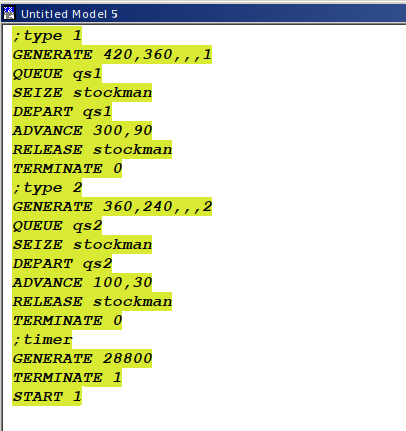
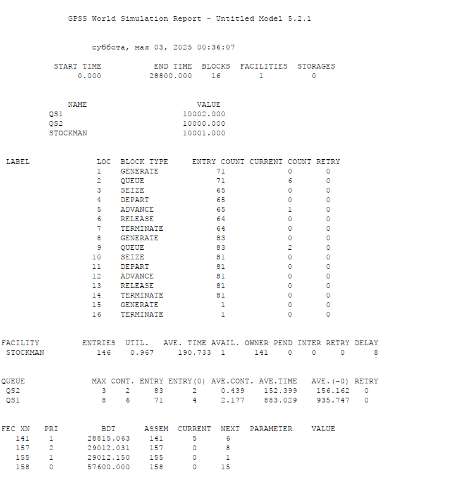
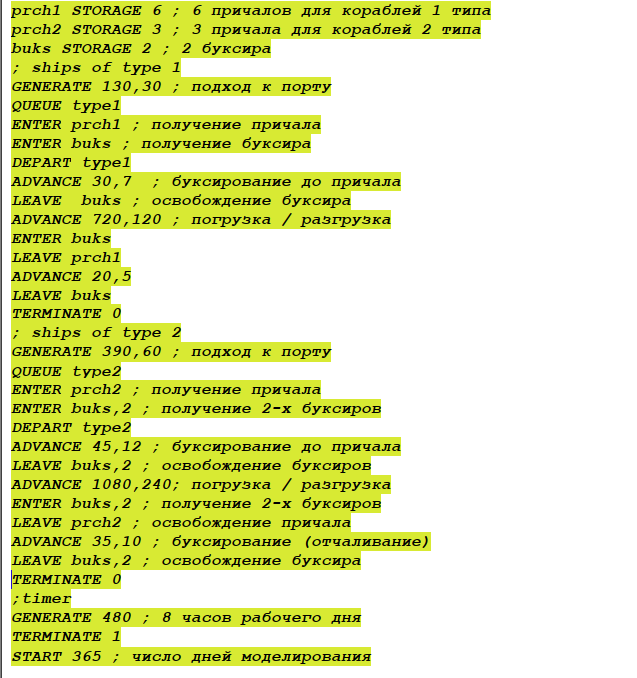
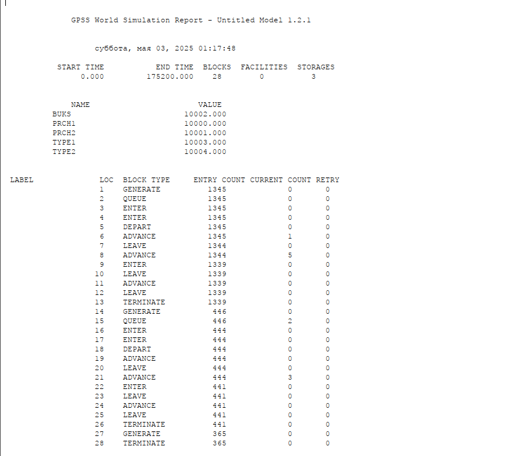
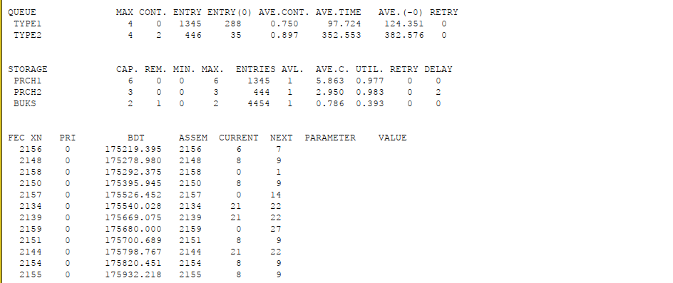

---
## Front matter
lang: ru-RU
title: Лабораторная работа №15
subtitle: Модели обслуживания с приоритетами
author:
  - Дворкина Е. В.
institute:
  - Российский университет дружбы народов, Москва, Россия
date: 10 мая 2025

## i18n babel
babel-lang: russian
babel-otherlangs: english

## Formatting pdf
toc: false
toc-title: Содержание
slide_level: 2
aspectratio: 169
section-titles: true
theme: metropolis
header-includes:
 - \metroset{progressbar=frametitle,sectionpage=progressbar,numbering=fraction}
---

## Докладчик

:::::::::::::: {.columns align=center}
::: {.column width="70%"}

  * Дворкина Ева Владимировна
  * студентка
  * группа НФИбд-01-22
  * Российский университет дружбы народов
  * [1132226447@rudn.ru](mailto:1132226447@rudn.ru)
  * <https://github.com/evdvorkina>

:::
::: {.column width="30%"}

:::
::::::::::::::

## Цель и задачи

Реализовать модели обслуживания с приоритетами и провести анализ результатов.

- Модель обслуживания механиков на складе

- Модель обслуживания в порту судов двух типов

# Выполнение лабораторной работы

## Модель обслуживания механиков на складе

{#fig:001 width=70%}

## Отчет по модели обслуживания механиков на складе

{#fig:002 width=60%}

## Модель обслуживания в порту судов двух типов

{#fig:003 width=70%}

## Отчет по модели обслуживания в порту судов двух типов

{#fig:004 width=60%}

## Отчет по модели обслуживания в порту судов двух типов

{#fig:005 width=60%}

## Выводы

В результате выполнения работы были реализованы с помощью gpss:

- Модель обслуживания механиков на складе;

- Модель обслуживания в порту судов двух типов.

