---
## Front matter
lang: ru-RU
title: Лабораторная работа №16
subtitle: Задачи оптимизации. Модель двух стратегий обслуживания
author:
  - Дворкина Е. В.
institute:
  - Российский университет дружбы народов, Москва, Россия
date: 10 мая 2025

## i18n babel
babel-lang: russian
babel-otherlangs: english

## Formatting pdf
toc: false
toc-title: Содержание
slide_level: 2
aspectratio: 169
section-titles: true
theme: metropolis
header-includes:
 - \metroset{progressbar=frametitle,sectionpage=progressbar,numbering=fraction}
---

## Докладчик

:::::::::::::: {.columns align=center}
::: {.column width="70%"}

  * Дворкина Ева Владимировна
  * студентка
  * группа НФИбд-01-22
  * Российский университет дружбы народов
  * [1132226447@rudn.ru](mailto:1132226447@rudn.ru)
  * <https://github.com/evdvorkina>

:::
::: {.column width="30%"}

:::
::::::::::::::

## Цели и задачи

Реализовать с помощью gpss модель двух стратегий обслуживания и оценить оптимальные параметры.

- модель с двумя очередями;

- модель с одной очередью;

- изменить модели, чтобы определить оптимальное число пропускных пунктов.

## Постановка задачи

1. автомобили образуют две очереди и обслуживаются соответствующими пунктами
пропуска;

2. автомобили образуют одну общую очередь и обслуживаются освободившимся
пунктом пропуска.

## Модель первой стратегии обслуживания

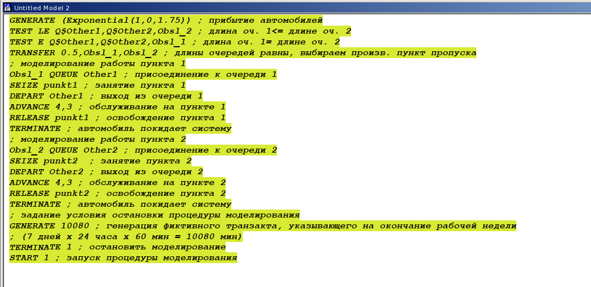{#fig:001 width=70%}

## Отчет по модели первой стратегии обслуживания

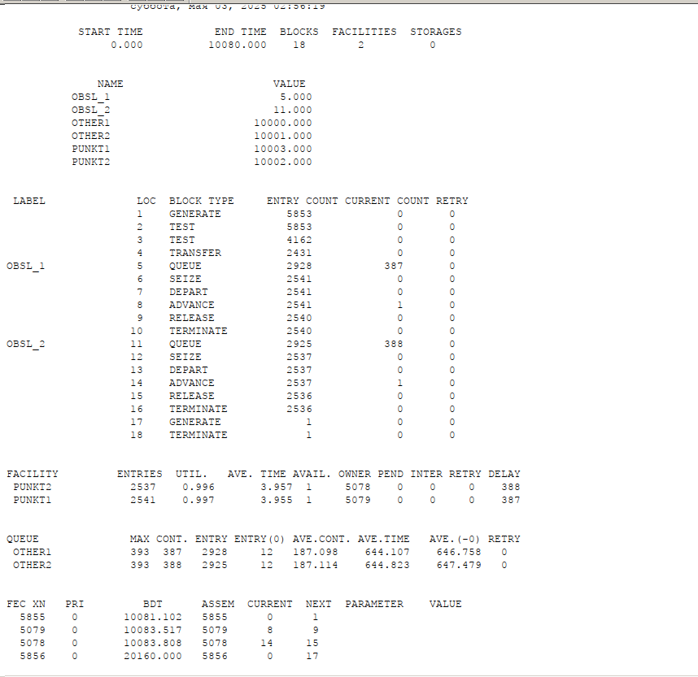{#fig:002 width=50%}

## Модель второй стратегии обслуживания

{#fig:003 width=70%}

## Отчет по модели второй стратегии обслуживания

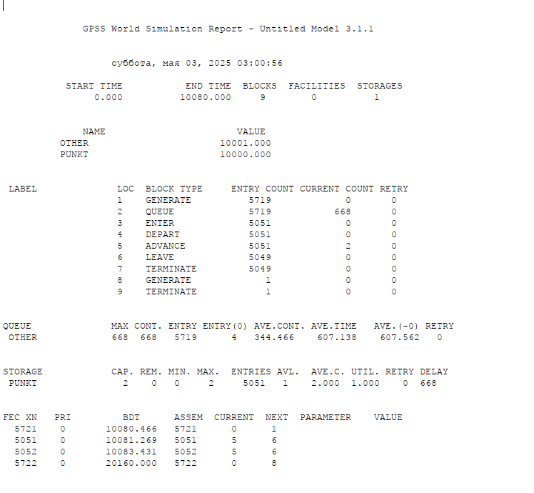{#fig:004 width=50%}

## Сравнение стратегий

: Сравнение стратегий {#tbl:strategy}

| Показатель                 | стратегия 1 |         |          |  стратегия 2 |
|----------------------------|-------------|---------|----------|--------------|
|                            | пункт 1     | пункт 2 | в целом  |              |
| Поступило автомобилей      | 2928        | 2925    | 5853     | 5719         |
| Обслужено автомобилей      | 2540        | 2536    | 5076     | 5049         |
| Коэффициент загрузки       | 0,997       | 0,996   | 0,9965   | 1            |
| Максимальная длина очереди | 393         | 393     | 786      | 668          |
| Средняя длина очереди      | 187,098     | 187,114 | 374,212  | 344,466      |
| Среднее время ожидания     | 644,107     | 644,823 | 644,465  | 607,138      |

## Модель с одним пунктом

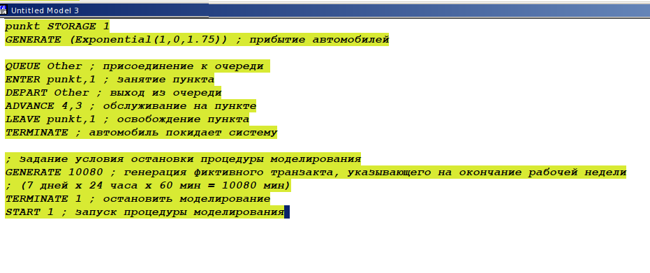{#fig:005 width=70%}

## Отчет по модели с одним пунктом

{#fig:006 width=50%}

## Модель первой стратегии обслуживания с 3 пунктами

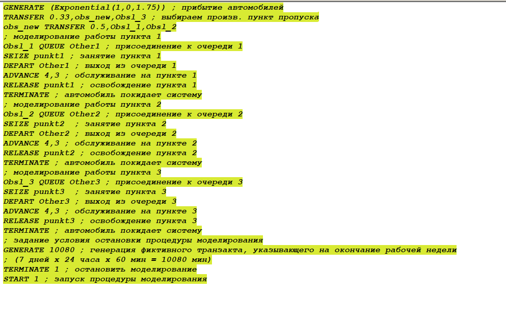{#fig:007 width=70%}

## Отчет по модели первой стратегии обслуживания с 3 пунктами

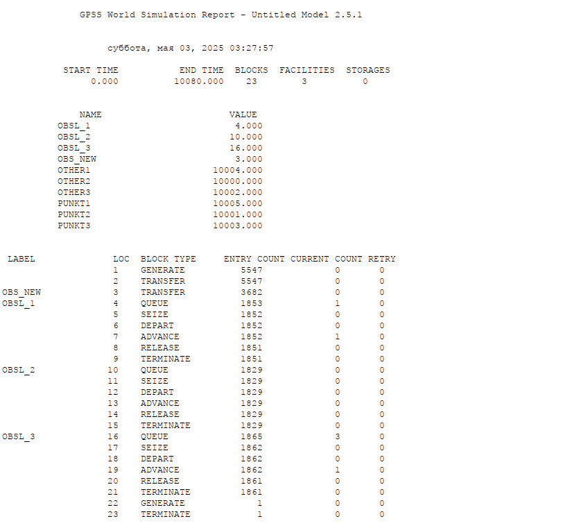{#fig:008 width=50%}

## Отчет по модели первой стратегии обслуживания с 3 пунктами

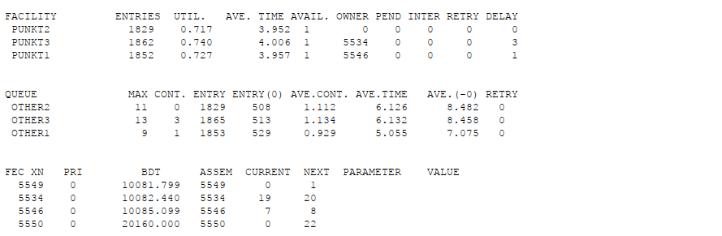{#fig:025 width=70%}

## Модель первой стратегии обслуживания с 4 пунктами

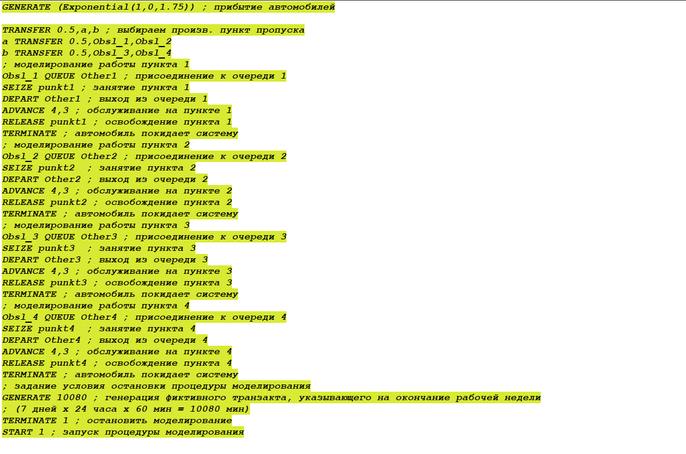{#fig:009 width=70%}

## Отчет по модели первой стратегии обслуживания с 4 пунктами

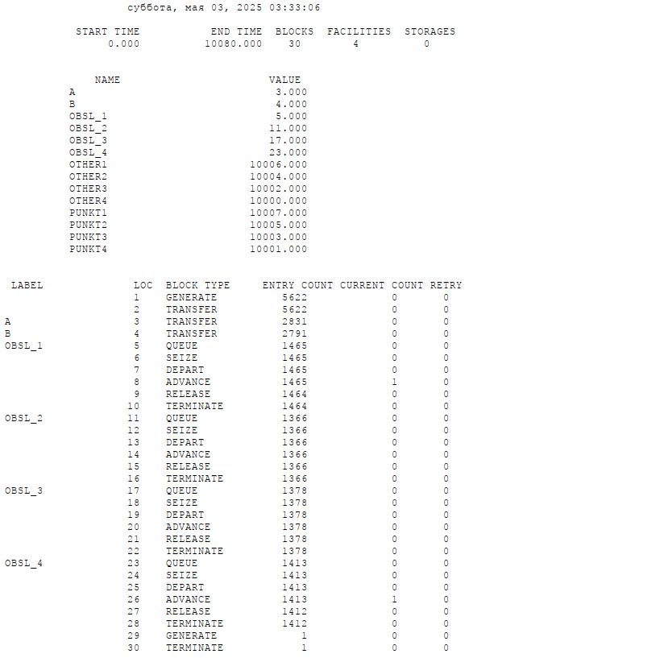{#fig:010 width=50%}

## Отчет по модели первой стратегии обслуживания с 4 пунктами

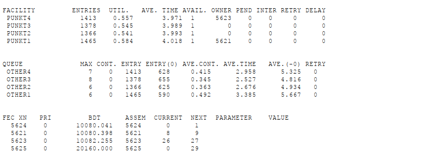{#fig:026 width=70%}

## Модель второй стратегии обслуживания с 3 пунктами

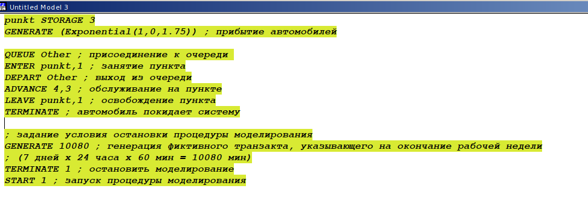{#fig:011 width=70%}

## Отчет по модели второй стратегии обслуживания с 3 пунктами

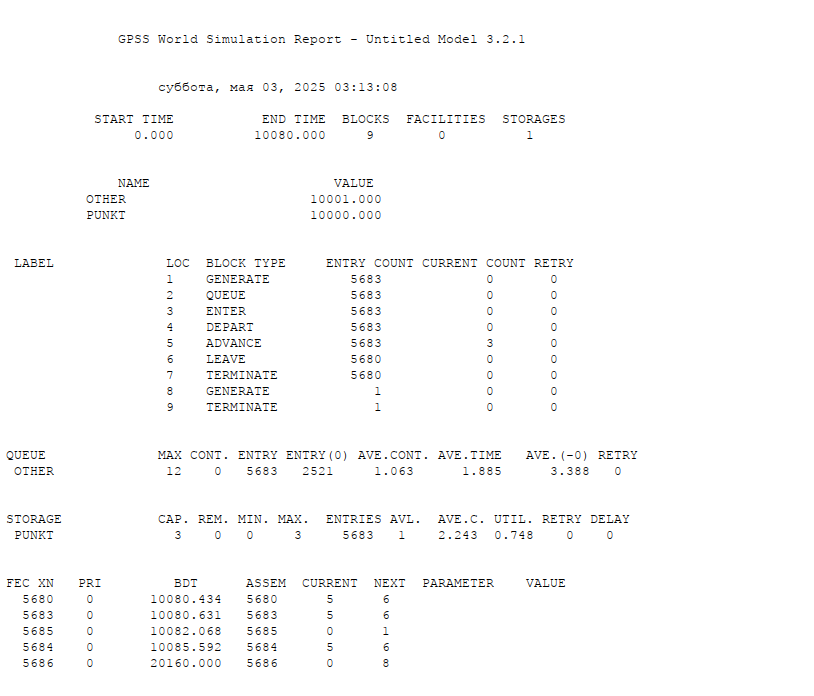{#fig:012 width=50%}

## Модель второй стратегии обслуживания с 4 пунктами

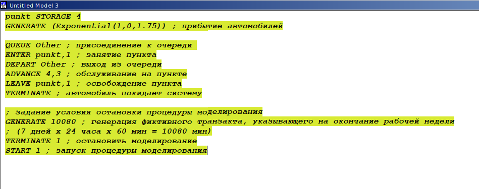{#fig:013 width=70%}

## Отчет по модели второй стратегии обслуживания с 4 пунктами

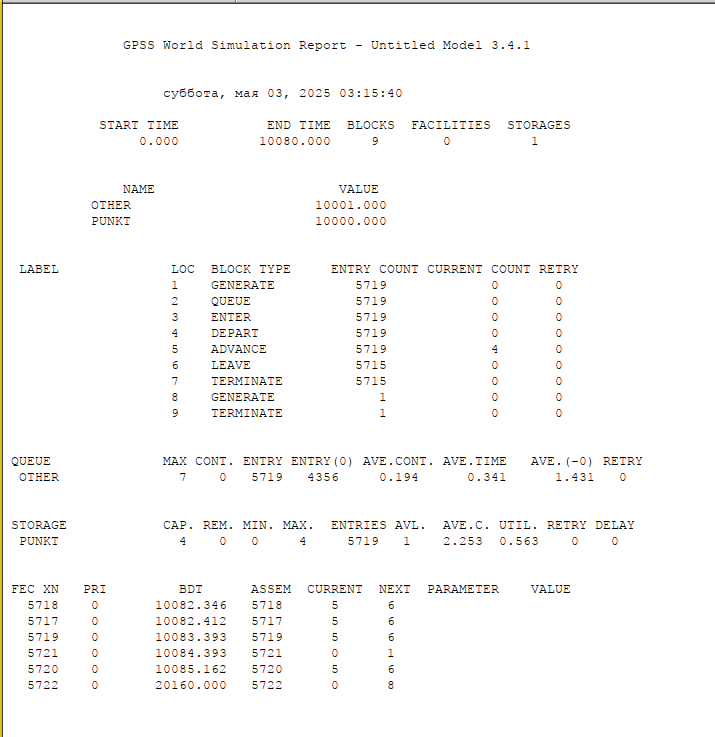{#fig:014 width=50%}

## Выводы

В результате выполнения данной лабораторной работы я реализовала с помощью gpss:

- модель с двумя очередями;

- модель с одной очередью;

- изменить модели, чтобы определить оптимальное число пропускных пунктов.

