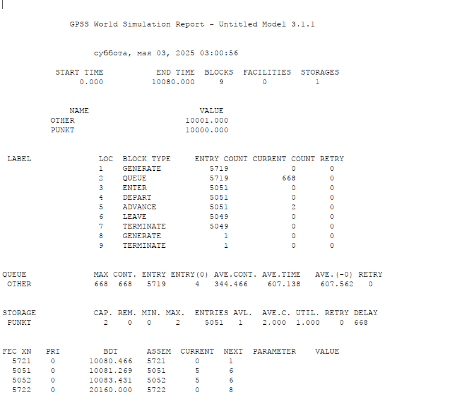
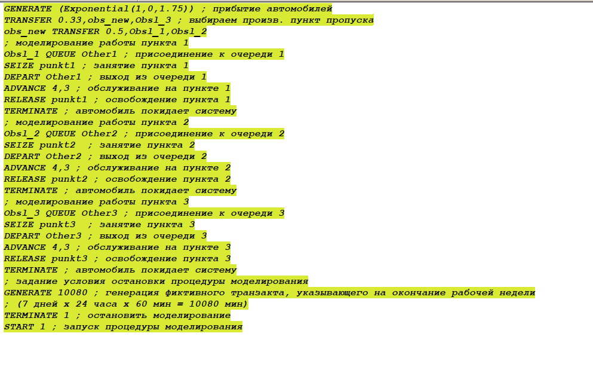
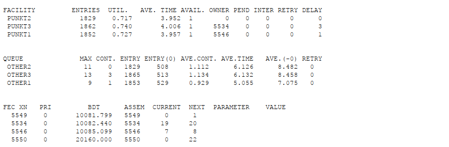
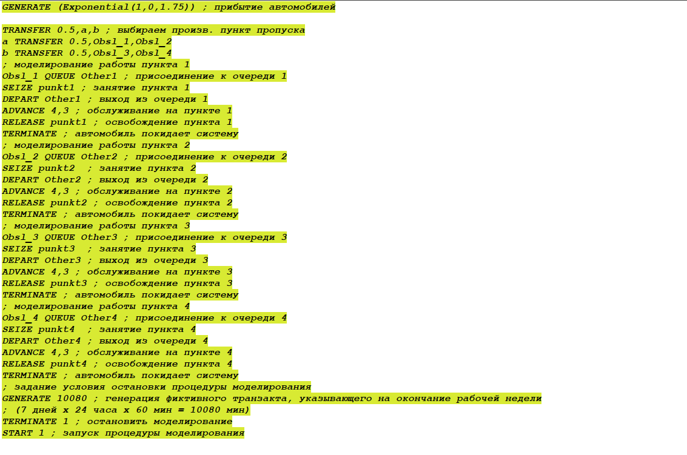
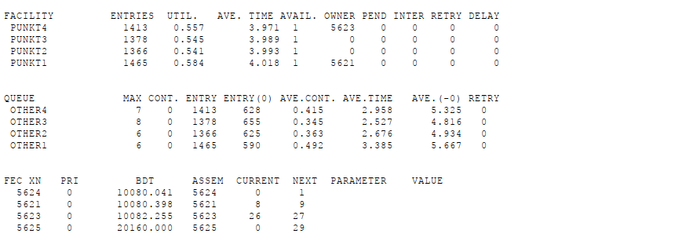
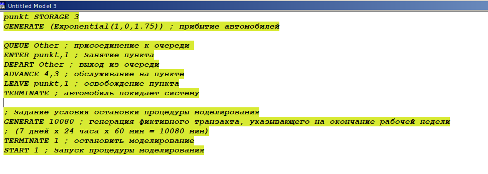

---
## Front matter
title: "Лабораторная работа 16"
subtitle: "Задачи оптимизации. Модель двух стратегий обслуживания"
author: "Дворкина Ева Владимировна"

## Generic otions
lang: ru-RU
toc-title: "Содержание"

## Bibliography
bibliography: bib/cite.bib
csl: pandoc/csl/gost-r-7-0-5-2008-numeric.csl

## Pdf output format
toc: true # Table of contents
toc-depth: 2
lof: true # List of figures
lot: false # List of tables
fontsize: 12pt
linestretch: 1.5
papersize: a4
documentclass: scrreprt
## I18n polyglossia
polyglossia-lang:
  name: russian
  options:
	- spelling=modern
	- babelshorthands=true
polyglossia-otherlangs:
  name: english
## I18n babel
babel-lang: russian
babel-otherlangs: english
## Fonts
mainfont: IBM Plex Serif
romanfont: IBM Plex Serif
sansfont: IBM Plex Sans
monofont: IBM Plex Mono
mathfont: STIX Two Math
mainfontoptions: Ligatures=Common,Ligatures=TeX,Scale=0.94
romanfontoptions: Ligatures=Common,Ligatures=TeX,Scale=0.94
sansfontoptions: Ligatures=Common,Ligatures=TeX,Scale=MatchLowercase,Scale=0.94
monofontoptions: Scale=MatchLowercase,Scale=0.94,FakeStretch=0.9
mathfontoptions:
## Biblatex
biblatex: true
biblio-style: "gost-numeric"
biblatexoptions:
  - parentracker=true
  - backend=biber
  - hyperref=auto
  - language=auto
  - autolang=other*
  - citestyle=gost-numeric
## Pandoc-crossref LaTeX customization
figureTitle: "Рис."
tableTitle: "Таблица"
listingTitle: "Листинг"
lofTitle: "Список иллюстраций"
lotTitle: "Список таблиц"
lolTitle: "Листинги"
## Misc options
indent: true
header-includes:
  - \usepackage{indentfirst}
  - \usepackage{float} # keep figures where there are in the text
  - \floatplacement{figure}{H} # keep figures where there are in the text
---

# Цель работы

Реализовать с помощью gpss модель двух стратегий обслуживания и оценить оптимальные параметры.

# Задание

Реализовать с помощью gpss:

- модель с двумя очередями;
- модель с одной очередью;
- изменить модели, чтобы определить оптимальное число пропускных пунктов.

# Теоретическое введение

Пакет GPSS(General Purpose Simulation System — система моделирования общего назначения) предназначен для имитационного моделирования дискретных систем [@gpss:bash].

 Имитационная модель в GPSS представляет собой последовательность текстовых строк, каждая из которых определяет правила создания, перемещения, задержки и удаления транзактов.
 
 *Транзакт* — динамический объект, отождествляемый с заявкой на обслуживание, который перемещается между элементами системы.

# Выполнение лабораторной работы

Использованы материалы из [@l:bash].

## Постановка задачи

На пограничном контрольно-пропускном пункте транспорта имеются 2 пункта
пропуска. Интервалы времени между поступлением автомобилей имеют экспоненциальное распределение со средним значением $\mu$. Время прохождения автомобилями
пограничного контроля имеет равномерное распределение на интервале $[a, b]$.
Предлагается две стратегии обслуживания прибывающих автомобилей:

1. автомобили образуют две очереди и обслуживаются соответствующими пунктами
пропуска;

2. автомобили образуют одну общую очередь и обслуживаются освободившимся
пунктом пропуска.
Исходные данные: $\mu$ = 1, 75 мин, $a$ = 1 мин, $b$ = 7 мин.

## Построение модели

Целью моделирования является определение:

- характеристик качества обслуживания автомобилей, в частности, средних длин
очередей; среднего времени обслуживания автомобиля; среднего времени пребывания автомобиля на пункте пропуска;

- наилучшей стратегии обслуживания автомобилей на пункте пограничного контроля;

- оптимального количества пропускных пунктов.

В качестве критериев, используемых для сравнения стратегий обслуживания
автомобилей, выберем:

- коэффициенты загрузки системы;

- максимальные и средние длины очередей;

- средние значения времени ожидания обслуживания.

Для первой стратегии обслуживания, когда прибывающие автомобили образуют
две очереди и обслуживаются соответствующими пропускными пунктами, имеем
следующую модель (рис. [-@fig:001]).

{#fig:001 width=70%}

После запуска симуляции получим отчёт (рис. [-@fig:002]).

{#fig:002 width=70%}

Составим модель для второй стратегии обслуживания, когда прибывающие автомобили образуют одну очередь и обслуживаются освободившимся пропускным пунктом (рис. [-@fig:003], [-@fig:004]).

{#fig:003 width=70%}

{#fig:004 width=70%}

Составим таблицу по полученной статистике (табл. [-@tbl:strategy]).

: Сравнение стратегий {#tbl:strategy}

| Показатель                 | стратегия 1 |         |          |  стратегия 2 |
|----------------------------|-------------|---------|----------|--------------|
|                            | пункт 1     | пункт 2 | в целом  |              |
| Поступило автомобилей      | 2928        | 2925    | 5853     | 5719         |
| Обслужено автомобилей      | 2540        | 2536    | 5076     | 5049         |
| Коэффициент загрузки       | 0,997       | 0,996   | 0,9965   | 1            |
| Максимальная длина очереди | 393         | 393     | 786      | 668          |
| Средняя длина очереди      | 187,098     | 187,114 | 374,212  | 344,466      |
| Среднее время ожидания     | 644,107     | 644,823 | 644,465  | 607,138      |

Сравнив результаты моделирования двух систем, можно сделать вывод о том,
что первая модель позволяет обслужить большее число автомобилей. Однако мы
видим, что разница между обслуженными и поступившими автомобилями меньше
для второй модели – значит, продуктивность работы выше. Также для второй модели коэффициент загрузки равен 1 -- значит ни один из
пунктов не простаивает. Максимальная длина очереди, средняя длина очереди и
среднее время ожидания меньше для второй стратегии. Можно сделать вывод, что
вторая стратегия лучше.

## Оптимизация модели двух стратегий обслуживания

Изменим модели, чтобы определить оптимальное число пропускных пунктов (от 1 до 4). Будем подбирать под следующие критерии:

- коэффициент загрузки пропускных пунктов принадлежит интервалу [0, 5; 0, 95];

- среднее число автомобилей, одновременно находящихся на контрольно пропускном пункте, не должно превышать 3;

- среднее время ожидания обслуживания не должно превышать 4 мин.

Для обеих стратегий модель с одним пунктом выглядит одинаково (рис. [-@fig:005]).

{#fig:005 width=70%}

После симуляции получим следующий отчет (рис. [-@fig:005]).

{#fig:006 width=70%}

В этом случае модель не проходит ни по одному из критериев, так как коэффициент загрузки, размер очереди и среднее время ожидания больше.

Построим модель для первой стратегии с 3 пропускными пунктами и получим отчет (рис. [-@fig:007], [-@fig:008], [-@fig:025]).

{#fig:007 width=70%}

{#fig:008 width=70%}

{#fig:025 width=70%}

В этом случае среднее количество автомобилей в очереди меньше 3 и коэффициент загрузки в нужном диапазоне, но среднее время ожидания больше 4.

Построим модель для первой стратегии с 4 пропускными пунктами (рис. [-@fig:009], [-@fig:007], [-@fig:026]).

{#fig:009 width=70%}

{#fig:010 width=70%}

{#fig:026 width=70%}

В этом случае все критерии выполнены, поэтому 4 пункта являются *оптимальным* количеством для первой стратегии.

Построим модель для второй стратегии с 3 пропускными пунктами и получим отчет (рис. [-@fig:011], [-@fig:012]).

{#fig:011 width=70%}

{#fig:012 width=70%}

В этом случае все критерии выполняются, поэтому модель *оптимальна*.

Построим модель для второй стратегии с 4 пропускными пунктами и получим отчет (рис. [-@fig:013], [-@fig:014]).

{#fig:013 width=70%}

{#fig:014 width=70%}

Здесь все критерии выполнены при этом время ожидания и среднее число автомобилей меньше, чем в случае второй стратегии с 3 пунктами, однако и загрузка меньше. Можно сделать вывод, что 4 пропускной пункт излишне разгружает систему.

В результате анализа наилучшим количеством пропускных пунктов будет *3 при втором типе обслуживания* и *4 при первом*.

# Выводы

В результате выполнения данной лабораторной работы я реализовала с помощью gpss:

- модель с двумя очередями;

- модель с одной очередью;

- изменить модели, чтобы определить оптимальное число пропускных пунктов.

# Список литературы{.unnumbered}

::: {#refs}
:::
