---
## Front matter
lang: ru-RU
title: Лабораторная работа №17
subtitle: Задание для самостоятельной работы
author:
  - Дворкина Е. В.
institute:
  - Российский университет дружбы народов, Москва, Россия
date: 11 мая 2025

## i18n babel
babel-lang: russian
babel-otherlangs: english

## Formatting pdf
toc: false
toc-title: Содержание
slide_level: 2
aspectratio: 169
section-titles: true
theme: metropolis
header-includes:
 - \metroset{progressbar=frametitle,sectionpage=progressbar,numbering=fraction}
---

## Докладчик

:::::::::::::: {.columns align=center}
::: {.column width="50%"}

  * Дворкина Ева Владимировна
  * студентка
  * группа НФИбд-01-22
  * Российский университет дружбы народов
  * [1132226447@rudn.ru](mailto:1132226447@rudn.ru)
  * <https://github.com/evdvorkina>

:::
::: {.column width="30%"}

:::
::::::::::::::

## Цели и здачи

Реализовать с помощью gpss модели работы вычислительного центра, аэропорта и морского порта.

- модель работы вычислительного центра;

- модель работы аэропорта;

- модель работы морского порта.

# Выполнение лабораторной работы

## Моделирование работы вычислительного центра

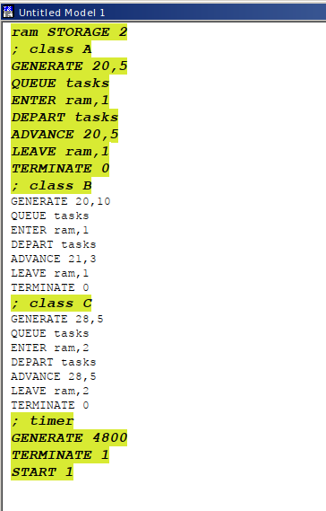{#fig:001 width=50%}

## Моделирование работы вычислительного центра

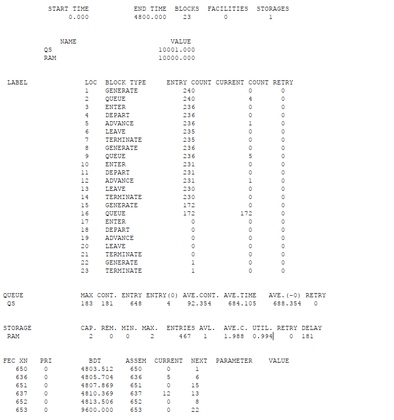{#fig:002 width=50%}

## Модель работы аэропорта

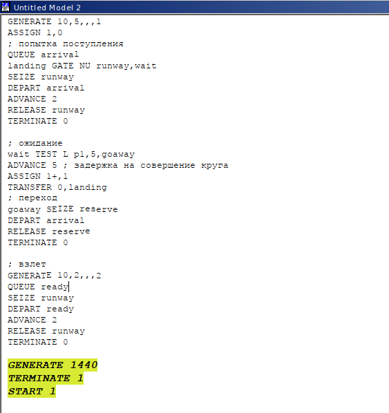{#fig:004 width=50%}

## Модель работы аэропорта

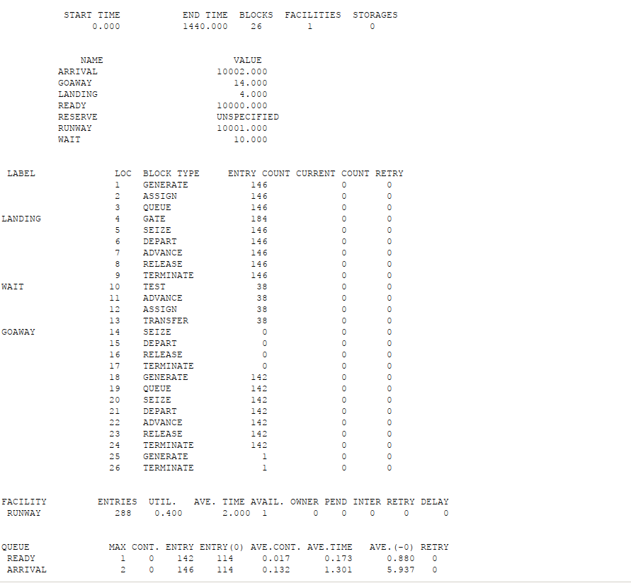{#fig:005 width=50%}

## Моделирование работы морского порта. **Первый вариант модели**

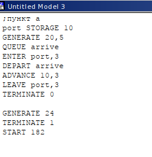{#fig:007 width=50%}

## Моделирование работы морского порта. **Первый вариант модели**

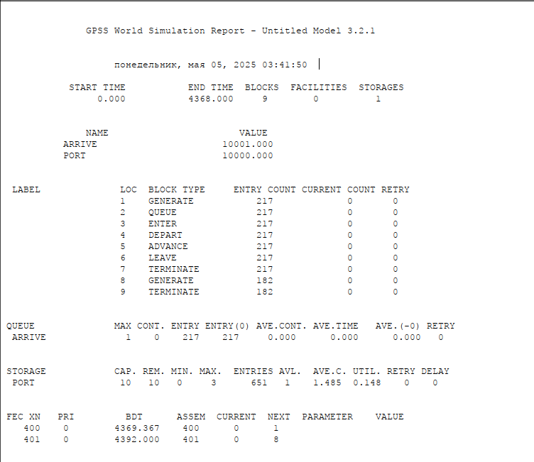{#fig:008 width=50%}

## Моделирование работы морского порта. **Первый вариант модели**

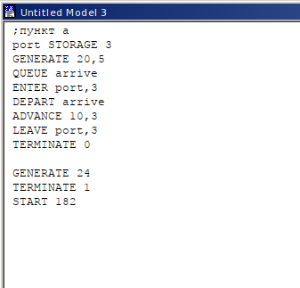{#fig:009 width=50%}

## Моделирование работы морского порта. **Первый вариант модели**

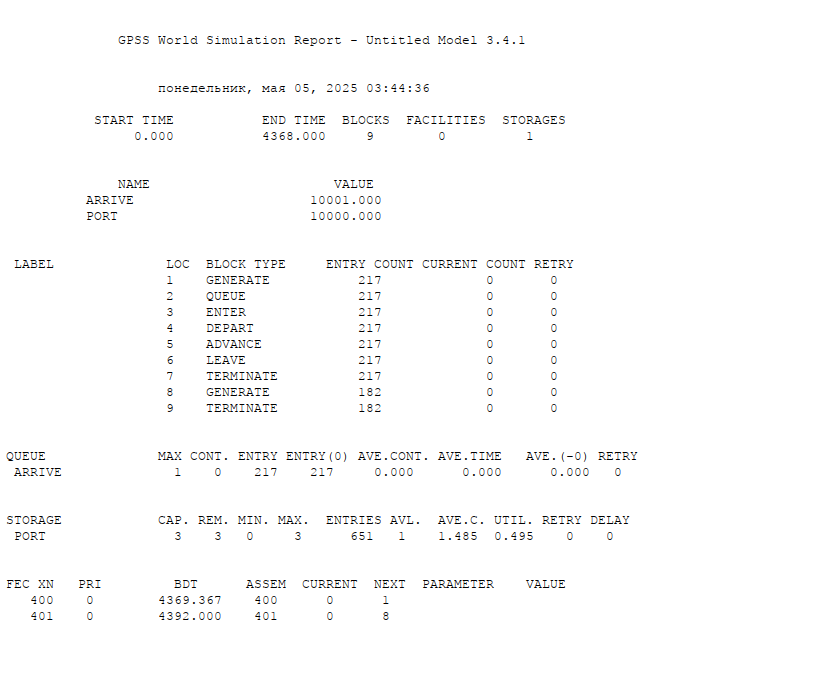{#fig:010 width=50%}

## Моделирование работы морского порта. **Второй вариант модели**

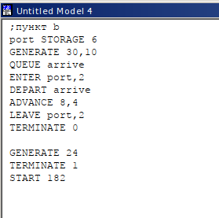{#fig:011 width=50%}

## Моделирование работы морского порта. **Второй вариант модели**

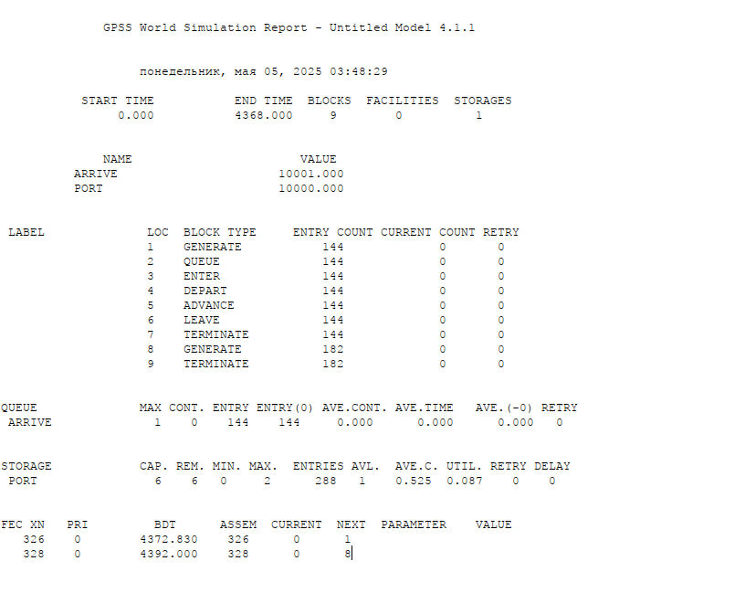{#fig:012 width=50%}

## Моделирование работы морского порта. **Второй вариант модели**

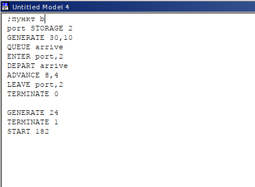{#fig:013 width=50%}

## Моделирование работы морского порта. **Второй вариант модели**

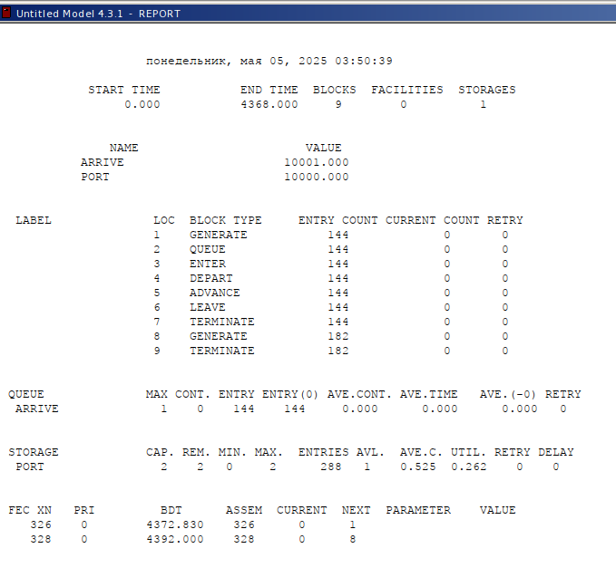{#fig:014 width=50%}

## Выводы

В результате выполнения данной лабораторной работы я реализовала с помощью gpss:

- модель работы вычислительного центра;

- модель работы аэропорта;

- модель работы морского порта.

